# <a name="quickstart-build-your-first-logic-app-workflow---azure-portal"></a>Inicio rápido: Creación del primer flujo de trabajo de aplicación lógica - Azure Portal

Esta guía de inicio rápido muestra cómo crear su primer flujo de trabajo automatizado con [Azure Logic Apps](../logic-apps/logic-apps-overview.md). En este artículo, creará una aplicación lógica que comprobará periódicamente la fuente RSS de un sitio web para detectar si se ha publicado nuevo contenido. Si existe algún elemento nuevo, la aplicación lógica envía un correo electrónico por cada elemento. Cuando haya terminado, la aplicación lógica se parecerá a este flujo de trabajo, en un alto nivel:


Para seguir esta guía de inicio rápido, necesita una cuenta de correo electrónico de un proveedor compatible con Logic Apps, como Office 365 Outlook, Outlook.com o Gmail. En el caso de otros proveedores, [consulte la lista de conectores que se muestra aquí](https://docs.microsoft.com/connectors/). Esta aplicación lógica usa una cuenta de Office 365 Outlook. Si usa otra cuenta de correo electrónico, los pasos generales serán los mismos, pero su interfaz de usuario puede ser ligeramente distinta. 

Asimismo, si no tiene una suscripción de Azure, <a href="https://azure.microsoft.com/free/" target="_blank">regístrese para obtener una cuenta gratuita de Azure</a>.

## <a name="sign-in-to-the-azure-portal"></a>Inicie sesión en el Portal de Azure.

Inicie sesión en <a href="https://portal.azure.com" target="_blank">Azure Portal</a> con las credenciales de su cuenta de Azure.

## <a name="create-your-logic-app"></a>Creación de una aplicación lógica 

1. En el menú principal de Azure, elija **Nuevo** > **Enterprise Integration** > **Logic App**.

   

3. En **Crear aplicación lógica**, proporcione información sobre la aplicación lógica, como se muestra a continuación. Cuando haya terminado, seleccione **Anclar al panel** > **Crear**.

   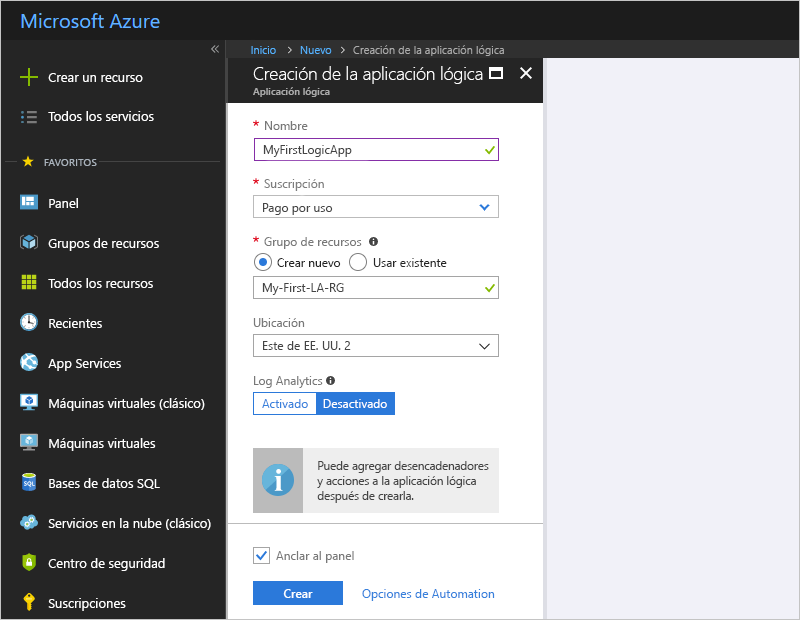

   | Configuración | Valor | DESCRIPCIÓN | 
   | ------- | ----- | ----------- | 
   | **Name** | MyFirstLogicApp | Nombre de la aplicación lógica | 
   | **Suscripción** | <*nombre-de-su-suscripción-a-Azure*> | El nombre de la suscripción a Azure | 
   | **Grupos de recursos** | My-First-LA-RG | Nombre del [grupo de recursos de Azure](../azure-resource-manager/resource-group-overview.md) que se utiliza para organizar recursos relacionados | 
   | **Ubicación** | Este de EE. UU. 2 | Región en la que desea almacenar la información de la aplicación lógica | 
   | **Log Analytics** | Off | Mantenga el valor **Off** para el registro de diagnóstico. | 
   |||| 

3. Una vez que Azure ha implementado la aplicación, el Diseñador de aplicaciones lógicas se abre y muestra una página con un vídeo de introducción y desencadenadores utilizados frecuentemente. En **plantillas**, elija **Aplicación lógica en blanco**.

   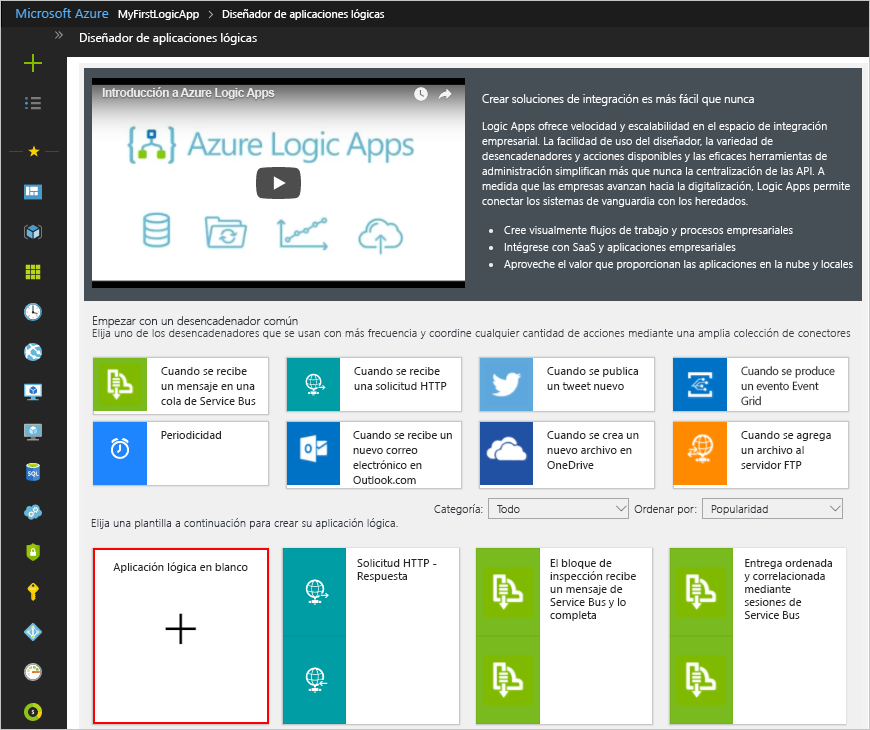

A continuación, añada un [desencadenador](../logic-apps/logic-apps-overview.md#logic-app-concepts) que se active cuando aparezca un nuevo elemento en la fuente RSS. Cada aplicación lógica debe comenzar con un desencadenador, que se activa cuando sucede un evento específico o cuando se cumple una condición determinada. Cada vez que el desencadenador se activa, el motor de Logic Apps crea una instancia de aplicación lógica que inicia y ejecuta el flujo de trabajo.

## <a name="check-rss-feed-with-a-trigger"></a>Comprobación de la fuente RSS con un desencadenador

1. En el diseñador, escriba "rss" en el cuadro de búsqueda. Seleccione este desencadenador: **RSS: cuando se publica un elemento de fuente**

   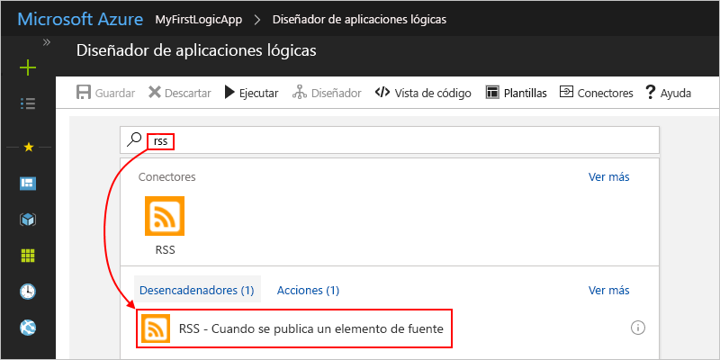

2. Proporcione esta información para el desencadenador, como se describe a continuación: 

   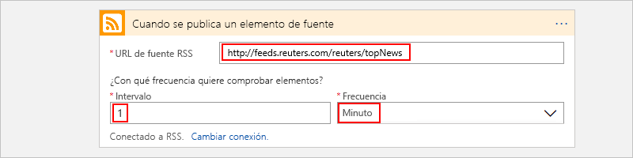

   | Configuración | Valor | DESCRIPCIÓN | 
   | ------- | ----- | ----------- | 
   | **URL de fuente RSS** | ```http://feeds.reuters.com/reuters/topNews``` | Vínculo de la fuente RSS que desea supervisar | 
   | **Intervalo** | 1 | Número de intervalos que se espera entre comprobaciones | 
   | **Frecuencia** | Minuto | La unidad de tiempo de cada intervalo entre comprobaciones  | 
   |  |  |  | 

   Juntos, el intervalo y la frecuencia definen la programación para el desencadenador de la aplicación lógica. 
   Esta aplicación lógica comprueba la fuente cada minuto.

3. Para ocultar por ahora los detalles del desencadenador, haga clic dentro de la barra de título del desencadenador.

   

4. Guarde la aplicación lógica. En la barra de herramientas del diseñador, haga clic en **Guardar**. 

La aplicación lógica estará activa, pero no hace más que comprobar la fuente RSS. Por lo tanto, agregue una acción que responda cuando se active el desencadenador.

## <a name="send-email-with-an-action"></a>Envío de correo electrónico con una acción

Ahora, añada una [acción](../logic-apps/logic-apps-overview.md#logic-app-concepts) para enviar un correo electrónico cuando aparezca un nuevo elemento en la fuente RSS. 

1. En el desencadenador **Cuando se publica un elemento de fuente**, seleccione **+ Nuevo paso** > **Agregar una acción**.

   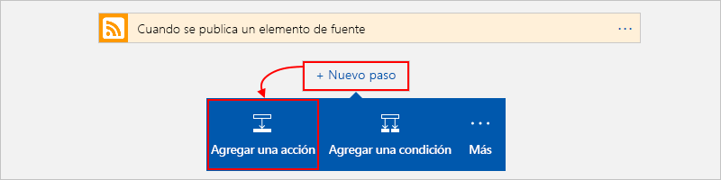

2. En **Elegir una acción**, busque "send email" (enviar correo electrónico) y luego seleccione la acción "send email" (enviar correo electrónico) para el proveedor de su elección. Para filtrar la lista de acciones y encontrar un servicio específico, puede seleccionar primero el conector en **Conectores**.

   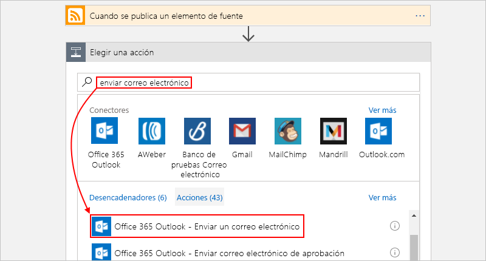

   * Para las cuentas profesionales o educativas de Azure, seleccione Office 365 Outlook. 
   * Para las cuentas de Microsoft personales, seleccione Outlook.com.

3. Si se le piden credenciales, inicie sesión en su cuenta de correo electrónico para que Logic Apps cree una conexión a su cuenta de correo electrónico.

4. En la acción **Enviar correo electrónico**, especifique los datos que desea que el correo electrónico incluya. 

   1. En el cuadro **Para**, escriba la dirección de correo electrónico del destinatario. 
   Para realizar pruebas, puede usar su propia dirección de correo electrónico.

      Por ahora, omita la lista de parámetros o la lista **Agregar contenido dinámico** que aparece. 
      Al hacer clic en algunos cuadros de edición, esta lista aparece y muestra los parámetros disponibles del paso anterior que se pueden incluir como entradas en el flujo de trabajo.
      El ancho del explorador determina lo que aparece en la lista.

   2. En el cuadro **Asunto**, escriba este texto con un espacio en blanco final: ```New RSS item: ```

      
 
   3. En la lista de parámetros o en la lista **Agregar contenido dinámico**, seleccione **Título de fuente** para incluir el título del elemento RSS.

      Por ejemplo, esta es la lista de parámetros:

      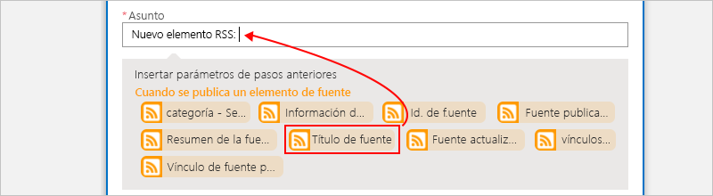

      Y esta la lista de contenido dinámico:

      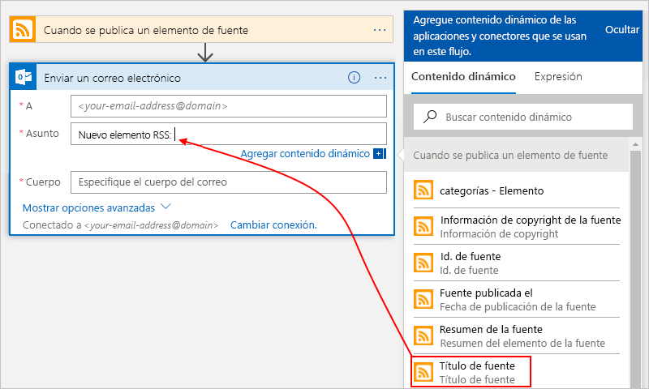

      Cuando haya terminado, el asunto del correo electrónico será similar a este ejemplo:

      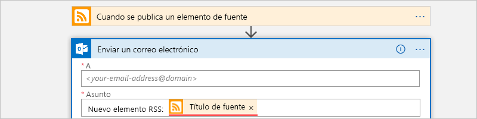

      Si un bucle "Para cada uno" aparece en el diseñador, habrá seleccionado un campo que contiene una matriz, como el campo **categorías-elemento**. 
      Para este tipo de campos, el diseñador añade automáticamente este bucle alrededor de la acción que hace referencia a ese campo. 
      De este modo, la aplicación lógica realiza la misma acción en cada elemento de la matriz. 
      Para quitar el bucle, elija el botón de **puntos suspensivos** (**...**) de la barra de título del bucle y **Eliminar**.

   4. En el cuadro **Cuerpo**, escriba este texto y seleccione estos campos para el cuerpo del correo electrónico. 
   Para agregar líneas en blanco en el cuadro de edición, presione Mayús + Entrar. 

      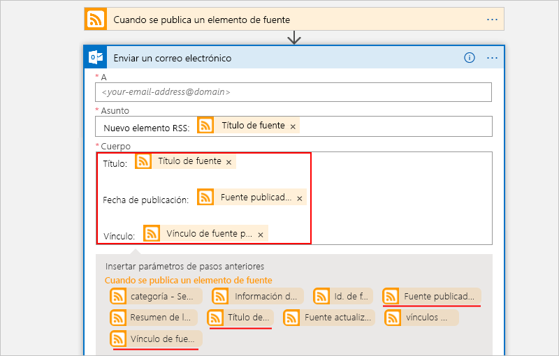

      | Configuración | DESCRIPCIÓN | 
      | ----- | ----------- | 
      | **Título de fuente** | Título del elemento | 
      | **Fuente publicada el** | Fecha y hora de publicación del elemento | 
      | **Vínculo de fuente principal** | Dirección URL del elemento | 
      ||| 
   
5. Guarde la aplicación lógica.

A continuación, pruebe la aplicación lógica.

## <a name="run-your-logic-app"></a>Ejecución de la aplicación lógica

Para iniciar manualmente la aplicación lógica, en la barra de la barra de herramientas del diseñador, elija **Ejecutar**. También puede esperar a que la aplicación lógica se ejecute en la programación especificada (cada minuto). Si la fuente RSS tiene nuevos elementos, la aplicación lógica envía un correo electrónico para cada uno de ellos. No obstante, si la fuente no tiene elementos nuevos, la aplicación lógica omite el paso de activar el desencadenador y espera al siguiente intervalo para volver a realizar la comprobación. 

Por ejemplo, este es un correo electrónico de ejemplo que envía esta aplicación lógica:


Si no recibe ningún correo electrónico, compruebe la carpeta de correo electrónico no deseado. El filtro de correo electrónico no deseado podría redirigir esta clase de correo. 

Enhorabuena, acaba de crear y ejecutar su primera aplicación lógica.

## <a name="clean-up-resources"></a>Limpieza de recursos

Cuando ya no lo necesite, elimine el grupo de recursos que contiene la aplicación lógica y los recursos relacionados. En el menú principal de Azure, vaya a **Grupos de recursos** y seleccione el grupo de recursos de la aplicación lógica. Seleccione **Eliminar grupo de recursos**. Escriba el nombre del grupo de recursos como confirmación y elija **Eliminar**.

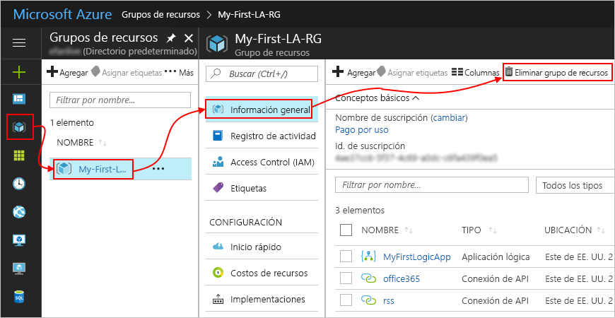

## <a name="get-support"></a>Obtención de soporte técnico

* Si tiene alguna duda, visite el [foro de Azure Logic Apps](https://social.msdn.microsoft.com/Forums/en-US/home?forum=azurelogicapps).
* Para enviar ideas sobre características o votar sobre ellas, visite el [sitio de comentarios de los usuarios de Logic Apps](http://aka.ms/logicapps-wish).

## <a name="next-steps"></a>pasos siguientes

En esta guía de inicio rápido, ha creado su primera aplicación lógica que comprueba si hay actualizaciones de RSS según la programación especificada (cada minuto) y realiza una acción (envía un correo electrónico) cuando hay actualizaciones. Para más información, continúe con este tutorial para crear flujos de trabajo basados en programación más avanzados:

> [!div class="nextstepaction"]
> [Comprobación del tráfico con una aplicación lógica basada en una programación](../logic-apps/tutorial-build-schedule-recurring-logic-app-workflow.md)