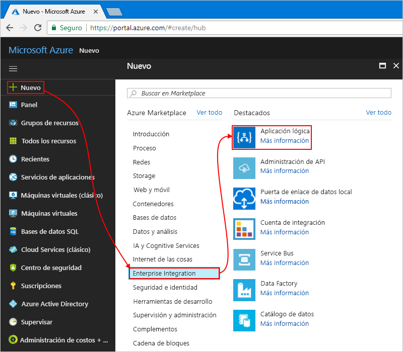

# <a name="check-traffic-with-a-scheduler-based-logic-app"></a>Comprobación del tráfico con una aplicación lógica basada en un programador

Azure Logic Apps le ayuda a automatizar los flujos de trabajo que se ejecutan mediante un programador. Este tutorial muestra cómo puede crear una [aplicación lógica](../logic-apps/logic-apps-overview.md) con un desencadenador de programador que se ejecuta por las mañanas los días de entre semana y comprueba el tiempo de desplazamiento, incluido el tráfico, entre dos lugares. Si el tiempo supera un límite específico, la aplicación lógica envía un correo electrónico con el tiempo de desplazamiento y el tiempo adicional necesario para el destino.

En este tutorial, aprenderá a:

> [!div class="checklist"]
> * Crear una aplicación lógica en blanco. 
> * Agregar un desencadenador que funciona como un programador para la aplicación lógica.
> * Agregar una acción que obtiene el tiempo de desplazamiento para una ruta.
> * Agregar una acción que crea una variable, convierte el tiempo de desplazamiento de segundos a minutos y guarda ese resultado en la variable.
> * Agregar una condición que compara el tiempo de desplazamiento con un límite especificado.
> * Agregar una acción que envía un correo electrónico si el tiempo de desplazamiento supera el límite.

Cuando haya terminado, la aplicación lógica se parecerá a este flujo de trabajo, en un alto nivel:


Si no tiene ninguna suscripción a Azure, <a href="https://azure.microsoft.com/free/" target="_blank">cree una cuenta gratuita de Azure</a> antes de empezar.

## <a name="prerequisites"></a>requisitos previos

* Una cuenta de correo electrónico con un proveedor de correo electrónico compatible con Logic Apps, como Office 365 Outlook, Outlook.com o Gmail. En el caso de otros proveedores, [consulte la lista de conectores que se muestra aquí](https://docs.microsoft.com/connectors/). Esta guía de inicio rápido usa una cuenta de Outlook.com. Si utiliza una cuenta de correo electrónico diferente, los pasos generales siguen siendo los mismos pero la interfaz de usuario podría ser ligeramente distinta.

* Para obtener el tiempo de desplazamiento para una ruta, necesita una clave de acceso para la API de Mapas de Bing. Para obtener esta clave, siga los pasos sobre <a href="https://msdn.microsoft.com/library/ff428642.aspx" target="_blank">cómo obtener una clave de Mapas de Bing</a>. 

## <a name="sign-in-to-the-azure-portal"></a>Inicie sesión en el Portal de Azure.

Inicie sesión en <a href="https://portal.azure.com" target="_blank">Azure Portal</a> con sus credenciales de su cuenta de Azure.

## <a name="create-your-logic-app"></a>Creación de una aplicación lógica

1. En el menú principal de Azure Portal, elija **Crear un recurso** > **Enterprise Integration** > **Logic App**.

   

2. En **Crear aplicación lógica**, proporcione esta información sobre la aplicación lógica tal como se muestra y se describe a continuación. Cuando esté listo, elija **Anclar al panel** > **Crear**.

   

   | Configuración | Valor | DESCRIPCIÓN | 
   | ------- | ----- | ----------- | 
   | **Name** | LA TravelTime | Nombre de la aplicación lógica | 
   | **Suscripción** | <*nombre-de-su-suscripción-a-Azure*> | El nombre de la suscripción a Azure | 
   | **Grupos de recursos** | LA-TravelTime-RG | Nombre del [grupo de recursos de Azure](../azure-resource-manager/resource-group-overview.md) que se utiliza para organizar recursos relacionados | 
   | **Ubicación** | Este de EE. UU. 2 | Región en la que desea almacenar información sobre la aplicación lógica | 
   | **Log Analytics** | Off | Mantenga el valor **Off** para el registro de diagnóstico. | 
   |||| 

3. Una vez que Azure haya implementado la aplicación, el Diseñador de aplicaciones lógicas se abre y muestra una página con un vídeo de introducción y plantillas para patrones de aplicaciones lógicas comunes. En **plantillas**, elija **Aplicación lógica en blanco**.

   

A continuación, agregue el [desencadenador](../logic-apps/logic-apps-overview.md#logic-app-concepts) de periodicidad, que se activa en función de una programación especificada. Cada aplicación lógica debe comenzar con un desencadenador, que se activa cuando sucede un evento específico o cuando hay nuevos datos que cumplen una condición determinada. Para más información, consulte [Creación de una nueva aplicación lógica](../logic-apps/quickstart-create-first-logic-app-workflow.md).

## <a name="add-scheduler-trigger"></a>Incorporación de un desencadenador de programador

1. En el diseñador, escriba "periodicidad" en el cuadro de búsqueda. Seleccione este desencadenador: **Programación: Periodicidad**

   

2. En la forma **Periodicidad**, elija el botón de **puntos suspensivos** (**...** ) y luego **Cambiar de nombre**. Cambie el nombre del desencadenador por esta descripción:```Check travel time every weekday morning```

   

3. En el desencadenador, elija **Mostrar opciones avanzadas**.

4. Proporcione los detalles de programación y periodicidad para el desencadenador tal como se muestra y se describe a continuación:

   

   | Configuración | Valor | DESCRIPCIÓN | 
   | ------- | ----- | ----------- | 
   | **Intervalo** | 1 | Número de intervalos que se espera entre comprobaciones | 
   | **Frecuencia** | Semana | Unidad de tiempo que se usa para la periodicidad. | 
   | **Zona horaria** | None | Se aplica únicamente cuando se especifica una hora de inicio. Resulta útil para especificar una zona horaria no local. | 
   | **Hora de inicio** | None | La periodicidad se retrasa hasta una fecha y hora específicas. Para más información, consulte [Programación de tareas y flujos de trabajo ejecutados con regularidad](../connectors/connectors-native-recurrence.md). | 
   | **En estos días** | Lunes,Martes,Miércoles,Jueves,Viernes | Disponible solo cuando **Frecuencia** se establece en "Semana". | 
   | **A estas horas** | 7,8,9 | Disponible solo cuando **Frecuencia** se establece en "Semana" o "Día". Se seleccionan las horas del día para ejecutar esta periodicidad. En este ejemplo, la ejecución se realiza a las marcas de hora 7, 8 y 9. | 
   | **En estos minutos** | 0,15,30,45 | Disponible solo cuando **Frecuencia** se establece en "Semana" o "Día". Se seleccionan los minutos del día para ejecutar esta periodicidad. En este ejemplo, la ejecución se realiza cada 15 minutos a partir de la marca de hora cero. | 
   ||||

   Este desencadenador se activa los días de entre semana cada 15 minutos, a partir de las 7:00 a.m. y hasta las 9:45 p.m. 
   El cuadro **Vista previa** muestra la programación de periodicidad. 
   Para más información, consulte [Programación de tareas y flujos de trabajo](../connectors/connectors-native-recurrence.md) y [Acciones y desencadenadores de flujos de trabajo](../logic-apps/logic-apps-workflow-actions-triggers.md#recurrence-trigger).

5. Para ocultar por ahora los detalles del desencadenador, haga clic dentro de la barra de título de la forma.

   

6. Guarde la aplicación lógica. En la barra de herramientas del diseñador, haga clic en **Guardar**. 

La aplicación lógica está ahora activa pero no hace más que repetirse. Por lo tanto, agregue una acción que responda cuando se active el desencadenador.

## <a name="get-the-travel-time-for-a-route"></a>Obtención del tiempo de desplazamiento para una ruta

Ahora que ya tiene un desencadenador, agregue una [acción](../logic-apps/logic-apps-overview.md#logic-app-concepts) que obtenga el tiempo de desplazamiento entre dos lugares. Logic Apps proporciona un conector para la API de Mapas de Bing de forma que pueda obtener fácilmente esta información. Antes de iniciar esta tarea, asegúrese de tener una clave de la API de Mapas de Bing tal como se describe en los requisitos previos de este tutorial.

1. En el Diseñador de aplicación lógica, en el desencadenador, elija **+ Nuevo paso** > **Agregar una acción**.

2. Busque "mapas" y seleccione esta acción: **Bing Maps - Get route** (Mapas de Bing: Obtener ruta).

3. Si no tiene una conexión de Mapas de Bing, se le solicitará que cree una conexión. Proporcione estos detalles de conexión y elija **Create** (Crear).

   

   | Configuración | Valor | DESCRIPCIÓN |
   | ------- | ----- | ----------- |
   | **Nombre de la conexión** | BingMapsConnection | Proporcione un nombre para la conexión. | 
   | **Clave de API** | <*su-clave-de-Mapas-de-Bing*> | Escriba la clave de Mapas de Bing recibida previamente. Si no tiene una clave de Mapas de Bing, consulte <a href="https://msdn.microsoft.com/library/ff428642.aspx" target="_blank">Getting a Bing Maps Key</a> (Obtención de una clave de Mapas de Bing). | 
   | | | |  

4. Cambie el nombre de la acción por esta descripción: ```Get route and travel time with traffic```

5. Proporcione los detalles de la acción **Get route** (Obtener ruta) tal como se muestra y se describe aquí, por ejemplo:

    

   | Configuración | Valor | DESCRIPCIÓN |
   | ------- | ----- | ----------- |
   | **Waypoint 1** (Punto de referencia 1) | <*ubicación-inicial*> | Origen de la ruta | 
   | **Waypoint 2** (Punto de referencia 2) | <*ubicación-final*> | Destino de la ruta | 
   | **Avoid** (Evitar) | None | Cualquier elemento para evitar en la ruta, como autopistas, peajes, etc. | 
   | **Optimize** (Optimizar) | timeWithTraffic | Parámetro para optimizar la ruta, como distancia, tiempo de desplazamiento con tráfico actual, etc. Seleccione este parámetro: "timeWithTraffic". | 
   | **Distance unit** (Unidad de distancia) | <*su preferencia*> | Unidad de distancia para la ruta. En este artículo se usa esta unidad: "Mile" (Milla).  | 
   | **Travel mode** (Modo de desplazamiento) | Conducción | Modo de desplazamiento para la ruta. Seleccione este modo: "Driving" (Conducción). | 
   | **Transit Date-Time** (Fecha y hora de tránsito) | None | Se aplica solo al modo de tránsito. | 
   | **Tipo de fecha y hora** | None | Se aplica solo al modo de tránsito. | 
   |||| 

   Para más información acerca de estos parámetros, consulte [Calculate a route](https://msdn.microsoft.com/library/ff701717.aspx) (Cálculo de una ruta).

6. Guarde la aplicación lógica.

A continuación, cree una variable para que pueda convertir y almacenar el tiempo de desplazamiento actual en minutos, en lugar de en segundos. De este modo, puede evitar repetir la conversión y utilizar el valor más fácilmente en pasos posteriores. 

## <a name="create-variable-to-store-travel-time"></a>Creación de una variable para almacenar el tiempo de desplazamiento

A veces, es posible que desee realizar operaciones en los datos del flujo de trabajo y usar los resultados en acciones posteriores. Para guardar estos resultados, de forma que pueda volver a utilizarlos o hacer referencia a ellos fácilmente, puede crear variables para almacenar los resultados después de procesarlos. Solo puede crear variables en el nivel superior de la aplicación lógica.

De forma predeterminada, la acción anterior **Get route** (Obtener ruta) devuelve el tiempo de desplazamiento actual con el tráfico en segundos mediante el campo **Travel Duration Traffic** (Tráfico de duración del desplazamiento). Al convertir y almacenar este valor en minutos, facilita volver a utilizar el valor más adelante sin necesidad de convertirlo de nuevo.

1. En la acción **Get route** (Obtener ruta), elija **+ Nuevo paso** > **Agregar una acción**.

2. Busque "variables" y seleccione esta acción: **Variables: Inicializar variable**.

   

3. Cambie el nombre de esta acción por esta descripción: ```Create variable to store travel time```

4. Proporcione los detalles de la variable tal como se describen aquí:

   | Configuración | Valor | DESCRIPCIÓN | 
   | ------- | ----- | ----------- | 
   | **Name** | travelTime | Nombre de la variable | 
   | **Tipo** | Entero | Tipo de datos de la variable | 
   | **Valor** | Expresión que convierte el tiempo de desplazamiento actual de segundos a minutos (consulte los pasos a continuación de esta tabla). | Valor inicial de la variable | 
   |||| 

   1. Para crear la expresión para el campo **Valor**, haga clic en el campo para que aparezca la lista de contenido dinámico. 
   Si es necesario, amplíe el explorador hasta que aparezca la lista. 
   En la lista de contenido dinámico, elija **Expresión**. 

      

      Al hacer clic en algunos cuadros de edición, aparece una lista de contenido dinámico o una lista de parámetros insertada. En esta lista se muestran los parámetros de las acciones anteriores que puede usar como entradas en el flujo de trabajo. 
      La lista de contenido dinámico tiene un editor de expresiones donde puede seleccionar funciones para realizar operaciones. 
      Este editor de expresiones solo aparece en la lista de contenido dinámico.

      El ancho del explorador determina lo que aparece en la lista. 
      Si el explorador está en vista ampliada, aparece la lista de contenido dinámico. 
      Si el explorador está en vista reducida, aparece una lista de parámetros insertada debajo del cuadro de edición que tiene actualmente el foco.

   2. En el editor de expresiones, escriba esta expresión: ```div(,60)```

      

   3. Coloque el cursor dentro de la expresión entre el paréntesis de apertura (**(**) y la coma (**,**). 
   Elija **Contenido dinámico**.

      

   4. En la lista de contenido dinámico, seleccione **Travel Duration Traffic** (Tráfico de duración del desplazamiento).

      

   5. Una vez resuelto el campo en la expresión, seleccione **Aceptar**.

      

      El campo **Valor** aparece ahora como se muestra aquí:

      

5. Guarde la aplicación lógica.

A continuación, agregue una condición que compruebe si el tiempo de desplazamiento actual es mayor que un límite específico.

## <a name="compare-travel-time-with-limit"></a>Comparación del tiempo de desplazamiento con límite

1. En la acción anterior, elija **+ Nuevo paso** > **Agregar una condición**. 

2. Cambie el nombre de la condición por esta descripción: ```If travel time exceeds limit```

3. Cree una condición que compruebe si **travelTime** supera el límite especificado tal como se describe y se muestra aquí:

   1. En la condición, haga clic dentro del cuadro **Elegir un valor**, que está a la izquierda (vista ampliada del explorador) o en la parte superior (vista reducida del explorador).

   2. En la lista de contenido dinámico o de parámetros, seleccione el campo **travelTime** en **Variables**.

   3. En el cuadro de comparación, seleccione este operador: **es mayor que**

   4. En el cuadro **Elegir un valor** a la derecha (vista ampliada) o en la parte inferior (vista reducida), escriba este límite: ```15```

   Por ejemplo, si está trabajando en vista reducida, esta condición se crea del modo siguiente:

   

4. Guarde la aplicación lógica.

A continuación, agregue la acción que desea realizar cuando el tiempo de desplazamiento supere el límite.

## <a name="send-email-when-limit-exceeded"></a>Envío de un correo electrónico cuando se supere el límite

Ahora, agregue una acción que se le enviará por correo electrónico cuando el tiempo de desplazamiento supere el límite. Este correo electrónico incluye el tiempo de desplazamiento actual y el tiempo adicional necesario para desplazarse por la ruta especificada. 

1. En la rama **If true** (Si es true) de la condición, elija **Agregar una acción**.

2. Busque "enviar correo electrónico" y seleccione el conector de correo electrónico y la acción "enviar correo electrónico" que desea usar.

   

   * Para las cuentas de Microsoft personales, seleccione **Outlook.com**. 
   * Para las cuentas profesionales o educativas de Azure, seleccione **Office 365 Outlook**.

3. Si no tiene ya una conexión, se le solicita que inicie sesión en su cuenta de correo electrónico.

   Logic Apps crea una conexión a la cuenta de correo electrónico.

4. Cambie el nombre de la acción por esta descripción: ```Send email with travel time```

5. En el cuadro **Para**, escriba la dirección de correo electrónico del destinatario. Para las pruebas, use su dirección de correo electrónico.

6. En el cuadro **Asunto**, especifique el asunto del correo electrónico e incluya la variable **travelTime**.

   1. Escriba el texto ```Current travel time (minutes): ``` con un espacio final. 
   
   2. En la lista de parámetros o de contenido dinámico, seleccione **travelTime** en **Variables**. 
   
      Por ejemplo, si el explorador se encuentra en vista reducida:

      

7. En el cuadro **Cuerpo**, especifique el contenido del cuerpo del correo electrónico. 

   1. Escriba el texto ```Add extra travel time (minutes): ``` con un espacio final. 
   
   2. Si es necesario, amplíe el explorador hasta que aparezca la lista de contenido dinámico. 
   En la lista de contenido dinámico, elija **Expresión**.

      

   3. En el editor de expresiones, escriba esta expresión para que pueda calcular el número de minutos que superen el límite: ```sub(,15)```

      

   4. Coloque el cursor dentro de la expresión entre el paréntesis de apertura (**(**) y la coma (**,**). Elija **Contenido dinámico**.

      

   5. En **Variables**, seleccione **travelTime**.

      

   6. Una vez resuelto el campo en la expresión, seleccione **Aceptar**.

      

      El campo **Cuerpo** aparece ahora como se muestra aquí:

      

8. Guarde la aplicación lógica.

A continuación, pruebe la aplicación lógica, que ahora es similar a este ejemplo:


## <a name="run-your-logic-app"></a>Ejecución de la aplicación lógica

Para iniciar manualmente la aplicación lógica, en la barra de la barra de herramientas del diseñador, elija **Ejecutar**. Si el tiempo de desplazamiento actual permanece en el límite, la aplicación lógica no hace nada más y espera al siguiente intervalo antes de volver a comprobar.
Pero si el tiempo de desplazamiento actual supera el límite, recibirá un correo electrónico con el tiempo de desplazamiento actual y el número de minutos por encima del límite. Este es un correo electrónico de ejemplo que la aplicación lógica envía:


Si no recibe ningún correo electrónico, compruebe la carpeta de correo electrónico no deseado. El filtro de correo electrónico no deseado podría redirigir esta clase de correo. Si tampoco aparece allí y no está seguro de que la aplicación lógica se ejecutara correctamente, consulte el artículo de [solución de problemas en la aplicación lógica](../logic-apps/logic-apps-diagnosing-failures.md).

Enhorabuena, acaba de crear y ejecutar una aplicación lógica periódica basada en programación. 

Para crear otras aplicaciones lógicas que usen el desencadenador **Programación: Periodicidad**, consulte estas plantillas, que están disponibles tras crear una aplicación lógica:

* Enviarle recordatorios diarios.
* Eliminar blobs de Azure anteriores.
* Agregar mensaje a una cola de Azure Storage.

## <a name="clean-up-resources"></a>Limpieza de recursos

Cuando ya no lo necesite, elimine el grupo de recursos que contiene la aplicación lógica y los recursos relacionados. En el menú principal de Azure, vaya a **Grupos de recursos** y seleccione el grupo de recursos de la aplicación lógica. Seleccione **Eliminar grupo de recursos**. Escriba el nombre del grupo de recursos como confirmación y elija **Eliminar**.


## <a name="get-support"></a>Obtención de soporte técnico

* Si tiene alguna duda, visite el [foro de Azure Logic Apps](https://social.msdn.microsoft.com/Forums/en-US/home?forum=azurelogicapps).
* Para enviar ideas sobre características o votar sobre ellas, visite el [sitio de comentarios de los usuarios de Logic Apps](http://aka.ms/logicapps-wish).

## <a name="next-steps"></a>pasos siguientes

En este tutorial ha creado una aplicación de lógica que comprueba el tráfico según una programación definida (por las mañanas los días de entre semana) y realiza alguna acción (envío de correo electrónico) cuando el tiempo de desplazamiento supera un límite especificado. Ahora, aprenda a crear una aplicación lógica que envía solicitudes de lista de correo para su aprobación mediante la integración de servicios de Azure, servicios de Microsoft y otras aplicaciones SaaS.

> [!div class="nextstepaction"]
> [Administración de solicitudes de lista de distribución de correo](../logic-apps/tutorial-process-mailing-list-subscriptions-workflow.md)
