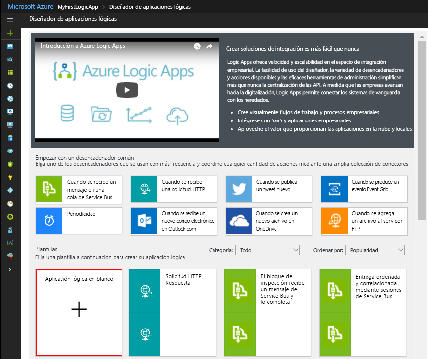

# <a name="process-emails-and-attachments-with-a-logic-app"></a>Procesamiento de correos electrónicos y datos adjuntos con una aplicación lógica

Azure Logic Apps le ayuda a automatizar los flujos de trabajo y a integrar los datos entre servicios de Azure, servicios de Microsoft, otras aplicaciones de software como servicio (SaaS) y sistemas locales. En este tutorial se muestra cómo puede crear una [aplicación lógica](../logic-apps/logic-apps-overview.md) que controla los correos electrónicos entrantes y sus datos adjuntos. Esta aplicación lógica procesa ese contenido, lo guarda en Azure Storage y envía notificaciones para revisar ese contenido. 

En este tutorial, aprenderá a:

> [!div class="checklist"]
> * Configurar [Azure Storage](../storage/common/storage-introduction.md) y el Explorador de Storage para comprobar los correos electrónicos y los datos adjuntos guardados.
> * Crear una [función de Azure](../azure-functions/functions-overview.md) que elimina el código HTML de los correos electrónicos. Este tutorial incluye el código que puede usar para esta función.
> * Crear una aplicación lógica en blanco.
> * Agregar un desencadenador que supervise los datos adjuntos en los correos electrónicos
> * Agregar una condición que compruebe si los correos electrónicos tienen datos adjuntos
> * Agregar una acción que llama a la función de Azure cuando un correo electrónico tiene datos adjuntos
> * Agregar una acción que crea blobs de almacenamiento para correos electrónicos y datos adjuntos
> * Agregar una acción que envía notificaciones por correo electrónico

Cuando haya terminado, la aplicación lógica se parecerá a este flujo de trabajo, en un alto nivel:


Si no tiene ninguna suscripción a Azure, <a href="https://azure.microsoft.com/free/" target="_blank">cree una cuenta gratuita de Azure</a> antes de empezar. 

## <a name="prerequisites"></a>requisitos previos

* Una cuenta de correo electrónico con un proveedor de correo electrónico compatible con Logic Apps, como Office 365 Outlook, Outlook.com o Gmail. En el caso de otros proveedores, [consulte la lista de conectores que se muestra aquí](https://docs.microsoft.com/connectors/).

  Esta aplicación lógica usa una cuenta de Office 365 Outlook. 
  Si utiliza una cuenta de correo electrónico diferente, los pasos generales siguen siendo los mismos pero la interfaz de usuario podría ser ligeramente distinta.

* Descargue e instale el <a href="http://storageexplorer.com/" target="_blank">Explorador de Microsoft Azure Storage</a>, una herramienta que es gratuita. Esta herramienta le ayuda a comprobar que el contenedor de almacenamiento esté configurado correctamente.

## <a name="sign-in-to-the-azure-portal"></a>Inicie sesión en el Portal de Azure.

Inicie sesión en <a href="https://portal.azure.com" target="_blank">Azure Portal</a> con sus credenciales de su cuenta de Azure.

## <a name="set-up-storage-to-save-attachments"></a>Configuración del almacenamiento para guardar datos adjuntos

Puede guardar los correos electrónicos entrantes y los datos adjuntos como blobs en un [contenedor de Azure Storage](../storage/common/storage-introduction.md). 

1. Para crear un contenedor de almacenamiento, [cree una cuenta de almacenamiento](../storage/common/storage-create-storage-account.md#create-a-storage-account) con esta configuración:

   | Configuración | Valor | DESCRIPCIÓN | 
   | ------- | ----- | ----------- | 
   | **Name** | attachmentstorageacct | El nombre de la cuenta de almacenamiento. | 
   | **Modelo de implementación** | Resource Manager | El [modelo de implementación](../azure-resource-manager/resource-manager-deployment-model.md) para administrar la implementación de recursos | 
   | **Tipo de cuenta** | Uso general | El [tipo de cuenta de almacenamiento](../storage/common/storage-introduction.md#types-of-storage-accounts) | 
   | **Rendimiento** | Estándar | Esta configuración especifica los tipos de datos admitidos y los medios para almacenar los datos. Consulte [Tipos de cuentas de almacenamiento](../storage/common/storage-introduction.md#types-of-storage-accounts). | 
   | **Replicación** | Almacenamiento con redundancia local (LRS) | Esta configuración especifica cómo se copian, se almacenan, se administran y se sincronizan los datos. Consulte [Replicación](../storage/common/storage-introduction.md#replication). | 
   | **Se requiere transferencia segura** | Disabled | Esta configuración especifica la seguridad que necesitan las solicitudes en las conexiones. Consulte [Exigencia de transferencia segura](../storage/common/storage-require-secure-transfer.md). | 
   | **Suscripción** | <*nombre-de-su-suscripción-a-Azure*> | El nombre de la suscripción a Azure | 
   | **Grupos de recursos** | LA-Tutorial-RG | El nombre del [grupo de recursos de Azure](../azure-resource-manager/resource-group-overview.md) usado para organizar y administrar los recursos relacionados. <p>**Nota:** Existe un grupo de recursos dentro de una región específica. Aunque es posible que los elementos de este tutorial no estén disponibles en todas las regiones, intente usar la misma región siempre que sea posible. | 
   | **Ubicación** | Este de EE. UU. 2 | La región dónde almacenar la información sobre su cuenta de almacenamiento | 
   | **Configuración de redes virtuales** | Disabled | En este tutorial, mantenga el valor **Deshabilitado**. | 
   |||| 

   También puede usar [Azure PowerShell](../storage/common/storage-quickstart-create-storage-account-powershell.md) o la [CLI de Azure](../storage/common/storage-quickstart-create-storage-account-cli.md).
  
2. Una vez que Azure implementa su cuenta de almacenamiento, obtenga la clave de acceso para ella:

   1. En el menú de la cuenta de almacenamiento, en **Configuración**, elija **Claves de acceso**. 
   2. Busque **key1** en **Claves predeterminadas** y el nombre de la cuenta de almacenamiento.

      

   También puede usar [Azure PowerShell](https://docs.microsoft.com/powershell/module/azurerm.storage/get-azurermstorageaccountkey) o la [CLI de Azure](https://docs.microsoft.com/cli/azure/storage/account/keys?view=azure-cli-latest.md#az_storage_account_keys_list). 

3. Cree un contenedor de almacenamiento para los datos adjuntos de correo electrónico.
   
   1. En el menú de la cuenta de almacenamiento, en el panel **Información general**, elija **Blobs** en **Servicios**, a continuación, elija **+ Contenedor**.

   2. Escriba "datos adjuntos" como nombre del contenedor. En **Nivel de acceso público**, seleccione **Contenedor (acceso de lectura anónimo para contenedores y blobs)** y elija **Aceptar**.

   También puede usar [Azure PowerShell](https://docs.microsoft.com/powershell/module/azure.storage/new-azurestoragecontainer) o la [CLI de Azure](https://docs.microsoft.com/cli/azure/storage/container?view=azure-cli-latest#az_storage_container_create). 
   Cuando haya terminado, puede encontrar el contenedor de almacenamiento en la cuenta de almacenamiento en Azure Portal:

   

A continuación, conecte el Explorador de Storage a la cuenta de almacenamiento.

## <a name="set-up-storage-explorer"></a>Configurar el Explorador de Storage

Ahora, conecte el Explorador de Storage a la cuenta de almacenamiento para que pueda confirmar que la aplicación lógica guarda correctamente los datos adjuntos como blobs en el contenedor de almacenamiento.

1. Abra el Explorador de Microsoft Azure Storage. Cuando el Explorador de Storage le solicite una conexión a Azure Storage, elija **Use a storage account name and key** >  (Usar un nombre y una clave de cuenta de almacenamiento) **Next** (Siguiente).
Si no aparece ningún mensaje, elija **Add account** (Agregar cuenta) en la barra de herramientas del explorador.

2. En **Attach using Name and Key** (Asociar con el nombre y la clave), escriba el nombre y la clave de acceso de la cuenta de almacenamiento que guardó anteriormente. Elija **Next** >  (Siguiente) **Connect** (Conectar).

3. Compruebe que la cuenta de almacenamiento y el contenedor aparecen correctamente en el Explorador de Storage:

   1. En **Explorer** (Explorador), expanda **(Local and Attached)** (Local y asociada) > 
   **Storage Accounts** (Cuentas de almacenamiento) > **attachmentstorageaccount** > 
   **Blob Containers** (Contenedores de blobs).

   2. Confirme que el contenedor "attachments" (datos adjuntos) aparece ahora. 
   Por ejemplo: 

      

A continuación, cree una [función de Azure](../azure-functions/functions-overview.md) que elimine el código HTML del correo electrónico entrante.

## <a name="create-a-function-to-clean-html"></a>Creación de una función para limpiar el código HTML

Ahora, use el fragmento de código proporcionado en estos pasos para crear una función de Azure que quite el código HTML de cada correo electrónico entrante. De este modo, el contenido del correo electrónico es más limpio y se procesa de manera más fácil. A continuación, puede llamar a esta función desde la aplicación lógica.

1. Antes de crear una función, [cree una aplicación de función](../azure-functions/functions-create-function-app-portal.md) con estos valores de configuración:

   | Configuración | Valor | DESCRIPCIÓN | 
   | ------- | ----- | ----------- | 
   | **Nombre de la aplicación** | CleanTextFunctionApp | Un nombre descriptivo y globalmente único para la aplicación de función. | 
   | **Suscripción** | <*nombre-de-su-suscripción-a-Azure*> | La misma suscripción de Azure que usó anteriormente. | 
   | **Grupo de recursos** | LA-Tutorial-RG | El mismo grupo de recursos de Azure que usó anteriormente. | 
   | **Plan de hospedaje** | Plan de consumo | Esta configuración determina cómo asignar y escalar los recursos, como la potencia de computación, para ejecutar la aplicación de función. Consulte [Comparación de planes de hospedaje](../azure-functions/functions-scale.md). | 
   | **Ubicación** | Este de EE. UU. 2 | La misma región que usó anteriormente. | 
   | **Storage** | cleantextfunctionstorageacct | Cree una cuenta de almacenamiento para su aplicación de función. Use solo letras minúsculas y números. <p>**Nota:** Esta cuenta de almacenamiento contiene las aplicaciones de función y difiere de la cuenta de almacenamiento creada anteriormente para los datos adjuntos de correo electrónico. | 
   | **Application Insights** | Off | Activa la supervisión de aplicaciones con [Application Insights](../application-insights/app-insights-overview.md); sin embargo, en este tutorial, mantenga el valor de configuración **Off** (Desactivado). | 
   |||| 

   Si la aplicación de función no se abre automáticamente tras la implementación, busque su aplicación en <a href="https://portal.azure.com" target="_blank">Azure Portal</a>. En el menú principal de Azure, elija **App Services**, y seleccione su aplicación de función.

   

   Si **App Services** no aparece en el menú de Azure, vaya en su lugar a **Más servicios**. En el cuadro de búsqueda, busque y seleccione **Instancias de Function App**. Para más información, consulte [Creación de función](../azure-functions/functions-create-first-azure-function.md).

   También puede usar la [CLI de Azure](../azure-functions/functions-create-first-azure-function-azure-cli.md) o [PowerShell y plantillas de Resource Manager](../azure-resource-manager/resource-group-template-deploy.md).

2. En **Instancias de Function App**, expanda **CleanTextFunctionApp** y seleccione **Functions**. En la barra de herramientas de funciones, elija **+ New function** (+ Nueva función).

   

3. En **Choose a template below or go to the quickstart** (Elegir una plantilla a continuación o ir a la guía de inicio rápido), seleccione la plantilla de función **HttpTrigger - C#**.

   

4. En **Asigne un nombre a la función**, escriba ```RemoveHTMLFunction```. En **HTTP trigger** >  (Desencadenador HTTP) **Nivel de autorización**, mantenga el valor de **Función** predeterminado y elija **Crear**.

   

5. Después de que se abre el editor, sustituya el código de plantilla por este código, que elimina el HTML y devuelve los resultados a la persona que llama:

   ``` CSharp
   using System.Net;
   using System.Text.RegularExpressions;

   public static async Task<HttpResponseMessage> Run(HttpRequestMessage req, TraceWriter log)
   {
      log.Info($"HttpWebhook triggered");

      // Parse query parameter
      string emailBodyContent = await req.Content.ReadAsStringAsync();

      // Replace HTML with other characters
      string updatedBody = Regex.Replace(emailBodyContent, "<.*?>", string.Empty);
      updatedBody = updatedBody.Replace("\\r\\n", " ");
      updatedBody = updatedBody.Replace(@"&nbsp;", " ");

      // Return cleaned text
      return req.CreateResponse(HttpStatusCode.OK, new { updatedBody });

   }
   ```

6. Cuando termine, seleccione **Guardar**. Para probar la función, elija **Probar** en el icono de flecha (**<**) situado en el borde derecho del editor. 

   

7. En el panel **Probar**, en **Cuerpo de la solicitud**, escriba esta línea y elija **Ejecutar**.

   ```json
   {"name": "<p><p>Testing my function</br></p></p>"}
   ```

   

   En la ventana **Salida** se muestra este resultado de la función:

   ```json
   {"updatedBody":"{\"name\": \"Testing my function\"}"}
   ```

Después de comprobar que funciona la función, cree la aplicación lógica. Aunque en este tutorial se muestra cómo crear una función que elimina el código HTML de los mensajes de correo electrónico, Logic Apps también tiene un conector de **HTML a texto**.

## <a name="create-your-logic-app"></a>Creación de una aplicación lógica

1. En el menú principal de Azure, elija **Nuevo** > **Enterprise Integration** > **Logic App**.

   

2. En **Crear aplicación lógica**, proporcione esta información sobre la aplicación lógica tal como se muestra y se describe a continuación. Cuando esté listo, elija **Anclar al panel** > **Crear**.

   

   | Configuración | Valor | DESCRIPCIÓN | 
   | ------- | ----- | ----------- | 
   | **Name** | LA-ProcessAttachment | Nombre de la aplicación lógica | 
   | **Suscripción** | <*nombre-de-su-suscripción-a-Azure*> | La misma suscripción de Azure que usó anteriormente. | 
   | **Grupos de recursos** | LA-Tutorial-RG | El mismo grupo de recursos de Azure que usó anteriormente. |
   | **Ubicación** | Este de EE. UU. 2 | La misma región que usó anteriormente. | 
   | **Log Analytics** | Off | En este tutorial, mantenga el valor **Off** (Desactivado). | 
   |||| 

3. Una vez que Azure haya implementado la aplicación, el Diseñador de aplicaciones lógicas se abre y muestra una página con un vídeo de introducción y plantillas para patrones de aplicaciones lógicas comunes. En **plantillas**, elija **Aplicación lógica en blanco**.

   

A continuación, agregue un [desencadenador](../logic-apps/logic-apps-overview.md#logic-app-concepts) que escuche los correos electrónicos entrantes que tienen datos adjuntos. Cada aplicación lógica debe comenzar con un desencadenador, que se activa cuando sucede un evento específico o cuando hay nuevos datos que cumplen una condición determinada. Para más información, consulte [Creación de una nueva aplicación lógica](../logic-apps/quickstart-create-first-logic-app-workflow.md).

## <a name="monitor-incoming-email"></a>Supervisión del correo electrónico entrante

1. En el diseñador, escriba "when email arrives" (cuando llega correo electrónico) en el cuadro de búsqueda. Seleccione este desencadenador para su proveedor de correo electrónico: **<*su proveedor de correo electrónico*> - When a new email arrives** (Cuando llega un nuevo correo electrónico), por ejemplo:

   

   * Para las cuentas profesionales o educativas de Azure, seleccione Office 365 Outlook. 
   * Para las cuentas de Microsoft personales, seleccione Outlook.com. 

2. Si se le piden credenciales, inicie sesión en su cuenta de correo electrónico para que Logic Apps pueda conectarse a su cuenta de correo electrónico.

3. Ahora, proporcione los criterios que usa el desencadenador para filtrar el nuevo correo electrónico.

   1. Especifique la carpeta, el intervalo y la frecuencia de comprobación del correo electrónico.

      

      | Configuración | Valor | DESCRIPCIÓN | 
      | ------- | ----- | ----------- | 
      | **Carpeta** | Bandeja de entrada | La carpeta de correo electrónico para comprobar. | 
      | **Intervalo** | 1 | Número de intervalos que se espera entre comprobaciones | 
      | **Frecuencia** | Minuto | La unidad de tiempo de cada intervalo entre comprobaciones | 
      |  |  |  | 
  
   2. Elija **Show advanced options** (Mostrar opciones avanzadas) y especifique estos valores de configuración:

      | Configuración | Valor | DESCRIPCIÓN | 
      | ------- | ----- | ----------- | 
      | **Tiene datos adjuntos** | Sí | Obtener solo los correos electrónicos con datos adjuntos. <p>**Nota:** El desencadenador no elimina los correos electrónicos de la cuenta, solo comprueba si existen nuevos mensajes y procesa únicamente los correos electrónicos que coinciden con el filtro del asunto. | 
      | **Include Attachments** (Incluir datos adjuntos) | Sí | Obtener los datos adjuntos como entrada del flujo de trabajo, en lugar de solamente buscar datos adjuntos. | 
      | **Subject Filter** (Filtro de asunto) | ```Business Analyst 2 #423501``` | El texto para encontrar el asunto del correo electrónico. | 
      |  |  |  | 

4. Para ocultar por ahora los detalles del desencadenador, haga clic dentro de la barra de título del desencadenador.

   

5. Guarde la aplicación lógica. En la barra de herramientas del diseñador, haga clic en **Guardar**.

   La aplicación lógica está ahora activa, pero no hace otra cosa que comprobar los correos electrónicos. 
   A continuación, agregue una condición que especifique criterios para continuar el flujo de trabajo.

## <a name="check-for-attachments"></a>Comprobar datos adjuntos

1. En el desencadenador, elija **+ New step** (+ Nuevo paso)  > **Add a condition** (Agregar una condición).

   Cuando aparece la forma de condición, de manera predeterminada, se muestra la lista de parámetros o la lista de contenido dinámico solo con los parámetros del paso anterior que se pueden incluir como entradas del flujo de trabajo. 
   El ancho del explorador determina lo que aparece en la lista.

2. Cambie el nombre de la condición por una descripción mejor.

   1. En la barra de título de la condición, elija el botón **puntos suspensivos** (**...** ) > **Rename** (Cambiar nombre).

      Por ejemplo, si el explorador se encuentra en vista reducida:

      

      Si el explorador se encuentra en vista amplia y la lista de contenido dinámico boquea el botón de puntos suspensivos, cierre la lista; para ello, elija **Add dynamic content** (Agregar contenido dinámico) dentro de la condición. 
      
      

   2. Cambie el nombre de la condición con esta descripción: ```If email has attachments and key subject phrase```

3. Describa la condición mediante una expresión. 

   1. Dentro de la forma de condición, elija **Edit in advanced mode** (Editar en modo avanzado).

      

   2. En el cuadro de texto, escriba esta expresión:

      ```@equals(triggerBody()?['HasAttachment'], bool('true'))```

      Esta expresión compara el valor de la propiedad **HasAttachment** (Tiene datos adjuntos) del cuerpo del desencadenador, que es el correo electrónico en este tutorial, con el objeto booleano ```True```. 
      Si ambos valores son iguales, el correo electrónico tiene al menos un archivo adjunto, la condición pasa y el flujo de trabajo continúa.

      Ahora, la condición es similar a este ejemplo:

      

   3. Elija **Edit in basic mode** (Editar en modo básico). La expresión se resuelve como se muestra aquí:

      

      > [!NOTE]
      > Para crear manualmente una expresión, debe trabajar en modo básico y tener abierta la lista dinámica para poder trabajar con el generador de expresiones. En **Expression** (Expresión), puede seleccionar funciones. En **Dynamic content** (Contenido dinámico), puede seleccionar campos de parámetro para usarlos en esas funciones.
      > Más adelante en este tutorial se muestra cómo crear manualmente expresiones.

4. Guarde la aplicación lógica.

### <a name="test-your-condition"></a>Prueba de la condición

Ahora, pruebe si la condición funciona correctamente:

1. Si la aplicación lógica no se está ejecutando aún, elija **Run** (Ejecutar) en la barra de herramientas del diseñador.

   Este paso inicia manualmente la aplicación lógica sin tener que esperar a que transcurra el intervalo especificado. 
   Sin embargo, no sucede nada hasta que el correo electrónico de prueba llega a la Bandeja de entrada. 

2. Envíese un correo electrónico que cumpla este criterio:

   * El asunto del correo electrónico tiene el texto que especificó en el **filtro de asunto** del desencadenador: ```Business Analyst 2 #423501```

   * El correo electrónico tiene un archivo adjunto. 
   Por ahora, cree un archivo de texto vacío y asocie ese archivo a su correo electrónico.

   Cuando llega el correo electrónico, la aplicación lógica comprueba si hay datos adjuntos y el texto de asunto especificado.
   Si pasa la condición, el desencadenador se activa y hace que el motor de Logic Apps cree una instancia de aplicación lógica e inicie el flujo de trabajo. 

3. Para comprobar que el desencadenador se ha activado y que la aplicación lógica se ejecutó correctamente, en el menú de la aplicación lógica, elija **Overview** (Información general).

   

   Si la aplicación lógica no se ha desencadenado o se ejecuta a pesar de que se ha desencadenado correctamente, consulte [Solución de problemas de la aplicación lógica](../logic-apps/logic-apps-diagnosing-failures.md).

A continuación, defina las acciones que se realizarán para la rama **If true**. Para guardar el correo electrónico junto con los datos adjuntos, elimine el código HTML del cuerpo del correo electrónico y, luego, cree blobs en el contenedor de almacenamiento para el correo electrónico y los datos adjuntos.

> [!NOTE]
> La lógica de aplicación no tiene que hacer nada con la rama **If false** cuando un correo electrónico no tiene datos adjuntos. Como ejercicio adicional, cuando termine este tutorial, puede agregar una acción adecuada que quiera realizar con la rama **If false**.

## <a name="call-the-removehtmlfunction"></a>Llamada a RemoveHTMLFunction

1. En el menú de la aplicación lógica, elija **Logic App Designer** (Diseñador de aplicaciones lógicas). En la rama **If true**, elija **Add an action** (Agregar una acción).

2. Busque "azure functions" y seleccione esta acción: **Azure Functions – Choose an Azure function** (Azure Functions: Elegir una función de Azure).

   

3. Seleccione la aplicación de función que creó anteriormente: **CleanTextFunctionApp**.

   

4. Ahora, seleccione la función: **RemoveHTMLFunction**.

   

5. Cambie el nombre de la forma de la función con esta descripción: ```Call RemoveHTMLFunction to clean email body``` 

6. En la forma de la función, escriba la entrada de la función que se va a procesar. Especifique el cuerpo del correo electrónico como se muestra y se describe aquí:

   

   1. En **Request Body** (Cuerpo de la solicitud), escriba este texto: 
   
      ```{ "emailBody": ``` 

      Hasta que finalice esta entrada en los pasos siguientes, aparece un error sobre JSON no válido.
      Cuando anteriormente probó esta función, la entrada especificada para esta función usaba notación de objetos JavaScript (JSON). 
      Por lo tanto, el cuerpo de la solicitud debe usar también el mismo formato. 

   2. En la lista de parámetros o la lista de contenido dinámico, seleccione el campo **Body** (Cuerpo) en **When a new email arrives** (Cuando llega un nuevo correo electrónico).
   Después del campo **Body** (Cuerpo), agregue la llave de cierre: ```}```

      

      En la definición de aplicación lógica, esta entrada aparece en este formato:

      ```{ "emailBody": "@triggerBody()?['Body']" }```

7. Guarde la aplicación lógica.

A continuación, agregue una acción que crea un blob en el contenedor de almacenamiento para guardar el cuerpo del correo electrónico.

## <a name="create-blob-for-email-body"></a>Creación del blob para el cuerpo del correo electrónico

1. En la forma de la función de Azure, elija **Add an action** (Agregar una acción). 

2. En **Elegir una acción**, busque "blob" y seleccione esta acción: **Azure Blob Storage – Create blob** (Azure Blob Storage: Crear blob).

   

3. Si no tiene una conexión a una cuenta de almacenamiento de Azure, cree una conexión a la cuenta de almacenamiento con esta configuración, como se muestra y se describen aquí. Cuando termine, seleccione **Crear**.

   

   | Configuración | Valor | DESCRIPCIÓN | 
   | ------- | ----- | ----------- | 
   | **Nombre de la conexión** | AttachmentStorageConnection | Un nombre descriptivo para la conexión. | 
   | **Storage Account** | attachmentstorageacct | El nombre de la cuenta de almacenamiento que creó anteriormente para guardar los datos adjuntos. | 
   |||| 

4. Cambie el nombre de la acción **Create blob** (Crear blob) con esta descripción:```Create blob for email body```.

5. En la acción **Create blob** (Crear blob), proporcione esta información y seleccione estos parámetros para crear el blob, como se muestra y se describe:

   

   | Configuración | Valor | DESCRIPCIÓN | 
   | ------- | ----- | ----------- | 
   | **Folder path** (Ruta de acceso a la carpeta) | /attachments | La ruta de acceso y el nombre del contenedor que creó anteriormente. También puede examinar y seleccionar un contenedor. | 
   | **Blob name** (Nombre de blob) | Campo **From** (De) | Pase el nombre del remitente de correo electrónico como nombre del blob. En la lista de parámetros o la lista de contenido dinámico, seleccione **From** (De) en **When a new email arrives** (Cuando llega un nuevo correo electrónico). | 
   | **Blob content** (Contenido del blob) | Campo **Content** (Contenido) | Pase el cuerpo del correo electrónico sin HTML como contenido del blob. En la lista de parámetros o la lista de contenido dinámico, seleccione **Body** (Cuerpo) en **Call RemoveHTMLFunction to clean email body** (Llamar a RemoveHTMLFunction para limpiar el cuerpo del correo electrónico). |
   |||| 

6. Guarde la aplicación lógica. 

### <a name="check-attachment-handling"></a>Comprobación del tratamiento de los datos adjuntos

Ahora compruebe si la aplicación lógica trata los correos electrónicos tal y como ha especificado:

1. Si la aplicación lógica no se está ejecutando aún, elija **Run** (Ejecutar) en la barra de herramientas del diseñador.

2. Envíese un correo electrónico que cumpla este criterio:

   * El asunto del correo electrónico tiene el texto que especificó en el **filtro de asunto** del desencadenador: ```Business Analyst 2 #423501```

   * El correo electrónico tiene al menos un archivo adjunto. 
   Por ahora, cree un archivo de texto vacío y asocie ese archivo a su correo electrónico.

   * El correo electrónico tiene algún contenido de prueba en el cuerpo, por ejemplo: 

     ```
     Testing my logic app
     ```

   Si la aplicación lógica no se ha desencadenado o se ejecuta a pesar de que se ha desencadenado correctamente, consulte [Solución de problemas de la aplicación lógica](../logic-apps/logic-apps-diagnosing-failures.md).

3. Compruebe que la aplicación lógica ha guardado el correo electrónico en el contenedor de almacenamiento correcto. 

   1. En el Explorador de Storage, expanda **(Local and Attached)** (Local y asociada) > 
   **Storage Accounts** > (Cuentas de almacenamiento) **attachmentstorageacct (External) (Externa)** > 
   **Blob Containers** > (Contenedores de blobs) **attachments** (datos adjuntos).

   2. Busque en el contenedor **attachments** (datos adjuntos) el correo electrónico. 

      En este momento, solo el correo electrónico aparece en el contenedor porque la aplicación lógica no procesa aún los datos adjuntos.

      

   3. Cuando haya terminado, elimine el correo electrónico del Explorador de Storage.

4. Si lo desea, para probar la rama **If false**, que en este momento no hace nada, puede enviar un correo electrónico que no cumpla los criterios.

A continuación, agregue un bucle para procesar todos los datos adjuntos de correo electrónico.

## <a name="process-attachments"></a>Procesamiento de los datos adjuntos

Esta lógica de aplicación emplea un bucle **Para cada uno** para procesar los datos adjuntos del correo electrónico.

1. En la forma **Create blob for email body** (Crear blob para el cuerpo del correo electrónico), elija **… More** (Más) y seleccione este comando: **Add a for each** (Agregar Para cada uno).

   

2. Cambie el nombre del bucle con esta descripción:```For each email attachment```.

3. Ahora, especifique los datos del bucle para procesar. Haga clic dentro del cuadro **Select an output from previous steps** (Seleccionar una salida de los pasos anteriores). En la lista de parámetros o la lista de contenido dinámico, seleccione **Attachments** (Datos adjuntos). 

   

   El campo **Attachments** (Datos adjuntos) pasa una matriz que contiene todos los datos adjuntos incluidos en un correo electrónico. 
   El bucle **For each** (Para cada uno) repite las acciones en cada elemento que se pasa con la matriz.

4. Guarde la aplicación lógica.

A continuación, agregue la acción que guarda cada archivo adjunto como un blob en el contenedor de almacenamiento **attachments** (datos adjuntos).

## <a name="create-blobs-for-attachments"></a>Creación de blobs para datos adjuntos

1. En el bucle **For each** (Para cada uno), elija **Add an action** (Agregar una acción) para que pueda especificar la tarea que se realizará en cada archivo adjunto encontrado.

   

2. En **Elegir una acción**, busque "blob" y, luego, seleccione esta acción: **Azure Blob Storage - Create blob** (Azure Blob Storage: Crear blob).

   

3. Cambie el nombre de la acción **Create blob 2** (Crear blob 2) por esta descripción: ```Create blob for each email attachment```.

4. En la acción **Create blob for each email attachment** (Crear blob para cada dato adjunto de correo electrónico), proporcione esta información y seleccione los parámetros para crear cada blob como se muestra y se describe:

   

   | Configuración | Valor | DESCRIPCIÓN | 
   | ------- | ----- | ----------- | 
   | **Folder path** (Ruta de acceso a la carpeta) | /attachments | La ruta de acceso y el nombre del contenedor creó anteriormente. También puede buscar y seleccionar un contenedor. | 
   | **Blob name** (Nombre de blob) | Campo **Name** (Nombre) | En la lista de parámetros o la lista de contenido dinámico, seleccione **Name** (Nombre) para pasar el nombre del archivo adjunto como nombre del blob. | 
   | **Blob content** (Contenido del blob) | Campo **Content** (Contenido) | En la lista de parámetros o la lista de contenido dinámico, seleccione **Content** (Contenido) para pasar el contenido de datos adjuntos como contenido del blob. |
   |||| 

5. Guarde la aplicación lógica. 

### <a name="check-attachment-handling"></a>Comprobación del tratamiento de los datos adjuntos

A continuación, compruebe si la aplicación lógica trata los datos adjuntos tal y como ha especificado:

1. Si la aplicación lógica no se está ejecutando aún, elija **Run** (Ejecutar) en la barra de herramientas del diseñador.

2. Envíese un correo electrónico que cumpla este criterio:

   * El asunto del correo electrónico tiene el texto que especificó en el **filtro de asunto** del desencadenador: ```Business Analyst 2 #423501```

   * El correo electrónico tiene al menos dos archivos adjuntos. 
   Por ahora, cree dos archivos de texto vacío y adjunte esos archivos a su correo electrónico.

   Si la aplicación lógica no se ha desencadenado o se ejecuta a pesar de que se ha desencadenado correctamente, consulte [Solución de problemas de la aplicación lógica](../logic-apps/logic-apps-diagnosing-failures.md).

3. Compruebe que la aplicación lógica ha guardado el correo electrónico y los datos adjuntos en el contenedor de almacenamiento correcto. 

   1. En el Explorador de Storage, expanda **(Local and Attached)** (Local y asociada) > 
   **Storage Accounts** > (Cuentas de almacenamiento) **attachmentstorageacct (External) (Externa)** > 
   **Blob Containers** > (Contenedores de blobs) **attachments** (datos adjuntos).

   2. Compruebe que en el contenedor **attachments** (datos adjuntos) se encuentren el correo electrónico y los datos adjuntos.

      

   3. Cuando haya terminado, elimine el correo electrónico y los datos adjuntos del Explorador de Storage.

A continuación, agregue una acción para que la aplicación lógica envíe un correo electrónico para revisar los datos adjuntos.

## <a name="send-email-notifications"></a>Envío de notificaciones por correo electrónico

1. En la rama **if true**, en el bucle **For each email attachment** (Para cada archivo adjunto de correo electrónico), elija **Add an action** (Agregar una acción). 

   

2. En **Elegir una acción**, busque "send email" (enviar correo electrónico) y luego seleccione la acción "send email" (enviar correo electrónico) para el proveedor de su elección. Para filtrar la lista de acciones y encontrar un servicio específico, puede seleccionar primero el conector en **Conectores**.

   

   * Para las cuentas profesionales o educativas de Azure, seleccione Office 365 Outlook. 
   * Para las cuentas de Microsoft personales, seleccione Outlook.com. 

3. Si se le piden credenciales, inicie sesión en su cuenta de correo electrónico para que Logic Apps cree una conexión a su cuenta de correo electrónico.

4. Cambie el nombre de la acción **Send an email** (Enviar un correo electrónico) por esta descripción:```Send email for review```.

5. Proporcione la información de esta acción y seleccione los campos que quiere incluir en el correo electrónico como se muestra y se describe. Para agregar líneas en blanco en el cuadro de edición, presione Mayús + Entrar.  

   Por ejemplo, si está trabajando con la lista de contenido dinámico:

   

   Si no encuentra un campo esperado en la lista, seleccione **See more** (Ver más) junto a **When a new email arrives** (Cuando llega un nuevo correo electrónico) en la lista de contenido dinámico o al final de la lista de parámetros.

   | Configuración | Valor | Notas | 
   | ------- | ----- | ----- | 
   | **To** | <*recipient-email-address*> | Para realizar pruebas, puede usar su propia dirección de correo electrónico. | 
   | **Asunto**  | ```ASAP - Review applicant for position: ``` **Subject** (Asunto) | El asunto del correo electrónico que quiere incluir. En la lista de parámetros o la lista de contenido dinámico, seleccione el campo **Subject** (Asunto) en **When a new email arrives** (Cuando llega un nuevo correo electrónico). | 
   | **Cuerpo** | ```Please review new applicant:``` <p>```Applicant name: ``` **From** (De) <p>```Application file location: ``` **Path** (Ruta de acceso) <p>```Application email content: ``` **Body** (Cuerpo) | El contenido del cuerpo del correo electrónico. En la lista de parámetros o la lista de contenido dinámico, seleccione estos campos: <p>- El campo **From** (De) en **When a new email arrives** (Cuando llega un nuevo correo electrónico) </br>- El campo **Path** (Ruta de acceso) en **Create blob for email body** (Crear blob para el cuerpo del correo electrónico) </br>- El campo **Body** (Cuerpo) en **Call RemoveHTMLFunction to clean email body** (Llamar a RemoveHTMLFunction para limpiar el cuerpo del correo electrónico) | 
   |||| 

   Si selecciona un campo que contiene una matriz, como **Content** (Contenido), el diseñador agrega automáticamente un bucle "For each" (Para cada uno) en la acción que haga referencia a ese campo. 
   De este modo, la aplicación lógica realiza la acción en todos los elementos de la matriz. 
   Para quitar el bucle, quite el campo de la matriz, mueva la acción de referencia fuera del bucle, elija el botón de puntos suspensivos (**...** ) en la barra de título del bucle y elija **Delete** (Eliminar).
     
6. Guarde la aplicación lógica. 

A continuación, pruebe la aplicación lógica, que ahora es similar a este ejemplo:


## <a name="run-your-logic-app"></a>Ejecución de la aplicación lógica

1. Envíese un correo electrónico que cumpla este criterio:

   * El asunto del correo electrónico tiene el texto que especificó en el **filtro de asunto** del desencadenador: ```Business Analyst 2 #423501```

   * El correo electrónico tiene uno o varios datos adjuntos. 
   Puede volver a usar un archivo de texto vacío de la prueba anterior. 
   Si quiere un escenario más realista, adjunte un archivo de reanudación.

   * El cuerpo del correo electrónico tiene este texto, que puede copiar y pegar:

     ```
     Name: Jamal Hartnett   
     
     Street address: 12345 Anywhere Road   
     
     City: Any Town   
     
     State or Country: Any State   
     
     Postal code: 00000   
     
     Email address: jamhartnett@outlook.com   
     
     Phone number: 000-000-0000   
     
     Position: Business Analyst 2 #423501   

     Technical skills: Dynamics CRM, MySQL, Microsoft SQL Server, JavaScript, Perl, Power BI, Tableau, Microsoft Office: Excel, Visio, Word, PowerPoint, SharePoint, and Outlook   

     Professional skills: Data, process, workflow, statistics, risk analysis, modeling; technical writing, expert communicator and presenter, logical and analytical thinker, team builder, mediator, negotiator, self-starter, self-managing  
     
     Certifications: Six Sigma Green Belt, Lean Project Management   
     
     Language skills: English, Mandarin, Spanish   
     
     Education: Master of Business Administration   
     ```

2. Ejecute la aplicación lógica. Si la operación tiene éxito, la aplicación lógica le envía un correo electrónico parecido al de este ejemplo:

   

   Si no recibe ningún correo electrónico, compruebe la carpeta de correo electrónico no deseado. 
   El filtro de correo electrónico no deseado podría redirigir esta clase de correo. 
   Si tampoco aparece allí y no está seguro de que la aplicación lógica se ejecutara correctamente, consulte el artículo de [solución de problemas en la aplicación lógica](../logic-apps/logic-apps-diagnosing-failures.md).

Enhorabuena, ahora ha creado y ejecutado una aplicación de lógica que automatiza tareas en diferentes servicios de Azure y llama a código personalizado.

## <a name="clean-up-resources"></a>Limpieza de recursos

Cuando ya no lo necesite, elimine el grupo de recursos que contiene la aplicación lógica y los recursos relacionados. En el menú principal de Azure, vaya a **Grupos de recursos** y seleccione el grupo de recursos de la aplicación lógica. Seleccione **Eliminar grupo de recursos**. Escriba el nombre del grupo de recursos como confirmación y elija **Eliminar**.


## <a name="get-support"></a>Obtención de soporte técnico

* Si tiene alguna duda, visite el [foro de Azure Logic Apps](https://social.msdn.microsoft.com/Forums/en-US/home?forum=azurelogicapps).
* Para enviar ideas sobre características o votar sobre ellas, visite el [sitio de comentarios de los usuarios de Logic Apps](http://aka.ms/logicapps-wish).

## <a name="next-steps"></a>pasos siguientes

En este tutorial, ha creado una aplicación de lógica que procesa y almacena datos adjuntos de correo electrónico mediante la integración de servicios de Azure, como Azure Storage y Azure Functions. Ahora, conozca más sobre otros conectores que puede usar para crear aplicaciones de lógica.

> [!div class="nextstepaction"]
> [Más información sobre los conectores de Logic Apps](../connectors/apis-list.md)
