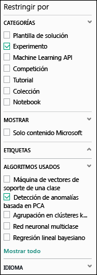
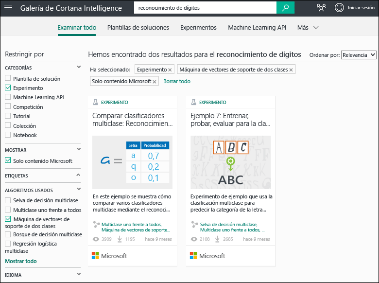
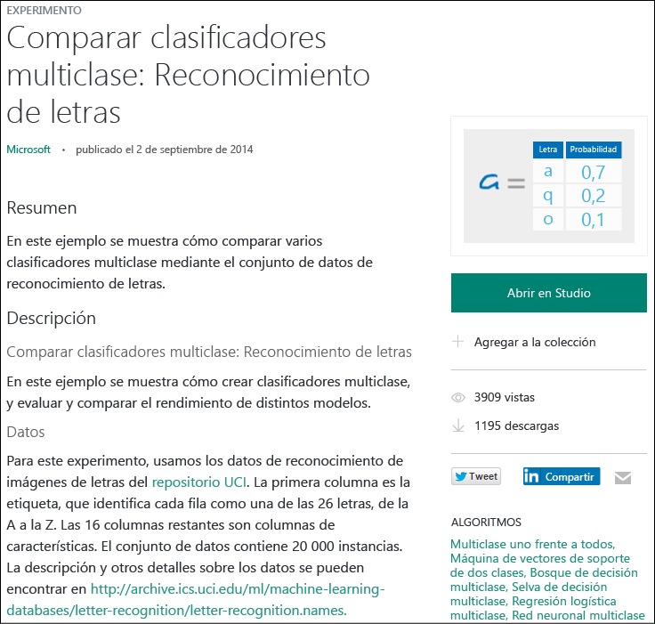

# Copia de experimentos de ejemplo para crear nuevos experimentos de aprendizaje automático
Obtenga información introductoria acerca de los experimentos de ejemplo de [Galería de Cortana Intelligence](http://gallery.cortanaintelligence.com/) en lugar de crear experimentos de aprendizaje automático desde cero. Puede usar los ejemplos para crear sus propias soluciones de aprendizaje automático.

En la galería hay experimentos de ejemplo creados por el equipo de Aprendizaje automático de Microsoft Azure, así como ejemplos compartidos por la comunidad de Aprendizaje automático. También puede plantear preguntas o publicar comentarios acerca de experimentos.

Para ver cómo usar la galería, vea el vídeo de 3 minutos [Copia del trabajo de otras personas para realizar ciencia de datos](machine-learning-data-science-for-beginners-copy-other-peoples-work-to-do-data-science.md) de la serie [Ciencia de datos para principiantes](machine-learning-data-science-for-beginners-the-5-questions-data-science-answers.md).

[!INCLUDE [machine-learning-free-trial](../../includes/machine-learning-free-trial.md)]

## Busque un experimento para copiar en la Galería de Cortana Intelligence
Para ver qué experimentos hay disponibles, vaya a la [galería](http://gallery.cortanaintelligence.com/) y haga clic en **Experiments** (Experimentos) en la parte superior de la página.

### Busque los experimentos más recientes o más populares
En esta página puede ver experimentos **agregados recientemente** (Recently added), desplazarse hacia abajo para averiguar **qué es popular** (What's popular) o consultar los **experimentos populares de Microsoft** (Popular Microsoft experiments) más recientes.

### Busque un experimento que cumpla los requisitos específicos
Para examinar todos los experimentos:

1. Haga clic en **Browse all** (Examinar todo) en la parte superior de la página.
2. En **Refine by** (Refinar por), seleccione **Experiment** (Experimento) para ver todos los experimentos de la galería.
3. Puede encontrar los experimentos que cumplan con sus requisitos de las siguientes maneras:
   * **Seleccione los filtros de la izquierda.** Por ejemplo, para examinar los experimentos que utilizan un algoritmo de detección de anomalías basado en PCA, seleccione **Experiment** (Experimento) en **Categories** (Categorías), y **PCA-Based Anomaly Detection** (Detección de anomalías basada en PCA) en **Algorithms Used** (Algoritmos usados). Si no ve ese algoritmo, haga clic en **Show all** (Mostrar todo) en la parte inferior de la lista.  
     
   * **Utilice el cuadro de búsqueda.**  Por ejemplo, para buscar experimentos aportados por Microsoft relacionados con el reconocimiento de dígitos que usen un algoritmo de máquina de vectores de soporte de dos clases, escriba "digit recognition" (reconocimiento de dígitos) en el cuadro de búsqueda. A continuación, seleccione **Experiment** (Experimento), **Microsoft content only** (Solo contenido de Microsoft) y **Two-Class Support Vector Machine**:  (Máquina de vectores de soporte de dos clases) 
4. Haga clic en un experimento para obtener más información.
5. Para ejecutar o modificar el experimento, haga clic en **Open in Studio** (Abrir en Estudio) en la página del experimento.
   
   > [!NOTE]
   > Para abrir un experimento en Estudio de aprendizaje automático, debe iniciar sesión con las credenciales de su cuenta Microsoft. Si aún no tiene un área de trabajo de Aprendizaje automático, se creará un área de trabajo de prueba gratuita. [Información sobre qué incluye la evaluación gratuita de Aprendizaje automático](https://azure.microsoft.com/pricing/details/machine-learning/)
   > 
   > 
   
     

## Uso de una plantilla en Estudio de aprendizaje automático
También puede crear un nuevo experimento en Estudio de aprendizaje automático si usa un ejemplo de la galería como plantilla.

1. Inicie sesión con las credenciales de su cuenta Microsoft en [Estudio](https://studio.azureml.net)y después haga clic en **Nuevo** para crear un nuevo experimento.
2. Examine el contenido de ejemplo y haga clic en uno.

Se crea un nuevo experimento en el área de trabajo con el experimento de ejemplo como plantilla.

## Pasos siguientes
* [Preparación de sus datos](machine-learning-data-science-import-data.md)
* [Probar el uso de R en el experimento](machine-learning-r-quickstart.md)
* [Revisar los experimentos de ejemplo R](machine-learning-r-csharp-web-service-examples.md)
* [Creación de una API de servicio web](machine-learning-publish-a-machine-learning-web-service.md)
* [Examinar aplicaciones listas para utilizar](https://datamarket.azure.com/browse?query=machine+learning)

<!--HONumber=Nov16_HO2-->

