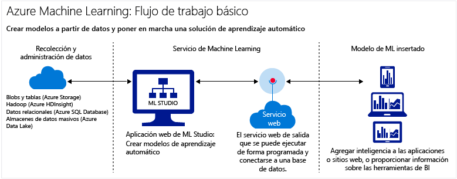

<properties
    pageTitle="¿Qué es Aprendizaje automático en Azure? | Microsoft Azure"
    description="Explica los conceptos básicos del aprendizaje automático en la nube, describe para qué puede utilizarlo y define los términos de aprendizaje automático."
	keywords="qué es aprendizaje automático, terminología de aprendizaje automático, predictivo, qué es análisis predictivo, poner en funcionamiento"
	services="machine-learning"
    documentationCenter=""
    authors="cjgronlund"
    manager="jhubbard"
    editor="cgronlun"/>

<tags
    ms.service="machine-learning"
    ms.workload="data-services"
    ms.tgt_pltfrm="na"
    ms.devlang="na"
    ms.topic="get-started-article"
    ms.date="08/17/2016"
    ms.author="cgronlun;tedway;olgali"/>

# Introducción al aprendizaje automático en la nube

## ¿Qué es el aprendizaje automático?

El aprendizaje automático es una técnica de ciencia de datos que ayuda a los equipos a aprender de los datos existentes para prever tendencias, resultados y comportamientos futuros.

Estas previsiones o predicciones del aprendizaje automático pueden hacer que las aplicaciones y los dispositivos sean más inteligentes. Cuando compra en línea, el aprendizaje automático ayuda a recomendar otros productos según lo que haya adquirido. Al pasar su tarjeta de crédito, el aprendizaje automático compara la transacción con una base de datos de transacciones y ayuda a detectar fraudes. Cuando la aspiradora robot aspira una sala, el aprendizaje automático le ayuda a decidir si se ha terminado el trabajo.

Si desea una pequeña introducción, vea la serie de vídeos [Ciencia de datos para principiantes](machine-learning-data-science-for-beginners-the-5-questions-data-science-answers.md). Sin utilizar tecnicismos ni matemáticas, la serie de vídeos Ciencia de datos para principiantes hace una introducción al aprendizaje automático y le guía a lo largo de un sencillo modelo de predicción.

## ¿Qué es Aprendizaje automático en la nube de Microsoft Azure?

Aprendizaje automático de Azure es un eficaz servicio de análisis predictivo basado en la nube que permite crear e implementar rápidamente modelos predictivos como soluciones de análisis. Al usar la nube de Azure para ejecutar experimentos de aprendizaje automático o crear soluciones, no es necesario comprar hardware ni infraestructura costosos.

Aprendizaje automático de Azure no solo proporciona herramientas para análisis predictivos de modelos, sino que también proporciona un servicio totalmente administrado que se puede usar para implementar los modelos predictivos como servicios web listos para consumir. Aprendizaje automático de Azure proporciona herramientas para crear completas soluciones de análisis predictivos en la nube: crear, probar, poner operativos y administrar modelos predictivos rápidamente.

[AZURE.INCLUDE [machine-learning-free-trial](../../includes/machine-learning-free-trial.md)]

## ¿Qué es el análisis predictivo?

El análisis predictivo emplea varias fórmulas matemáticas denominadas algoritmos que analizan datos históricos o actuales para buscar patrones o tendencias para la previsión de futuros eventos.

Aprendizaje automático de Azure es una manera muy eficaz de realizar análisis predictivos: puede trabajar desde una biblioteca lista para el uso de algoritmos, usar estos para crear modelos en un equipo conectado a Internet e implementar rápidamente su solución predictiva. Para obtener resultados rápidamente, comience con los ejemplos y soluciones listos para usarse de la [Galería de Cortana Intelligence](http://gallery.cortanaintelligence.com/).

## Generación de completas soluciones de Aprendizaje automático en la nube

Aprendizaje automático de Azure tiene todo lo que necesita para crear soluciones de análisis predictivos en la nube desde una biblioteca de algoritmos grande, a un estudio para la creación de modelos, para una manera fácil de implementar el modelo como un servicio web.

### Estudio de aprendizaje automático: creación de modelos predictivos

En [Estudio de aprendizaje automático](machine-learning-what-is-ml-studio.md), puede crear rápidamente modelos predictivos arrastrando, quitando y conectando módulos. Es fácil experimentar con diferentes combinaciones y puede [probarlas gratuitamente](https://studio.azureml.net/?selectAccess=true&o=2).

* En la [Galería de Cortana Intelligence](machine-learning-gallery-how-to-use-contribute-publish.md), puede intentar las soluciones de análisis creadas por otros usuarios o aportar las suyas propias. Publique preguntas o comentarios sobre experimentos en la comunidad o comparta vínculos a experimentos a través de redes sociales, como LinkedIn y Twitter.
* Utilice una gran biblioteca de [algoritmos y módulos de Aprendizaje automático](https://msdn.microsoft.com/library/azure/f5c746fd-dcea-4929-ba50-2a79c4c067d7) en Estudio de aprendizaje automático para impulsar sus modelos de predictivos. Elija entre experimentos de ejemplo, paquetes R y Python y los mejores algoritmos de su clase en servicios de Microsoft como Xbox y Bing. Amplíe los módulos de Studio con sus propios scripts de [R](machine-learning-r-quickstart.md) y [Python](machine-learning-execute-python-scripts.md) personalizados.

	

### Operacionalización de soluciones de análisis predictivos: adquiera servicios web de compra o publique las suyas

* Adquiera servicios web listos para consumir en [Microsoft Azure Marketplace](https://datamarket.azure.com/browse?query=machine+learning), por ejemplo, recomendaciones, análisis de texto y detección de anomalías.

* Operacionalización de los modelos de análisis predictivo:
    * [Implementación de servicios web](machine-learning-publish-a-machine-learning-web-service.md)
    * [Entrenar y volver a entrenar modelos mediante API](machine-learning-retrain-models-programmatically.md)
    * [Administración de extremos de servicios web](machine-learning-create-endpoint.md)
    * [Escala de servicios web](machine-learning-scaling-endpoints.md)
    * [Consumo de servicios web](machine-learning-consume-web-services.md)

## Términos clave del aprendizaje automático

La terminología del aprendizaje automático puede resultar confusa. Aquí se muestran definiciones de términos clave que le ayudarán. Use los comentarios que aparecen a continuación para indicarnos cualquier otro término del que le gustaría ver una definición.

### Exploración de datos, análisis descriptivo y análisis predictivos

**Exploración de datos** es el proceso de recopilación de información sobre un conjunto de datos grande y a menudo no estructurado para encontrar características para análisis más detallados. **Minería de datos** hace referencia a la exploración de datos automatizada.

**Análisis descriptivo** es el proceso de análisis de un conjunto de datos con el fin de resumir lo que sucedió. La inmensa mayoría de análisis de negocios, como los informes de ventas, las métricas de web y el análisis de redes sociales, son descriptivos.

El **Análisis predictivos** es el proceso de creación de modelos de datos históricos o actuales con el fin de pronosticar resultados futuros.

### Aprendizaje supervisado y no supervisado
 Los algoritmos de **aprendizaje supervisado** se ha entrenado con datos etiquetados; es decir, con datos formados por ejemplos de las respuestas deseadas. Por ejemplo, se podría preparar un modelo que identifique el uso de tarjetas de crédito fraudulentas desde un conjunto de datos en el cual se etiqueten los puntos de datos que indiquen cargos fraudulentos y cargos válidos conocidos. Se supervisa la mayoría del aprendizaje automático.

 El **aprendizaje no supervisado** se utiliza en los datos sin etiquetas y el objetivo es buscar relaciones en los datos. Por ejemplo, puede querer buscar agrupaciones de datos demográficos del cliente con hábitos de compra similares.

### Entrenamiento y evaluación de modelos
Un modelo de aprendizaje automático es una abstracción de la pregunta que intenta responder o el resultado que desea predecir. Modelos se entrenan y se evalúan a partir de datos existentes.

#### Datos de aprendizaje.
Cuando entrena un modelo a partir de datos, utiliza un conjunto de datos conocido y realiza los ajustes necesarios en el modelo en función de las características de datos para obtener la respuesta más precisa. En Aprendizaje automático de Azure, se crea un modelo a partir de un módulo de algoritmo que procesa los datos de entrenamiento y módulos funcionales, como un módulo de puntuación.

En el aprendizaje supervisado, si está entrenando un modelo de detección de fraudes, usará un conjunto de transacciones que se etiquetan como fraudulentas o válidas. Podrá dividir el conjunto de datos de forma aleatoria y usar una parte para entrenar el modelo y otra parte para probar o evaluar el modelo.

#### Datos de evaluación
Una vez entrenado un modelo, se evalúa con los datos restantes de la prueba. Puede usar los datos de los que ya conoce los resultados, por lo que puede saber si su modelo predice con precisión.

## Otros términos comunes relativos al aprendizaje automático

* **Algoritmo**: un conjunto independiente de reglas usado para resolver problemas a través de procesamiento de datos, cálculos matemáticos o razonamiento automatizado.
* **Detección de anomalías**: un modelo que marca valores o eventos no habituales y le ayuda a detectar problemas. Por ejemplo, para la detección de fraudes en tarjetas de crédito se buscan compras no usuales.
* **Datos categóricos**: datos que se organizan por categorías y que se pueden dividir en grupos. Por ejemplo, un conjunto de datos categóricos de coches podría especificar el año, la marca, el modelo y el precio.
* **Clasificación**: un modelo para organizar los puntos de datos en categorías según un conjunto de datos para el que ya se conocen las agrupaciones de categorías.
* **Ingeniería de características**: el proceso de extracción o de selección de características relacionados con un conjunto de datos con el fin de mejorar el conjunto de datos y de mejorar los resultados. Por ejemplo, los datos de vuelo podrían mejorarse por días de la semana y días festivos. Consulte [Selección de características e ingeniería en Aprendizaje automático de Azure](machine-learning-feature-selection-and-engineering.md).
* **módulo**: una parte funcional en un modelo de Estudio de aprendizaje automático, como el módulo Especificar datos que permite especificar y editar conjuntos de datos pequeños. Un algoritmo también es un tipo de módulo de Estudio de aprendizaje automático.
* **modelo**: un modelo de aprendizaje supervisado es el producto de un experimento de aprendizaje automático que consta de un conjunto de datos de entrenamiento, un módulo de algoritmo y módulos funcionales, como un módulo de puntuación de modelos.
* **Datos numéricos**: datos que significan medidas (datos continuos) o cuentas (datos discretos). También se denomina *datos cuantitativos*.
* **Partición**: el método por el que se dividen los datos en los ejemplos. Consulte [Partición y ejemplo](https://msdn.microsoft.com/library/azure/dn905960.aspx) para obtener más información.
* **Predicción**: una predicción es una previsión de un valor o valores en un modelo de aprendizaje automático. También puede ver el término "puntuación prevista". Sin embargo, los resultados previstos no son el resultado final de un modelo. Una evaluación del modelo sigue la puntuación.
* **Regresión**: un modelo para predecir un valor en función de variables independientes; por ejemplo, predecir el precio de un coche en función de su año y marca.
* **puntuación**: un valor predictivo que se genera a partir de una clasificación entrenada o un modelo de regresión, mediante el [módulo Puntuar modelo](https://msdn.microsoft.com/library/azure/dn905995.aspx) en Estudio de aprendizaje automático. Los modelos de clasificación también devuelven un resultado de la probabilidad del valor de predicción. Cuando se hayan generado las puntuaciones de un modelo, puede evaluar la exactitud del modelo con el [módulo Evaluar modelo](https://msdn.microsoft.com/library/azure/dn905915.aspx).
* **Ejemplo**: una parte de un conjunto de datos diseñado para ser representante del conjunto. Los ejemplos pueden elegirse aleatoriamente o según características específicas del conjunto de datos.

## Pasos siguientes
Puede aprender los conceptos básicos de análisis predictivos y de aprendizaje automático mediante un [tutorial paso a paso](machine-learning-create-experiment.md) y [creando muestras](machine-learning-sample-experiments.md).

<!-- Module References -->
[learning-with-counts]: https://msdn.microsoft.com/library/azure/81c457af-f5c0-4b2d-922c-fdef2274413c/

<!---HONumber=AcomDC_0914_2016-->