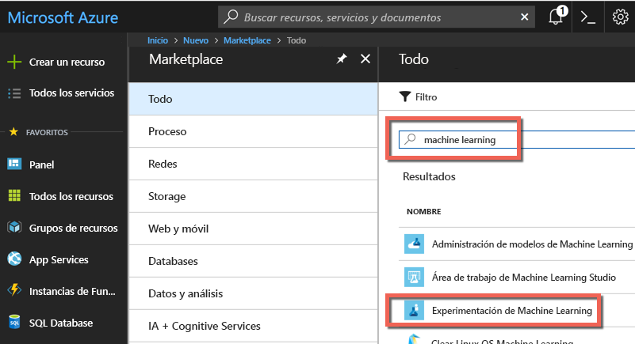
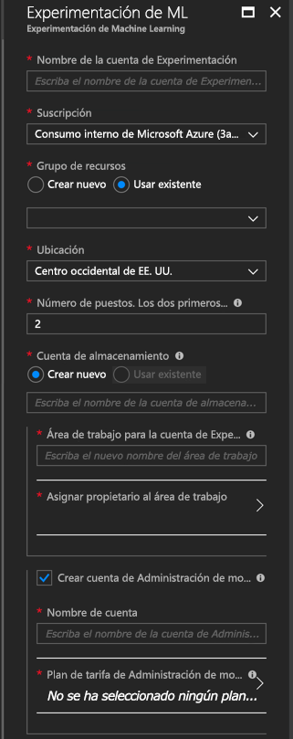
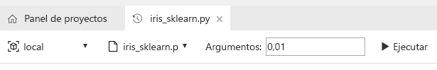

# Creación de cuentas de la versión preliminar de Azure Machine Learning e instalación de Azure Machine Learning Workbench
Los servicios de Azure Machine Learning (versión preliminar) solo son una solución de análisis avanzado y ciencia de datos integrada y completa. Ayuda a los científicos de datos profesionales a preparar datos, desarrollar experimentos e implementar modelos a escala de nube.

Esta guía de inicio rápido muestra cómo crear cuentas de administración de modelos y experimentación en la versión preliminar de Azure Machine Learning. También muestra cómo instalar las herramientas de CLI y la aplicación de escritorio de Azure Machine Learning Workbench. A continuación, realizará un rápido recorrido por las características de la versión preliminar de Azure Machine Learning mediante el uso del [conjunto de datos "iris flower"](https://en.wikipedia.org/wiki/iris_flower_data_set) para compilar un modelo que predice el tipo de iris en función de sus características físicas.  

Si no tiene una suscripción a Azure, cree una [cuenta gratuita](https://azure.microsoft.com/free/?WT.mc_id=A261C142F) antes de empezar.

## requisitos previos

Actualmente, la aplicación de escritorio de Azure Machine Learning Workbench se puede instalar solo en los siguientes sistemas operativos: 
- Windows 10
- Windows Server 2016
- macOS Sierra
- macOS High Sierra

## Inicie sesión en el Portal de Azure.
Inicie sesión en el [Azure Portal](https://portal.azure.com/).

## Creación de cuentas de Azure Machine Learning
Use Azure Portal para aprovisionar cuentas de Azure Machine Learning: 
1. Seleccione el botón **Nuevo** (+) de la esquina superior izquierda del portal.

2. Escriba **Machine Learning** en la barra de búsqueda. Seleccione el resultado de búsqueda denominado **Experimentación de Machine Learning (versión preliminar)** .  Haga clic en el icono de estrella para que esta selección sea favorita en Azure Portal.

   

3. Seleccione **+ Agregar** para configurar una nueva cuenta de Experimentación de Machine Learning. Se abrirá un formulario detallado.

   

4. Complete el formulario de Experimentación de Machine Learning con la siguiente información:

   Configuración|Valor sugerido|DESCRIPCIÓN
   ---|---|---
   Nombre de cuenta de Experimentación | _Nombre único_ |Elija un nombre único que identifique la cuenta. Puede usar su propio nombre o el nombre de departamento o proyecto que mejor identifique el experimento. El nombre debe tener entre 2 y 32 caracteres. Debe incluir solo caracteres alfanuméricos y el carácter de guión (-). 
   La suscripción | _Su suscripción_ |Elija la suscripción de Azure que desee usar para el experimento. Si tiene varias suscripciones, elija en la que se factura el recurso.
   Grupos de recursos | _El grupo de recursos_ | Puede crear un nuevo nombre de grupo de recursos o usar uno que ya exista en la suscripción.
   La ubicación | _Región más cercana a los usuarios_ | Elija la ubicación más cercana a los usuarios y los recursos de datos.
   Número de puestos | 2 | Escriba el número de puestos. Esta selección afecta a los [precios](https://azure.microsoft.com/pricing/details/machine-learning/). Los dos primeros puestos son gratuitos. Para esta guía de inicio rápido, use dos puestos. Puede actualizar el número de puestos posteriormente según sea necesario en Azure Portal.
   Cuenta de almacenamiento | _Nombre único_ | Seleccione **Crear nuevo** y especifique un nombre para crear una cuenta de Azure Storage. O bien, seleccione **Usar existente** y, después, seleccione una de las cuentas de almacenamiento de la lista desplegable. La cuenta de almacenamiento es necesaria y se utiliza para almacenar los artefactos de proyecto y ejecutar datos de historial. 
   Cuenta de Workspace para Experimentación | _Nombre único_ | Proporcione un nombre para la nueva área de trabajo. El nombre debe tener entre 2 y 32 caracteres. Debe incluir solo caracteres alfanuméricos y el carácter de guión (-).
   Asignar propietario para el área de trabajo | _Su cuenta_ | Seleccione su propia cuenta como propietario del área de trabajo.
   Crear una cuenta de Administración de modelos | *check* | Como parte de la experiencia de creación de la cuenta de Experimentación, también puede crear la cuenta de Administración de modelos de Machine Learning. Use este recurso cuando esté listo para implementar y administrar sus modelos como servicios web en tiempo real. Se recomienda crear la cuenta de Administración de modelos al mismo tiempo que la cuenta de Experimentación.
   Nombre de cuenta | _Nombre único_ | Elija un nombre único que identifique la cuenta de Administración de modelos. Puede usar su propio nombre o el nombre de departamento o proyecto que mejor identifique el experimento. El nombre debe tener entre 2 y 32 caracteres. Debe incluir solo caracteres alfanuméricos y el carácter de guión (-). 
   Plan de tarifa de Administración de modelos | **DEVTEST** | Seleccione **No se ha seleccionado ningún plan de tarifa** para especificar el plan de tarifa para la nueva cuenta de Administración de modelos. Para ahorrar costos, seleccione el plan de tarifa **DEVTEST**, en caso de que esté disponible para su suscripción. De lo contrario, seleccione el plan de tarifa S1 para ahorrar costos. Haga clic en **Seleccionar** para guardar este plan de tarifa. 
   Anclar al panel | _check_ | Seleccione la opción **Anclar al panel** para permitir realizar un seguimiento fácil de la cuenta de Experimentación de Machine Learning en la página del panel frontal de Azure Portal.

5. Seleccione **Crear** para iniciar el proceso de creación.

6. En la barra de herramientas de Azure Portal, haga clic en **Notificaciones** (icono de la campana) para supervisar el proceso de implementación. 

   La notificación muestra el mensaje **Implementación en curso**. El estado cambia a **Implementación correcta** al terminar. Una vez finalizada correctamente la implementación, se abre la página de la cuenta de Experimentación de Machine Learning.
   
   

Ahora, en función del sistema operativo que use en el equipo local, siga una de las dos secciones siguientes para instalar Azure Machine Learning Workbench. 

## Instalar Azure Machine Learning Workbench en Windows
Instale Azure Machine Learning Workbench en un equipo con Windows 10, Windows Server 2016, o cualquier versión posterior.

1. Descargue el instalador más reciente de Azure Machine Learning Workbench, [AmlWorkbenchSetup.msi](https://aka.ms/azureml-wb-msi).

2. Haga doble clic en el instalador descargado, **AmlWorkbenchSetup.msi**, en el Explorador de archivos.

   >[!IMPORTANT]
   >Descargue el instalador por completo en el disco y ejecútelo desde allí. No lo ejecute directamente desde el widget de descarga del explorador.

3. Siga las instrucciones en pantalla para finalizar la instalación.

   El instalador descarga todos los componentes dependientes necesarios, como Python, Miniconda y otras bibliotecas relacionadas. La instalación puede tardar, aproximadamente, media hora en finalizar todos los componentes. 

4. Ahora, Azure Machine Learning Workbench ya está instalado en el directorio siguiente:
   
   `C:\Users\<user>\AppData\Local\AmlWorkbench`

## Instalación de Azure Machine Learning Workbench en macOS
Instale Azure Machine Learning Workbench en un equipo con macOS Sierra o versiones posteriores.

1. Descargue el instalador más reciente de Azure Machine Learning Workbench, [AmlWorkbench.dmg](https://aka.ms/azureml-wb-dmg).

   >[!IMPORTANT]
   >Descargue el instalador por completo en el disco y ejecútelo desde allí. No lo ejecute directamente desde el widget de descarga del explorador.

2. Haga doble clic en el instalador descargado **AmlWorkbench.dmg** desde Finder.

3. Siga las instrucciones en pantalla para finalizar la instalación.

   El instalador descarga todos los componentes dependientes necesarios, como Python, Miniconda y otras bibliotecas relacionadas. La instalación puede tardar, aproximadamente, media hora en finalizar todos los componentes. 

4. Ahora, Azure Machine Learning Workbench ya está instalado en el directorio siguiente: 

   `/Applications/Azure ML Workbench.app`

## Ejecución de Azure Machine Learning Workbench para iniciar sesión por primera vez
1. Una vez que finalice el proceso de instalación, haga clic en el botón **Launch Workbench** (Iniciar Workbench) de la última pantalla del instalador. Si ha cerrado el instalador, busque el acceso directo a Machine Learning Workbench en el escritorio y abra el menú **Azure Machine Learning Workbench** para iniciar la aplicación.

2. Inicie sesión en Workbench con la misma cuenta que usó anteriormente para aprovisionar los recursos de Azure. 

3. Cuando el proceso de inicio de sesión se ha completado correctamente, Workbench intenta encontrar las cuentas de Experimentación de Machine Learning que creó previamente. Busca todas las suscripciones de Azure a las que tiene acceso con sus credenciales. Cuando se encuentra al menos una cuenta de Experimentación, Workbench se abre con ella. A continuación, enumera las áreas de trabajo y los proyectos que se encuentran en dicha cuenta. 

   >[!TIP]
   > Si tiene acceso a varias cuentas de Experimentación, para cambiar de una a otra cuenta, haga clic en el icono de avatar de la esquina inferior izquierda de la aplicación Workbench.

Para obtener información acerca de la creación de un entorno para la implementación de los servicios web, consulte [Instalación de Administración de modelos](deployment-setup-configuration.md).

## Crear un nuevo proyecto
1. Inicie la aplicación Azure Machine Learning Workbench e inicie sesión. 

2. Haga clic en **Archivo** > **Nuevo proyecto** (o haga clic en el signo **+**del panel **PROJECTS**). 

3. Complete los cuadros **Nombre del proyecto** y **Directorio del proyecto**. **Descripción del proyecto** es opcional, pero resulta útil. Deje el cuadro **Visualstudio.com GIT Repository URL** (Dirección URL del repositorio de GIT de Visualstudio.com) en blanco por ahora. Elija un área de trabajo y seleccione **Classifying Iris** (Clasificación de Iris) como plantilla de proyecto.

   >[!TIP]
   >Si lo desea, puede rellenar el cuadro de texto de repositorio de GIT con la dirección URL de un repositorio de GIT hospedado en un proyecto de [Visual Studio Team Services](https://www.visualstudio.com). Este repositorio de GIT ya debe existir y debe estar vacío sin bifurcación principal. Además, debe tener acceso de escritura a él. Agregar un repositorio de GIT le permite habilitar la movilidad y compartir escenarios más adelante. [Más información](using-git-ml-project.md).

4. Haga clic en el botón **Crear** para crear el proyecto. El proyecto se creará y se abrirá automáticamente. En este momento, ya puede explorar la página principal, los orígenes de datos, los cuadernos y los archivos de código fuente del proyecto. 

    >[!TIP]
    >También puede abrir el proyecto en Visual Studio Code u otros editores. Para ello, solo tiene que configurar un vínculo de entorno de desarrollo integrado (IDE ) y, después, abrir el directorio del proyecto desde este. [Más información](how-to-configure-your-IDE.md). 

## Ejecutar un script de Python
Ejecutaremos un script en el equipo local. 

1. Cada proyecto se abre en su propia página **Panel del proyecto**. Seleccione **local** como destino de ejecución en la barra de comandos que hay cerca de la parte superior de la aplicación y seleccione el script **iris_sklearn.py** que se va ejecutar. El ejemplo incluye otros archivos que se pueden extraer del repositorio más adelante. 

   

2. En el cuadro de texto **Argumentos**, escriba **0,01**. Este número se usa en el código para establecer la velocidad de regularización. Es un valor que se utiliza para configurar cómo se entrena el modelo de regresión lineal. 

3. Haga clic en el botón **Ejecutar** para empezar a ejecutar **iris_sklearn.py** en el equipo. 

   Este código usa el algoritmo de [regresión logística](https://en.wikipedia.org/wiki/logistic_regression) de la popular biblioteca de Python [scikit-learn](http://scikit-learn.org/stable/index.html) para generar el modelo.

4. Si aún no está visible, el panel **Trabajos** se desliza desde la derecha y el trabajo **iris_sklearn** se agrega al panel. Su estado cambia de **Enviando** a **En ejecución** cuando el trabajo empieza a ejecutarse y, transcurridos unos segundos, a **Completado**. 

   ¡Enhorabuena! Ha ejecutado correctamente un script de Python en Azure Machine Learning Workbench.

6. Repita los pasos 2 a 4 varias veces. Utilice cada vez valores de argumento diferentes que oscilen entre **10** y **0,001**.

## Ver historial de ejecución
1. Navegue hasta la vista **Ejecuciones** y seleccione **iris_sklearn.py** en la lista de ejecuciones. Se abre el panel del historial de ejecución para **iris_sklearn.py**. Muestra todas las ejecuciones que se realizaron en **iris_sklearn.py**. 

   

2. El panel del historial de ejecución también muestra las métricas principales, un conjunto de grafos predeterminados y una lista de métricas para cada ejecución. Para personalizar esta vista, ordene, filtre y ajuste las configuraciones. Basta con hacer clic en el icono de configuración o en el icono de filtro.

   

3. Seleccione una ejecución que se haya completado y obtendrá una vista detallada de la misma. Los detalles incluyen otras métricas, los archivos que produce y otros registros potencialmente útiles.

## pasos siguientes
Ya ha creado correctamente una cuenta de Experimentación de Azure Machine Learning y una cuenta de Administración de modelos de Azure Machine Learning. Ha instalado la aplicación de escritorio Azure Machine Learning Workbench y la interfaz de línea de comandos. Ha creado un proyecto nuevo, creado un modelo mediante la ejecución de script y explorado el historial de ejecución del script.

Para obtener una experiencia más detallada de este flujo de trabajo, incluida la forma de implementar el modelo Iris como servicio web, siga el completo tutorial de *clasificación de Iris*. El tutorial contiene los pasos detallados para la [preparación de datos](tutorial-classifying-iris-part-1.md), [experimentación](tutorial-classifying-iris-part-2.md) y [administración de modelos](tutorial-classifying-iris-part-3.md). 

> [!div class="nextstepaction"]
> [Tutorial de clasificación de Iris](tutorial-classifying-iris-part-1.md)
