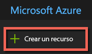

# <a name="quickstart-install-and-get-started-with-azure-machine-learning-services"></a>Inicio rápido: Instalar los servicios de Machine Learning y empezar a trabajar con ellos
Los servicios de Azure Machine Learning (versión preliminar) son una solución integrada y completa de análisis avanzado y ciencia de datos. Ayuda a los científicos de datos profesionales a preparar datos, desarrollar experimentos e implementar modelos a escala de nube.

Esta guía de inicio rápido le muestra cómo:

* Crear cuentas de servicio para los servicios de Azure Machine Learning
* Instalar Azure Machine Learning Workbench e iniciar sesión
* Crear un proyecto en Workbench
* Ejecutar un script en el proyecto  
* Acceder a la interfaz de la línea de comandos (CLI)


Si no tiene una suscripción a Azure, cree una [cuenta gratuita](https://azure.microsoft.com/free/?WT.mc_id=A261C142F) antes de empezar.

<a name="prerequisites"></a>La aplicación Azure Machine Learning Workbench se puede instalar en los siguientes sistemas operativos:
- Windows 10 o Windows Server 2016
- macOS Sierra o High Sierra

## <a name="create-azure-machine-learning-services-accounts"></a>Creación de cuentas de Azure Machine Learning
Use Azure Portal para aprovisionar las cuentas de Azure Machine Learning: 
1. Inicie sesión en [Azure Portal](https://portal.azure.com/) con las credenciales de la suscripción de Azure que se va a utilizar. Si no tiene una suscripción a Azure, cree una [cuenta gratuita](https://azure.microsoft.com/free/?WT.mc_id=A261C142F) ahora. 

   

1. Seleccione el botón **Crear un recurso** (+) de la esquina superior izquierda del portal.

   

1. Escriba **Machine Learning** en la barra de búsqueda. Seleccione el resultado de la búsqueda llamado **Experimentación de Machine Learning**. 

   

1. En el panel de **Experimentación de Machine Learning**, desplácese hasta la parte inferior y seleccione **Crear** para empezar a definir su cuenta experimentación.  

   

1. En el panel de **Experimentación de Machine Learning**, configure su cuenta de Experimentación de Machine Learning. 

   Configuración|Valor recomendado para el tutorial|DESCRIPCIÓN
   ---|---|---
   Nombre de cuenta de Experimentación | _Nombre único_ |Elija un nombre único que identifique la cuenta. Puede usar su propio nombre o el nombre de departamento o proyecto que mejor identifique el experimento. El nombre debe tener entre 2 y 32 caracteres. Debe incluir solo caracteres alfanuméricos y el carácter de guión (-). 
   La suscripción | _Su suscripción_ |Elija la suscripción de Azure que desee usar para el experimento. Si tiene varias suscripciones, elija en la que se factura el recurso.
   Grupos de recursos | _El grupo de recursos_ | Use un grupo de recursos existente en su suscripción o escriba un nombre para crear un nuevo grupo de recursos para esta cuenta de experimentación. 
   Ubicación | _Región más cercana a los usuarios_ | Elija la ubicación más cercana a los usuarios y los recursos de datos.
   Número de puestos | 2 | Escriba el número de puestos. Obtenga información acerca de cómo los [puestos afectan a los precios](https://azure.microsoft.com/pricing/details/machine-learning/).<br/><br/>Para esta guía de inicio rápido, solo necesita dos puestos. Los puestos se pueden agregar o quitar según sea necesario en Azure Portal.
   Cuenta de almacenamiento | _Nombre único_ | Seleccione **Crear nuevo** y especifique un nombre para crear una [cuenta de Azure Storage](https://docs.microsoft.com/en-us/azure/storage/common/storage-quickstart-create-account?tabs=portal). O bien, seleccione **Usar existente** y, después, seleccione una de las cuentas de almacenamiento de la lista desplegable. La cuenta de almacenamiento es necesaria y se utiliza para almacenar los artefactos de proyecto y ejecutar datos de historial. 
   Área de trabajo para Experimentación | IrisGarden | Proporcione el nombre de un área de trabajo para esta cuenta. El nombre debe tener entre 2 y 32 caracteres. Debe incluir solo caracteres alfanuméricos y el carácter de guión (-). Esta área de trabajo contiene las herramientas que necesita para crear, administrar y publicar experimentos.
   Asignar propietario para el área de trabajo | _Su cuenta_ | Seleccione su propia cuenta como propietario del área de trabajo.
   Creación de cuenta de Administración de modelos | **activar** |Ahora, cree una cuenta de Administración de modelos para que este recurso esté disponible cuando quiera implementar y administrar sus modelos como servicios web en tiempo real. <br/><br/>Aunque es opcional, se recomienda crear la cuenta de Administración de modelos al mismo tiempo que la cuenta de Experimentación.
   Nombre de cuenta | _Nombre único_ | Elija un nombre único que identifique la cuenta de Administración de modelos. Puede usar su propio nombre o el nombre de departamento o proyecto que mejor identifique el experimento. El nombre debe tener entre 2 y 32 caracteres. Debe incluir solo caracteres alfanuméricos y el carácter de guión (-). 
   Plan de tarifa de Administración de modelos | **DEVTEST** | Seleccione **No se ha seleccionado ningún plan de tarifa** para especificar el plan de tarifa para la nueva cuenta de Administración de modelos. Para ahorrar costos, seleccione el plan de tarifa **DEVTEST**, en caso de que esté disponible para su suscripción. De lo contrario, seleccione el plan de tarifa S1 para ahorrar costos. Haga clic en **Seleccionar** para guardar este plan de tarifa. 
   Anclar al panel | _activar_ | Seleccione la opción **Anclar al panel** para permitir realizar un seguimiento fácil de la cuenta de Experimentación de Machine Learning en la página del panel frontal de Azure Portal.

   

5. Seleccione **Crear** para comenzar el proceso de creación de la cuenta de Experimentación junto con la cuenta de Administración de modelos.

   

   La cuenta puede tardar unos momentos en crearse. Para comprobar el estado del proceso de implementación, haga clic en la campana en la barra de herramientas de Azure Portal.
   
   


## <a name="install-and-log-in-to-workbench"></a>Instale e inicie sesión en Workbench

Azure Machine Learning Workbench está disponible para Windows o Mac OS. Consulte la lista de [plataformas admitidas](#prerequisites).

>[!WARNING]
>La instalación puede tardar hasta 30 minutos en completarse. 

1. Descargue e inicie el instalador de Workbench más reciente. 
   >[!IMPORTANT]
   >Descargue el instalador por completo en el disco y ejecútelo desde allí. No lo ejecute directamente desde el widget de descarga del explorador.

   **En Windows:** 

   &nbsp;&nbsp;&nbsp;&nbsp;A. Descargue [AmlWorkbenchSetup.msi](https://aka.ms/azureml-wb-msi).  <br/>
   &nbsp;&nbsp;&nbsp;&nbsp;B. Haga doble clic en el instalador descargado en el Explorador de archivos.

   **En macOS:** 

   &nbsp;&nbsp;&nbsp;&nbsp;A. Descargue [AmlWorkbench.dmg](https://aka.ms/azureml-wb-dmg). <br/>
   &nbsp;&nbsp;&nbsp;&nbsp;B. Haga doble clic en el instalador descargado en Finder.<br/><br/>

1. Siga las instrucciones en pantalla en el instalador hasta su finalización. 

   **La instalación puede tardar hasta 30 minutos en completarse.**  
   
   | |Ruta de instalación de Azure Machine Learning Workbench|
   |--------|------------------------------------------------|
   |Windows|C:\Users\<user>\AppData\Local\AmlWorkbench|
   |macOS|/Applications/Azure ML Workbench.app|

   El instalador descarga e instala todos los componentes dependientes necesarios, como Python, Miniconda y otras bibliotecas relacionadas.    Esta instalación incluye también la herramienta de línea de comandos multiplataforma de Azure, o la CLI de Azure.

  
1. Para iniciar Workbench, seleccione el botón **Launch Workbench** (Iniciar Workbench) en la última pantalla del instalador. 

   Si cerró el instalador, no hay problema. 
   + En Windows, puede iniciarlo con el acceso directo del escritorio **Machine Learning Workbench**. 
   + En Mac OS, seleccione **Azure ML Workbench** en el Launchpad.

1. En la primera pantalla, seleccione **Sign in** (Iniciar sesión) para autenticarse en Azure Machine Learning Workbench. Use las mismas credenciales que usó en Azure Portal para crear las cuentas de Administración de modelos y Experimentación. 

   Una vez que haya iniciado sesión, Workbench utiliza la primera cuenta de Experimentación que encuentra en las suscripciones de Azure.  Workbench usa la primera cuenta de Experimentación que encuentra y muestra todas las áreas de trabajo y los proyectos asociados a esa cuenta. 

   >[!TIP]
   > Para cambiar a otra cuenta de Experimentación, use el icono situado en la esquina inferior izquierda de la ventana de la aplicación Workbench.

## <a name="create-a-project-in-workbench"></a>Crear un proyecto en Workbench

En Azure Machine Learning, un proyecto es el contenedor lógico de todo el trabajo realizado para resolver un problema. Se asigna a una sola carpeta de archivos en el disco local y puede agregar archivos o subcarpetas a él. 

Aquí, vamos a crear un nuevo proyecto de Workbench con una plantilla que incluye el [conjunto de datos Iris Flower](https://en.wikipedia.org/wiki/iris_flower_data_set). Los tutoriales que siguen esta guía de inicio rápido dependen de estos datos para crear un modelo que predice el tipo de flor en función de algunas de sus características físicas.  

1. Con Azure Machine Learning Workbench abierto, seleccione el signo más (+) en el panel **PROJECTS** (PROYECTOS) y elija **New Project** (Nuevo proyecto).  

   

1. Rellene los campos del formulario y seleccione el botón **Create** (Crear) para crear un nuevo proyecto en Workbench.

   Campo|Valor recomendado para el tutorial|DESCRIPCIÓN
   ---|---|---
   Nombre de proyecto | myIris |Elija un nombre único que identifique la cuenta. Puede usar su propio nombre o el nombre de departamento o proyecto que mejor identifique el experimento. El nombre debe tener entre 2 y 32 caracteres. Debe incluir solo caracteres alfanuméricos y el carácter de guión (-). 
   Directorio del proyecto | c:\Temp\ | Especifique el directorio en el que se creará el proyecto.
   Descripción del proyecto | _déjelo en blanco_ | Campo opcional útil para describir los proyectos.
   Visualstudio.com |_déjelo en blanco_ | Campo opcional. Si lo desea, el proyecto puede asociarse con un repositorio de Git para el control de código fuente y la colaboración en Visual Studio Team Services. [Vea cómo configurarlo](https://docs.microsoft.com/en-us/azure/machine-learning/preview/using-git-ml-project#step-3-set-up-a-machine-learning-project-and-git-repo). 
   Área de trabajo | IrisGarden (si existe) | Elija un área de trabajo que ha creado para su cuenta de Experimentación en Azure Portal. <br/>Si ha seguido la guía de inicio rápido, tendrá un área de trabajo con el nombre IrisGarden. Si no es así, seleccione el que creó cuando creó su cuenta de Experimentación o cualquier otro que desee utilizar.
   Plantilla de proyecto | Clasificación de iris | Las plantillas contienen scripts y datos que puede usar para explorar el producto. Esta plantilla contiene los scripts y los datos que necesita para esta guía de inicio rápido y otros tutoriales en este sitio de documentación. 

   
 
 Se crea un nuevo proyecto y se abre el panel de proyecto con ese proyecto. En este momento, ya puede explorar la página principal, los orígenes de datos, los cuadernos y los archivos de código fuente del proyecto. 

>[!TIP]
>Puede configurar Workbench para trabajar con un IDE de Python para una experiencia de desarrollo de ciencia de datos sin problemas. Después, podrá interactuar con el proyecto en el IDE. [Más información](how-to-configure-your-IDE.md). 

## <a name="run-a-python-script"></a>Ejecutar un script de Python

Ahora, puede ejecutar el script **iris_sklearn.py** en el equipo local. Este script se incluye de forma predeterminada con la plantilla de proyecto **Classifying Iris**. El script crea el modelo con el algoritmo de [regresión logística](https://en.wikipedia.org/wiki/logistic_regression) de la popular biblioteca de Python [scikit-learn](http://scikit-learn.org/stable/index.html).

1. En la barra de comandos que hay en la parte superior de la página **Project Dashboard** (Panel del proyecto), seleccione **local** como destino de ejecución y seleccione **iris_sklearn.py** como script para ejecutar. Estos valores ya están seleccionados de forma predeterminada. 

   El ejemplo incluye otros archivos que puede consultar más adelante pero, para esta guía de inicio rápido, solo nos interesa **iris_sklearn.py**. 

   

1. En el cuadro de texto **Arguments** (Argumentos), escriba **0,01**. Este número se usa en el código del script para establecer la velocidad de regularización. Este valor se utiliza para configurar cómo se entrena el modelo de regresión lineal. 

1. Seleccione **Run** (Ejecutar) para iniciar la ejecución del script en el equipo. El trabajo **iris_sklearn** aparece inmediatamente en el panel **Jobs** de la derecha para que pueda supervisar la ejecución del script.

   Felicidades. Ha ejecutado correctamente un script de Python en Azure Machine Learning Workbench.

1. Repita los pasos 2 y 3 varias veces utilizando diferentes valores de argumento entre **0,001** y **10**. Cada trabajo de ejecución aparece en el panel **Jobs** (Trabajos).

1. Para inspeccionar el historial de ejecución, seleccione la vista **Runs** (Ejecuciones) y, a continuación, **iris_sklearn.py** en la lista de ejecuciones para mostrar el historial de ejecución de este script. 

   

   Muestra todas las ejecuciones que se realizaron en **iris_sklearn.py**. El panel del historial de ejecución también muestra las métricas principales, un conjunto de grafos predeterminados y una lista de métricas para cada ejecución. 

1. Para personalizar esta vista, ordene, filtre y ajuste las configuraciones con los iconos de engranaje o de filtro.

   

3. Seleccione una ejecución finalizada en el panel Jobs (Trabajos) para obtener una vista detallada de la misma. Los detalles incluyen otras métricas, los archivos que produce y otros registros potencialmente útiles.

## <a name="start-the-cli"></a>Iniciar la CLI

También se instala la interfaz de línea de comandos (CLI) de Azure Machine Learning. La interfaz CLI le permite acceder a sus servicios de Azure Machine Learning e interactuar con ellos mediante los comandos `az` para realizar todas las tareas necesarias para un flujo de trabajo de ciencia de datos de principio a fin. [Más información.](tutorial-iris-azure-cli.md)

Para iniciar la CLI azure-cli-ml desde la barra de herramientas de Workbench, use **File --> Open Command Prompt** (Archivo --> Abrir símbolo del sistema).

También puede obtener ayuda acerca de los comandos de la CLI azure-cli-ml con el argumento --help.

```az ml --help```

## <a name="clean-up-resources"></a>Limpieza de recursos

[!INCLUDE [aml-delete-resource-group](../../../includes/aml-delete-resource-group.md)]

## <a name="next-steps"></a>Pasos siguientes
Ya ha creado las cuentas de Azure Machine Learning necesarias y ha instalado la aplicación Azure Machine Learning Workbench. En esa aplicación, ha creado un proyecto nuevo, ha ejecutado un script y ha explorado el historial de ejecuciones del script.

Para obtener una experiencia más detallada de este flujo de trabajo, incluida la forma de implementar el modelo Iris como servicio web, siga el completo tutorial de *clasificación de Iris*. El tutorial contiene los pasos detallados para la [preparación de datos](tutorial-classifying-iris-part-1.md), [experimentación](tutorial-classifying-iris-part-2.md) y [administración de modelos](tutorial-classifying-iris-part-3.md). 

> [!div class="nextstepaction"]
> [Tutorial: Clasificación de iris (parte 1)](tutorial-classifying-iris-part-1.md)

>[!NOTE]
> Aunque tiene una cuenta de Administración de modelos, el entorno aún no está configurado para implementar servicios web.  Vea cómo configurar el [entorno de implementación](deployment-setup-configuration.md).