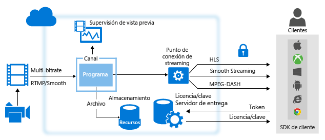
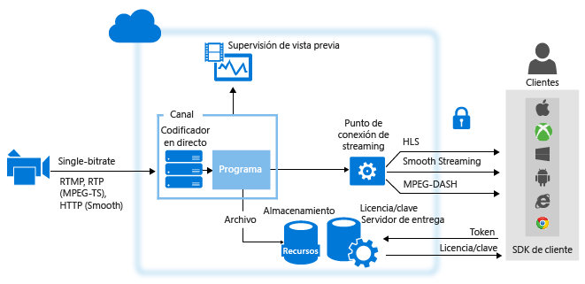

# Información general de streaming en vivo con Azure Media Services
## Información general
Cuando se proporcionan eventos de streaming en vivo con Servicios multimedia de Azure normalmente participan los siguientes componentes:

* Una cámara que se usa para difundir un evento.
* Un codificador de vídeo en directo que convierte las señales de la cámara en secuencias que se envían a un servicio de streaming en vivo.

    Opcionalmente, varios codificadores sincronizados en directo. Para determinados eventos en directo críticos que demandan una disponibilidad y una calidad de experiencia muy altas, se recomienda emplear codificadores redundantes activo-activo con sincronización de hora para lograr una conmutación por error perfecta sin pérdida de datos.
* Un servicio de streaming en vivo que permita hacer lo siguiente:

  * Recopilar contenido en directo mediante varios protocolos de streaming en vivo (por ejemplo RTMP o Smooth Streaming).
  * (Opcionalmente) Codificar la transmisión en una transmisión con velocidad de bits adaptable.
  * Mostrar una vista previa de la secuencia en vivo.
  * Registrar y almacenar el contenido recibido para transmitirlo posteriormente (vídeo bajo demanda).
  * Entregar el contenido mediante protocolos de streaming comunes (por ejemplo, MPEG DASH, Smooth o HLS) directamente a sus clientes o a una red de entrega de contenido (CDN) para ampliar la distribución.

**Microsoft Azure Media Services** (AMS) permite recopilar, codificar, mostrar una vista previa, almacenar y entregar el contenido de streaming en vivo.

Al entregar contenido a sus clientes, el objetivo es entregar un vídeo de alta calidad a diversos dispositivos en condiciones de red diferentes. Para conseguir esto, use codificadores en directo para codificar la secuencia en una secuencia de vídeo de velocidad de bits múltiple (velocidad de bits adaptativa).  Para abordar el streaming en diferentes dispositivos, use el [empaquetado dinámico](media-services-dynamic-packaging-overview.md) de Servicios multimedia para volver a empaquetar dinámicamente su secuencia para distintos protocolos. Media Services admite la entrega de las siguientes tecnologías de streaming con velocidad de bits adaptable: HTTP Live Streaming (HLS), Smooth Streaming y MPEG DASH.

En Azure Media Services, los **canales**, **programas** y **extremos de streaming** controlan todas las funcionalidades de streaming en vivo, incluidas la recopilación, el formato, DVR, la seguridad, la escalabilidad y la redundancia.

Un **canal** representa una canalización para procesar contenido de streaming en vivo. Un canal puede recibir transmisiones de entrada en directo de la siguiente manera:

* Un codificador local en directo envía contenido **RTMP** o **Smooth Streaming** (MP4 fragmentado) con velocidades de bits múltiples al canal que está configurado por la entrega de **paso a través**. La entrega de **paso a través** significa que las transmisiones ingeridas pasan a través de **canales** sin más procesamiento. Puede usar los siguientes codificadores en directo que generan Smooth Streaming con velocidad de bits múltiple: MediaExcel, Ateme, Imagine Communications, Envivio, Cisco y Elemental. Los siguientes codificadores en directo generan RTMP: Adobe Flash Media Live Encoder (FMLE), Telestream Wirecast, Haivision, Teradek y los transcodificadores Tricaster.  El codificador en directo también puede enviar una secuencia de una sola velocidad de bits a un canal que no está habilitado para la codificación en directo, pero esto no es recomendable. Cuando se solicita, Media Services entrega la secuencia a los clientes.

  > [!NOTE]
  > El uso de un método de paso a través es la forma más económica de streaming en vivo cuando está realizando varios eventos en un largo período y ya ha invertido en codificadores locales. Consulte los detalles en [Precios de Servicios multimedia](https://azure.microsoft.com/pricing/details/media-services/) .
  > 
  > 
* Un codificador en directo local envía una secuencia de una sola velocidad de bits al canal que está habilitado para realizar codificación en directo con Servicios multimedia, con uno de los siguientes formatos: RTP o Smooth Streaming (MP4 fragmentado). También se admite RTP (MPEG-TS), siempre que disponga de una conexión dedicada al centro de datos de Azure. Se sabe que los siguientes codificadores en directo con salida RTMP funcionan con los canales de este tipo: Telestream Wirecast y FMLE. Después, el canal codifica en directo la secuencia entrante de una sola velocidad de bits en una secuencia de vídeo de varias velocidades de bits (adaptable). Cuando se solicita, Servicios multimedia entrega la secuencia a los clientes.

A partir de la versión 2.10 de Servicios multimedia, al crear un canal, puede especificar la forma en que desea que este reciba el flujo de entrada y si quiere que el canal realice la codificación en directo de la secuencia. Tiene dos opciones:

* **Ninguna** (paso a través): especifique este valor si piensa usar un codificador en directo local que genere una secuencia de varias velocidades de bits (una transmisión de paso a través). En este caso, el flujo entrante pasa hasta la salida sin codificación alguna. Este es el comportamiento de un canal antes de la versión 2.10.  
* **Estándar** : elija este valor si piensa usar Servicios multimedia para codificar secuencias en directo con una sola velocidad de bits como secuencias de varias velocidades de bits. Este método es más económico para la escalación vertical rápida para eventos poco frecuentes. Tenga en cuenta que hay un impacto en la facturación para la codificación en directo y debe recordar que salir de un canal de codificación en directo en el estado "En ejecución" supondrá un coste adicional de facturación.  Se recomienda detener inmediatamente sus canales de ejecución después que se complete su evento de transmisión en directo para evitar cargos por hora adicionales.

## Comparación de tipos de canales
La tabla siguiente proporciona a una guía para comparar los dos tipos de canal compatibles en Servicios multimedia

| Característica | Canal de paso a través | Canal estándar |
| --- | --- | --- |
| La entrada de velocidad de bits única se codifica en varias velocidades de bits en la nube |No |Sí |
| Resolución máxima, número de capas |1080p, 8 capas, 60+fps |720p, 6 capas, 30 fps |
| Protocolos de entrada |RTMP, Smooth Streaming |RTMP, Smooth Streaming y RTP |
| Precio |Consulte la [página de precios](https://azure.microsoft.com/pricing/details/media-services/) y haga clic en la pestaña "Vídeo en vivo" |Consulte la [página de precios](https://azure.microsoft.com/pricing/details/media-services/) |
| Tiempo de ejecución máximo |24x7 |8 horas |
| Compatibilidad con inserción de tabletas táctiles |No |Sí |
| Compatibilidad con señalización de anuncios |No |Sí |
| Títulos CEA 608/708 de paso a través |Sí |Sí |
| Capacidad para la recuperación de breves pausas en la fuente de contribución |Sí |No (el canal comenzará a usar la tableta táctil transcurridos más de 6 segundos sin datos de entrada) |
| Compatibilidad con GOP de entrada no uniformes |Sí |No: la entrada debe ser GOP de 2 s fijos |
| Compatibilidad con la entrada de la velocidad de fotogramas variable |Sí |No: la entrada debe ser una velocidad de fotogramas fija. Se tolerarán pequeñas variaciones, por ejemplo, durante las escenas con grandes movimientos. Sin embargo, el codificador no puede tener una frecuencia inferior de 10 fotogramas/s. |
| Apagado automático de canales cuando se pierde la fuente de entrada |No |Después de 12 horas, si no hay ningún programa en ejecución |

## Uso de canales que reciben streaming en vivo con velocidad de bits múltiple de codificadores locales (paso a través)
En el diagrama siguiente se muestran las partes principales de la plataforma AMS que intervienen en el flujo de trabajo de **paso a través** .

Para más información, consulte [Uso de canales que reciben streaming en vivo con velocidad de bits múltiple de codificadores locales](media-services-live-streaming-with-onprem-encoders.md).

## Uso de canales habilitados para realizar la codificación en directo con Servicios multimedia de Azure
El diagrama siguiente muestra las partes principales de la plataforma AMS que intervienen en el flujo de trabajo de streaming en vivo, en la que se habilita un canal para realizar la codificación en directo con Servicios multimedia.

Para obtener más información, vea [Uso de canales habilitados para realizar la codificación en directo con Servicios multimedia de Azure](media-services-manage-live-encoder-enabled-channels.md).

## Descripción de un canal y sus componentes relacionados
### canal
En Servicios multimedia, los [canal](https://docs.microsoft.com/rest/api/media/operations/channel)es son los responsables de procesar el contenido de streaming en vivo. Un canal proporciona un extremo de entrada (dirección URL de introducción) que luego se brinda a un transcodificador en vivo. El canal recibe flujos de entrada en vivo desde el transcodificador en vivo y las deja a disposición del streaming a través de uno o más StreamingEndpoints. Los canales también proporcionan un extremo de vista previa (dirección URL de vista previa) que se puede utilizar para obtener una vista previa y validar el flujo antes de mayor procesamiento y entrega.

Puede obtener la dirección URL de introducción y la dirección URL de vista previa cuando crea el canal. Para obtener estas direcciones URL, el canal no puede encontrarse en el estado iniciado. Cuando está listo para comenzar a insertar datos desde un transcodificador en vivo al canal, este debe estar iniciado. Una vez que el transcodificar en vivo comienza a introducir datos, puede tener una vista previa de la transmisión.

Cada cuenta de Servicios multimedia puede contener varios canales, varios programas y varios StreamingEndpoints. Según las necesidades de ancho de banda y seguridad, los servicios de StreamingEndpoint pueden dedicarse a uno o más canales. Puede extraer cualquier StreamingEndpoint de cualquier canal.

### Programa
Un [programa](https://docs.microsoft.com/rest/api/media/operations/program) le permite controlar la publicación y almacenamiento de segmentos en una secuencia en directo. Los canales administran los programas. La relación entre canales y programas es muy similar a los medios tradicionales, donde un canal tiene un flujo constante de contenido y un programa se enfoca algún evento programado en dicho canal.
Puede especificar la cantidad de horas que desea conservar el contenido grabado del programa en la configuración de la propiedad **ArchiveWindowLength** . Este valor se puede establecer desde un mínimo de cinco minutos a un máximo de 25 horas.

ArchiveWindowLength también indica el tiempo máximo que los clientes pueden buscar hacia atrás a partir de la posición en vivo actual. Los programas pueden transmitirse durante la cantidad de tiempo especificada, pero el contenido que escape de esa longitud de ventana se descartará continuamente. El valor de esta propiedad también determina durante cuánto tiempo los manifiestos de cliente pueden crecer.

Cada programa está asociado a un recurso. Para publicar el programa, debe crear un localizador para el recurso asociado. Contar con este localizador le permitirá crear una dirección URL de streaming que puede proporcionar a sus clientes.

Un canal es compatible con hasta tres programas en ejecución simultánea, por lo que puede crear varios archivos del mismo flujo entrante. Esto le permite publicar y archivar distintas partes de un evento, según sea necesario. Por ejemplo, el requisito de su empresa es solo archivar seis horas de un programa, pero difundir solo los últimos diez minutos. Para lograrlo, necesita crear dos programas en ejecución simultánea. Un programa está definido para archivar seis horas del evento, pero no está publicado. El otro programa está definido para archivar durante diez minutos y este programa sí se publica.

## Implicaciones de facturación
Un canal comienza la facturación tan pronto como su estado realiza la transición a "En ejecución" a través de la API.  

En la tabla siguiente se muestra cómo se asignan los estados del canal a los estados de facturación en la API y Azure Portal. Tenga en cuenta que los estados son ligeramente diferentes entre la API y la experiencia de usuario del portal. En cuanto un canal se encuentre en el estado "En ejecución" a través de la API, o en el estado "Listo" o "Streaming" en Azure Portal, la facturación estará activa.

Para hacer que el canal deje de facturarle, tendrá que detener el canal a través de la API o en Azure Portal.
Usted es responsable de detener sus canales cuando haya terminado con el canal. Si el canal no se detiene, la facturación continuará.

> [!NOTE]
> Al trabajar con canales estándar, AMS cerrará automáticamente todos los canales que estén en estado "En ejecución" 12 horas después de la fuente de entrada se pierda y no haya programas en ejecución. Sin embargo, se le facturará por el tiempo que el canal ha estado en estado "En ejecución".
>
>

### Estados del canal y cómo se asignan al modo de facturación
El estado actual de un canal. Los valores posibles son:

* **Detenido**. Este es el estado inicial del canal después de su creación (a menos que seleccionara el inicio automático en el portal.) No se produce ninguna facturación en este estado. En este estado, se pueden actualizar las propiedades del canal pero no se permite el streaming.
* **Iniciando**. El canal se está iniciando. No se produce ninguna facturación en este estado. No se permiten actualizaciones ni streaming durante este estado. Si se produce un error, el canal vuelve al estado Detenido.
* **En ejecución**. El canal es capaz de procesar secuencias en directo. Está ahora el uso de facturación. Debe detener el canal para evitar más facturación.
* **Deteniéndose**. El canal se está deteniendo. No se produce facturación en este estado transitorio. No se permiten actualizaciones ni streaming durante este estado.
* **Eliminando**. El canal se está eliminando. No se produce facturación en este estado transitorio. No se permiten actualizaciones ni streaming durante este estado.

En la tabla siguiente se muestra cómo se asignan los estados del canal al modo de facturación.

| Estado del canal | Indicadores IU del portal | ¿Es la facturación? |
| --- | --- | --- |
| Iniciando |Iniciando |No (estado transitorio) |
| En ejecución |Listo (no hay programas en ejecución) o Streaming (al menos un programa en ejecución) |SÍ |
| Deteniéndose |Deteniéndose |No (estado transitorio) |
| Detenido |Detenido |No |

## Rutas de aprendizaje de Servicios multimedia
[!INCLUDE [media-services-learning-paths-include](../../includes/media-services-learning-paths-include.md)]

## Envío de comentarios
[!INCLUDE [media-services-user-voice-include](../../includes/media-services-user-voice-include.md)]

## Temas relacionados
[Especificación de la introducción en directo de MP4 fragmentado de Servicios multimedia de Azure](media-services-fmp4-live-ingest-overview.md)

[Uso de canales habilitados para realizar la codificación en directo con Servicios multimedia de Azure](media-services-manage-live-encoder-enabled-channels.md)

[Uso de canales que reciben streaming en vivo con velocidad de bits múltiple de codificadores locales](media-services-live-streaming-with-onprem-encoders.md)

[Cuotas y limitaciones](media-services-quotas-and-limitations.md).  

[Conceptos de Servicios multimedia de Azure](media-services-concepts.md)
