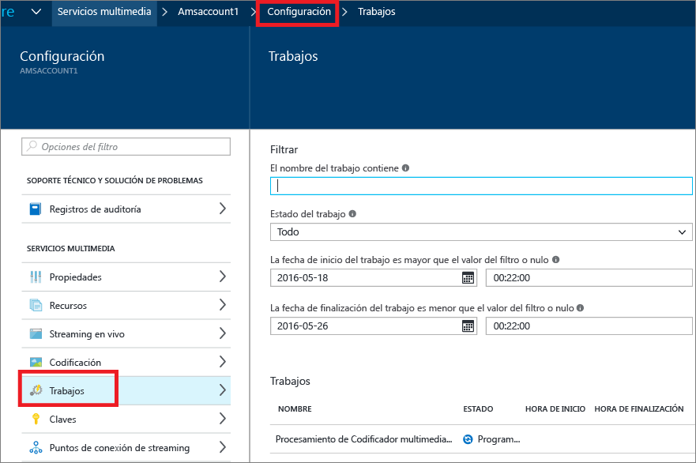

# Supervisión del progreso de trabajo de codificación con el Portal de Azure
> [!div class="op_single_selector"]
> * [Portal](media-services-portal-check-job-progress.md)
> * [.NET](media-services-check-job-progress.md)
> * [REST](media-services-rest-check-job-progress.md)
> 
> 

## Información general
> [!NOTE]
> Para completar este tutorial, deberá tener una cuenta de Azure. Para obtener más información, consulte [Evaluación gratuita de Azure](https://azure.microsoft.com/pricing/free-trial/). 
> 
> 

Al ejecutar trabajos, muchas veces se requiere una forma de hacer un seguimiento al progreso del trabajo. 

Para supervisar el progreso del trabajo de codificación, haga clic en **Configuración** (en la parte superior de la página) y, después, seleccione **Trabajos**.

Puede hacer clic en el trabajo para ver más detalles.

## Pasos siguientes
Después de finalizar el trabajo de codificación, puede publicar y reproducir sus recursos, tal y como se describe [aquí](media-services-portal-publish.md).

## Rutas de aprendizaje de Media Services
[!INCLUDE [media-services-learning-paths-include](../../includes/media-services-learning-paths-include.md)]

## Envío de comentarios
[!INCLUDE [media-services-user-voice-include](../../includes/media-services-user-voice-include.md)]

