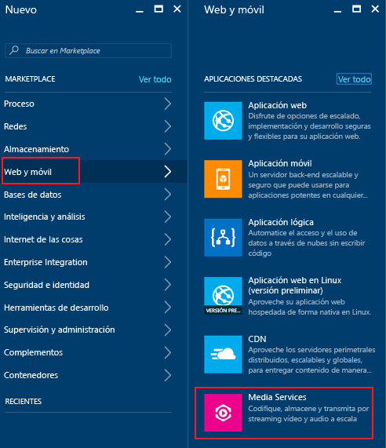
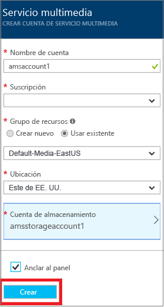

# Creación de una cuenta de Azure Media Services mediante Azure Portal
> [!div class="op_single_selector"]
> * [Portal](media-services-portal-create-account.md)
> * [PowerShell](media-services-manage-with-powershell.md)
> * [REST](https://docs.microsoft.com/rest/api/media/mediaservice)
> 
> [!NOTE]
> Para completar este tutorial, deberá tener una cuenta de Azure. Para obtener más información, consulte [Evaluación gratuita de Azure](https://azure.microsoft.com/pricing/free-trial/). 
> 
> 

Azure Portal proporciona una forma de crear rápidamente una cuenta de Azure Media Services (AMS). Puede usar la cuenta para obtener acceso a Media Services que le permiten almacenar, cifrar, codificar, administrar y transmitir contenido multimedia en Azure. En el momento en el que crea una cuenta de Media Services, también crea una cuenta de almacenamiento asociada (o usa una ya existente) en la misma región geográfica que la cuenta de Media Services.

En este artículo se explican algunos conceptos comunes y se muestra cómo crear una cuenta de Media Services con Azure Portal.

> [!NOTE]
> Para obtener información acerca de la disponibilidad de las características de Azure Media Services en distintas regiones, consulte la sección [Availability of Media Services features across datacenters](scenarios-and-availability.md#availability) (Disponibilidad de las características de Media Services en los centros de datos).

## Conceptos
El acceso a Media Services requiere dos cuentas asociadas:

* Una cuenta de Media Services. La cuenta le proporciona acceso a un conjunto de Media Services basados en la nube que están disponibles en Azure. Una cuenta de Media Services no almacena el contenido multimedia real, sino que almacena metadatos sobre el contenido multimedia y trabajos de procesamiento multimedia en su cuenta. En el momento en el que cree la cuenta, seleccione una región de Media Services disponible. La región que selecciona es un centro de datos que almacena los registros de metadatos para su cuenta.
  
* Una cuenta de almacenamiento de Azure. Las cuentas de almacenamiento deben ubicarse en la misma región geográfica que la cuenta de Media Services. Cuando cree una cuenta de Media Services, podrá elegir una cuenta de almacenamiento existente en la misma región o crear una nueva cuenta de almacenamiento en la misma región. Si elimina una cuenta de Media Services, no se eliminarán los blobs de la cuenta de almacenamiento relacionada.

  > [!NOTE]
  > Media Services restringe la cuenta de almacenamiento principal para que sea una cuenta **de almacenamiento de uso general** con tablas y colas. Para más información acerca de los tipos de almacenamiento, consulte [Acerca de las cuentas de almacenamiento de Azure](https://docs.microsoft.com/azure/storage/common/storage-create-storage-account).

## Creación de una cuenta de AMS
Los pasos de esta sección muestran cómo crear una cuenta de AMS.

1. Inicie sesión en el [Portal de Azure](https://portal.azure.com/).
2. Haga clic en **+Nuevo** > **Web y móvil** > **Servicios multimedia**.
   
    
3. En **CREAR CUENTA DE SERVICIOS MULTIMEDIA** especifique los valores obligatorios.
   
    
   
   1. En **Nombre de la cuenta**, especifique el nombre de la cuenta nueva de AMS. El nombre de la cuenta de Media Services debe estar compuesto totalmente de minúsculas o de números, sin espacios, y con una longitud de entre 3 y 24 caracteres.
   2. En Suscripción, seleccione entre las diferentes suscripciones de Azure a las que tiene acceso.
   3. En **Grupo de recursos**seleccione el recurso nuevo o uno ya existente.  Un grupo de recursos es una colección de recursos que comparten ciclos de vida, permisos y directivas. Obtenga más información [aquí](../azure-resource-manager/resource-group-overview.md#resource-groups).
   4. En **Ubicación**, seleccione la región geográfica que se usará para almacenar los registros de medios y de metadatos para la cuenta de Media Services. Esta región se utilizará para procesar y transmitir contenido multimedia. Solo las regiones de Media Services disponibles aparecen en la lista desplegable. 
   5. En **Cuenta de almacenamiento**, seleccione una cuenta de almacenamiento para proporcionar almacenamiento de blobs del contenido multimedia desde la cuenta de Media Services. Puede seleccionar una cuenta de almacenamiento existente de la misma región geográfica que la cuenta de Media Services o crearla. Se crea una nueva cuenta de almacenamiento en la misma región. Las reglas para los nombres de cuenta de almacenamiento son las mismas que para las cuentas de Media Services.
      
       Puede obtener más información acerca del almacenamiento [aquí](../storage/common/storage-introduction.md).
   6. Seleccione **Anclar al panel** para ver el progreso de la implementación de la cuenta.
4. Haga clic en **Crear** en la parte inferior del formulario.
   
    Cuando la cuenta se crea correctamente, se carga la página de información general. En la tabla de puntos de conexión de streaming, la cuenta tendrá el punto de conexión de streaming predeterminado en el estado **Stopped** (Detenido). 

    >[!NOTE]
    >Cuando se crea la cuenta de AMS, se agrega un punto de conexión de streaming **predeterminado** a la cuenta en estado **Stopped** (Detenido). Para iniciar la transmisión del contenido y aprovechar el empaquetado dinámico y el cifrado dinámico, el punto de conexión de streaming desde el que va a transmitir el contenido debe estar en estado **Running** (En ejecución). 
   
## Administración de una cuenta de AMS

Para administrar una cuenta de AMS (por ejemplo, conectarse a la API de AMS mediante programación, cargar vídeos, codificar recursos, configurar la protección de contenido o supervisar el progreso del trabajo) seleccione **Configuración** en el lado izquierdo del portal. En **Configuración**, navegue a una de las hojas disponibles (por ejemplo: **Acceso de API**, **Recursos**, **Trabajos**, **Content Protection**).

## Pasos siguientes

Ya puede cargar archivos en su cuenta de AMS. Para más información, consulte [Upload files into a Media Services account using the Azure portal](media-services-portal-upload-files.md)(Carga de archivos en una cuenta de Servicios multimedia desde el Portal de Azure).

Si planea acceder a la API de AMS mediante programación, consulte [Acceso a Azure Media Services API con la autenticación de Azure AD](media-services-use-aad-auth-to-access-ams-api.md).

## Rutas de aprendizaje de Media Services
[!INCLUDE [media-services-learning-paths-include](../../includes/media-services-learning-paths-include.md)]

## Envío de comentarios
[!INCLUDE [media-services-user-voice-include](../../includes/media-services-user-voice-include.md)]

