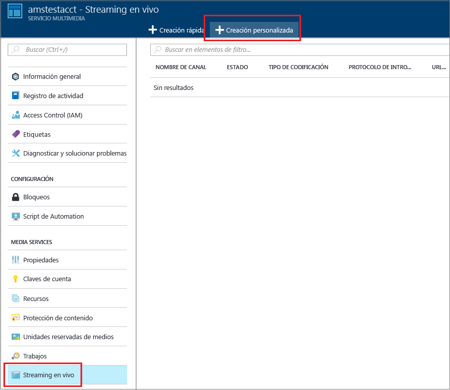
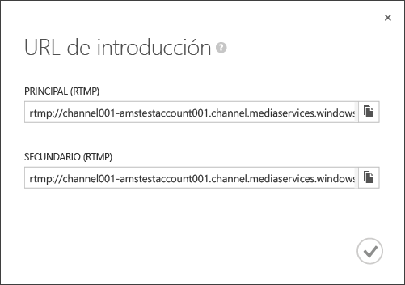
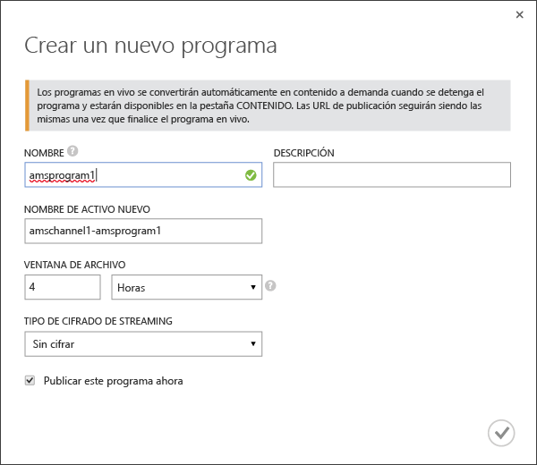
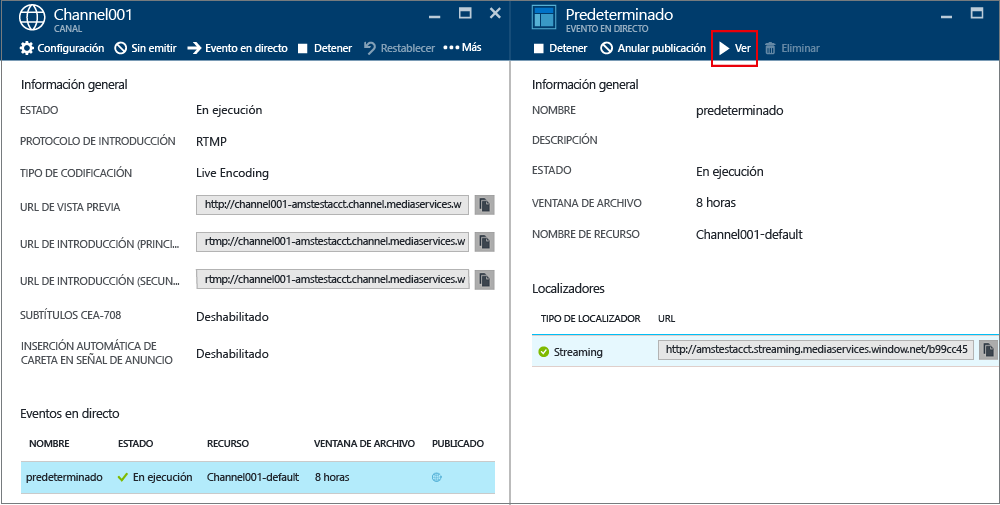
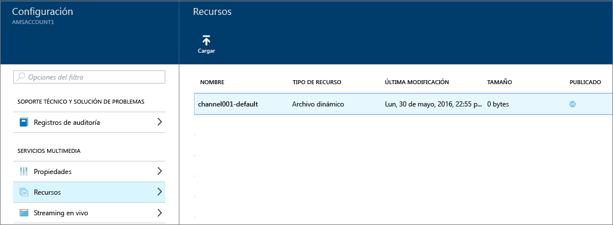

# Cómo realizar el streaming en vivo con Azure Media Services para crear transmisiones de velocidad de bits múltiple con el portal de Azure
> [!div class="op_single_selector"]
> * [Portal](media-services-portal-creating-live-encoder-enabled-channel.md)
> * [.NET](media-services-dotnet-creating-live-encoder-enabled-channel.md)
> * [API DE REST](https://docs.microsoft.com/rest/api/media/operations/channel)
> 
> 

Este tutorial le guía por los pasos para crear un **canal** que reciba una secuencia en directo de una sola velocidad de bits y la codifique como secuencia de varias velocidades de bits.

> [!NOTE]
> Para más información sobre los canales habilitados para la codificación en directo, consulte [Uso de canales habilitados para realizar la codificación en directo con Servicios multimedia de Azure](media-services-manage-live-encoder-enabled-channels.md).
> 
> 

## Escenario común de streaming en vivo
A continuación se indican los pasos generales para crear aplicaciones comunes de streaming en vivo.

> [!NOTE]
> Actualmente, la duración máxima recomendada de un evento en directo es de 8 horas. Si necesita ejecutar un canal durante largos períodos de tiempo, póngase en contacto con amslived en Microsoft.com.
> 
> 

1. Conecte una cámara de vídeo a un equipo. Inicie y configure un codificador local en directo que pueda generar una secuencia de una sola velocidad de bits en uno de los siguientes protocolos: RTMP, Smooth Streaming o RTP (MPEG-TS). Para obtener más información, consulte [Compatibilidad con RTMP de Servicios multimedia de Azure y codificadores en directo](http://go.microsoft.com/fwlink/?LinkId=532824).
   
    Este paso también puede realizarse después de crear el canal.
2. Cree e inicie un canal. 
3. Recupere la URL de ingesta de canales. 
   
    El codificador en directo usa la URL de ingesta para enviar la secuencia al canal.
4. Recupere la URL de vista previa de canal. 
   
    Use esta dirección URL para comprobar que el canal recibe correctamente la secuencia en vivo.
5. Cree un evento o programa (que también creará un recurso). 
6. Publique el evento (que creará un localizador a petición para el recurso asociado).    
7. Inicie el evento cuando esté listo para iniciar el streaming y el archivo.
8. Si lo desea, puede señalar el codificador en directo para iniciar un anuncio. El anuncio se inserta en el flujo de salida.
9. Detenga el evento cuando quiera detener el streaming y el archivo del evento.
10. Elimine el evento (y, opcionalmente, elimine el recurso).   

## Apartados de este tutorial
En este tutorial, se utiliza el portal de Azure para realizar las tareas siguientes: 

1. Cree un canal que está habilitado para realizar la codificación en directo.
2. Obtenga la URL de introducción para proporcionarla al codificador en directo. El codificador en directo utilizará esta dirección URL para introducir la transmisión en el canal.
3. Cree un evento o programa (y un recurso).
4. Publicar el recurso y obtener las direcciones URL de streaming.  
5. Reproduzca el contenido.
6. Realice la limpieza.

## Requisitos previos
Los siguientes requisitos son necesarios para completar el tutorial.

* Para completar este tutorial, deberá tener una cuenta de Azure. En caso de no tener ninguna, puede crear una cuenta de evaluación gratuita en tan solo unos minutos. 
  Para obtener más información, consulte [Evaluación gratuita de Azure](https://azure.microsoft.com/pricing/free-trial/).
* Una cuenta de Servicios multimedia. Para crear una cuenta de Media Services, consulte [Creación de cuenta](media-services-portal-create-account.md).
* Una cámara web y un codificador que pueda enviar una secuencia en vivo de una sola velocidad de bits.

## Creación de un canal
1. En [Azure Portal](https://portal.azure.com/), seleccione Media Services y, luego, haga clic en el nombre de la cuenta de Media Services.
2. Seleccione **Streaming en vivo**.
3. Seleccione **Creación personalizada**. Esta opción le permite crear un canal habilitado para la codificación en directo.
   
    
4. Haga clic en **Configuración**.
   
   1. Elija el tipo de canal **Codificación en directo** . Este tipo especifica que desea crear un canal que está habilitado para la codificación en directo. Lo que significa que la secuencia entrante de velocidad de bits única se envía al canal y se codifica en una secuencia de velocidad de bits múltiple mediante la configuración del codificador directo especificado. Para más información, consulte [Streaming en vivo mediante Azure Media Services para crear transmisiones de velocidad de bits múltiple](media-services-manage-live-encoder-enabled-channels.md). Haga clic en Aceptar.
   2. Especifique el nombre de un canal.
   3. Haga clic en Aceptar, en la parte inferior de la pantalla.
5. Seleccione la pestaña **Ingerir** .
   
   1. En esta página, puede seleccionar un protocolo de streaming. Para el tipo de canal **Codificación en directo** , las opciones de protocolo válidas son:
      
      * MP4 fragmentado de una sola velocidad de bits (Smooth Streaming)
      * RTMP de velocidad de bits única
      * RTP (MPEG-TS): secuencia de transporte MPEG-2 a través de RTP.
        
        Para mas información sobre cada protocolo, consulte [Streaming en vivo mediante Azure Media Services para crear transmisiones de velocidad de bits múltiple](media-services-manage-live-encoder-enabled-channels.md).
        
        No se puede cambiar la opción de protocolo mientras el canal o sus eventos o programas asociados se están ejecutando. Si necesitan diferentes protocolos, debe crear canales independientes para cada protocolo de streaming.  
   2. Puede aplicar restricciones de IP en la ingesta. 
      
       Puede definir las direcciones IP permitidas para introducir un vídeo en este canal. Dichas direcciones se pueden especificar como dirección IP individual (por ejemplo, ‘10.0.0.1’), un intervalo de direcciones IP mediante una dirección IP y una máscara de subred CIDR (por ejemplo, ‘10.0.0.1/22’) o un intervalo de direcciones IP mediante una dirección IP y una máscara de subred decimal con puntos (por ejemplo, '10.0.0.1(255.255.252.0)').
      
       Si no se especifican direcciones IP y no hay ninguna definición de regla, no se permitirá ninguna dirección IP. Para permitir las direcciones IP, cree una regla y establezca 0.0.0.0/0.
6. En la pestaña **Vista previa** , aplique las restricciones de IP en la vista previa.
7. En la pestaña **Codificación** , especifique el valor preestablecido de codificación. 
   
    Actualmente, el único valor preestablecido del sistema que puede seleccionar es **Predeterminado 720p**. Para especificar un valor preestablecido personalizado, abra una incidencia de soporte técnico de Microsoft. Después, escriba el nombre de del valor preestablecido que se ha creado. 

> [!NOTE]
> Actualmente en versión preliminar; el inicio del canal puede tardar hasta 30 minutos. El restablecimiento de canal puede tardar hasta 5 minutos.
> 
> 

Una vez creado el canal, puede hacer clic en el canal y seleccionar **Configuración** donde puede ver las configuraciones de canales. 

Para más información, consulte [Streaming en vivo mediante Azure Media Services para crear transmisiones de velocidad de bits múltiple](media-services-manage-live-encoder-enabled-channels.md).

## Obtención de direcciones URL de introducción
Una vez creado el canal, obtendrá direcciones URL de introducción que se proporcionarán al codificador en directo. El codificador usa estas direcciones URL para introducir una secuencia en vivo.

## Creación y administración de eventos
### Información general
Un canal está asociado a eventos y programas que le permiten controlar la publicación y el almacenamiento de segmentos en una transmisión en vivo. Los canales administran los eventos y programas. La relación entre canales y programas es muy similar a los medios tradicionales, donde un canal tiene un flujo constante de contenido y un programa se enfoca algún evento programado en dicho canal.

Puede especificar la cantidad de horas que desea conservar el contenido grabado del evento en la configuración de la duración de **Ventana de archivo** . Este valor se puede establecer desde un mínimo de cinco minutos a un máximo de 25 horas. La duración de la ventana de archivo también indica el tiempo máximo que los clientes pueden buscar hacia atrás a partir de la posición en vivo actual. Los eventos pueden transmitirse durante la cantidad de tiempo especificada, pero el contenido que escape de esa longitud de ventana se descartará continuamente. El valor de esta propiedad también determina durante cuánto tiempo los manifiestos de cliente pueden crecer.

Cada evento está asociado a un recurso. Para publicar el evento, debe crear un localizador a petición para el recurso asociado. Contar con este localizador le permitirá crear una dirección URL de streaming que puede proporcionar a sus clientes.

Un canal es compatible con hasta tres eventos en ejecución simultánea, por lo que puede crear varios archivos de la misma transmisión entrante. Esto le permite publicar y archivar distintas partes de un evento, según sea necesario. Por ejemplo, el requisito de su empresa es solo archivar seis horas de un evento, pero difundir solo los últimos diez minutos. Para lograrlo, necesita crear dos eventos en ejecución simultánea. Un evento se establece para archivar seis horas del evento, pero el programa no se publica. El otro evento se establece para archivar durante diez minutos y este programa sí se publica.

No debe volver a usar programas existentes para eventos nuevos. En su lugar, cree e inicie un programa nuevo para cada evento.

Inicie un evento o programa cuando esté listo para iniciar el streaming y el archivo. Detenga el evento cuando quiera detener el streaming y el archivo del evento. 

Para eliminar contenido archivado, detenga y elimine el evento y, a continuación, elimine el recurso asociado. No se puede eliminar un recurso si lo está usando el evento; primero se debe eliminar el evento. 

Incluso después de detener y eliminar el evento, los usuarios podrán transmitir el contenido archivado como un vídeo a petición siempre que no elimine el recurso.

Si desea conservar el contenido archivado, pero no hacerlo disponible para la transmisión, elimine el localizador de streaming.

### Creación/inicio/detención de eventos
Cuando la secuencia fluye en el canal, puede comenzar el evento de streaming mediante la creación de un recurso, un programa y el localizador de streaming. Se archivará la secuencia y estará disponible a los usuarios a través del extremo de streaming. 

>[!NOTE]
>Cuando se crea la cuenta de AMS, se agrega un punto de conexión de streaming **predeterminado** a la cuenta en estado **Stopped** (Detenido). Para iniciar la transmisión del contenido y aprovechar el empaquetado dinámico y el cifrado dinámico, el punto de conexión de streaming desde el que va a transmitir el contenido debe estar en estado **Running** (En ejecución). 

Existen dos formas de iniciar un evento: 

1. En la página **Canal**, presione **Evento en directo** para agregar un nuevo evento.
   
    Especifique lo siguiente: nombre de evento, nombre de recurso, ventana de archivo y opción de cifrado.
   
    
   
    Si ha dejado activado **Publish this live event now** (Publicar este evento en directo ahora), se crearán las direcciones URL de publicación del evento.
   
    Puede presionar **Iniciar**cuando esté preparado para transmitir el evento.
   
    Una vez iniciado el evento, puede presionar **Inspección** para empezar a reproducir el contenido.
2. También, puede utilizar un acceso directo y presionar el botón **Go Live** (Publicar) situado en la página **Canal**. Se creará un recurso, un programa y el localizador de streaming predeterminados.
   
    El evento se denomina **default** y la ventana de archivo se establece en ocho horas.

Puede ver los eventos publicados desde la página **Evento en directo** . 

Si hace clic en **Off air**(Cancelar emisión), se detienen todos los eventos en directo. 

## Visualización del evento
Para ver el evento, haga clic en **Inspección** en el Portal de Azure o copie la dirección URL de streaming y use el reproductor que prefiera. 

El evento en directo convierte automáticamente los eventos en contenido a petición cuando se detiene.

## Limpieza
Si se realizan eventos de streaming y desea limpiar los recursos aprovisionados anteriormente, siga el procedimiento siguiente.

* Detenga la inserción de la secuencia en el codificador.
* Detenga el canal. Cuando se detiene el canal, no se incurrirá en ningún cargo. Cuando necesite iniciarlo de nuevo, tendrá la misma URL de introducción, por lo que no necesitará volver a configurar su codificador.
* Puede detener el extremo de streaming, a menos que desee seguir proporcionando el archivo de su evento en vivo como una secuencia a petición. Cuando el canal está en estado detenido, no se incurrirá en ningún cargo.

## Visualización del contenido archivado
Incluso después de detener y eliminar el evento, los usuarios podrán transmitir el contenido archivado como un vídeo a petición siempre que no elimine el recurso. No se puede eliminar un recurso si lo está usando un evento; primero se debe eliminar el evento. 

Para administrar los recursos seleccione **Configuración** y haga clic en **Recursos**.

## Consideraciones
* Actualmente, la duración máxima recomendada de un evento en directo es de 8 horas. Si necesita ejecutar un canal durante largos períodos de tiempo, póngase en contacto con amslived en Microsoft.com.
* Asegúrese de que el punto de conexión de streaming desde el que va a transmitir el contenido esté en estado **Running** (En ejecución).

## Paso siguiente
Consulte las rutas de aprendizaje de Servicios multimedia.

[!INCLUDE [media-services-learning-paths-include](../../includes/media-services-learning-paths-include.md)]

## Envío de comentarios
[!INCLUDE [media-services-user-voice-include](../../includes/media-services-user-voice-include.md)]

