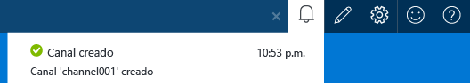
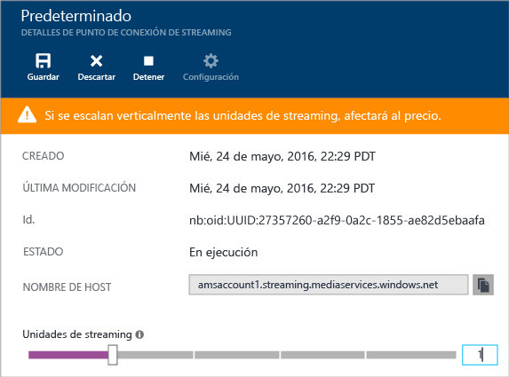
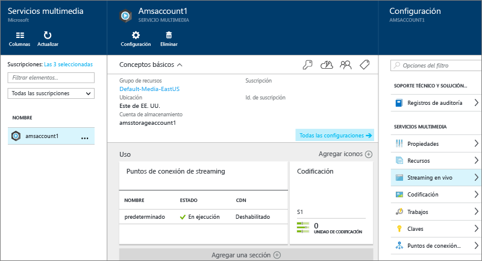
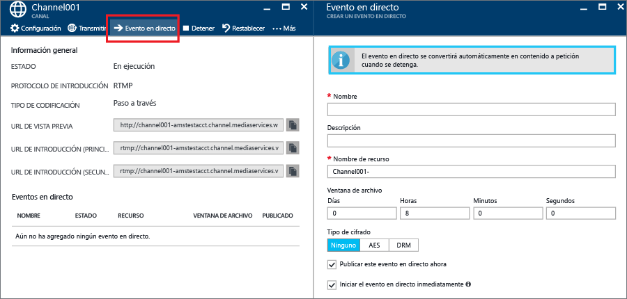
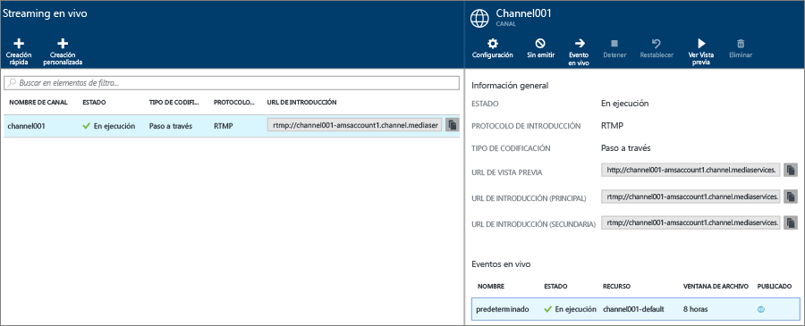
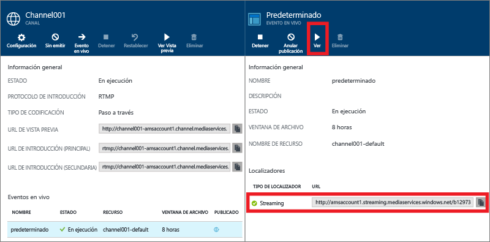
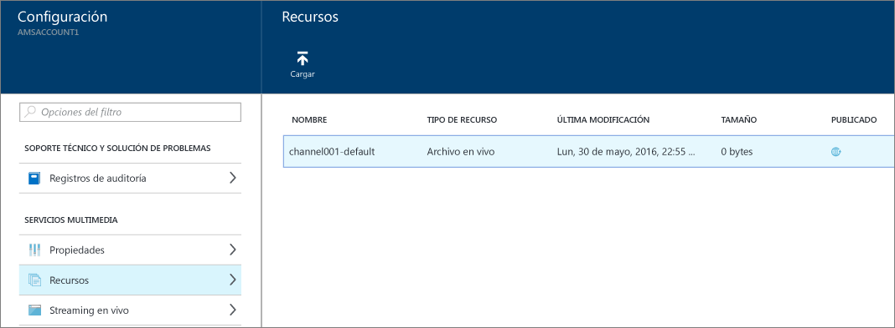

<properties 
	pageTitle="Realización de streaming en vivo con codificadores locales mediante el Portal de Azure | Microsoft Azure" 
	description="Este tutorial le guiará por los pasos para crear un canal que esté configurado para una entrega de paso a través." 
	services="media-services" 
	documentationCenter="" 
	authors="juliako" 
	manager="erikre" 
	editor=""/>

<tags 
	ms.service="media-services" 
	ms.workload="media" 
	ms.tgt_pltfrm="na" 
	ms.devlang="na" 
	ms.topic="get-started-article"
	ms.date="09/05/2016" 
	ms.author="juliako"/>

#Realización de streaming en vivo con codificadores locales mediante el Portal de Azure

> [AZURE.SELECTOR]
- [Portal](media-services-portal-live-passthrough-get-started.md)
- [.NET](media-services-dotnet-live-encode-with-onpremises-encoders.md)
- [REST](https://msdn.microsoft.com/library/azure/dn783458.aspx)

Este tutorial le guiará por los pasos para usar el Portal de Azure para crear un **Canal** que esté configurado para una entrega de paso a través.

##Requisitos previos

Estos son los requisitos previos para completar el tutorial.

- Una cuenta de Azure. Para obtener más información, consulte [Evaluación gratuita de Azure](https://azure.microsoft.com/pricing/free-trial/).
- Una cuenta de Servicios multimedia. Para crear una cuenta de Servicios multimedia, consulte el tema [Creación de una cuenta de Servicios multimedia](media-services-create-account.md).
- Una cámara web. Por ejemplo, el [codificador Telestream Wirecast](http://www.telestream.net/wirecast/overview.htm).

Es importante que revise los artículos siguientes:

- [Compatibilidad con RTMP de Servicios multimedia de Azure y codificadores en directo.](https://azure.microsoft.com/blog/2014/09/18/azure-media-services-rtmp-support-and-live-encoders/)
- [Información general de streaming en vivo con Servicios multimedia de Azure](media-services-manage-channels-overview.md)
- [Streaming en vivo con codificadores locales que crean secuencias de velocidad de bits múltiple](media-services-live-streaming-with-onprem-encoders.md)

##Escenario común de streaming en vivo

Los pasos siguientes describen las tareas que conlleva la creación de aplicaciones comunes de streaming en vivo que usan canales configurados para entregas de paso a través. Este tutorial muestra cómo crear y administrar un canal de paso a través y eventos en directo.

1. Conecte una cámara de vídeo a un equipo. Inicie y configure un codificador en directo local que genere una transmisión de RTMP o MP4 fragmentado con velocidad de bits múltiple. Para obtener más información, consulte [Compatibilidad con RTMP de Servicios multimedia de Azure y codificadores en directo](http://go.microsoft.com/fwlink/?LinkId=532824).
	
	Este paso también puede realizarse después de crear el canal.

1. Cree e inicie un canal de paso a través.
1. Recupere la URL de ingesta de canales.

	El codificador en directo usa la URL de ingesta para enviar la secuencia al canal.
1. Recupere la URL de vista previa de canal.

	Use esta dirección URL para comprobar que el canal recibe correctamente la secuencia en vivo.

3. Cree un evento o programa en directo.

	Con el Portal de Azure, al crear un evento en directo también se crea un recurso.
	  
	>[AZURE.NOTE]Asegúrese de tener al menos una unidad de streaming reservada en el extremo de streaming desde el que desea transmitir el contenido.
1. Inicie el evento o programa cuando esté listo para iniciar el streaming y el archivo.
2. Si lo desea, puede señalar el codificador en directo para iniciar un anuncio. El anuncio se inserta en el flujo de salida.
1. Detenga el evento o programa cuando quiera detener el streaming y el archivo del evento.
1. Elimine el evento o programa (y, opcionalmente, elimine el recurso).

>[AZURE.IMPORTANT] Revise [Streaming en directo con codificadores locales que crean secuencias de velocidad de bits múltiple](media-services-live-streaming-with-onprem-encoders.md) para obtener información acerca de los conceptos y las consideraciones relacionadas con el streaming en vivo con codificadores locales y canales de paso a través.

##Visualización de notificaciones y errores

Si desea ver las notificaciones y los errores generados por el Portal de Azure, haga clic en el icono de notificación.

##Configurar extremos de streaming 

Media Services proporciona empaquetado dinámico que permite entregar archivos MP4 de velocidad de bits múltiple en los siguientes formatos de streaming: MPEG DASH, HLS, Smooth Streaming o HDS sin tener que volver a empaquetar en dichos formatos. Con el empaquetado dinámico, solo necesita almacenar y pagar por los archivos en formato de almacenamiento sencillo y Media Services creará y servirá la respuesta adecuada en función de las solicitudes del cliente.

Para aprovechar al máximo el empaquetado dinámico, debe obtener al menos una unidad de streaming para el punto de conexión de streaming desde el que va a entregar el contenido.

Para crear y cambiar el número de unidades reservadas de streaming, haga lo siguiente:

1. Inicie sesión en el [Portal de Azure](https://portal.azure.com/).
1. En la ventana **Configuración**, haga clic en **Puntos de conexión de streaming**.

2. Haga clic en el punto de conexión de streaming predeterminado.

	Aparecerá la ventana de **DETALLES DEL PUNTO DE CONEXIÓN DE STREAMING PREDETERMINADO**.

3. Para especificar el número de unidades de streaming, mueva el control deslizante **Unidades de streaming**.

	

4. Haga clic en el botón **Guardar** para guardar los cambios.

	>[AZURE.NOTE]La asignación de cualquier nueva unidad puede tardar hasta 20 minutos en completarse.
	
##Creación e inicio de canales de paso a través y eventos

Un canal está asociado a eventos y programas que le permiten controlar la publicación y el almacenamiento de segmentos en una transmisión en vivo. Los canales administran los eventos.
	
Puede especificar la cantidad de horas que desea conservar el contenido grabado del programa en la configuración de la duración de **Ventana de archivo**. Este valor se puede establecer desde un mínimo de cinco minutos a un máximo de 25 horas. La duración de la ventana de archivo también indica el tiempo máximo que los clientes pueden buscar hacia atrás a partir de la posición en vivo actual. Los eventos pueden transmitirse durante la cantidad de tiempo especificada, pero el contenido que escape de esa longitud de ventana se descartará continuamente. El valor de esta propiedad también determina durante cuánto tiempo los manifiestos de cliente pueden crecer.

Cada evento está asociado a un recurso. Para publicar el evento, debe crear un localizador a petición para el recurso asociado. Contar con este localizador le permite crear una dirección URL de streaming que puede proporcionar a sus clientes.

Un canal es compatible con hasta tres eventos en ejecución simultánea, por lo que puede crear varios archivos de la misma transmisión entrante. Esto le permite publicar y archivar distintas partes de un evento, según sea necesario. Por ejemplo, el requisito de su empresa es solo archivar seis horas de un programa, pero difundir solo los últimos diez minutos. Para lograrlo, necesita crear dos programas en ejecución simultánea. Un programa está definido para archivar seis horas del evento, pero no está publicado. El otro programa está definido para archivar durante diez minutos y este programa sí se publica.

No debería reutilizar eventos en directo ya existentes. En su lugar, cree e inicie un evento nuevo para cada evento.

Inicie el evento cuando esté listo para iniciar el streaming y el archivo. Detenga el programa cuando quiera detener el streaming y el archivo del evento.

Para eliminar contenido archivado, detenga y elimine el evento y, a continuación, elimine el recurso asociado. No se puede eliminar un recurso si lo está usando un evento; primero se debe eliminar el evento.

Incluso después de detener y eliminar el evento, los usuarios podrán transmitir el contenido archivado como un vídeo a petición siempre que no elimine el recurso.

Si desea conservar el contenido archivado, pero no hacerlo disponible para la transmisión, elimine el localizador de streaming.

###Uso del portal para crear un canal 

Esta sección muestra cómo utilizar la opción **Creación rápida** para crear un canal de paso a través.

Para más información sobre los canales de este tipo, consulte [Streaming en vivo con codificadores locales que crean secuencias de velocidad de bits múltiple](media-services-live-streaming-with-onprem-encoders.md).

1. En la ventana **Configuración**, haga clic en **Streaming en vivo**.

	
	
	Aparece la ventana **Streaming en vivo**.

3. Haga clic en **Creación rápida** para crear un canal de paso a través con el protocolo de introducción RTMP.

	Aparece la ventana **CREAR UN NUEVO CANAL**.
4. Asigne un nombre al nuevo canal y haga clic en **Crear**.

	Con ello, se crea un canal de paso a través con el protocolo de introducción RTMP.

##Creación de eventos

1. Seleccione el canal al que desea agregar un evento.
2. Pulse el botón **Evento en directo**.

##Obtención de direcciones URL de introducción

Una vez creado el canal, obtendrá direcciones URL de introducción que se proporcionarán al codificador en directo. El codificador usa estas direcciones URL para introducir una secuencia en vivo.

##Visualización del evento

Para ver el evento, haga clic en **Inspección** en el Portal de Azure o copie la dirección URL de streaming y use el reproductor que prefiera.
 

El evento en directo se convierte automáticamente en contenido a petición cuando se detiene.

##Limpieza

Para más información sobre los canales de este tipo, consulte [Streaming en vivo con codificadores locales que crean secuencias de velocidad de bits múltiple](media-services-live-streaming-with-onprem-encoders.md).

- Un canal se puede detener solo cuando se hayan detenido todos los eventos o programas del canal. Cuando se detiene el canal, no se incurre en ningún cargo. Cuando necesite iniciarlo de nuevo, tendrá la misma URL de introducción, por lo que no necesitará volver a configurar su codificador.
- Un canal se puede eliminar solo cuando se hayan eliminado todos los eventos en directo del canal.

##Visualización del contenido archivado

Incluso después de detener y eliminar el evento, los usuarios podrán transmitir el contenido archivado como un vídeo a petición siempre que no elimine el recurso. No se puede eliminar un recurso si lo está usando un evento; primero se debe eliminar el evento.

Para administrar los recursos seleccione **Configuración** y haga clic en **Recursos**.

##Paso siguiente

Consulte las rutas de aprendizaje de Servicios multimedia.

[AZURE.INCLUDE [media-services-learning-paths-include](../../includes/media-services-learning-paths-include.md)]

##Envío de comentarios

[AZURE.INCLUDE [media-services-user-voice-include](../../includes/media-services-user-voice-include.md)]

<!---HONumber=AcomDC_0907_2016-->