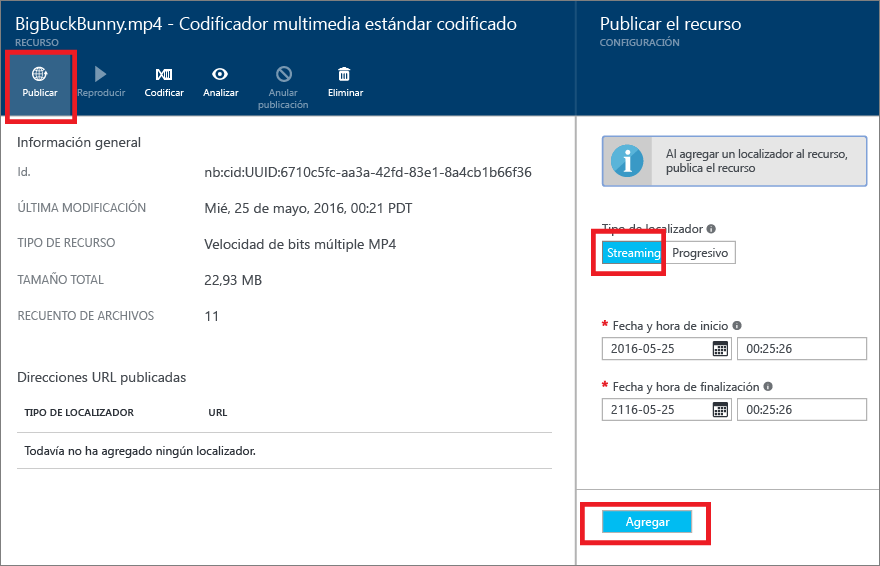
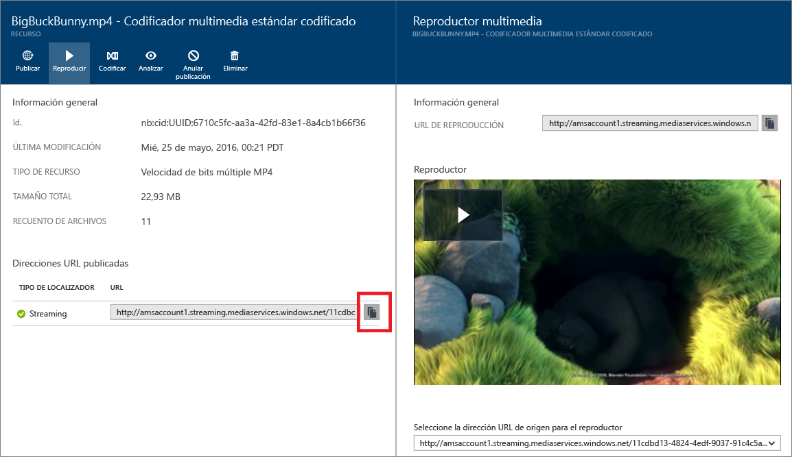

# Publicación de contenido en Azure Portal
> [!div class="op_single_selector"]
> * [Portal](media-services-portal-publish.md)
> * [.NET](media-services-deliver-streaming-content.md)
> * [REST](media-services-rest-deliver-streaming-content.md)
> 
> 

## Información general
> [!NOTE]
> Para completar este tutorial, deberá tener una cuenta de Azure. Para más información, consulte [Evaluación gratuita de Azure](https://azure.microsoft.com/pricing/free-trial/). 
> 
> 

Para proporcionar al usuario una dirección URL que pueda utilizarse para transmitir o descargar el contenido, primero debe publicar el recurso mediante la creación de un localizador. Los localizadores proporcionan acceso a los archivos de recursos. Azure Media Services admite dos tipos de localizadores: 

* **Localizadores de streaming (OnDemandOrigin)**. Los localizadores de streaming se usan para streaming adaptable. Los ejemplos de streaming adaptable incluyen Apple HTTP Live Streaming (HLS), Microsoft Smooth Streaming y Dynamic Adaptive Streaming sobre HTTP (DASH, también llamado MPEG-DASH). Para crear un localizador de streaming, el recurso debe incluir un archivo .ism. 
* **Localizadores progresivos (firma de acceso compartido)**. Los localizadores progresivos se usan para proporcionar vídeo mediante descarga progresiva.

Para generar una dirección URL de streaming de HLS, anexe *(format=m3u8-aapl)* a la dirección URL:

    {streaming endpoint name-media services account name}.streaming.mediaservices.windows.net/{locator ID}/{file name}.ism/Manifest(format=m3u8-aapl)

Para generar una dirección URL de streaming para reproducir recursos de Smooth Streaming, utilice el formato de dirección URL siguiente:

    {streaming endpoint name-media services account name}.streaming.mediaservices.windows.net/{locator ID}/{file name}.ism/Manifest

Para generar una dirección URL de streaming de MPEG DASH, anexe *(format=mpd-time-csf)* a la dirección URL:

    {streaming endpoint name-media services account name}.streaming.mediaservices.windows.net/{locator ID}/{file name}.ism/Manifest(format=mpd-time-csf)

Una dirección URL de firma de acceso compartido tiene el formato siguiente:

    {blob container name}/{asset name}/{file name}/{shared access signature}

Para más información, consulte la [introducción a la entrega de contenidos](media-services-deliver-content-overview.md).

> [!NOTE]
> Los localizadores que se crearon en Azure Portal antes de marzo de 2015 tienen una fecha de expiración de dos años.  
> 
> 

Para actualizar una fecha de expiración en un localizador, puede usar una [API de REST](https://docs.microsoft.com/rest/api/media/operations/locator#update_a_locator) o una [API de .NET](http://go.microsoft.com/fwlink/?LinkID=533259). 

> [!NOTE]
> Cuando se actualiza la fecha de expiración de un localizador de firma de acceso compartido, la dirección URL cambia.

### Uso del portal para publicar un recurso
1. En [Azure Portal](https://portal.azure.com/), seleccione la cuenta de Azure Media Services.
2. Seleccione **Configuración** > **Activos**. Seleccione el recurso que desea publicar.
3. Seleccione el botón **Publicar**.
4. Seleccione el tipo de localizador.
5. Seleccione **Agregar**.
   
    

La dirección URL se agrega a la lista de **direcciones URL publicadas**.

## Reproducción de contenido en el portal
Puede probar el vídeo en un reproductor de contenido en Azure Portal.

Seleccione el vídeo y, a continuación, haga clic en el botón **Reproducir**.

Se aplican algunas consideraciones:

* Asegúrese de que el vídeo se ha publicado.
* El reproductor multimedia de Azure Portal reproduce desde el punto de conexión de streaming predeterminado. Si quiere reproducir desde un punto de conexión de streaming no predeterminado, seleccione y copie la dirección URL y luego péguela en otro reproductor. Por ejemplo, puede probar el vídeo en [Azure Media Player](http://amsplayer.azurewebsites.net/azuremediaplayer.html).
* Debe estar ejecutándose el punto de conexión de streaming desde el que está realizando una operación de streaming.  

## Envío de comentarios
[!INCLUDE [media-services-user-voice-include](../../includes/media-services-user-voice-include.md)]

## Pasos siguientes
[!INCLUDE [media-services-learning-paths-include](../../includes/media-services-learning-paths-include.md)]

