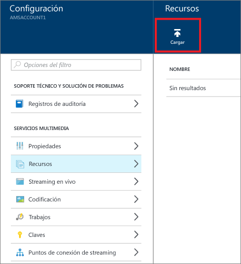
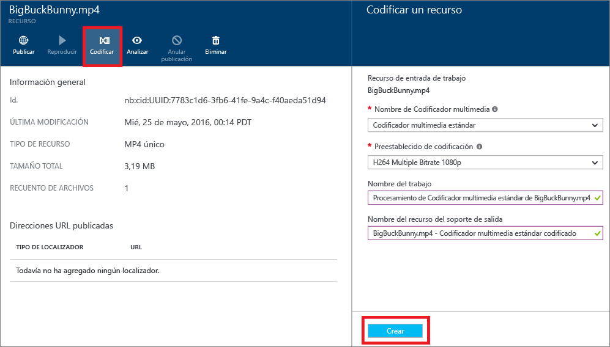

# Introducción a la entrega de contenido a petición mediante Azure Portal
[!INCLUDE [media-services-selector-get-started](../../includes/media-services-selector-get-started.md)]

Este tutorial le guía por los pasos para implementar un servicio básico de entrega de contenido de vídeo bajo demanda (VoD) con una aplicación de Azure Media Services (AMS) mediante Azure Portal.

## Requisitos previos
Los siguientes elementos son necesarios para completar el tutorial:

* Una cuenta de Azure. Para más información, consulte [Evaluación gratuita de Azure](https://azure.microsoft.com/pricing/free-trial/). 
* Una cuenta de Media Services. Para crear una cuenta de Media Services, consulte el tema [Creación de una cuenta de Media Services](media-services-portal-create-account.md).

Este tutorial incluye las siguientes tareas:

1. Inicio del punto de conexión de streaming.
2. Carga de un archivo de vídeo.
3. Codificación del archivo de origen en un conjunto de archivos MP4 de velocidad de bits adaptativa
4. Publicación del recurso y obtención de las direcciones URL de descarga progresiva y de streaming.  
5. Reproduzca el contenido.

## Inicio del punto de conexión de streaming

Cuando se trabaja con Azure Media Services, uno de los escenarios más comunes es la entrega de vídeo mediante streaming con velocidad de bits adaptable. Media Services le proporciona empaquetado dinámico. Con el empaquetado dinámico, puede entregar su contenido codificado en MP4 con velocidad de bits adaptable en formatos de streaming Just-In-Time que son compatibles con Media Services. Los ejemplos incluyen Apple HTTP Live Streaming (HLS), Microsoft Smooth Streaming y Dynamic Adaptive Streaming sobre HTTP (DASH, también llamado MPEG-DASH). Mediante el uso de streaming con velocidad de bits adaptable de Media Services, puede entregar sus vídeos sin almacenar versiones empaquetadas previamente de cada uno de estos formatos de streaming.

> [!NOTE]
> Cuando se crea la cuenta de Azure Media Services, se agrega un punto de conexión de streaming predeterminado a la cuenta en estado **Detenido**. Para iniciar la transmisión del contenido y aprovechar el empaquetado dinámico y el cifrado dinámico, el punto de conexión de streaming desde el que va a transmitir el contenido debe estar en estado **En ejecución**. 

Para iniciar el punto de conexión de streaming:

1. Inicie sesión en el [Portal de Azure](https://portal.azure.com/).
2. Seleccione **Configuración** > **Puntos de conexión de streaming**. 
3. Seleccione el punto de conexión de streaming predeterminado. Aparecerá la ventana de **DETALLES DEL PUNTO DE CONEXIÓN DE STREAMING PREDETERMINADO** .
4. Seleccione el icono **Iniciar**.
5. Seleccione el botón **Guardar**.

## Carga de archivos
Para transmitir vídeos mediante Media Services, se cargan los vídeos de origen, se codifican en varias velocidades de bits y luego se publica el resultado. En esta sección se describe el primer paso. 

1. En [Azure Portal](https://portal.azure.com/), seleccione la cuenta de Azure Media Services.
2. Seleccione **Configuración** > **Activos**. Después, seleccione el botón **Cargar**.
   
    
   
    Aparecerá la ventana **Upload a video asset** (Cargar un recurso de vídeo).
   
   > [!NOTE]
   > Media Services no limita el tamaño de archivo en la carga de vídeos.
   > 
   > 
3. En el equipo, vaya al vídeo que desea cargar. Seleccione el vídeo y, después, haga clic en **Aceptar**.  
   
    Comienza la carga. Puede ver el progreso debajo del nombre de archivo.  

Cuando haya finalizado la carga, el nuevo recurso se muestra en el panel **Recursos**. 

## Codificación de recursos
Para aprovechar las ventajas del empaquetado dinámico, debe codificar el archivo de origen en un conjunto de archivos MP4 con velocidad de bits múltiple. Los pasos de codificación se muestran en esta sección.

### Codificación de recursos en el portal
Para codificar el contenido mediante Media Encoder Standard en Azure Portal, siga estos pasos:

1. En [Azure Portal](https://portal.azure.com/), seleccione la cuenta de Azure Media Services.
2. Seleccione **Configuración** > **Activos**. Seleccione el recurso que desea codificar.
3. Seleccione el botón **Codificar**.
4. En el panel **Codificar un recurso**, seleccione el procesador **Media Encoder Standard** y un valor predeterminado. Para más información sobre los valores predeterminados, consulte los artículos sobre la [generación automática de una escalera de velocidad de bits](media-services-autogen-bitrate-ladder-with-mes.md) y [Valores preestablecidos de las tareas de MES (Media Encoder Standard)](media-services-mes-presets-overview.md). Es importante elegir el valor predeterminado que funcionará mejor con la entrada de vídeo. Por ejemplo, si sabe que la entrada de vídeo tiene una resolución de 1920x1080 píxeles, se podría usar el valor predeterminado **H264 Multiple Bitrate 1080p**. Si tiene un vídeo de baja resolución (640x360), no debería usar el valor predeterminado **H264 Multiple Bitrate 1080p**.
   
   Para ayudarlo a administrar los recursos, puede editar el nombre del recurso de salida y el nombre del trabajo.
   
   
5. Seleccione **Crear**.

### Supervisión del progreso del trabajo de codificación
Para supervisar el progreso del trabajo de codificación, haga clic en **Configuración** y, después, seleccione **Trabajos**.

## Publicación de contenido
Para proporcionar al usuario una dirección URL que pueda utilizarse para transmitir o descargar el contenido, primero debe publicar el recurso mediante la creación de un localizador. Los localizadores proporcionan acceso a los archivos contenidos en el recurso. Azure Media Services admite dos tipos de localizadores: 

* **Localizadores de streaming (OnDemandOrigin)**. Los localizadores de streaming se usan para el streaming adaptable. Ejemplos de streaming adaptable son HLS, Smooth Streaming y MPEG-DASH. Para crear un localizador de streaming, el recurso debe incluir un archivo .ism. 
* **Localizadores progresivos (firma de acceso compartido)**. Los localizadores progresivos se usan para proporcionar vídeo mediante descarga progresiva.

Para generar una dirección URL de streaming de HLS, anexe *(format=m3u8-aapl)* a la dirección URL:

    {streaming endpoint name-media services account name}.streaming.mediaservices.windows.net/{locator ID}/{file name}.ism/Manifest(format=m3u8-aapl)

Para generar una dirección URL de streaming para reproducir recursos de Smooth Streaming, utilice el formato de dirección URL siguiente:

    {streaming endpoint name-media services account name}.streaming.mediaservices.windows.net/{locator ID}/{file name}.ism/Manifest

Para generar una dirección URL de streaming de MPEG DASH, anexe *(format=mpd-time-csf)* a la dirección URL:

    {streaming endpoint name-media services account name}.streaming.mediaservices.windows.net/{locator ID}/{file name}.ism/Manifest(format=mpd-time-csf)

Una dirección URL de firma de acceso compartido tiene el formato siguiente:

    {blob container name}/{asset name}/{file name}/{shared access signature}

> [!NOTE]
> Los localizadores que se crearon en Azure Portal antes de marzo de 2015 tienen una fecha de expiración de dos años.  
> 
> 

Para actualizar una fecha de expiración en un localizador, puede usar una [API de REST](https://docs.microsoft.com/rest/api/media/operations/locator#update_a_locator) o una [API de .NET](http://go.microsoft.com/fwlink/?LinkID=533259). 

> [!NOTE]
> Cuando se actualiza la fecha de expiración de un localizador de firma de acceso compartido, la dirección URL cambia.

### Uso del portal para publicar un recurso
1. En [Azure Portal](https://portal.azure.com/), seleccione la cuenta de Azure Media Services.
2. Seleccione **Configuración** > **Activos**. Seleccione el recurso que desea publicar.
3. Seleccione el botón **Publicar**.
4. Seleccione el tipo de localizador.
5. Seleccione **Agregar**.
   
    

La dirección URL se agrega a la lista de **direcciones URL publicadas**.

## contenido desde el portal
Puede probar el vídeo en un reproductor de contenido en Azure Portal.

Seleccione el vídeo y, a continuación, haga clic en el botón **Reproducir**.

Se aplican algunas consideraciones:

* Para iniciar el streaming, comience a ejecutar el punto de conexión de streaming predeterminado.
* Asegúrese de que el vídeo se ha publicado.
* El reproductor multimedia de Azure Portal reproduce desde el punto de conexión de streaming predeterminado. Si quiere reproducir desde un punto de conexión de streaming no predeterminado, seleccione y copie la dirección URL y luego péguela en otro reproductor. Por ejemplo, puede probar el vídeo en [Azure Media Player](http://amsplayer.azurewebsites.net/azuremediaplayer.html).

## Envío de comentarios
[!INCLUDE [media-services-user-voice-include](../../includes/media-services-user-voice-include.md)]

## Pasos siguientes
[!INCLUDE [media-services-learning-paths-include](../../includes/media-services-learning-paths-include.md)]
