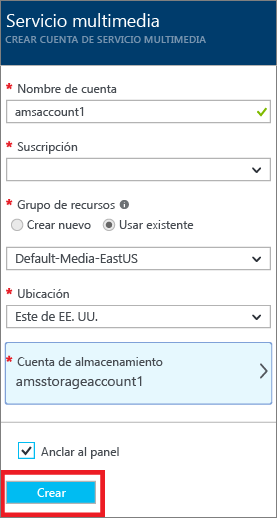
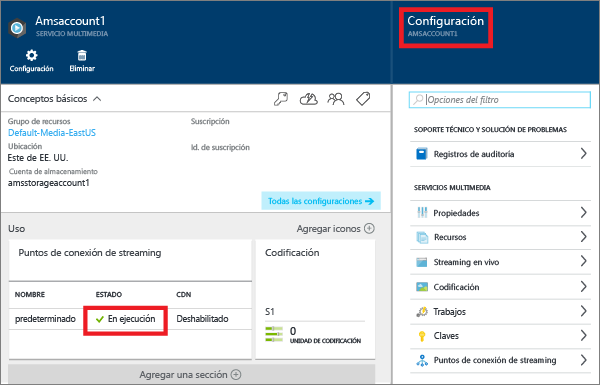
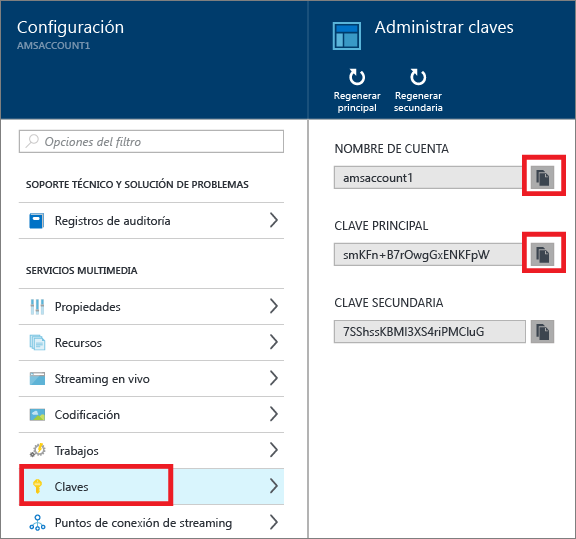

# Introducción a la entrega de contenido a petición mediante el Portal de Azure
[!INCLUDE [media-services-selector-get-started](../../includes/media-services-selector-get-started.md)]

Este tutorial le guiará por los pasos necesarios para implementar un servicio básico de entrega de contenido de vídeo bajo demanda (VoD) con la aplicación de Servicios multimedia de Azure (AMS) mediante el Portal de Azure.

> [!NOTE]
> Para completar este tutorial, deberá tener una cuenta de Azure. Para obtener más información, consulte [Evaluación gratuita de Azure](https://azure.microsoft.com/pricing/free-trial/). 
> 
> 

Este tutorial incluye las siguientes tareas:

1. Creación de una cuenta de Servicios multimedia de Azure.
2. Inicie el punto de conexión de streaming.
3. Carga de un archivo de vídeo.
4. Codificación del archivo de origen en un conjunto de archivos MP4 de velocidad de bits adaptativa
5. Publicación del recurso y obtención de direcciones URL de descarga progresiva y streaming.  
6. Reproduzca el contenido.

## Creación de una cuenta de Servicios multimedia de Azure
Los pasos de esta sección muestran cómo crear una cuenta de AMS.

1. Inicie sesión en el [Portal de Azure](https://portal.azure.com/).
2. Haga clic en **+Nuevo** > **Web y móvil** > **Servicios multimedia**.
   
    
3. En **CREAR CUENTA DE SERVICIOS MULTIMEDIA** especifique los valores obligatorios.
   
    
   
   1. En **Nombre de la cuenta**, especifique el nombre de la cuenta nueva de AMS. El nombre de la cuenta de Servicios multimedia debe estar compuesto de números o letras en minúscula, sin espacios y con una longitud de entre 3 y 24 caracteres.
   2. En Suscripción, seleccione entre las diferentes suscripciones de Azure a las que tiene acceso.
   3. En **Grupo de recursos**seleccione el recurso nuevo o uno ya existente.  Un grupo de recursos es una colección de recursos que comparten ciclos de vida, permisos y directivas. Obtenga más información [aquí](../azure-resource-manager/resource-group-overview.md#resource-groups).
   4. En **Ubicación**, seleccione la región geográfica que se usará para almacenar los registros de medios y de metadatos para la cuenta de Media Services. Esta región se utiliza para procesar y transmitir contenido multimedia. Solo las regiones de Servicios multimedia disponibles aparecen en la lista desplegable. 
   5. En **Cuenta de almacenamiento**, seleccione una cuenta de almacenamiento para proporcionar almacenamiento de blobs del contenido multimedia desde la cuenta de Servicios multimedia. Puede seleccionar una cuenta de almacenamiento existente de la misma región geográfica que la cuenta de Servicios multimedia o crearla. Se crea una nueva cuenta de almacenamiento en la misma región. Las reglas para los nombres de cuenta de almacenamiento son las mismas que para las cuentas de Servicios multimedia.
      
       Puede obtener más información acerca del almacenamiento [aquí](../storage/storage-introduction.md).
   6. Seleccione **Anclar al panel** para ver el progreso de la implementación de la cuenta.
4. Haga clic en **Crear** en la parte inferior del formulario.
   
    Cuando la cuenta se crea correctamente, se carga la página de información general. En la tabla de puntos de conexión de streaming, la cuenta tendrá el punto de conexión de streaming predeterminado en el estado **Stopped** (Detenido). El punto de conexión de streaming desde el que va a transmitir el contenido debe estar en estado **Running** (En ejecución). 
   
    
   
    Para administrar la cuenta de AMS (por ejemplo, para cargar vídeos, codificar recursos, supervisar el progreso del trabajo) use la ventana **Configuración** .

## Administrar claves
Necesita el nombre de cuenta y la información de la clave principal para obtener acceso mediante programación a la cuenta de Servicios multimedia.

1. En el Portal de Azure, seleccione la cuenta. 
   
    Aparecerá la ventana **Configuración** a la derecha. 
2. En la ventana **Configuración**, seleccione **Claves**. 
   
    Aparece la ventana **Administrar claves** que muestra el nombre de la cuenta y la clave principal y la secundaria. 
3. Pulse el botón Copiar para copiar los valores.
   
    

## Inicio de los puntos de conexión de streaming 

Cuando se trabaja con Azure Media Services, uno de los escenarios más comunes es entregar contenido de vídeo a los clientes mediante streaming con velocidad de bits adaptable. Media Services proporciona empaquetado dinámico que permite entregar contenido codificado MP4 con velocidad de bits adaptable en formatos de streaming admitidos por Media Services (MPEG DASH, HLS, Smooth Streaming) justo a tiempo, sin tener que almacenar versiones previamente empaquetadas de cada uno de estos formatos.

>[!NOTE]
>Cuando se crea la cuenta de AMS, se agrega un punto de conexión de streaming **predeterminado** a la cuenta en estado **Stopped** (Detenido). Para iniciar la transmisión del contenido y aprovechar el empaquetado dinámico y el cifrado dinámico, el punto de conexión de streaming desde el que va a transmitir el contenido debe estar en estado **Running** (En ejecución). 

Para iniciar el punto de conexión de streaming, haga lo siguiente:

1. En la ventana Settings (Configuración), haga clic en Streaming endpoints (Puntos de conexión de streaming). 
2. Haga clic en el punto de conexión de streaming predeterminado. 

    Aparecerá la ventana de detalles del punto de conexión de streaming predeterminado.

3. Haga clic en el icono de inicio.
4. Haga clic en el botón Save (Guardar) para guardar los cambios.

## Carga de archivos
Para transmitir vídeos mediante Servicios multimedia de Azure, es preciso cargar los vídeos de origen, codificarlos en varias velocidades de bits y publicar el resultado. En esta sección se describe el primer paso. 

1. En la ventana **Configuración**, haga clic en **Activos**.
   
    
2. Haga clic en el botón **Upload** .
   
    Aparecerá la ventana **Upload a video asset** (Cargar un recurso de vídeo).
   
   > [!NOTE]
   > No hay ninguna limitación de tamaño de archivo.
   > 
   > 
3. Busque el vídeo deseado en su equipo, selecciónelo y haga clic en Aceptar.  
   
    La carga se inicia y puede ver el progreso en el nombre de archivo.  

Una vez que la carga se haya completado, verá el nuevo recurso en la ventana **Activos** . 

## Codificación de recursos
Cuando se trabaja con Servicios multimedia de Azure, uno de los escenarios más comunes es entregar streaming de velocidad de bits adaptable a los clientes. Media Services admite las siguientes tecnologías de streaming con velocidad de bits adaptable: HTTP Live Streaming (HLS), Smooth Streaming y MPEG DASH. Para preparar vídeos para streaming con velocidad de bits adaptable, debe codificar el vídeo de origen en archivos de varias velocidades de bits. Debe utilizar el **Codificador multimedia estándar** para codificar sus vídeos.  

Media Services también proporciona empaquetado dinámico, que permite entregar archivos MP4 de velocidad de bits múltiple en los siguientes formatos de streaming: MPEG DASH, HLS o Smooth Streaming sin tener que volver a empaquetar en dichos formatos. Con el empaquetado dinámico, solo necesita almacenar y pagar por los archivos en formato de almacenamiento sencillo y Servicios multimedia creará y servirá la respuesta adecuada en función de las solicitudes del cliente.

Para sacar partido del empaquetado dinámico, tiene que codificar su archivo de origen en un conjunto de archivos MP4 de velocidad de bits múltiple (los pasos de codificación se muestran más adelante en esta sección).

### Uso del portal para codificar
En esta sección se describen los pasos que puede seguir para codificar el contenido con Estándar de codificador multimedia.

1. En la ventana **Configuración**, seleccione **Activos**.  
2. En la ventana **Activos** , seleccione el recurso que desea codificar.
3. Presione el botón **Codificar** .
4. En la ventana **Encode an asset** (Codificar un recurso), seleccione el procesador "Codificador multimedia estándar" y un valor predeterminado. Por ejemplo, si sabe que el vídeo de entrada tiene una resolución de 1920 x 1080 píxeles, se podría utilizar el valor predeterminado "H264 Multiple Bitrate 1080p". Para más información acerca de los valores predeterminados, consulte [este](https://msdn.microsoft.com/library/azure/mt269960.aspx) artículo: es importante seleccionar el valor predeterminado que resulta más adecuado para el vídeo de entrada. Si tiene un vídeo de baja resolución (640 x 360), no debería utilizar el valor predeterminado "H264 Multiple Bitrate 1080p".
   
   Para facilitar la administración, se puede editar el nombre del recurso de salida y el nombre del trabajo.
   
   
5. Pulse **Crear**.

### Supervisión del progreso del trabajo de codificación
Para supervisar el progreso del trabajo de codificación, haga clic en **Configuración** (en la parte superior de la página) y, después, seleccione **Trabajos**.

## Publicación de contenido
Para proporcionar al usuario una dirección URL que pueda utilizarse para transmitir o descargar su contenido, primero necesitará "publicar" su recurso mediante la creación de un localizador. Los localizadores proporcionan acceso a los archivos contenidos en el recurso. Servicios multimedia admite dos tipos de localizadores: 

* Los localizadores de streaming (OnDemandOrigin), que se usan en el streaming adaptable (por ejemplo, para transmitir MPEG DASH, HLS o Smooth Streaming). Para crear un localizador de streaming el recurso debe contener un archivo .ism. 
* Localizadores (SAS) progresivos, utilizados para la entrega de vídeo mediante descarga progresiva.

Una dirección URL de streaming tiene el siguiente formato y se puede usar para reproducir los recursos de Smooth Streaming:

    {streaming endpoint name-media services account name}.streaming.mediaservices.windows.net/{locator ID}/{filename}.ism/Manifest

Para generar una dirección URL de streaming de HLS, anexe (format=m3u8-aapl) a la dirección URL.

    {streaming endpoint name-media services account name}.streaming.mediaservices.windows.net/{locator ID}/{filename}.ism/Manifest(format=m3u8-aapl)

Para generar una dirección URL de streaming de MPEG DASH, anexe (format=mpd-time-csf) a la dirección URL.

    {streaming endpoint name-media services account name}.streaming.mediaservices.windows.net/{locator ID}/{filename}.ism/Manifest(format=mpd-time-csf)

Una dirección URL de SAS tiene el formato siguiente:

    {blob container name}/{asset name}/{file name}/{SAS signature}

> [!NOTE]
> Si usó el portal para crear localizadores antes de marzo de 2015, se crearon localizadores con una fecha de caducidad de dos años.  
> 
> 

Para actualizar la fecha de caducidad de un localizador, use las API de [REST](http://msdn.microsoft.com/library/azure/hh974308.aspx#update_a_locator) o de [.NET](http://go.microsoft.com/fwlink/?LinkID=533259). Cuando se actualiza la fecha de caducidad de un localizador de SAS, cambia la dirección URL.

### Uso del portal para publicar un recurso
Para usar el portal para publicar un recurso, haga lo siguiente:

1. Seleccione **Configuración** > **Activos**.
2. Seleccione el recurso que desea publicar.
3. Haga clic en el botón **Publicar** .
4. Seleccione el tipo de localizador.
5. Presione **Agregar**.
   
    

La dirección URL se agrega a la lista de **direcciones URL publicadas**.

## contenido desde el portal
El Portal de Azure proporciona un reproductor de contenido que puede usar para probar el vídeo.

Haga clic en el vídeo deseado y, luego, en el botón **Reproducir** .

Se aplican algunas consideraciones:

* Asegúrese de que se ha publicado el vídeo.
* El **Reproductor multimedia** reproduce desde el punto de conexión de streaming predeterminado. Si desea reproducir desde un punto de conexión de streaming que no esté predeterminado, haga clic para copiar la dirección URL y use otro reproductor. Por ejemplo, el [Reproductor de Servicios multimedia de Azure](http://amsplayer.azurewebsites.net/azuremediaplayer.html).

## Pasos siguientes
Consulte las rutas de aprendizaje de Servicios multimedia.

[!INCLUDE [media-services-learning-paths-include](../../includes/media-services-learning-paths-include.md)]

## Envío de comentarios
[!INCLUDE [media-services-user-voice-include](../../includes/media-services-user-voice-include.md)]

<!--HONumber=Jan17_HO2-->

