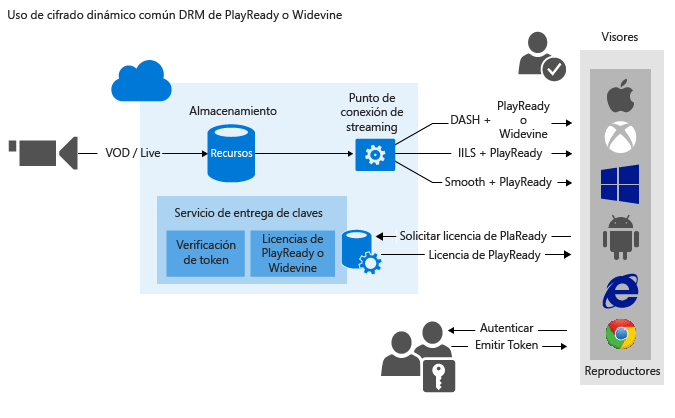

# Uso de cifrado dinámico común de PlayReady o Widevine

> [!div class="op_single_selector"]
> * [.NET](media-services-protect-with-drm.md)
> * [Java](https://github.com/southworkscom/azure-sdk-for-media-services-java-samples)
> * [PHP](https://github.com/Azure/azure-sdk-for-php/tree/master/examples/MediaServices)
>
>

Servicios multimedia de Microsoft Azure le permite entregar secuencias MPEG-DASH, Smooth Streaming y Http-Live-Streaming (HLS) protegidas con [DRM de Microsoft PlayReady](https://www.microsoft.com/playready/overview/). También permite entregar transmisiones DASH cifradas con licencias DRM de Widevine. Tanto PlayReady como Widewine se cifran según la especificación de cifrado común (ISO/IEC 23001-7 CENC). Puede usar el [.NET SDK de AMS](https://www.nuget.org/packages/windowsazure.mediaservices/) (a partir de la versión 3.5.1) o la API de REST para configurar AssetDeliveryConfiguration para usar Widevine.

Servicios multimedia proporciona un servicio para entregar licencias DRM de PlayReady y Widevine. Servicios multimedia también proporciona unas API que permiten configurar los derechos y las restricciones que desee aplicar en tiempo de ejecución de DRM de PlayReady o Widevine cuando un usuario reproduzca contenido protegido. Cuando un usuario solicita contenido protegido con DRM, la aplicación del reproductor solicitará una licencia del servicio de licencias de AMS. El servicio de licencias de AMS emitirá una licencia al reproductor, si está autorizado. Una licencia de PlayReady o Widevine contiene la clave de descifrado que puede usar el reproductor cliente para descifrar y transmitir el contenido.

También puede usar los siguientes asociados de AMS para ayudarle a entregar licencias de Widevine: [Axinom](http://www.axinom.com/press/ibc-axinom-drm-6/), [EZDRM](http://ezdrm.com/) y [castLabs](http://castlabs.com/company/partners/azure/). Para obtener más información, consulte: integración con [Axinom](media-services-axinom-integration.md) y [castLabs](media-services-castlabs-integration.md).

Servicios multimedia admite varias formas de autorizar a los usuarios que realizan solicitudes de clave. La directiva de autorización de claves de acceso podría tener una o más restricciones de autorización: abrir o restricción de token. La directiva con restricción token debe ir acompañada de un token emitido por un Servicio de tokens seguros (STS). Media Services admite tokens en formato [Token de web simple (SWT)](https://msdn.microsoft.com/library/gg185950.aspx#BKMK_2) y en formato [JSON Web Token (JWT)](https://msdn.microsoft.com/library/gg185950.aspx#BKMK_3). Para obtener más información, consulte Configuración de la directiva de autorización de la clave de contenido.

Para aprovechar las ventajas del cifrado dinámico, debe disponer de un recurso que contenga un conjunto de archivos MP4 o archivos de origen Smooth Streaming, de varias velocidades de bits. También es preciso configurar las directivas de entrega del recurso (se describe más adelante en este tema). Luego, según el formato especificado en la URL de streaming, el servidor de streaming a petición se asegurará de que se reciba la secuencia en el protocolo elegido. Como resultado, solo tendrá que almacenar y pagar los archivos en un solo formato de almacenamiento y Servicios multimedia compilará y proporcionará la respuesta adecuada en función de cada solicitud de un cliente.

Este tema será útil para los desarrolladores que trabajan en aplicaciones que entregan medios protegidos con varios DRM, por ejemplo, PlayReady y Widevine. En este tema se muestra cómo configurar el servicio de entrega de licencias de PlayReady con directivas de autorización para que solo los clientes autorizados puedan recibir licencias de PlayReady o Widevine. También muestra cómo usar el cifrado dinámico con DRM de PlayReady o Widevine a través de DASH.

>[!NOTE]
>Cuando se crea la cuenta de AMS, se agrega un punto de conexión de streaming **predeterminado** a la cuenta en estado **Stopped** (Detenido). Para iniciar la transmisión del contenido y aprovechar el empaquetado dinámico y el cifrado dinámico, el punto de conexión de streaming desde el que va a transmitir el contenido debe estar en estado **Running** (En ejecución). 

## Descarga de un ejemplo
Puede descargar el ejemplo descrito en este artículo [aquí](https://github.com/Azure-Samples/media-services-dotnet-dynamic-encryption-with-drm).

## Configuración del cifrado dinámico común y el servicio de entrega de licencias DRM

Éstos son los pasos generales que deberá realizar al proteger sus recursos con PlayReady, mediante el servicio de entrega de licencias de Servicios multimedia y también mediante cifrado dinámico.

1. Creación de un recurso y carga de los archivos en el recurso.
2. Codificación del recurso que contiene el archivo con Adaptive Bitrate MP4 Set.
3. Creación de una clave de contenido y su asociación con el recurso codificado. En Servicios multimedia, la clave de contenido contiene la clave de cifrado del recurso.
4. Configuración de la directiva de autorización de la clave de contenido. El usuario debe configurar la directiva de autorización de claves y el cliente (reproductor) debe conocerla para que se le entregue la clave de contenido.

    Al crear la directiva de autorización de claves de contenido, debe especificar lo siguiente: método de entrega (PlayReady o Widevine), restricciones (abiertas o tokens) e información específica del tipo de entrega de claves que define cómo se entrega la clave al cliente (plantilla de licencia [PlayReady](media-services-playready-license-template-overview.md) o [Widevine](media-services-widevine-license-template-overview.md)).

5. Configuración de la directiva de entrega para un recurso. La configuración de directivas de entrega incluye: el protocolo de entrega (por ejemplo, MPEG DASH, HLS, Smooth Streaming o todos), el tipo de cifrado dinámico (por ejemplo, cifrado común) y la URL de adquisición de licencias de PlayReady o Widevine.

    Puede aplicar diferentes directivas a cada protocolo en el mismo recurso. Por ejemplo, puede aplicar cifrado PlayReady a Smooth/DASH y AES Envelope a HLS. Se bloqueará la transmisión para todos los protocolos que no estén definidos en una directiva de entrega (por ejemplo, si agrega una sola directiva que solo especifica HLS como el protocolo). La excepción a esta regla se produce en el caso de que no haya definido ninguna directiva de entrega de recursos. En tal caso, todos los protocolos estarán habilitados sin cifrar.

6. Creación de un localizador a petición para obtener una URL de streaming.

Al final del tema encontrará un ejemplo de .NET completo.

La siguiente imagen muestra el flujo de trabajo que se ha descrito anteriormente. Aquí el token se usa para la autenticación.

El resto de este tema proporciona explicaciones detalladas, ejemplos de código y vínculos a temas que le muestran cómo lograr las tareas descritas arriba.

## Limitaciones actuales
Si agrega o actualiza la directiva de entrega de recursos, debe eliminar el localizador asociado (si hay) y crear uno nuevo.

Limitación cuando se cifra con Widevine con Servicios multimedia de Azure: actualmente, no se admiten varias claves de contenido.

## Creación de un recurso y carga de los archivos en el recurso.
Para administrar, codificar y transmitir por secuencias sus vídeos, primero debe cargar el contenido en Servicios multimedia de Microsoft Azure. Una vez cargado, el contenido se almacena de forma segura en la nube para su posterior procesamiento y transmisión.

Para obtener información detallada, consulte [Carga de archivos en una cuenta de Servicios multimedia](media-services-dotnet-upload-files.md).

## Codificación del recurso que contiene el archivo con Adaptive Bitrate MP4 Set.
Con el cifrado dinámico, todo lo que tiene que hacer es crear un recurso que contenga un conjunto de archivos MP4 o archivos Smooth Streaming, de varias velocidades de bits. Luego, según el formato especificado en la solicitud de manifiesto o de fragmento, el servidor de streaming a petición se asegurará de que reciba la transmisión en el protocolo elegido. Como resultado, solo tendrá que almacenar y pagar los archivos en formato de almacenamiento único y Servicios multimedia creará y proporcionará la respuesta adecuada en función de las solicitudes de un cliente. Para más información, consulte el tema [Información general sobre el empaquetado dinámico](media-services-dynamic-packaging-overview.md) .

Para obtener instrucciones sobre cómo codificar, consulte [Codificación de un recurso mediante Codificador multimedia estándar](media-services-dotnet-encode-with-media-encoder-standard.md).

## Creación de una clave de contenido y su asociación con el activo codificado
En Servicios multimedia, la clave de contenido contiene la clave con la que desea cifrar un recurso.

Para obtener más información, consulte [Creación de la clave de contenido](media-services-dotnet-create-contentkey.md).

## Configuración de la directiva de autorización de claves de contenido
Servicios multimedia admite varias formas de autenticar a los usuarios que realizan solicitudes de clave. El usuario debe configurar la directiva de autorización de claves y el cliente (reproductor) debe conocerla para que se le entregue la clave. La directiva de autorización de claves de acceso podría tener una o más restricciones de autorización: abrir o restricción de token.

Para obtener información detallada, consulte [Configuración de la directiva de autorización de claves de contenido](media-services-dotnet-configure-content-key-auth-policy.md#playready-dynamic-encryption).

## Configuración de directivas de entrega de recursos
Configure la directiva de entrega de sus recursos. Algunos de los elementos que incluye la configuración de la directiva de entrega de recursos son:

* La dirección URL de adquisición de licencias de DRM.
* El protocolo de entrega de recursos (por ejemplo, MPEG DASH, HLS, Smooth Streaming o todos).
* El tipo de cifrado dinámico (en este caso, cifrado común).

Para obtener más información, consulte [Configuración de directivas de entrega de recursos ](media-services-rest-configure-asset-delivery-policy.md).

## Creación de un localizador de streaming a petición para obtener una URL de streaming
Deberá suministrar al usuario la URL de streaming para Smooth, DASH o HLS.

> [!NOTE]
> Si agrega o actualiza la directiva de entrega de recursos, debe eliminar un localizador existente (si hay) y crear uno nuevo.
>
>

Para obtener instrucciones sobre cómo publicar un recurso y generar una dirección URL de streaming, vea [Creación de una dirección URL de streaming](media-services-deliver-streaming-content.md).

## Obtención de un token de prueba
Obtenga un token de prueba basado en la restricción de token que se usó para la directiva de autorización de claves.

    // Deserializes a string containing an Xml representation of a TokenRestrictionTemplate
    // back into a TokenRestrictionTemplate class instance.
    TokenRestrictionTemplate tokenTemplate =
        TokenRestrictionTemplateSerializer.Deserialize(tokenTemplateString);

    // Generate a test token based on the data in the given TokenRestrictionTemplate.
    //The GenerateTestToken method returns the token without the word “Bearer” in front
    //so you have to add it in front of the token string.
    string testToken = TokenRestrictionTemplateSerializer.GenerateTestToken(tokenTemplate);
    Console.WriteLine("The authorization token is:\nBearer {0}", testToken);

Puede usar [AMS Player](http://amsplayer.azurewebsites.net/azuremediaplayer.html) para probar la secuencia.

## Creación y configuración de un proyecto de Visual Studio

1. Configure el entorno de desarrollo y rellene el archivo app.config con la información de la conexión, como se describe en [Desarrollo de Media Services con .NET](media-services-dotnet-how-to-use.md). 
2. Agregue los siguientes elementos al elemento **appSettings** definido en el archivo app.config:

        <add key="Issuer" value="http://testacs.com"/>
        <add key="Audience" value="urn:test"/>

## Ejemplo

En el ejemplo siguiente muestra la funcionalidad que se introdujo en el SDK de Servicios multimedia para .NET de Azure versión 3.5.2 (en concreto, la capacidad de definir una plantilla de licencia de Widevine y solicitar una licencia de Widevine de Servicios multimedia de Azure).

Sobrescriba el código del archivo Program.cs con el código mostrado en esta sección.

>[!NOTE]
>Hay un límite de 1 000 000 directivas para diferentes directivas de AMS (por ejemplo, para la directiva de localizador o ContentKeyAuthorizationPolicy). Debe usar el mismo identificador de directiva si siempre usa los mismos permisos de acceso y días, por ejemplo, directivas para localizadores que vayan a aplicarse durante mucho tiempo (directivas distintas a carga). Para obtener más información, consulte [este tema](media-services-dotnet-manage-entities.md#limit-access-policies) .

Asegúrese de actualizar las variables para que apunten a las carpetas donde se encuentran los archivos de entrada.

    using System;
    using System.Collections.Generic;
    using System.Configuration;
    using System.IO;
    using System.Linq;
    using System.Threading;
    using Microsoft.WindowsAzure.MediaServices.Client;
    using Microsoft.WindowsAzure.MediaServices.Client.ContentKeyAuthorization;
    using Microsoft.WindowsAzure.MediaServices.Client.DynamicEncryption;
    using Microsoft.WindowsAzure.MediaServices.Client.Widevine;
    using Newtonsoft.Json;

    namespace DynamicEncryptionWithDRM
    {
        class Program
        {
        // Read values from the App.config file.
        private static readonly string _AADTenantDomain =
        ConfigurationManager.AppSettings["AADTenantDomain"];
        private static readonly string _RESTAPIEndpoint =
        ConfigurationManager.AppSettings["MediaServiceRESTAPIEndpoint"];

        private static readonly Uri _sampleIssuer =
            new Uri(ConfigurationManager.AppSettings["Issuer"]);
        private static readonly Uri _sampleAudience =
            new Uri(ConfigurationManager.AppSettings["Audience"]);

        // Field for service context.
        private static CloudMediaContext _context = null;

        private static readonly string _mediaFiles =
            Path.GetFullPath(@"../..\Media");

        private static readonly string _singleMP4File =
            Path.Combine(_mediaFiles, @"BigBuckBunny.mp4");

        static void Main(string[] args)
        {
            var tokenCredentials = new AzureAdTokenCredentials(_AADTenantDomain, AzureEnvironments.AzureCloudEnvironment);
            var tokenProvider = new AzureAdTokenProvider(tokenCredentials);

            _context = new CloudMediaContext(new Uri(_RESTAPIEndpoint), tokenProvider);

            bool tokenRestriction = false;
            string tokenTemplateString = null;

            IAsset asset = UploadFileAndCreateAsset(_singleMP4File);
            Console.WriteLine("Uploaded asset: {0}", asset.Id);

            IAsset encodedAsset = EncodeToAdaptiveBitrateMP4Set(asset);
            Console.WriteLine("Encoded asset: {0}", encodedAsset.Id);

            IContentKey key = CreateCommonTypeContentKey(encodedAsset);
            Console.WriteLine("Created key {0} for the asset {1} ", key.Id, encodedAsset.Id);
            Console.WriteLine("PlayReady License Key delivery URL: {0}", key.GetKeyDeliveryUrl(ContentKeyDeliveryType.PlayReadyLicense));
            Console.WriteLine();

            if (tokenRestriction)
            tokenTemplateString = AddTokenRestrictedAuthorizationPolicy(key);
            else
            AddOpenAuthorizationPolicy(key);

            Console.WriteLine("Added authorization policy: {0}", key.AuthorizationPolicyId);
            Console.WriteLine();

            CreateAssetDeliveryPolicy(encodedAsset, key);
            Console.WriteLine("Created asset delivery policy. \n");
            Console.WriteLine();

            if (tokenRestriction && !String.IsNullOrEmpty(tokenTemplateString))
            {
            // Deserializes a string containing an Xml representation of a TokenRestrictionTemplate
            // back into a TokenRestrictionTemplate class instance.
            TokenRestrictionTemplate tokenTemplate =
                TokenRestrictionTemplateSerializer.Deserialize(tokenTemplateString);

            // Generate a test token based on the the data in the given TokenRestrictionTemplate.
            // Note, you need to pass the key id Guid because we specified
            // TokenClaim.ContentKeyIdentifierClaim in during the creation of TokenRestrictionTemplate.
            Guid rawkey = EncryptionUtils.GetKeyIdAsGuid(key.Id);
            string testToken = TokenRestrictionTemplateSerializer.GenerateTestToken(tokenTemplate, null, rawkey,
                                        DateTime.UtcNow.AddDays(365));
            Console.WriteLine("The authorization token is:\nBearer {0}", testToken);
            Console.WriteLine();
            }

            // You can use the http://amsplayer.azurewebsites.net/azuremediaplayer.html player to test streams.
            // Note that DASH works on IE 11 (via PlayReady), Edge (via PlayReady), Chrome (via Widevine).

            string url = GetStreamingOriginLocator(encodedAsset);
            Console.WriteLine("Encrypted DASH URL: {0}/manifest(format=mpd-time-csf)", url);

            Console.ReadLine();
        }

        static public IAsset UploadFileAndCreateAsset(string singleFilePath)
        {
            if (!File.Exists(singleFilePath))
            {
            Console.WriteLine("File does not exist.");
            return null;
            }

            var assetName = Path.GetFileNameWithoutExtension(singleFilePath);
            IAsset inputAsset = _context.Assets.Create(assetName, AssetCreationOptions.None);

            var assetFile = inputAsset.AssetFiles.Create(Path.GetFileName(singleFilePath));

            Console.WriteLine("Created assetFile {0}", assetFile.Name);

            Console.WriteLine("Upload {0}", assetFile.Name);

            assetFile.Upload(singleFilePath);
            Console.WriteLine("Done uploading {0}", assetFile.Name);

            return inputAsset;
        }

        static public IAsset EncodeToAdaptiveBitrateMP4Set(IAsset inputAsset)
        {
            var encodingPreset = "Adaptive Streaming";

            IJob job = _context.Jobs.Create(String.Format("Encoding into Mp4 {0} to {1}",
                        inputAsset.Name,
                        encodingPreset));

            var mediaProcessors =
            _context.MediaProcessors.Where(p => p.Name.Contains("Media Encoder Standard")).ToList();

            var latestMediaProcessor =
            mediaProcessors.OrderBy(mp => new Version(mp.Version)).LastOrDefault();

            ITask encodeTask = job.Tasks.AddNew("Encoding", latestMediaProcessor, encodingPreset, TaskOptions.None);
            encodeTask.InputAssets.Add(inputAsset);
            encodeTask.OutputAssets.AddNew(String.Format("{0} as {1}", inputAsset.Name, encodingPreset), AssetCreationOptions.StorageEncrypted);

            job.StateChanged += new EventHandler<JobStateChangedEventArgs>(JobStateChanged);
            job.Submit();
            job.GetExecutionProgressTask(CancellationToken.None).Wait();

            return job.OutputMediaAssets[0];
        }

        static public IContentKey CreateCommonTypeContentKey(IAsset asset)
        {

            Guid keyId = Guid.NewGuid();
            byte[] contentKey = GetRandomBuffer(16);

            IContentKey key = _context.ContentKeys.Create(
                        keyId,
                        contentKey,
                        "ContentKey",
                        ContentKeyType.CommonEncryption);

            // Associate the key with the asset.
            asset.ContentKeys.Add(key);

            return key;
        }

        static public void AddOpenAuthorizationPolicy(IContentKey contentKey)
        {

            // Create ContentKeyAuthorizationPolicy with Open restrictions
            // and create authorization policy          

            List<ContentKeyAuthorizationPolicyRestriction> restrictions = new List<ContentKeyAuthorizationPolicyRestriction>
                {
                new ContentKeyAuthorizationPolicyRestriction
                {
                    Name = "Open",
                    KeyRestrictionType = (int)ContentKeyRestrictionType.Open,
                    Requirements = null
                }
                };

            // Configure PlayReady and Widevine license templates.
            string PlayReadyLicenseTemplate = ConfigurePlayReadyLicenseTemplate();

            string WidevineLicenseTemplate = ConfigureWidevineLicenseTemplate();

            IContentKeyAuthorizationPolicyOption PlayReadyPolicy =
            _context.ContentKeyAuthorizationPolicyOptions.Create("",
                ContentKeyDeliveryType.PlayReadyLicense,
                restrictions, PlayReadyLicenseTemplate);

            IContentKeyAuthorizationPolicyOption WidevinePolicy =
            _context.ContentKeyAuthorizationPolicyOptions.Create("",
                ContentKeyDeliveryType.Widevine,
                restrictions, WidevineLicenseTemplate);

            IContentKeyAuthorizationPolicy contentKeyAuthorizationPolicy = _context.
                ContentKeyAuthorizationPolicies.
                CreateAsync("Deliver Common Content Key with no restrictions").
                Result;

            contentKeyAuthorizationPolicy.Options.Add(PlayReadyPolicy);
            contentKeyAuthorizationPolicy.Options.Add(WidevinePolicy);
            // Associate the content key authorization policy with the content key.
            contentKey.AuthorizationPolicyId = contentKeyAuthorizationPolicy.Id;
            contentKey = contentKey.UpdateAsync().Result;
        }

        public static string AddTokenRestrictedAuthorizationPolicy(IContentKey contentKey)
        {
            string tokenTemplateString = GenerateTokenRequirements();

            List<ContentKeyAuthorizationPolicyRestriction> restrictions = new List<ContentKeyAuthorizationPolicyRestriction>
                {
                new ContentKeyAuthorizationPolicyRestriction
                {
                    Name = "Token Authorization Policy",
                    KeyRestrictionType = (int)ContentKeyRestrictionType.TokenRestricted,
                    Requirements = tokenTemplateString,
                }
                };

            // Configure PlayReady and Widevine license templates.
            string PlayReadyLicenseTemplate = ConfigurePlayReadyLicenseTemplate();

            string WidevineLicenseTemplate = ConfigureWidevineLicenseTemplate();

            IContentKeyAuthorizationPolicyOption PlayReadyPolicy =
            _context.ContentKeyAuthorizationPolicyOptions.Create("Token option",
                ContentKeyDeliveryType.PlayReadyLicense,
                restrictions, PlayReadyLicenseTemplate);

            IContentKeyAuthorizationPolicyOption WidevinePolicy =
            _context.ContentKeyAuthorizationPolicyOptions.Create("Token option",
                ContentKeyDeliveryType.Widevine,
                restrictions, WidevineLicenseTemplate);

            IContentKeyAuthorizationPolicy contentKeyAuthorizationPolicy = _context.
                ContentKeyAuthorizationPolicies.
                CreateAsync("Deliver Common Content Key with token restrictions").
                Result;

            contentKeyAuthorizationPolicy.Options.Add(PlayReadyPolicy);
            contentKeyAuthorizationPolicy.Options.Add(WidevinePolicy);

            // Associate the content key authorization policy with the content key
            contentKey.AuthorizationPolicyId = contentKeyAuthorizationPolicy.Id;
            contentKey = contentKey.UpdateAsync().Result;

            return tokenTemplateString;
        }

        static private string GenerateTokenRequirements()
        {
            TokenRestrictionTemplate template = new TokenRestrictionTemplate(TokenType.SWT);

            template.PrimaryVerificationKey = new SymmetricVerificationKey();
            template.AlternateVerificationKeys.Add(new SymmetricVerificationKey());
            template.Audience = _sampleAudience.ToString();
            template.Issuer = _sampleIssuer.ToString();
            template.RequiredClaims.Add(TokenClaim.ContentKeyIdentifierClaim);

            return TokenRestrictionTemplateSerializer.Serialize(template);
        }

        static private string ConfigurePlayReadyLicenseTemplate()
        {
            // The following code configures PlayReady License Template using .NET classes
            // and returns the XML string.

            //The PlayReadyLicenseResponseTemplate class represents the template for the response sent back to the end user.
            //It contains a field for a custom data string between the license server and the application
            //(may be useful for custom app logic) as well as a list of one or more license templates.
            PlayReadyLicenseResponseTemplate responseTemplate = new PlayReadyLicenseResponseTemplate();

            // The PlayReadyLicenseTemplate class represents a license template for creating PlayReady licenses
            // to be returned to the end users.
            //It contains the data on the content key in the license and any rights or restrictions to be
            //enforced by the PlayReady DRM runtime when using the content key.
            PlayReadyLicenseTemplate licenseTemplate = new PlayReadyLicenseTemplate();
            //Configure whether the license is persistent (saved in persistent storage on the client)
            //or non-persistent (only held in memory while the player is using the license).  
            licenseTemplate.LicenseType = PlayReadyLicenseType.Nonpersistent;

            // AllowTestDevices controls whether test devices can use the license or not.  
            // If true, the MinimumSecurityLevel property of the license
            // is set to 150.  If false (the default), the MinimumSecurityLevel property of the license is set to 2000.
            licenseTemplate.AllowTestDevices = true;

            // You can also configure the Play Right in the PlayReady license by using the PlayReadyPlayRight class.
            // It grants the user the ability to playback the content subject to the zero or more restrictions
            // configured in the license and on the PlayRight itself (for playback specific policy).
            // Much of the policy on the PlayRight has to do with output restrictions
            // which control the types of outputs that the content can be played over and
            // any restrictions that must be put in place when using a given output.
            // For example, if the DigitalVideoOnlyContentRestriction is enabled,
            //then the DRM runtime will only allow the video to be displayed over digital outputs
            //(analog video outputs won’t be allowed to pass the content).

            //IMPORTANT: These types of restrictions can be very powerful but can also affect the consumer experience.
            // If the output protections are configured too restrictive,
            // the content might be unplayable on some clients. For more information, see the PlayReady Compliance Rules document.

            // For example:
            //licenseTemplate.PlayRight.AgcAndColorStripeRestriction = new AgcAndColorStripeRestriction(1);

            responseTemplate.LicenseTemplates.Add(licenseTemplate);

            return MediaServicesLicenseTemplateSerializer.Serialize(responseTemplate);
        }

        private static string ConfigureWidevineLicenseTemplate()
        {
            var template = new WidevineMessage
            {
            allowed_track_types = AllowedTrackTypes.SD_HD,
            content_key_specs = new[]
            {
                    new ContentKeySpecs
                    {
                    required_output_protection = new RequiredOutputProtection { hdcp = Hdcp.HDCP_NONE},
                    security_level = 1,
                    track_type = "SD"
                    }
                },
            policy_overrides = new
            {
                can_play = true,
                can_persist = true,
                can_renew = false
            }
            };

            string configuration = JsonConvert.SerializeObject(template);
            return configuration;
        }

        static public void CreateAssetDeliveryPolicy(IAsset asset, IContentKey key)
        {
            // Get the PlayReady license service URL.
            Uri acquisitionUrl = key.GetKeyDeliveryUrl(ContentKeyDeliveryType.PlayReadyLicense);

            // GetKeyDeliveryUrl for Widevine attaches the KID to the URL.
            // For example: https://amsaccount1.keydelivery.mediaservices.windows.net/Widevine/?KID=268a6dcb-18c8-4648-8c95-f46429e4927c.  
            // The WidevineBaseLicenseAcquisitionUrl (used below) also tells Dynamaic Encryption
            // to append /? KID =< keyId > to the end of the url when creating the manifest.
            // As a result Widevine license acquisition URL will have KID appended twice,
            // so we need to remove the KID that in the URL when we call GetKeyDeliveryUrl.

            Uri widevineUrl = key.GetKeyDeliveryUrl(ContentKeyDeliveryType.Widevine);
            UriBuilder uriBuilder = new UriBuilder(widevineUrl);
            uriBuilder.Query = String.Empty;
            widevineUrl = uriBuilder.Uri;

            Dictionary<AssetDeliveryPolicyConfigurationKey, string> assetDeliveryPolicyConfiguration =
            new Dictionary<AssetDeliveryPolicyConfigurationKey, string>
            {
                    {AssetDeliveryPolicyConfigurationKey.PlayReadyLicenseAcquisitionUrl, acquisitionUrl.ToString()},
                    {AssetDeliveryPolicyConfigurationKey.WidevineBaseLicenseAcquisitionUrl, widevineUrl.ToString()}

            };

            // In this case we only specify Dash streaming protocol in the delivery policy,
            // All other protocols will be blocked from streaming.
            var assetDeliveryPolicy = _context.AssetDeliveryPolicies.Create(
                "AssetDeliveryPolicy",
            AssetDeliveryPolicyType.DynamicCommonEncryption,
            AssetDeliveryProtocol.Dash,
            assetDeliveryPolicyConfiguration);

            // Add AssetDelivery Policy to the asset
            asset.DeliveryPolicies.Add(assetDeliveryPolicy);

        }

        /// 

        /// Gets the streaming origin locator.
        /// 

        /// <param name="assets"></param>
        /// <returns></returns>
        static public string GetStreamingOriginLocator(IAsset asset)
        {

            // Get a reference to the streaming manifest file from the  
            // collection of files in the asset.

            var assetFile = asset.AssetFiles.Where(f => f.Name.ToLower().
                         EndsWith(".ism")).
                         FirstOrDefault();

            // Create a 30-day readonly access policy.
            IAccessPolicy policy = _context.AccessPolicies.Create("Streaming policy",
            TimeSpan.FromDays(30),
            AccessPermissions.Read);

            // Create a locator to the streaming content on an origin.
            ILocator originLocator = _context.Locators.CreateLocator(LocatorType.OnDemandOrigin, asset,
            policy,
            DateTime.UtcNow.AddMinutes(-5));

            // Create a URL to the manifest file.
            return originLocator.Path + assetFile.Name;
        }

        static private void JobStateChanged(object sender, JobStateChangedEventArgs e)
        {
            Console.WriteLine(string.Format("{0}\n  State: {1}\n  Time: {2}\n\n",
            ((IJob)sender).Name,
            e.CurrentState,
            DateTime.UtcNow.ToString(@"yyyy_M_d__hh_mm_ss")));
        }

        static private byte[] GetRandomBuffer(int length)
        {
            var returnValue = new byte[length];

            using (var rng =
            new System.Security.Cryptography.RNGCryptoServiceProvider())
            {
            rng.GetBytes(returnValue);
            }

            return returnValue;
        }
        }
    }

## Paso siguiente
Consulte las rutas de aprendizaje de Servicios multimedia.

[!INCLUDE [media-services-learning-paths-include](../../includes/media-services-learning-paths-include.md)]

## Envío de comentarios
[!INCLUDE [media-services-user-voice-include](../../includes/media-services-user-voice-include.md)]

## Otras referencias
[CENC with Multi-DRM and Access Control (CENC con DRM múltiple y Control de acceso)](media-services-cenc-with-multidrm-access-control.md)

[Configuración del empaquetado Widevine con AMS](http://mingfeiy.com/how-to-configure-widevine-packaging-with-azure-media-services)

[Anuncio de los servicios de entrega de licencias de Google Widevine en Servicios multimedia de Azure](https://azure.microsoft.com/blog/announcing-general-availability-of-google-widevine-license-services/)
