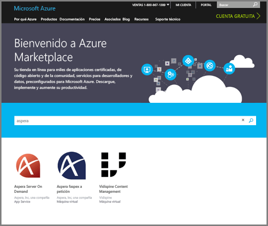
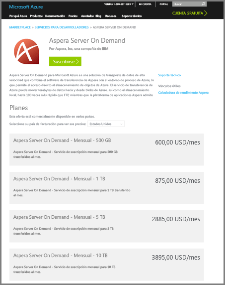
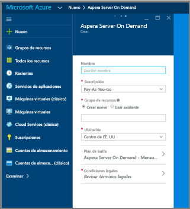
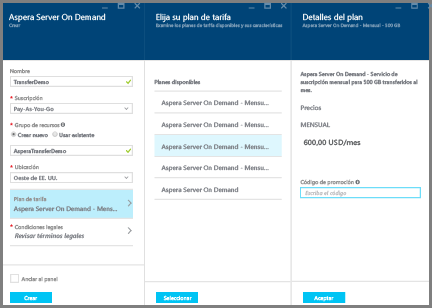
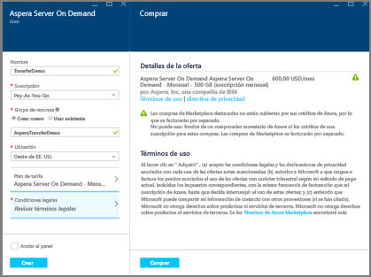
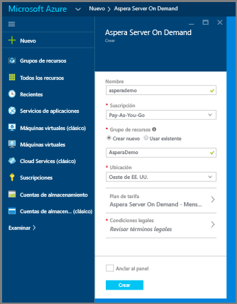
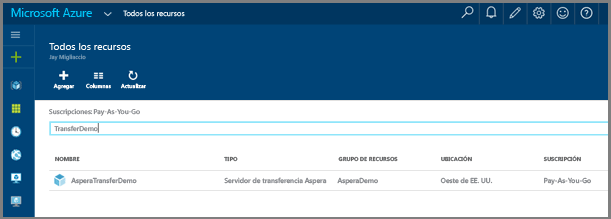
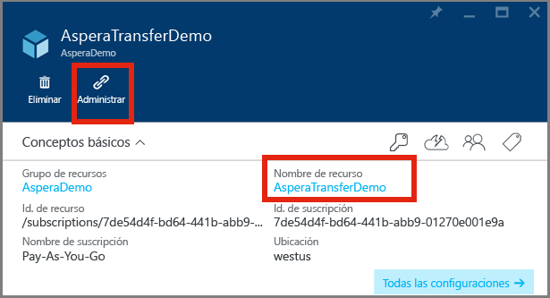

# Carga de archivos en una cuenta de Media Services mediante el servicio Aspera Server On Demand en Azure

## Información general

**Aspera** es un software de transferencia de archivos de alta velocidad. **Aspera Server On Demand** para Azure permite la carga y descarga a alta velocidad de archivos de gran tamaño directamente en Azure Blob Storage. Para obtener información acerca de **Aspera On Demand**, consulte el sitio de [Aspera Cloud](http://cloud.asperasoft.com/). 
  
**Aspera Server On Demand** para Azure se puede adquirir en [Azure Marketplace](https://azure.microsoft.com/en-us/marketplace/). Para realizar una compra de **Aspera Server On Demand** para Azure, inicie sesión en Azure Marketplace con su Windows Live ID.

Este tutorial le guía por los pasos para cargar archivos en una cuenta de almacenamiento que está asociada a una cuenta de Media Services mediante el servicio **Aspera Server On Demand** en Azure. 

Puede encontrar un ejemplo que muestra cómo usar las funciones de Azure con Aspera y Media Services [aquí](https://github.com/Azure-Samples/media-services-dotnet-functions-integration/tree/master/103-aspera-ingest).

>[!NOTE]
>Hay un límite para el tamaño máximo de archivo admitido para el procesamiento con los procesadores de multimedia (MP) de Azure Media Services. Consulte [este](media-services-quotas-and-limitations.md) artículo para obtener información más detallada acerca de la limitación de tamaño de archivo.
>

## Requisitos previos 

Para completar este tutorial, necesita:

* Un Windows Live ID
* Una [cuenta de Azure](https://azure.microsoft.com). Para obtener más información, consulte [Evaluación gratuita de Azure](https://azure.microsoft.com/pricing/free-trial/). 
* Una [cuenta de Azure Media Services](media-services-portal-create-account.md).

## Compra de Aspera On Demand para Azure

Una vez que ha iniciado sesión en Azure Marketplace, siga estos pasos básicos para completar la compra de Aspera On Demand para Azure.

1. Busque Aspera y seleccione "Server On Demand".

   

2. Revise los planes de suscripción y haga clic en "Sign Up" (registrarse)

   

3. Rellene los detalles específicos para su suscripción de Server on Demand.

   

4. Haga clic en el **Plan de tarifa** y seleccione el volumen mensual deseado en el subpanel. En el panel **Plan details** (Detalles de plan), seleccione **Aceptar**. En el panel **Elija su plan de tarifa**, haga clic en **Seleccionar**.

   

5. Haga clic en **Condiciones legales** para ver y aceptar las condiciones legales en el subpanel. Una vez que haya revisado las condiciones legales, haga clic en **Compra**.

   

6. Complete la compra haciendo clic en **Crear**.

   

7. El panel de Azure anunciará que está aprovisionando el servicio.  Una vez que se complete el aprovisionamiento, puede encontrar la nueva suscripción con una búsqueda en los recursos del nombre del servicio. Cuando haya encontrado el servicio, haga doble clic en él para iniciar el portal de administración del mismo.

   

8. Inicie el Portal de administración de Aspera. Una vez haya encontrado el nuevo servicio de Aspera, puede obtener acceso al portal de administración, haciendo clic en el servicio.  Se abrirá un nuevo panel. Desde dentro de dicho panel, tiene que hacer clic en el **Nombre de recurso** de su nuevo servicio.  En la siguiente captura de pantalla, el nombre del recurso es "AsperaTransferDemo". Al hacer clic en el nombre del recurso, se abre otro panel. En ese panel recién abierto, verá un vínculo "Manage" (Administrar). Haga clic en el vínculo "Manage" (Administrar) para iniciar el portal de administración de Aspera.

   

9. Al hacer clic en el vínculo para administrar le conducirá a la página de registro, lo que es necesario para tener acceso al servicio.

   

10. Llegados a este punto, debe tener acceso al portal de administración de servicios de Aspera, donde puede crear teclas de acceso, descargar licencias y clientes de Aspera, ver el uso y obtener información acerca de las API.

    En la captura de pantalla siguiente se muestra la creación del acceso. 

   

    La captura de pantalla siguiente muestra las interfaces de información de uso en el portal. 

   

## Carga de archivos con Aspera

1. Descargue e instale el software de cliente de Aspera:
    
    * [Complemento del explorador](http://downloads.asperasoft.com/connect2/)
    * [Cliente enriquecido](http://downloads.asperasoft.com/en/downloads/2)

2. Realice su primera transferencia. Para poder usar el cliente Aspera para transferir con el servicio de transferencia de Aspera, tiene que completar los siguientes pasos: 

    1. Cree una tecla de acceso, mediante el portal de Aspera.  
    2. Descargue, instale y obtenga licencia para el cliente Aspera (encontrará el software en el portal de Aspera).  

    >[!NOTE]
    >Lea la guía de cliente Aspera para obtener información sobre la configuración.
    
    3. Recupere alguna información de la cuenta de almacenamiento que está asociada a su cuenta de Azure Media utilizando [Azure Portal](https://portal.azure.com/). En concreto, nombre y clave y el nombre del contenedor de blob de almacenamiento en el que desea colocar el contenido. 

        * Para obtener la información de almacenamiento desde el portal: busque la cuenta de almacenamiento, haga clic en las teclas de acceso y copie el nombre y la clave de la cuenta.
        * Para obtener el nombre del contenedor: busque la cuenta de almacenamiento, seleccione **Blobs**, seleccione el nombre del contenedor en el que desea cargar el contenido. 

    A continuación se muestra la captura de pantalla de **Connection Manager** (Administrador de conexión) de cliente Aspera en donde tiene que especificar el tipo de almacenamiento "Azure" y las credenciales, así como el contenedor de blobs.

    

## Recursos

En este artículo se mencionaron los siguientes recursos. 

* [Complemento del explorador de Connect](http://downloads.asperasoft.com/connect2/)
* [Guía de Connect](http://downloads.asperasoft.com/en/documentation/8)
* [Cliente Aspera](http://downloads.asperasoft.com/en/downloads/2)
* [Guía de cliente](http://downloads.asperasoft.com/en/documentation/2)

## pasos siguientes

Ahora puede [copiar blobs de una cuenta de almacenamiento a una cuenta de AMS](media-services-copying-existing-blob.md#copy-blobs-from-a-storage-account-into-an-ams-account).

## Rutas de aprendizaje de Media Services
[!INCLUDE [media-services-learning-paths-include](../../includes/media-services-learning-paths-include.md)]

## Envío de comentarios
[!INCLUDE [media-services-user-voice-include](../../includes/media-services-user-voice-include.md)]

