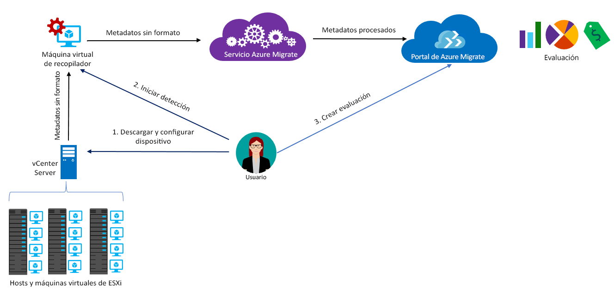

# Acerca de Azure Migrate

El servicio Azure Migrate evalúa las cargas de trabajo locales para su migración a Azure. El servicio evalúa la idoneidad de migración y el ajuste de tamaño basado en el rendimiento, y proporciona estimaciones del costo que supone la ejecución de máquinas locales en Azure. Si está pensando en migrar mediante lift-and-shift o se encuentra en las primeras fases de la evaluación de la migración, este es el servicio que debe elegir. Tras la evaluación, puede usar servicios como Azure Site Recovery y Azure Database Migration para migrar las máquinas a Azure.

> [!NOTE]
> Azure Migrate está actualmente en versión preliminar y admite cargas de trabajo de producción.

## ¿Por qué usar Azure Migrate?

Azure Migrate le ayuda a:

- **Evaluar la preparación de Azure**: evalúe si las máquinas locales son apropiadas para ejecutarse en Azure. 
- **Obtener recomendaciones de tamaño**: averigüe el tamaño recomendado de las máquinas virtuales de Azure en función del historial de rendimiento de las máquinas virtuales locales. 
- **Calcular los costos mensuales**: calcule el costo estimado de la ejecución de máquinas locales en Azure.  
- **Migrar con una confianza alta**: vea las dependencias de los equipos locales para crear los grupos de equipos que va a evaluar y migrar a la vez. Puede ver con precisión las dependencias de una máquina específica o de todas las máquinas de un grupo.

## Limitaciones actuales

- Actualmente, pueden evaluar máquinas virtuales (VM) VMware locales para la migración a máquinas virtuales de Azure.

> [!NOTE]
> La compatibilidad con Hyper-V está en el mapa de ruta y se habilitará próximamente. Mientras tanto, se recomienda usar [Azure Site Recovery Deployment Planner](http://aka.ms/asr-dp-hyperv-doc) para planear la migración de las cargas de trabajo de Hyper-V. 

- Puede detectar hasta 1000 máquinas virtuales en una sola detección y hasta 1500 en un solo proyecto. Además, puede evaluar hasta 400 máquinas virtuales en una valoración única. Si necesita detectar o evaluar más, puede aumentar el número de detecciones o valoraciones. [Más información](how-to-scale-assessment.md).
- La máquina virtual que desea evaluar la debe administrar vCenter Server, versión 5.5, 6.0 o 6.5.
- Los proyectos de Azure Migrate solo se pueden crear en la región Oeste del centro de EE. UU. Sin embargo, esto no afecta a su capacidad para planear la migración de otra ubicación de Azure de destino. La ubicación del proyecto de migración solo se usa para almacenar los metadatos que se detectan desde el entorno local.
- Azure Migrate solo admite discos administrados para la valoración de la migración.

## ¿Por qué conceptos tengo qué pagar?

Azure Migrate está disponible sin costo adicional. Sin embargo, durante la versión preliminar pública, se aplicarán un costo adicional por el uso de las funcionalidades de visualización de dependencias. Para admitir la [visualización de dependencias](concepts-dependency-visualization.md), Azure Migrate crea un área de Log Analytics de forma predeterminada. Si usa la visualización de dependencias, o el área de trabajo fuera de Azure Migrate, se le cobrará dicho uso. [Más información](https://azure.microsoft.com/en-us/pricing/details/insight-analytics/) acerca de los costos. Cuando el servicio esté disponible de forma general, no se realizarán cobrará el uso de las funcionalidades de visualización de dependencias.

## ¿Qué es una evaluación?

Una evaluación le ayuda a identificar si las máquinas virtuales locales son idóneas para Azure, le ofrece recomendaciones sobre el tamaño adecuado y calcula el costo de la ejecución de las máquinas virtuales en Azure. Las evaluaciones se basan en las propiedades que se resumen en la tabla siguiente. Puede modificar estas propiedades en el portal de Azure Migrate. 

**Propiedad** | **Detalles**
--- | ---
**Ubicación de destino** | La ubicación de Azure a la que desea realizar la migración. De forma predeterminada, la ubicación de destino es la región Oeste de EE. UU. 2. 
**Redundancia de almacenamiento** | El tipo de almacenamiento que las máquinas virtuales de Azure usarán después de la migración. El valor predeterminado es LRS.
**Panes de tarifa** | La evaluación tiene en cuenta si está inscritos en Software Assurance y puede usar la [Ventaja híbrida de Azure](https://azure.microsoft.com/pricing/hybrid-use-benefit/). También tiene en cuenta las ofertas de Azure debe aplicar y le permite especificar los descuentos específicos de la suscripción (%), que obtendrá además de la oferta. 
**Plan de tarifa** | Puede especificar el [plan de tarifa (Básico o Estándar)](../virtual-machines/windows/sizes-general.md) de las máquinas virtuales de Azure. Esto le ayudará a migrar a la familia de máquinas virtuales de Azure adecuada, en función de si se encuentra en un entorno de producción. De forma predeterminada se usa el plan [Estándar](../virtual-machines/windows/sizes-general.md).
**Historial de rendimiento** | De forma predeterminada, Azure Migrate usa un mes del historial para evaluar el rendimiento de las máquinas locales, con un valor de percentil del 95 %. Este valor se puede modificar.
**Factor de confort** | Azure Migrate tiene en cuenta un búfer (factor de confort) durante la evaluación. Dicho búfer se aplica además de los datos de uso de la máquina en las máquinas virtuales (CPU, memoria, disco y red). El factor de confort se tiene en cuenta en problemas como el uso estacional, un historial de rendimiento corto y los posibles aumentos en el uso futuro.   Por ejemplo, una máquina virtual de 10 núcleos con un uso del 20 % normalmente genera una máquina virtual de 2 núcleos. Sin embargo, con un factor de confort de 2.0 x, el resultado es una máquina virtual de 4 núcleos. El valor de confort predeterminado es 1.3 x.

## ¿Cómo funciona Azure Migrate?

1.  Cree un proyecto de Azure Migrate.
2.  Azure Migrate usa una máquina virtual local, llamada el dispositivo recopilador, para detectar información acerca de las máquinas locales. Para crear el dispositivo, descargue el archivo de instalación en formato Open Virtualization Appliance (.ova) e impórtelo como una máquina virtual en la instancia local de vCenter Server.
3.  Para conectarse a la máquina virtual, use la conexión de la consola en vCenter Server, especifique una nueva contraseña para la máquina virtual durante la conexión y, a continuación, ejecute el dispositivo recopilador en la máquina virtual para iniciar la detección.
4.  El recopilador recoge metadatos de máquinas virtuales con los de PowerCLI de VMware. La detección se realiza sin agente y no instala nada en los hosts ni en las máquinas virtuales de VMware. Los metadatos recopilados incluyen información acerca de la máquina virtual (núcleos, memoria, discos, tamaños de disco y adaptadores de red). También recopila datos de rendimiento de las máquinas virtuales, incluyendo el uso de la CPU y de la memoria, el IOPS de disco, el rendimiento del disco (MBps) y la red de salida (MBps).
5.  Los metadatos se insertan en el proyecto de Azure Migrate. Puede verlo en Azure Portal.
6.  Para la evaluación, las máquinas virtuales detectadas se reúnen en grupos. Por ejemplo, se pueden agrupar las máquinas virtuales que ejecutan la misma aplicación. Para obtener un agrupamiento más preciso, puede usar la visualización de dependencias para ver las dependencias de una máquina específica o de todas las máquinas de un grupo, y refinar el grupo.
7.  Una vez formado el grupo, se crea una evaluación para el grupo. 
8.  Una vez finalizada la evaluación, se puede ver en el portal, o bien descargar en formato de Excel.

  

## ¿Cuáles son los requisitos de puertos?

La tabla resumen los puertos necesarios para las comunicaciones de Azure Migrate.

|Componente          |Para comunicarse con     |Puerto requerido  |Motivo   |
|-------------------|------------------------|---------------|---------|
|Recopilador          |Servicio Azure Migrate   |TCP 443        |El recolector se conecta al servicio a través del puerto 443 de SSL|
|Recopilador          |vCenter Server          |Valor predeterminado 9443   | De manera predeterminada el recopilador se conecta a vCenter Server en el puerto 9443. Si el servidor escucha otro puerto, debe configurarse como puerto de salida en la máquina virtual del recopilador. |
|Máquina virtual local     | Área de trabajo de Operations Management Suite (OMS)          |[TCP 443](../log-analytics/log-analytics-windows-agent.md) |El agente MMA usa TCP 443 para conectarse a Log Analytics. Este puerto solo se necesita si se usa la característica de visualización de dependencias y se instala Microsoft Monitoring Agent (MMA). |

  
## ¿Qué pasa después de la evaluación?

Una vez que haya evaluado las máquinas locales para la migración con el servicio Azure Migrate, puede usar un par de herramientas para realizar la migración:

- **Azure Site Recovery**: puede usar Azure Site Recovery para realizar la migración a Azure, como se indica a continuación:
  - Prepare los recursos de Azure, entre los que se incluyen una suscripción a Azure, una red virtual de Azure y una cuenta de almacenamiento.
  - Prepare los servidores VMware locales para la migración. Compruebe los requisitos de compatibilidad de VMware con Site Recovery, prepare los servidores de VMware para la detección y prepárelos para instalar el servicio Site Recovery Mobility en las máquinas virtuales que desea migrar. 
  - Configure la migración. Configure un almacén de Recovery Services, los valores de origen y destino de la migración y una directiva de replicación, y habilite la replicación. Puede ejecutar una un simulacro de recuperación ante desastres para comprobar que la migración de una máquina virtual a Azure funciona correctamente.
  - Ejecute una conmutación por error para migrar máquinas locales a Azure. 
  - Para [más información](../site-recovery/tutorial-migrate-on-premises-to-azure.md), consulte el tutorial de migración de Site Recovery.

- **Azure Database Migration**: si las máquinas locales ejecutan una base de datos como SQL Server, MySQL u Oracle, puede usar Azure Database Migration Service para migrarlas a Azure. [Más información](https://azure.microsoft.com/campaigns/database-migration/).

## pasos siguientes 
[Siga un tutorial](tutorial-assessment-vmware.md) para crear una evaluación de una máquina virtual de VMware local.