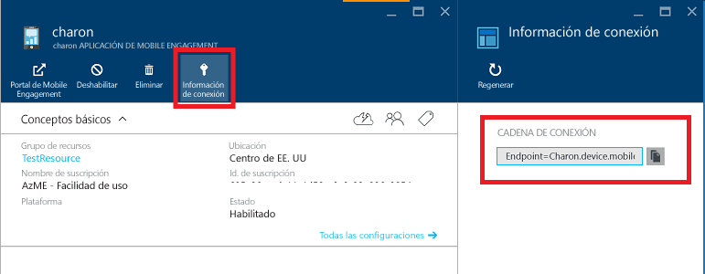

# Introducción a Azure Mobile Engagement para aplicaciones Android
[!INCLUDE [Hero tutorial switcher](../../includes/mobile-engagement-hero-tutorial-switcher.md)]

En este tema se muestra cómo usar Azure Mobile Engagement para comprender el uso de su aplicación y cómo enviar notificaciones push a los usuarios segmentados de una aplicación de Android.
En este tutorial se demuestra el escenario de difusión sencillo con Mobile Engagement. En él, creará una aplicación vacía de Android que recopile datos básicos y reciba notificaciones push mediante Google Cloud Messaging (GCM).

## Requisitos previos
Para completar este tutorial se requieren la [Herramientas para desarrolladores de Android](https://developer.android.com/sdk/index.html), que incluyen el entorno de desarrollo integrado de Android Studio y la última plataforma de Android.

Descargue el [SDK de Android para Mobile Engagement](https://aka.ms/vq9mfn).

> [!IMPORTANT]
> Para completar este tutorial, deberá tener una cuenta activa de Azure. En caso de no tener cuenta, puede crear una de evaluación gratuita en tan solo unos minutos. Para obtener más información, consulte [Evaluación gratuita de Azure](https://azure.microsoft.com/pricing/free-trial/?WT.mc_id=A0E0E5C02&amp;returnurl=http%3A%2F%2Fazure.microsoft.com%2Fen-us%2Fdocumentation%2Farticles%2Fmobile-engagement-android-get-started).
>
>

## Configuración de Mobile Engagement para una aplicación Android
[!INCLUDE [Create Mobile Engagement App in Portal](../../includes/mobile-engagement-create-app-in-portal-new.md)]

## Conectar la aplicación al backend de Mobile Engagement
En este tutorial se presenta una "integración básica", que es el conjunto mínimo necesario para recopilar los datos y enviar una notificación de inserción. Va a crear una aplicación básica con Android Studio para demostrar la integración.

La documentación de integración completa se puede encontrar en la [integración del SDK de Android para Mobile Engagement](mobile-engagement-android-sdk-overview.md).

### Creación de un proyecto de Android
1. Inicie **Android Studio** y, en el menú emergente, seleccione **Start a new Android Studio project** (Iniciar un nuevo proyecto de Android Studio).

    ![][1]
2. Especifique el nombre de la aplicación y el dominio de la compañía. Tome nota de los datos que especifique pues los necesitará más adelante. Haga clic en **Next**.

    ![][2]
3. Seleccione el factor de forma de destino y el nivel de la AP, y haga clic en **Siguiente**.

   > [!NOTE]
   > Compromiso de Mobile requiere el nivel de API mínimo de 10 (2.3.3 Android).
   >
   >

    ![][3]
4. Seleccione **Blank Activity** (Actividad en blanco) aquí, que es la única pantalla para esta aplicación, y haga clic en **Siguiente**.

    ![][4]
5. Por último, deje el valor predeterminado como está y haga clic en **Finalizar**.

    ![][5]

Ahora Android Studio crea la aplicación de demostración en la que integraremos Mobile Engagement.

### Incluir la biblioteca de SDK en el proyecto
1. Descargue el [SDK de Android para Mobile Engagement](https://aka.ms/vq9mfn).
2. Extraiga el archivo a una carpeta en el equipo.
3. Identifique la biblioteca .jar para la versión actual de este SDK y cópiela en el Portapapeles.

      ![][6]
4. Vaya a la sección **Proyecto** (1) y pegue el .jar en la carpeta libs (2).

      ![][7]
5. Para cargar la biblioteca, sincronice el proyecto.

      ![][8]

### Conectar la aplicación al back-end de Mobile Engagement mediante la cadena de conexión
1. Copie las siguientes líneas de código en la creación de la actividad (debe realizarse solo en un lugar de la aplicación, normalmente la actividad principal). Para esta aplicación de ejemplo, abra MainActivity en la carpeta src -> main -> java y agregue lo siguiente:

        EngagementConfiguration engagementConfiguration = new EngagementConfiguration();
        engagementConfiguration.setConnectionString("Endpoint={appCollection}.{domain};AppId={appId};SdkKey={sdkKey}");
        EngagementAgent.getInstance(this).init(engagementConfiguration);
2. Resuelva las referencias pulsando Alt + Intro o agregando las siguientes instrucciones de importación:

        import com.microsoft.azure.engagement.EngagementAgent;
        import com.microsoft.azure.engagement.EngagementConfiguration;
3. Vuelva a Azure Portal y en la página **Información de conexión** de la aplicación y copie la **Cadena de conexión**.

      

4. Péguelo en el parámetro `setConnectionString`, reemplazando la cadena completa que se muestra en el código siguiente:

        engagementConfiguration.setConnectionString("Endpoint=my-company-name.device.mobileengagement.windows.net;SdkKey=********************;AppId=*********");

### Agregar permisos y una declaración de servicio
1. Agregue estos permisos al archivo Manifest.xml del proyecto inmediatamente anterior a la etiqueta `<application>`:

        <uses-permission android:name="android.permission.INTERNET"/>
        <uses-permission android:name="android.permission.ACCESS_NETWORK_STATE"/>
        <uses-permission android:name="android.permission.WRITE_EXTERNAL_STORAGE"/>
        <uses-permission android:name="android.permission.RECEIVE_BOOT_COMPLETED" />
        <uses-permission android:name="android.permission.VIBRATE" />
        <uses-permission android:name="android.permission.DOWNLOAD_WITHOUT_NOTIFICATION"/>
2. Agregue este código entre las etiquetas `<application>` y `</application>` para declarar el servicio del agente:

        <service
             android:name="com.microsoft.azure.engagement.service.EngagementService"
             android:exported="false"
             android:label="<Your application name>"
             android:process=":Engagement"/>
3. En el código que pegó, reemplace `"<Your application name>"` en la etiqueta que aparece en el menú **Configuración** donde puede ver los servicios que se ejecutan en el dispositivo. Puede agregar la palabra "Servicio" a la etiqueta, por ejemplo.

### Enviar una pantalla a Mobile Engagement
Para comenzar a enviar datos y asegurarse de que los usuarios estén activos, debe enviar al menos una pantalla (Actividad) al back-end de Mobile Engagement.

Vaya a **MainActivity.java** y agregue la siguiente línea para reemplazar la clase base de **MainActivity** en **EngagementActivity**:

    public class MainActivity extends EngagementActivity {

> [!NOTE]
> Si la clase base no es *Activity*, consulte [Reporting Options with Engagement on Android](mobile-engagement-android-advanced-reporting.md) (Opciones de informes con Engagement en Android) sobre cómo heredar de clases diferentes.
>
>

Convierta en comentario la línea siguiente para este escenario de ejemplo simple:

    // setSupportActionBar(toolbar);

Si desea mantener `ActionBar` en la aplicación, consulte [Opciones de informes con Engagement en Android](mobile-engagement-android-advanced-reporting.md).

## Conectar la aplicación con la supervisión en tiempo real
[!INCLUDE [Connect app with real-time monitoring](../../includes/mobile-engagement-connect-app-with-monitor.md)]

## Habilitación de las notificaciones push y la mensajería en aplicación
Durante una campaña, Mobile Engagement permite interactuar y llegar por REACH a los usuarios mediante notificaciones push y mensajería en la aplicación. Este módulo se denomina REACH en el portal de Mobile Engagement.
En la sección siguiente se instala la aplicación para recibirlos.

### Copia de recursos SDK en el proyecto
1. Vuelva al contenido de descarga del SDK y copie la carpeta **res** .

    ![][10]
2. Vuelva a Android Studio, seleccione el directorio **main** de los archivos de proyecto y luego péguelo para agregar los recursos al proyecto.

    ![][11]

[!INCLUDE [Enable Google Cloud Messaging](../../includes/mobile-engagement-enable-google-cloud-messaging.md)]

[!INCLUDE [Enable in-app messaging](../../includes/mobile-engagement-android-send-push.md)]

[!INCLUDE [Send notification from portal](../../includes/mobile-engagement-android-send-push-from-portal.md)]

## pasos siguientes
Vaya a [SDK de Android](mobile-engagement-android-sdk-overview.md) para obtener información detallada sobre la integración de SDK.

<!-- Images. -->
[1]: ./media/mobile-engagement-android-get-started/android-studio-new-project.png
[2]: ./media/mobile-engagement-android-get-started/android-studio-project-props.png
[3]: ./media/mobile-engagement-android-get-started/android-studio-project-props2.png
[4]: ./media/mobile-engagement-android-get-started/android-studio-add-activity.png
[5]: ./media/mobile-engagement-android-get-started/android-studio-activity-name.png
[6]: ./media/mobile-engagement-android-get-started/sdk-content.png
[7]: ./media/mobile-engagement-android-get-started/paste-jar.png
[8]: ./media/mobile-engagement-android-get-started/sync-project.png
[9]: ./media/mobile-engagement-android-get-started/app-connection-info-page.png
[10]: ./media/mobile-engagement-android-get-started/copy-resources.png
[11]: ./media/mobile-engagement-android-get-started/paste-resources.png
