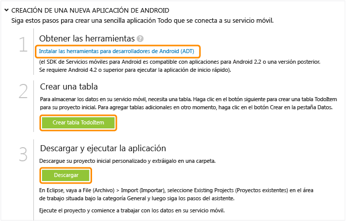

<properties pageTitle="Get Started with Azure Mobile Services for Android apps" metaKeywords="Azure android application, mobile service android, getting started Azure android, azure droid, getting started droid windows" description="Follow this tutorial to get started using Azure Mobile Services for Android development." metaCanonical="" services="" documentationCenter="Mobile" title="Get started with Mobile Services" authors="glenga" solutions="" manager="" editor="" />

Introducción a los Servicios móviles
====================================

[Tienda Windows](/en-us/documentation/articles/mobile-services-windows-store-get-started "Tienda Windows") [Windows Phone](/en-us/documentation/articles/mobile-services-windows-phone-get-started "Windows Phone") [iOS](/en-us/documentation/articles/mobile-services-ios-get-started "iOS") [Android](/en-us/documentation/articles/mobile-services-android-get-started "Android") [HTML](/en-us/documentation/articles/mobile-services-html-get-started "HTML") [Xamarin.iOS](/en-us/documentation/articles/partner-xamarin-mobile-services-ios-get-started "Xamarin.iOS") [Xamarin.Android](/en-us/documentation/articles/partner-xamarin-mobile-services-android-get-started "Xamarin.Android") [Sencha](/en-us/documentation/articles/partner-sencha-mobile-services-get-started/ "Sencha") [PhoneGap](/en-us/documentation/articles/mobile-services-javascript-backend-phonegap-get-started/ "PhoneGap")

[Back-end de .NET](/en-us/documentation/articles/mobile-services-dotnet-backend-android-get-started/ "Back-end de .NET") | [Back-end de JavaScript](/en-us/documentation/articles/mobile-services-android-get-started/ "Back-end de JavaScript")

En este tutorial se muestra cómo agregar un servicio back-end basado en la nube a una aplicación Android mediante los Servicios móviles de Azure. Con este tutorial creará tanto un servicio móvil nuevo como una aplicación simple de *lista de pendientes* que almacena datos de aplicación en el servicio móvil nuevo.

La siguiente captura de pantalla muestra la aplicación final:

[Ver el tutorial (en inglés)](http://channel9.msdn.com/Series/Windows-Azure-Mobile-Services/Android-Support-in-Windows-Azure-Mobile-Services) [Reproducir vídeo (en inglés)](http://channel9.msdn.com/Series/Windows-Azure-Mobile-Services/Android-Support-in-Windows-Azure-Mobile-Services)7:26

Para completar este tutorial se requieren las [herramientas para desarrolladores de Android (en inglés)](https://go.microsoft.com/fwLink/p/?LinkID=280125) (ADT), que incluyen el entorno de desarrollo integrado (IDE) Eclipse, el complemento para las ADT y la última plataforma Android. Se requiere Android 4.2 o versiones posteriores.

El proyecto de inicio rápido descargado contiene el SDK de Servicios móviles para Android. Si bien este proyecto requiere Android 4.2 o versiones posteriores, el SDK mencionado tan solo requiere Android 2.2 o una versión posterior.

**Nota:**

Necesita una cuenta de Azure para completar este tutorial. En caso de no tener ninguna, puede crear una cuenta de evaluación gratuita en tan solo unos minutos. Para obtener más información, consulte [Evaluación gratuita de Azure](http://www.windowsazure.com/en-us/pricing/free-trial/?WT.mc_id=AE564AB28).

Creación de un servicio móvil
-----------------------------

[WACOM.INCLUDE [mobile-services-create-new-service](../includes/mobile-services-create-new-service.md)]
## Creación de una aplicaciónCreación de una aplicación Android
---------------------------------------------------------------------------------------------

Una vez que haya creado el servicio móvil, podrá seguir una introducción rápida en el Portal de administración para crear una nueva aplicación o modificar una ya existente a fin de conectarla a dicho servicio.

En esta sección se creará una nueva aplicación Android que se conecta al servicio móvil.

1.  En el Portal de administración, haga clic en **Servicios móviles** y, a continuación, en el servicio móvil que acaba de crear.

2.  En la pestaña de inicio rápido, haga clic en **Android** bajo **Choose platform** y expanda **Create a new Android app**.

	![][6]

	Con esto se muestran los tres sencillos pasos requeridos para crear una aplicación Android conectada al servicio móvil.

	

1.  Si aún no lo ha hecho, descargue las [herramientas para desarrolladores de Android (en inglés)](https://go.microsoft.com/fwLink/p/?LinkID=280125) e instálelas en el equipo local o la máquina virtual.

2.  Haga clic en **Create TodoItem table** para crear una tabla donde almacenar datos de la aplicación.

3.  En **Download and run your app**, haga clic en **Download**.

De este modo se descarga el proyecto para la aplicación de *lista de pendientes* de muestra que está conectada al servicio móvil. Guarde el archivo comprimido del proyecto en el equipo local y anote dónde lo guardó.

Ejecución de la aplicación Android
----------------------------------

La etapa final de este tutorial consiste en crear y ejecutar la aplicación nueva.

1.  Desplácese a la ubicación donde se guardaron los archivos del proyecto comprimidos y expanda dichos archivos en el equipo.

2.  En Eclipse, haga clic en **File**, **Import**, expanda **Android**, haga clic en **Existing Android Code into Workspace** y, por último, en **Next.**

	

1.  Haga clic en **Browse**, desplácese a la ubicación de los archivos de proyecto expandidos, haga clic en **OK**, asegúrese de que el proyecto TodoActivity esté marcado y, a continuación, haga clic en **Finish**.

	

    De esta forma se importan los archivos del proyecto en el área de trabajo.

	

1.  Haga clic en la opción **Run** del menú **Run** para iniciar el proyecto en el emulador de Android.

    **Nota:**

    Para poder ejecutar el proyecto en el emulador de Android, debe definir al menos un dispositivo virtual de Android (AVD). Use el administrador AVD para crear y administrar estos dispositivos.

2.  En la aplicación, escriba un texto significativo, como *Realice el tutorial* y, a continuación, haga clic en **Add**.

	![][10]

	Esta acción envía una solicitud POST al nuevo servicio móvil hospedado en Azure. Los datos de la solicitud se insertan en la tabla TodoItem. El servicio móvil devuelve los elementos almacenados en la tabla y los datos se muestran en la lista.

    **Nota:**

    Puede revisar el código de acceso al servicio móvil para consultar e insertar datos; este se encuentra en el archivo ToDoActivity.java.

3.  Nuevamente en el Portal de administración, haga clic en la pestaña **Data** y, a continuación, en la tabla **TodoItems**.

	![][11]

	Esto le permite examinar los datos que la aplicación inserta en la tabla.

	![][12]

Pasos siguientes
----------------

Ahora que completó el inicio rápido, aprenda a realizar importantes tareas adicionales en los Servicios móviles:

-   [Introducción a los datos](/en-us/develop/mobile/tutorials/get-started-with-data-android)
    Obtenga más información sobre almacenar y consultar datos con los Servicios móviles.

-   [Introducción a la autenticación](/en-us/develop/mobile/tutorials/get-started-with-users-android)
    Aprenda a autenticar a los usuarios de su aplicación con un proveedor de identidades.

-   [Introducción a las notificaciones de inserción](/en-us/develop/mobile/tutorials/get-started-with-push-android)
    Aprenda a enviar una notificación de inserción muy básica a la aplicación.

<!-- Anchors. -->
[Getting started with Mobile Services]:#getting-started
[Create a new mobile service]:#create-new-service
[Define the mobile service instance]:#define-mobile-service-instance
[Next Steps]:#next-steps

<!-- Images. -->
[0]: ./media/mobile-services-android-get-started/mobile-quickstart-completed-android.png

[6]: ./media/mobile-services-android-get-started/mobile-portal-quickstart-android.png
[7]: ./media/mobile-services-android-get-started/mobile-quickstart-steps-android.png
[8]: ./media/mobile-services-android-get-started/mobile-eclipse-quickstart.png

[10]: ./media/mobile-services-android-get-started/mobile-quickstart-startup-android.png
[11]: ./media/mobile-services-android-get-started/mobile-data-tab.png
[12]: ./media/mobile-services-android-get-started/mobile-data-browse.png

[14]: ./media/mobile-services-android-get-started/mobile-services-import-android-workspace.png
[15]: ./media/mobile-services-android-get-started/mobile-services-import-android-project.png

<!-- URLs. -->
[Get started with data]: /en-us/develop/mobile/tutorials/get-started-with-data-android
[Get started with authentication]: /en-us/develop/mobile/tutorials/get-started-with-users-android
[Get started with push notifications]: /en-us/develop/mobile/tutorials/get-started-with-push-android
[Android SDK]: https://go.microsoft.com/fwLink/p/?LinkID=280125
[Mobile Services Android SDK]: https://go.microsoft.com/fwLink/p/?LinkID=266533

[Management Portal]: https://manage.windowsazure.com/