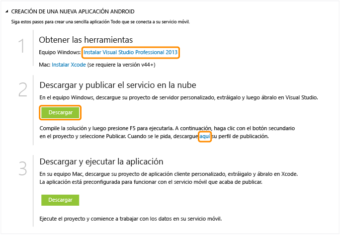

<properties pageTitle="Get Started with Azure Mobile Services for iOS apps" metaKeywords="Azure iOS application, mobile service iOS, getting started Azure iOS" description="Follow this tutorial to get started using Azure Mobile Services for iOS development. " metaCanonical="" services="" documentationCenter="Mobile" title="Get started with Mobile Services" authors="glenga" solutions="" manager="" editor="" />

Introducción a los Servicios móviles
====================================

[C\# para Tienda Windows](/en-us/documentation/articles/mobile-services-dotnet-backend-windows-store-dotnet-get-started "C# para Tienda Windows") [JavaScript para Tienda Windows](/en-us/documentation/articles/mobile-services-dotnet-backend-windows-store-javascript-get-started "JavaScript para Tienda Windows") [Windows Phone](/en-us/documentation/articles/mobile-services-dotnet-backend-windows-phone-get-started "Windows Phone") [iOS](/en-us/documentation/articles/mobile-services-dotnet-backend-ios-get-started "iOS") [Android](/en-us/documentation/articles/mobile-services-dotnet-backend-android-get-started "Android")

[Back-end de .NET](/en-us/documentation/articles/mobile-services-dotnet-backend-ios-get-started/ "Back-end de .NET") | [Back-end de JavaScript](/en-us/documentation/articles/mobile-services-ios-get-started/ "Back-end de JavaScript")

En este tutorial se muestra cómo agregar un servicio back-end basado en la nube a una aplicación de iOS con los Servicios móviles de Azure. Con este tutorial creará tanto un servicio móvil nuevo como una aplicación simple de *Lista de pendientes* que almacena datos de la aplicación en el servicio móvil nuevo. El servicio móvil que va a crear utiliza los lenguajes compatibles de .NET con Visual Studio para la lógica de negocios de servidor y para administrar el servicio móvil. Si desea crear un servicio móvil que le permita escribir su lógica de negocios de servidor en JavaScript, consulte la [versión back-end de JavaScript](/en-us/documentation/articles/mobile-services-ios-get-started) de este tema.

La siguiente captura de pantalla muestra la aplicación final:

Para completar este tutorial necesita XCode 4.5 y iOS 5.0 o versiones posteriores.

**Nota:**

Para completar este tutorial, deberá tener una cuenta de Azure. En caso de no tener ninguna, puede crear una cuenta de evaluación gratuita en tan solo unos minutos. Para obtener más información, consulte [Evaluación gratuita de Azure](http://www.windowsazure.com/en-us/pricing/free-trial/?WT.mc_id=AE564AB28&returnurl=http%3A%2F%2Fwww.windowsazure.com%2Fen-us%2Fdevelop%2Fmobile%2Ftutorials%2Fget-started-ios%2F).

Creación de un servicio móvil
-----------------------------

[WACOM.INCLUDE [mobile-services-create-new-service](../includes/mobile-services-create-new-service.md)]

Descarga del servicio móvil en un equipo local
----------------------------------------------

Ahora que ha creado el servicio móvil, descargue un proyecto de servicio móvil personalizado que pueda ejecutar en un equipo local o una máquina virtual.

1.  Haga clic en el servicio móvil que acaba de crear y, a continuación, en la pestaña de inicio rápido, haga clic en **iOS** debajo de **Choose platform** y expanda **Crear una nueva aplicación iOS**.

    

2.  Si todavía no lo ha hecho, descargue e instale Visual Studio Professional 2013 o una versión posterior.

3.  Haga clic en **Download** debajo de **Descargar y publicar el servicio en la nube**.

    De este modo se descarga el proyecto de Visual Studio que implementa el servicio móvil. Guarde el archivo comprimido del proyecto en el equipo local y anote dónde lo guardó.

4.  Además, descargue el perfil de publicación, guarde el archivo descargado en el equipo local y tome nota de dónde lo ha guardado.

Prueba del servicio móvil
-------------------------

[WACOM.INCLUDE [mobile-services-dotnet-backend-test-local-service](../includes/mobile-services-dotnet-backend-test-local-service.md)]

Publicación del servicio móvil
------------------------------

[WACOM.INCLUDE [mobile-services-dotnet-backend-publish-service](../includes/mobile-services-dotnet-backend-publish-service.md)]

Creación de una nueva aplicación iOS
------------------------------------

En esta sección, creará una aplicación de iOS que se conecta al servicio móvil.

1.  En el Portal de administración, haga clic en **Servicios móviles** y, a continuación, en el servicio móvil que acaba de crear.

2.  En la pestaña de inicio rápido, haga clic en **iOS** en **Choose platform** y, a continuación, expanda **Crear una nueva aplicación iOS**.

3.  Si todavía no lo ha hecho, descargue e instale [Xcode](https://go.microsoft.com/fwLink/p/?LinkID=266532) v4.4 o una versión posterior.

4.  Haga clic en **Create TodoItems table** para crear una tabla donde almacenar datos de la aplicación.

5.  En **Descargar y ejecutar la aplicación**, haga clic en **Descargar**.

	De este modo se descarga el proyecto para la aplicación de *lista de pendientes* de muestra que está conectada al servicio móvil, además del SDK de iOS para Servicios móviles. Guarde el archivo comprimido del proyecto en el equipo local y anote dónde lo guardó.

Ejecución de la nueva aplicación de iOS
---------------------------------------

[WACOM.INCLUDE [mobile-services-ios-run-app](../includes/mobile-services-ios-run-app.md)]

Con esto se muestra cómo ejecutar la nueva aplicación cliente contra el servicio móvil que se ejecuta en Azure. Antes de que pueda probar la aplicación iOS con el servicio móvil en ejecución en un equipo local, debe configurar el firewall y el servidor web para permitir el acceso desde su equipo de desarrollo iOS. Para obtener más información, consulte [Configuración del servidor web local para permitir conexiones a un servicio móvil local](/en-us/documentation/articles/mobile-services-dotnet-backend-how-to-configure-iis-express).

