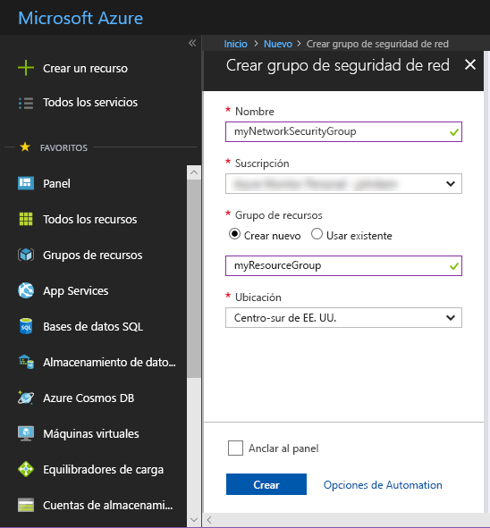
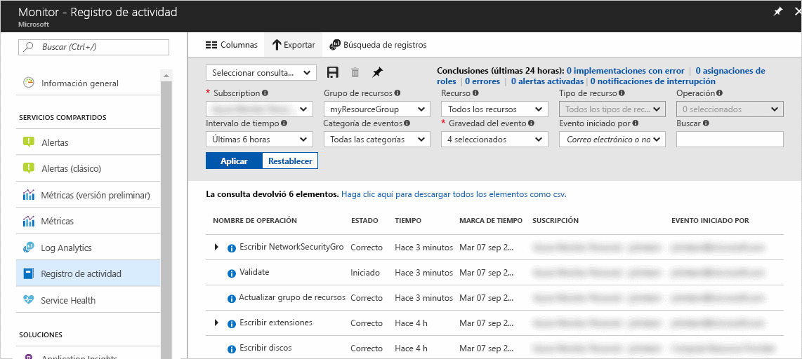
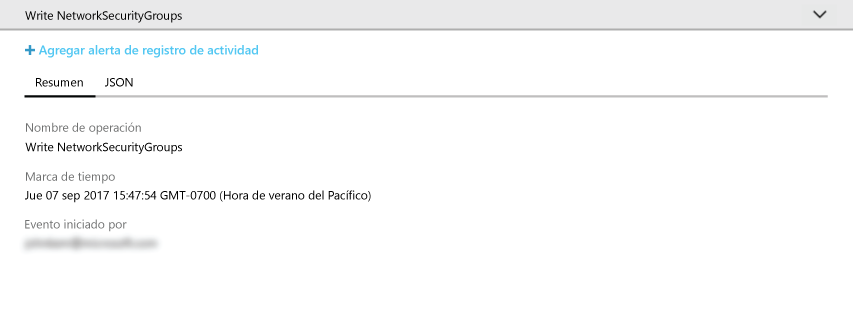
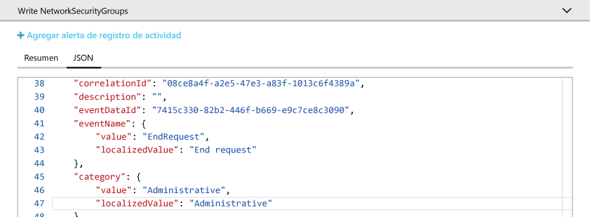
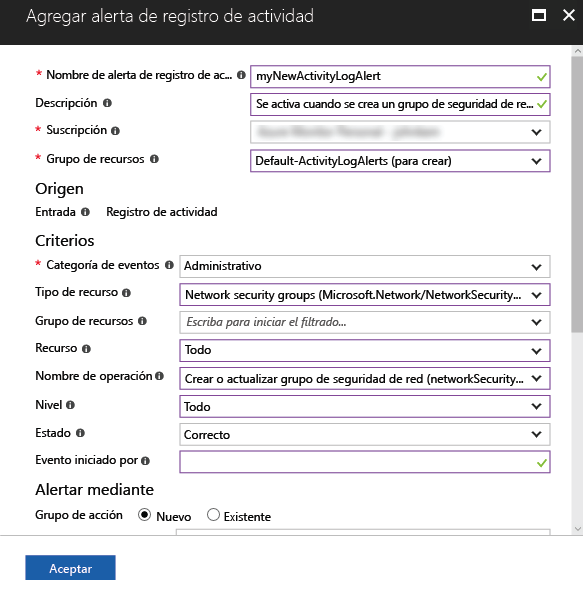
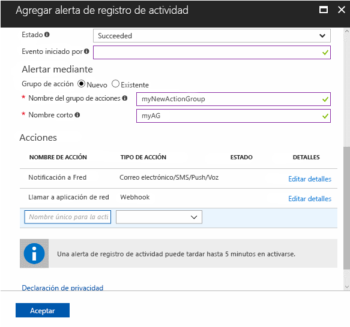

# Auditoría y recepción de notificaciones sobre las acciones importantes en su suscripción de Azure

El **Registro de actividad de Azure** proporciona un historial de eventos de nivel de suscripción en Azure. Ofrece información acerca de *quién* creó, actualizó o eliminó *qué* recursos y *cuándo* lo hicieron. Puede crear una **alerta de Registro de actividad** para recibir notificaciones de correo electrónico, SMS o webhook cuando se produce una actividad que coincide con las condiciones de alerta. Estos pasos de inicio rápido mediante la creación de un grupo simple de seguridad de red, búsqueda del Registro de activad para comprender el evento que se ha producido y, después, la creación de una alerta de Registro de actividad para recibir una notificación cuando se crea un grupo de seguridad de red en adelante.

Si no tiene una suscripción a Azure, cree una cuenta [gratuita](https://azure.microsoft.com/free/) antes de empezar.

## Iniciar sesión en Azure Portal

Inicie sesión en [Azure Portal](https://portal.azure.com/).

## Crear un grupo de seguridad de red

1. Haga clic en el botón **Nuevo** de la esquina superior izquierda de Azure Portal.

2. Seleccione **Redes** y **Grupo de seguridad de red**.

3. Especifique "myNetworkSG" como **Nombre** y cree un nuevo grupo de recursos con el nombre "**myResourceGroup**". Haga clic en el botón **Crear** .

    

## Consulta del Registro de actividad en el portal

Se ha agregado ahora un evento al Registro de actividad que describe la creación del grupo de seguridad de red. Utilice las siguientes instrucciones para identificar ese evento.

1. Haga clic en el botón **Monitor** que se encuentra en la lista de navegación de la izquierda. Se abrirá la sección Registro de actividad. Esta sección contiene un historial de todas las acciones que los usuarios han realizado en los recursos en su suscripción, que se puede filtrar por varias propiedades como el **Grupo de recursos**, el **Intervalo de tiempo** y la  **Categoría**.

2. En la sección **Registro de actividad**, haga clic en la lista desplegable **Grupo de recursos** y seleccione **myResourceGroup**. Cambie la lista desplegable **Intervalo de tiempo** a **Última hora**. Haga clic en **Apply**.

    

3. Haga clic en el evento **Escribir NetworkSecurityGroups** en la tabla de eventos que se muestran.

## Búsqueda de un evento en el Registro de actividad

La sección que aparece contiene detalles básicos de la operación que se ha realizado, incluido el nombre, la marca de tiempo y el usuario o aplicación que la realizó.

Haga clic en la pestaña **JSON** para ver los detalles completos del evento. Esto incluye detalles de cómo se autorizó el usuario o la aplicación para realizar la operación, el nivel y la categoría del evento, y el estado de la operación.

## Creación de una alerta del Registro de actividad

1. Haga clic en la pestaña **Resumen** para volver al resumen del evento.

2. En la sección de resumen que aparece, haga clic en **Agregar alerta de registro de actividad**.

    

3. En la sección que aparece, proporcione un nombre y una descripción a la alerta del Registro de actividad.

4. En **Criterios**, asegúrese de que **Categoría de eventos** esté establecida en **Administrativa**, **Tipo de recurso** en **Grupos de seguridad de red**, **Nombre de la operación** en **Crear o actualizar grupo de seguridad de red**, **Estado** en **Correcto** y de que los campos de los demás criterios estén en blanco o establecidos en **Todo**. Los criterios definen las reglas utilizadas para determinar si se debe activar la alerta cuando aparece un nuevo evento en el Registro de actividad.

    

5. En **Alertar mediante**, seleccione el grupo de acción **Nuevo** y proporcione un **nombre** y un **nombre corto** para el grupo de acciones. El grupo de acciones define el conjunto de acciones llevadas a cabo cuando se activa la alerta (cuando los criterios coinciden con un nuevo evento).

6. En **Acciones**, agregue una o más acciones proporcionando un **nombre** a la acción, el **tipo de acción** (por ejemplo, correo electrónico o SMS) y **detalles** para ese tipo de acción determinado (por ejemplo, una dirección URL de webhook, una dirección de correo electrónico o un número SMS).

    

7. Haga clic en **Aceptar** para guardar la alerta del Registro de actividad.

## Prueba de la alerta del Registro de actividad

> [!NOTE]
> Se tarda aproximadamente 10 minutos en que la alerta del Registro de actividad esté totalmente habilitada. Los nuevos eventos que se producen antes de que la alerta del Registro de actividad esté totalmente habilitada no generan notificaciones.
>
>

Para probar la alerta, repita la sección anterior a **Creación de un grupo de seguridad de red**, pero proporcione a este grupo de seguridad de red un nombre diferente y vuelva a usar el grupo de recursos existente. En unos minutos recibirá una notificación de que se ha creado el grupo de seguridad de red.

## Limpieza de recursos

Cuando ya no sea necesario, elimine el grupo de recursos y el grupo de seguridad de red. Para ello, escriba el nombre del grupo de recursos que creó en el cuadro de búsqueda en la parte superior del portal y haga clic en el nombre del grupo de recursos. En la sección que se muestra, haga clic en el botón **Eliminar grupo de recursos**, escriba el nombre del grupo de recursos y haga clic en **Eliminar**.

## Pasos siguientes

En este inicio rápido, ha realizado una operación para generar un evento del Registro de actividad y, después, ha creado una alerta del Registro de actividad para que se notifique cuando esta operación se produzca de nuevo en el futuro. A continuación, ha probado la alerta mediante la realización de esa operación de nuevo. Azure proporciona los eventos del Registro de actividad de los últimos 90 días. Si necesita conservar eventos posteriores a 90 días, pruebe a archivar los datos del Registro de actividad junto con los demás datos de supervisión.

> [!div class="nextstepaction"]
> [Archivado de los datos de supervisión](./monitor-tutorial-archive-monitoring-data.md)
