<properties
    pageTitle="Introducción a Azure Monitor | Microsoft Azure"
    description="Comience a utilizar Azure Monitor para comprender mejor el funcionamiento de los recursos y realizar acciones en función de los datos."
    authors="johnkemnetz"
    manager="rboucher"
    editor=""
    services="monitoring-and-diagnostics"
    documentationCenter="monitoring-and-diagnostics"/>

<tags
    ms.service="monitoring-and-diagnostics"
    ms.workload="na"
    ms.tgt_pltfrm="na"
    ms.devlang="na"
    ms.topic="article"
    ms.date="09/26/2016"
    ms.author="johnkem"/>

# Introducción a Azure Monitor

Azure Monitor es un nuevo servicio de plataforma que proporciona un único origen para la supervisión de recursos de Azure. Con Azure Monitor, puede visualizar, consultar, redirigir y archivar las métricas y los registros procedentes de los recursos de Azure, así como tomar medidas relacionadas. Puede trabajar con estos datos con la utilización de la hoja del portal de Monitor, los cmdlets de PowerShell para Insights, la CLI multiplataforma o las API de REST de Insights para Azure. En este artículo se describen algunos de los componentes clave de Azure Monitor.

1. En el portal, vaya a **More services** (Más servicios) y busque la opción **Monitor**. Haga clic en el icono de estrella para agregar esta opción a la lista Favoritos para poder acceder siempre con facilidad desde la barra de navegación izquierda.

    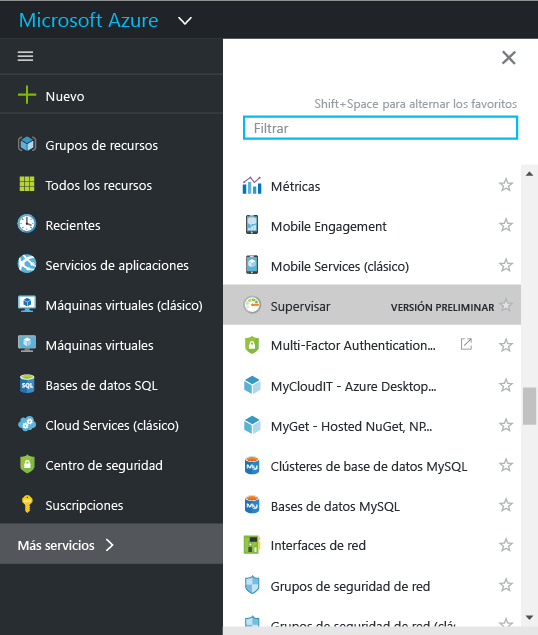

2. Haga clic en la opción **Monitor** para abrir la hoja **Monitor**. En esta hoja se encuentran toda la configuración de supervisión y los datos en una sola vista consolidada. Primero se abre la sección **Registro de actividades** .

    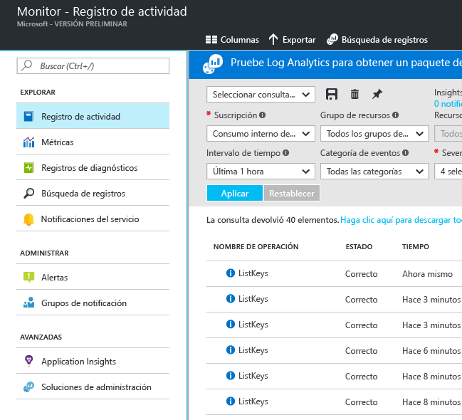

    > [AZURE.WARNING] Las opciones **Notificaciones del servicio** y **Notification groups** (Grupos de notificación) que se muestran son Private Preview y solo aparecen para los que se han unido a Private Preview.

    Azure Monitor tiene tres categorías básicas de supervisión de datos: el registro de actividad, las métricas y los registros de diagnóstico.

3. Haga clic en **Registro de actividades** para asegurarse de que se muestra la sección del registro de actividades.

    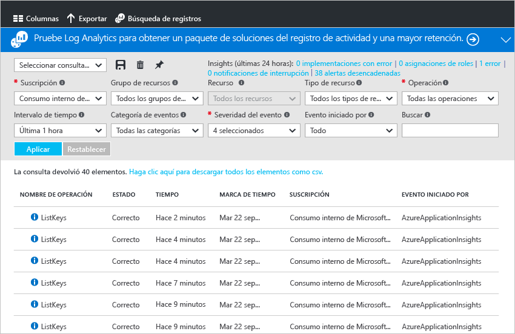

    En el **registro de actividades** se describen todas las operaciones realizadas en los recursos de su suscripción. Con el Registro de actividades, se pueden determinar los interrogantes “qué, quién y cuándo” de las operaciones de escritura en los recursos de la suscripción. Por ejemplo, en el Registro de actividades consta cuándo se ha detenido una aplicación web y quién lo ha hecho. Los eventos del Registro de actividades se almacenan en la plataforma durante 90 días.
   
    Puede crear y guardar las consultas para los filtros comunes y luego anclar las consultas más importantes en un panel del portal, por lo que siempre sabrá si se han producido eventos que cumplen los criterios.

4. Filtre la vista de un grupo de recursos concreto durante la última semana y luego haga clic en el botón **Guardar** .

    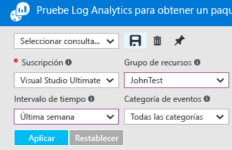

5. Ahora haga clic en el botón **Anclar** .

    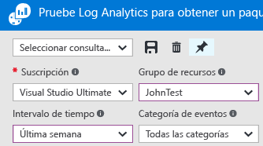

    La mayoría de las vistas de este tutorial se pueden anclar a un panel. Esto ayuda a crear un único origen de información de datos operativos de los servicios. 

6. Vuelva al panel. Ahora puede ver que la consulta (y el número de resultados) se muestra en el panel.

    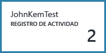

7. Vuelva al icono **Monitor** y haga clic en la sección **Métricas**. Primero debe seleccionar un recurso mediante filtrado y selección a través de las opciones de la parte superior de la sección.

    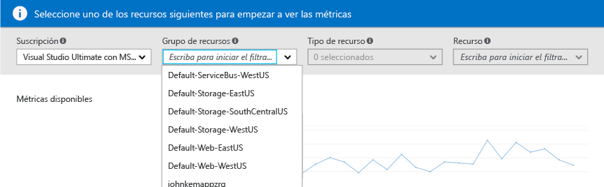

    Todos los recursos de Azure emiten métricas. En esta vista se reúnen todos ellos en un único panel.

8. Una vez haya seleccionado un recurso, todas las métricas disponibles aparecen en el lado izquierdo de la hoja. Puede crear un gráfico de varias métricas al mismo tiempo si selecciona las métricas y modifica el tipo de gráfico y el intervalo de tiempo. También puede ver todas las alertas de métricas establecidas en este recurso.

    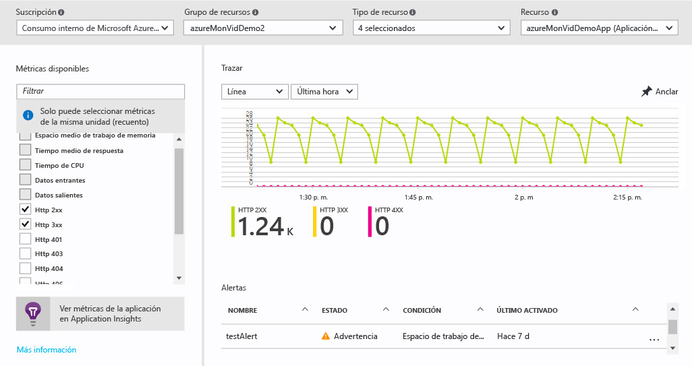

    > [AZURE.NOTE] Algunas métricas solo están disponibles si se habilita [Application Insights](../application-insights/app-insights-overview.md) en el recurso.

9. Cuando esté satisfecho con el gráfico, puede utilizar el botón **Anclar** para anclarlo al panel.

10. Vuelva a la hoja **Monitor** y haga clic en **Registros de diagnóstico**.

    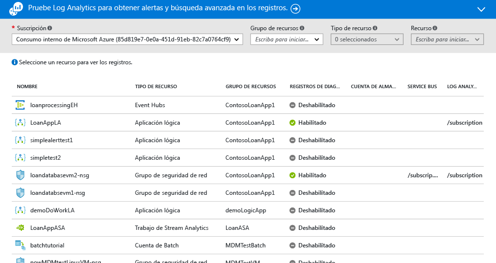

    Los registros de diagnóstico son registros emitidos por un recurso que proporcionan datos sobre el funcionamiento de dicho recurso en concreto. Por ejemplo, los contadores de reglas de grupo de seguridad de red y los registros de flujo de trabajo de aplicación lógica son tipos de registros de diagnóstico. Estos registros se pueden almacenar en una cuenta de almacenamiento, transmitir a un centro de eventos o enviar a [Log Analytics](../log-analytics/log-analytics-overview.md), el producto de inteligencia operativa de Microsoft, para la búsqueda avanzada y las alertas.
   
    En el portal puede ver y filtrar una lista de todos los recursos de la suscripción para identificar si tienen registros de diagnóstico habilitados.

11. Haga clic en un recurso en la hoja de registros de diagnóstico. Si los registros de diagnóstico se almacenan en una cuenta de almacenamiento, verá una lista de registros por hora que se pueden descargar directamente. También puede hacer clic en "Activar/desactivar diagnósticos," que permite configurar el archivado en una cuenta de almacenamiento, el streaming a Event Hubs o el envío a un área de Log Analytics.

    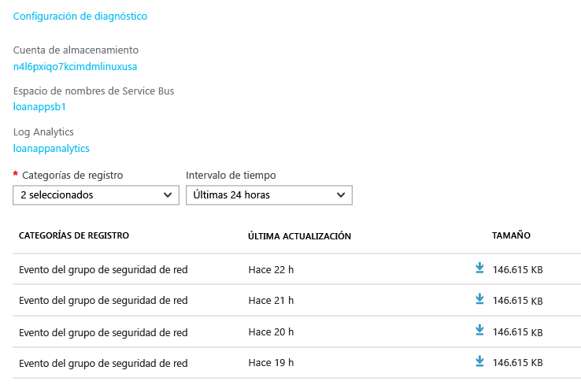

    Si ha configurado los registros de diagnóstico para Log Analytics, entonces puede buscar en la sección **Búsqueda de registros** del portal.

12. Vaya a la sección **Alertas** de la hoja Monitor.

    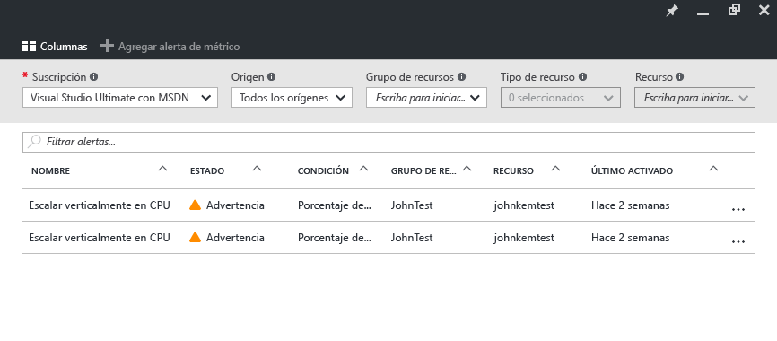

    Aquí puede administrar todas las alertas de los recursos de Azure. Esto incluye alertas en métricas, eventos de registro de actividades (versión preliminar), pruebas web de Application Insights (ubicaciones) y diagnósticos proactivos de Application Insights. Las alertas pueden activar el envío de un correo electrónico o MENSAJE a un webhook.
   
13. Haga clic en **Add metric alert** (Agregar alerta de métrica) para crear una alerta.

    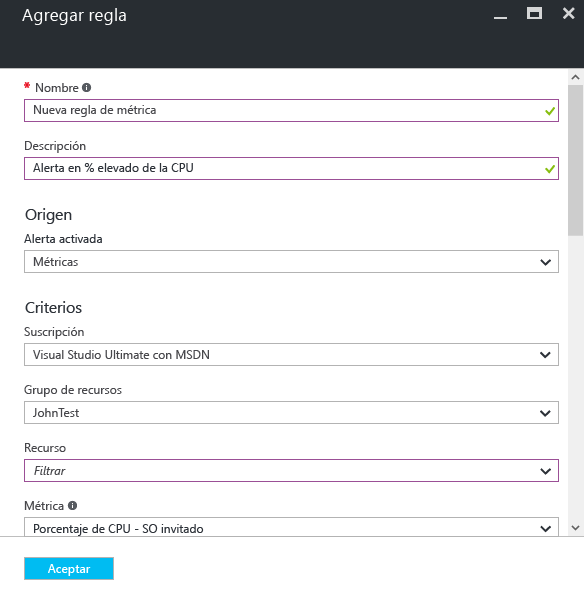

    A continuación, puede anclar una alerta al panel para ver fácilmente su estado en cualquier momento.

14. La sección Monitor también incluye vínculos a aplicaciones de [Application Insights](../application-insights/app-insights-overview.md) y soluciones de administración de [Log Analytics](../log-analytics/log-analytics-overview.md). Estos otros productos de Microsoft están perfectamente integrados en Azure Monitor.

15. Si no usa Application Insights o Log Analytics, lo más probable es que Azure Monitor tenga una asociación con los productos actuales de supervisión, registro y alertas. Vea nuestra [página de asociados](./monitoring-partners.md) para obtener una lista completa e instrucciones sobre cómo realizar la integración.

Si sigue estos pasos y ancla todos los iconos pertinentes a un panel, puede crear vistas completas de la aplicación y la infraestructura como esta:

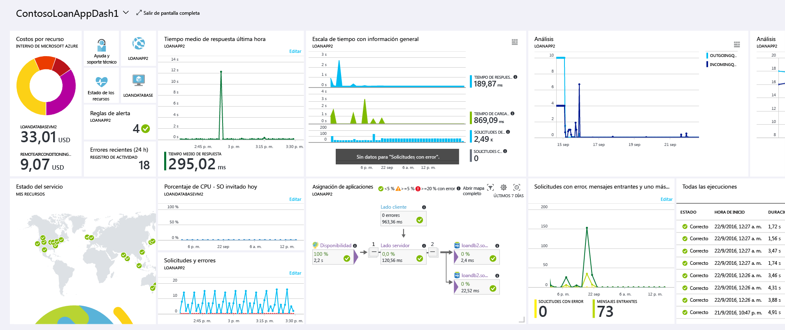

## Pasos siguientes
- Lea la [información general sobre Azure Monitor](./monitoring-overview.md)

<!--HONumber=Oct16_HO2-->

