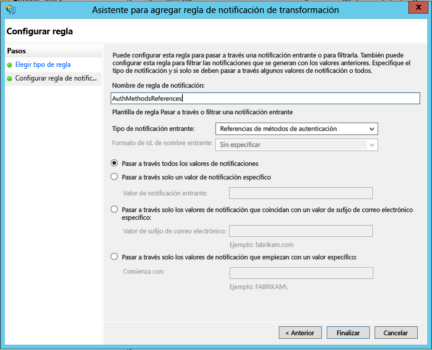

# Configuración del Servidor Azure Multi-Factor Authentication para trabajar con AD FS en Windows Server
Si usa los Servicios de federación de Active Directory (AD FS) y desea proteger los recursos en la nube y los locales, puede configurar Servidor Azure Multi-Factor Authentication con AD FS. Esta configuración desencadena la verificación en dos pasos para los puntos de conexión de alto valor.

En este artículo se describe el uso del Servidor Azure Multi-Factor Authentication con AD FS en Windows Server 2012 R2 y Windows Server 2016. Para más información, lea sobre la [protección de recursos en la nube y locales mediante Servidor Azure Multi-Factor Authentication con AD FS 2.0](multi-factor-authentication-get-started-adfs-adfs2.md).

## Protección de Windows Server AD FS con Servidor Azure Multi-Factor Authentication
Al instalar Servidor Azure Multi-Factor Authentication tiene las siguientes opciones:

* Instalar Servidor Azure Multi-Factor Authentication localmente en el mismo servidor que AD FS
* Instalar el adaptador de Azure Multi-Factor Authentication localmente en el servidor AD FS e instalar Servidor Multi-Factor Authentication en un equipo diferente

Antes de comenzar, tenga en cuenta lo siguiente:

* No tiene que instalar Servidor Azure Multi-Factor Authentication en el servidor de AD FS. Sin embargo, debe instalar el adaptador de Multi-Factor Authentication para AD FS en un equipo con Windows Server 2012 R2 o Windows Server 2016 en el que se ejecuta AD FS. Puede instalar el servidor en un equipo diferente si instala el adaptador de AD FS por separado en el servidor de federación de AD FS. Consulte los procedimientos siguientes para aprender a instalar el adaptador por separado.
* Si la organización usa métodos de verificación de aplicación móvil o mensaje de texto, las cadenas definidas en la configuración de la compañía contienen un marcador de posición "<$*application_name*$>". En la versión 7.1 del Servidor MFA, puede especificar el nombre de aplicación que reemplazará este marcador de posición. En la versión 7.0 o anteriores, este marcador de posición no se reemplaza automáticamente cuando se usa el adaptador de AD FS. En esas versiones anteriores, quite el marcador de posición de las cadenas correspondientes cuando proteja AD FS.
* La cuenta que use para iniciar sesión debe tener derechos de usuario para crear grupos de seguridad en el servicio de Active Directory.
* El asistente para la instalación del adaptador de AD FS de Multi-Factor Authentication crea un grupo de seguridad denominado PhoneFactor Admins en la instancia de Active Directory. A continuación, se agrega la cuenta de servicio de AD FS del servicio de federación a este grupo. Compruebe que el grupo PhoneFactor Admins se haya creado en el controlador de dominio y que la cuenta de servicio de AD FS sea miembro de este grupo. Si es necesario, agregue la cuenta de servicio de AD FS manualmente al grupo PhoneFactor Admins en el controlador de dominio.
* Para obtener información sobre cómo instalar el SDK del servicio web con el portal de usuarios, consulte [Implementación del Portal de usuarios para Servidor Azure Multi-Factor Authentication](multi-factor-authentication-get-started-portal.md)

### Instalación de Servidor Azure Multi-Factor Authentication localmente en el servidor AD FS
1. Descargue e instale Servidor Azure Multi-Factor Authentication en el servidor de AD FS. Para obtener información sobre la instalación, consulte la [introducción a Servidor Azure Multi-Factor Authentication](multi-factor-authentication-get-started-server.md).
2. En la consola de administración del Servidor Azure Multi-Factor Authentication, haga clic en el icono de **AD FS**. Seleccione las opciones **Permitir inscripción de usuario** y  **Permitir a los usuarios seleccionar el método**.
3. Seleccione las opciones adicionales que desee especificar para su organización.
4. Haga clic en **Instalar adaptador de AD FS**.
   
   

5. Si se muestra la ventana de Active Directory, eso significa dos cosas. El equipo está unido a un dominio y la configuración de Active Directory para proteger la comunicación entre el adaptador de AD FS y el servicio Multi-Factor Authentication está incompleta. Haga clic en **Siguiente** para completar esta configuración automáticamente o marque la casilla **Omitir configuración automática de Active Directory y configurar los parámetros manualmente**. Haga clic en **Siguiente**.
6. Si se muestran las ventanas de grupo local, eso significa dos cosas. El equipo no está unido a un dominio y la configuración del grupo local para proteger la comunicación entre el adaptador de AD FS y el servicio Multi-Factor Authentication está incompleta. Haga clic en **Siguiente** para completar esta configuración automáticamente o marque la casilla **Omitir configuración automática de grupo local y configurar los parámetros manualmente**. Haga clic en **Siguiente**.
7. En el asistente para la instalación, haga clic en **Siguiente**. Servidor Azure Multi-Factor Authentication crea el grupo PhoneFactor Admins y agrega la cuenta de servicio de AD FS al grupo PhoneFactor Admins.
   

8. En la página **Iniciar instalador**, haga clic en **Siguiente**.
9. En el instalador del adaptador de AD FS de Multi-Factor Authentication, haga clic en **Siguiente**.
10. Cuando se haya completado la instalación, haga clic en **Cerrar** .
11. Una vez instalado el adaptador, debe registrarlo con AD FS. Abra Windows PowerShell y ejecute el siguiente comando: 
    `C:\Program Files\Multi-Factor Authentication Server\Register-MultiFactorAuthenticationAdfsAdapter.ps1`
    

12. Modifique la directiva de autenticación global en AD FS para usar el adaptador recién registrado. En la consola de administración de AD FS, vaya al nodo **Directivas de autenticación** . En la sección **Multi-factor Authentication**, haga clic en el vínculo **Editar** situado junto a la sección **Configuración Global**. En la ventana **Editar directiva de autenticación global**, seleccione **Multi-Factor Authentication** como método de autenticación adicional y haga clic en **Aceptar**. El adaptador está registrado como WindowsAzureMultiFactorAuthentication. Reinicie el servicio de AD FS para que surta efecto el registro.

En este punto, Servidor Multi-Factor Authentication está configurado para ser un proveedor de autenticación adicional y utilizarlo con AD FS.

## Instalación de una instancia independiente del adaptador de AD FS mediante el SDK del servicio web
1. Instale el SDK del servicio web en el servidor que ejecuta Servidor Multi-Factor Authentication.
2. Copie los siguientes archivos del directorio \Archivos de programa\Multi-Factor Authentication Server en el servidor en el que planea instalar el adaptador de AD FS:
   * MultiFactorAuthenticationAdfsAdapterSetup64.msi
   * Register-MultiFactorAuthenticationAdfsAdapter.ps1
   * Unregister-MultiFactorAuthenticationAdfsAdapter.ps1
   * MultiFactorAuthenticationAdfsAdapter.config
3. Ejecute el archivo de instalación MultiFactorAuthenticationAdfsAdapterSetup64.msi.
4. En el instalador del adaptador de AD FS de Multi-Factor Authentication, haga clic en **Siguiente** para iniciar la instalación.
5. Cuando se haya completado la instalación, haga clic en **Cerrar** .

## Edite el archivo MultiFactorAuthenticationAdfsAdapter.config
Siga estos pasos para editar el archivo MultiFactorAuthenticationAdfsAdapter.config:

1. Establezca el nodo **UseWebServiceSdk** en **true**.  
2. Establezca el valor de **WebServiceSdkUrl** en la dirección URL del SDK del Servicio web Multi-Factor Authentication. Por ejemplo:  *https://contoso.com/&lt;NombreDelCertificado&gt;/MultiFactorAuthWebServicesSdk/PfWsSdk.asmx*, donde *NombreDelCertificado* es el nombre de su certificado.  
3. Edite el script Register-MultiFactorAuthenticationAdfsAdapter.ps1 agregando `-ConfigurationFilePath &lt;path&gt;` al final del comando `Register-AdfsAuthenticationProvider`, donde *&lt;path&gt;* es la ruta de acceso completa al archivo MultiFactorAuthenticationAdfsAdapter.config.

### Configuración del SDK del servicio web con nombre de usuario y contraseña
Hay dos opciones para configurar el SDK del servicio Web. La primera es con un nombre de usuario y una contraseña, y la segunda es con un certificado de cliente. Siga estos pasos para la primera opción o pase a la segunda.  

1. Establezca el valor de **WebServiceSdkUsername** en una cuenta miembro del grupo de seguridad PhoneFactor Admins. Utilice el formato &lt;dominio&gt;&#92;&lt;nombre de usuario&gt;.  
2. Establezca el valor de **WebServiceSdkPassword** en la contraseña de la cuenta apropiada.

### Configuración del SDK del servicio web con un certificado de cliente
Si no desea usar un nombre de usuario y una contraseña, siga estos pasos para configurar el SDK del servicio web con un certificado de cliente.

1. Obtenga un certificado de cliente de una entidad de certificación para el servidor que ejecuta el SDK del servicio web. Aprenda a [obtener certificados de cliente](https://technet.microsoft.com/library/cc770328.aspx).  
2. Importe el certificado de cliente en el almacén de certificados personales del equipo local en el servidor que ejecuta el SDK del servicio web. Asegúrese de que el certificado público de la entidad de certificación está en el almacén de certificados de certificados raíz de confianza.  
3. Exporte las claves pública y privadas del certificado de cliente a un archivo .pfx.  
4. Exporte la clave pública en formato Base64 a un archivo .cer.  
5. En el Administrador del servidor, compruebe que está instalada la característica de servidor web (IIS)\servidor web\seguridad\autenticación de asignaciones de certificado de cliente de IIS. Si no está instalada, seleccione **Agregar roles y características** para agregar esta característica.  
6. En Administrador de IIS, haga doble clic en **Editor de configuración** en el sitio web que contiene el directorio virtual del SDK del servicio web. Es importante seleccionar el sitio web, no el directorio virtual.  
7. Vaya a la sección **system.webServer/security/authentication/iisClientCertificateMappingAuthentication** .  
8. Establezca enabled en **true**.  
9. Establezca oneToOneCertificateMappingsEnabled en **true**.  
10. Haga clic en el botón **...** situado junto a oneToOneMappings y, después, haga clic en el vínculo **Agregar**.  
11. Abra el archivo .cer de Base64 que exportó anteriormente. Quite *-----BEGIN CERTIFICATE-----*, *-----END CERTIFICATE-----* y todos los saltos de línea. Copie la cadena resultante.  
12. Establezca certificate en la cadena que se copió en el paso anterior.  
13. Establezca enabled en **true**.  
14. Establezca userName en una cuenta que sea miembro del grupo de seguridad PhoneFactor Admins. Utilice el formato &lt;dominio&gt;&#92;&lt;nombre de usuario&gt;.  
15. Establezca la contraseña en la de la cuenta adecuada y, después, cierre el Editor de configuración.  
16. Haga clic en el vínculo **Aplicar** .  
17. En el directorio virtual del SDK del servicio web, haga doble clic en **Autenticación**.  
18. Compruebe que Suplantación de ASP.NET y Autenticación básica se establecen en **Habilitado** y los restantes elementos se establecen en **Deshabilitado**.  
19. En el directorio virtual del SDK del servicio web, haga doble clic en **Configuración de SSL**.  
20. Establezca Certificados de cliente en **Aceptar** y, después, haga clic en **Aplicar**.  
21. Copie el archivo .pfx que exportó anteriormente en el servidor que ejecuta el adaptador de AD FS.  
22. Importe el archivo .pfx en el almacén de certificados personales del equipo local.  
23. Haga clic con el botón derecho y seleccione **Administrar claves privadas**, y, a continuación, otorgue acceso de lectura a la cuenta usada para iniciar sesión en el servicio AD FS.  
24. Abra el certificado de cliente y copie la huella digital de la pestaña **Detalles** .  
25. En el archivo MultiFactorAuthenticationAdfsAdapter.config, establezca **WebServiceSdkCertificateThumbprint** en la cadena que copió en el paso anterior.  

Por último, para registrar el adaptador, ejecute el script \Archivos de programa\Multi-Factor Authentication Server\Register-MultiFactorAuthenticationAdfsAdapter.ps1 en PowerShell. El adaptador está registrado como WindowsAzureMultiFactorAuthentication. Reinicie el servicio de AD FS para que surta efecto el registro.

## Protección de los recursos de Azure AD mediante AD FS
Para proteger los recursos de la nube, configure una regla de notificaciones para que los servicios de federación de Active Directory emitan la notificación multipleauthn cuando un usuario realice correctamente la verificación en dos pasos. Esta notificación se transmitirá a Azure AD. Siga este procedimiento para realizar los pasos:

1. Abra Administración de AD FS.
2. A la izquierda, seleccione **Relaciones de confianza para usuario autenticado**.
3. Haga clic con el botón derecho en **Plataforma de identidad de Microsoft Office 365** y seleccione **Editar reglas de notificaciones…**

   

4. En Reglas de transformación de emisión, haga clic en **Agregar regla**.

   

5. En el Asistente para agregar regla de notificaciones de transformación, seleccione **Pasar por una notificación entrante o filtrarla** en la lista desplegable y haga clic en **Siguiente**.

   

6. Asigne un nombre a la regla.
7. Seleccione **Referencias de métodos de autenticación** como tipo de notificación entrante.
8. Seleccione **Pasar a través todos los valores de notificaciones**.
    
9. Haga clic en **Finalizar** Cierre la consola de administración de AD FS.

## Temas relacionados
Para obtener ayuda para solucionar problemas, consulte [P+F sobre Azure Multi-Factor Authentication](multi-factor-authentication-faq.md)
