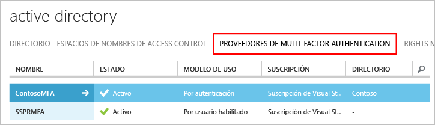

# Introducción a Servidor Azure Multi-Factor Authentication

Ahora que hemos determinado que se usa una instancia local del Servidor Multi-Factor Authentication, vayamos al paso siguiente. Esta página describe una nueva instalación del servidor y su configuración con una instancia loal de Active Directory. Si ya tiene instalado el servidor MFA y desea actualizarlo, consulte [Upgrade to the latest Azure Multi-Factor Authentication Server](multi-factor-authentication-server-upgrade.md) (Actualización a la versión más reciente del Servidor Microsoft Azure Multi-Factor Authentication). Para más información sobre cómo instalar solo el servicio web, consulte [Implementación del servicio web móvil de la aplicación móvil del Servidor Azure Multi-Factor Authentication](multi-factor-authentication-get-started-server-webservice.md).
 

## Planeamiento de la implementación

Antes de descargar el servidor Azure Multi-Factor Authentication, piense cuáles son sus requisitos de alta disponibilidad y carga. Use esta información para decidir cómo y dónde realizar la implementación. 

Una buena directriz para saber la cantidad de memoria que se necesita es el número de usuarios que se espera autenticar de forma regular. 

| Usuarios | RAM |
| ----- | --- |
| 1-10,000 | 4 GB |
| 10,001-50,000 | 8 GB |
| 50,001-100,000 | 12 GB |
| 100,000-200,001 | 16 GB |
| 200,001+ | 32 GB |

¿Necesita configurar varios servidores para lograr alta disponibilidad o un equilibrio de carga? Hay varias maneras de definir esta configuración con el Servidor Azure MFA. Cuando se instala el primer Servidor Azure MFA, pasa a ser el maestro. Los servidores adicionales pasan a ser los subordinados y sincronizan automáticamente los usuarios y la configuración con el maestro. A continuación, puede configurar un servidor principal y hacer que el resto actúen como copia de seguridad, o bien puede configurar el equilibrio de carga entre todos los servidores. 

Aunque se desconecte un Servidor Azure MFA maestro, los servidores subordinados pueden procesar solicitudes de comprobación de dos pasos. Sin embargo, no puede agregar usuarios nuevos y los existentes no pueden actualizar su configuración hasta que el servidor maestro vuelva a estar conectado o se promocione un servidor subordinado. 

## Preparación del entorno

Asegúrese de que el servidor que usa para Azure Multi-Factor Authentication cumple los requisitos siguientes:

| Requisitos del Servidor Azure Multi-Factor Authentication | Description |
|:--- |:--- |
| Hardware |<li>200 MB de espacio de disco duro</li><li>Procesador compatible con x32 o x64</li><li>1 GB o más de RAM</li> |
| Software |<li>Windows Server 2008 o superior si el host es un sistema operativo de servidor</li><li>Windows 7 o superior si el host es un sistema operativo cliente</li><li>Microsoft .NET 4.0 Framework</li><li>IIS 7.0 o superior si está instalado el SDK de servicio web o el portal de usuario</li> |

### Requisitos de firewall del Servidor Azure Multi-Factor Authentication
Cada servidor MFA debe ser capaz de comunicarse en el puerto 443 de salida a las siguientes direcciones:

* https://pfd.phonefactor.net
* https://pfd2.phonefactor.net
* https://css.phonefactor.net

Si los firewalls de salida están restringidos en el puerto 443, deberán abrirse los siguientes intervalos de direcciones IP:

| Subred IP | Máscara de red | Rango de direcciones IP |
|:--- |:--- |:--- |
| 134.170.116.0/25 |255.255.255.128 |134.170.116.1 – 134.170.116.126 |
| 134.170.165.0/25 |255.255.255.128 |134.170.165.1 – 134.170.165.126 |
| 70.37.154.128/25 |255.255.255.128 |70.37.154.129 – 70.37.154.254 |

Si no está usando la característica de confirmación de eventos y los usuarios no usan aplicaciones móviles para comprobar desde dispositivos de la red corporativa, solo necesita los siguientes intervalos:

| Subred IP | Máscara de red | Rango de direcciones IP |
|:--- |:--- |:--- |
| 134.170.116.72/29 |255.255.255.248 |134.170.116.72 – 134.170.116.79 |
| 134.170.165.72/29 |255.255.255.248 |134.170.165.72 – 134.170.165.79 |
| 70.37.154.200/29 |255.255.255.248 |70.37.154.201 – 70.37.154.206 |

## Descarga de Servidor Azure Multi-Factor Authentication
Hay dos maneras diferentes de descargar Servidor Azure Multi-Factor Authentication. Ambas se pueden hacer a través de Azure Portal. La primera es administrando el proveedor de autenticación multifactor directamente. La segunda es mediante la configuración del servicio. La segunda opción requiere un proveedor de Multi-Factor Authentication o una licencia de Azure MFA, Azure AD Premium o Enterprise Mobility Suite.

> [!Important]
> Estas dos opciones parecen similares pero, sin embargo, es importante saber cuál utilizar. Si los usuarios tienen licencias incluidas con MFA (Azure MFA, Azure AD Premium o Enterprise Mobility + Security), no cree un proveedor de Multi-Factor Authentication para conseguir la descarga del servidor. En su lugar, use la opción 2 para descargar el servidor de la página de configuración del servicio. 

### Opción 1: descargue el Servidor Azure Multi-Factor Authentication del Portal de Azure clásico.

Utilice esta opción de descarga si ya tiene un proveedor de Multi-Factor Authentication dado que ya paga MFA por cada usuario habilitado o por autenticación. 

1. Inicie sesión como administrador en el [Portal de Azure clásico](https://manage.windowsazure.com).
2. En la parte izquierda, seleccione **Active Directory**.
3. En la página Active Directory, haga clic en **Proveedores de autenticación multifactor** 
4. En la parte inferior, haga clic en **Administrar**. Se abrirá una nueva página.
5. Haga clic en **Descargas**.
6. Haga clic en el vínculo **Descargar**.
   
7. Guarde el archivo descargado.

### Opción 2: descargue el Servidor Azure Multi-Factor Authentication mediante la configuración del servicio

Utilice esta opción de descarga si tiene licencias Enterprise Mobility Suite, Azure AD Premium o Enterprise Cloud Suite. 

1. Inicie sesión como administrador en el [Portal de Azure clásico](https://manage.windowsazure.com).
2. En la parte izquierda, seleccione **Active Directory**.
3. Haga doble clic en la instancia de Azure AD.
4. En la parte superior, haga clic en **Configurar**
5. Vaya a la sección **autenticación multifactor** y seleccione **Administrar configuración del servicio**.
6. En la parte inferior de la página de configuración de servicios, haga clic en **Ir al portal**. Se abrirá una nueva página.
   
7. Haga clic en **Descargas**
8. Haga clic en el vínculo **Descargar**.
    
9. Guarde el archivo descargado.

## Instalación y configuración del Servidor Azure Multi-Factor Authentication
Una vez descargado el servidor, ya se puede instalar y configurar.  Asegúrese de que el servidor en el que va a instalarlo cumple los requisitos que se enumeran en la sección de planificación. 

Estos pasos muestran una instalación rápida con el asistente para configuración. Si no ve el asistente o desea volver a ejecutarlo, puede seleccionarlo en el menú **Herramientas** en el servidor.

1. Haga doble clic en el archivo ejecutable. 
2. En la pantalla Seleccionar carpeta de instalación, asegúrese de que la carpeta sea correcta y haga clic en **Siguiente**.
3. Una vez completada la instalación, haga clic en **Finalizar**.  Se inicia el asistente para configuración.
4. En la pantalla de bienvenida del asistente para configuración, active **Omitir el uso del Asistente para configuración de autenticación** y haga clic en **Siguiente**.  El asistente se cierra y el servidor se inicia.
    
5. De vuelta en la página desde la que hemos descargado el servidor, haga clic en el botón **Generar credenciales de activación** . Copie esta información en Servidor Azure Multi-Factor Authentication en los cuadros correspondientes y haga clic en **Activar**.

## Importación de usuarios desde Active Directory
Ahora que está instalado y configurado el servidor, puede importar rápidamente los usuarios en Servidor Azure Multi-Factor Authentication.

1. En Servidor Azure Multi-Factor Authentication, a la izquierda, seleccione **Usuarios**.
2. En la parte inferior, seleccione **Importar desde Active Directory**.
3. Ahora puede buscar usuarios individuales o buscar en el directorio de AD las unidades organizativas con usuarios en ellas.  En este caso, se especifican las unidades organizativas de los usuarios.
4. Resalte todos los usuarios de la derecha y haga clic en **Importar**.  Debe aparecer una ventana emergente que le indica que la operación se realizó correctamente.  Cierre la ventana de importación.
   

## Enviar un correo electrónico a los usuarios
Ahora que ha importado los usuarios en el servidor de MFA, envíe un correo electrónico para informarles de que se les ha inscrito en la verificación en dos pasos.

El correo electrónico que envíe estará determinado por cómo haya configurado la verificación en dos pasos para los usuarios. Por ejemplo, si puede importar los números de teléfono del directorio de la empresa, el mensaje de correo electrónico deberá incluir los números de teléfono predeterminados para que los usuarios sepan qué pueden esperar. Si no los ha importado o los usuarios van a usar la aplicación móvil, envíeles un mensaje de correo electrónico que les indique se deben completar la inscripción de su cuenta. Incluya un hipervínculo al portal de usuarios de Azure Multi-factor Authentication en el correo electrónico.

El contenido del correo electrónico variará según el método de autenticación que se haya establecido para el usuario (llamada de teléfono, SMS o aplicación móvil).  Por ejemplo, si el usuario debe usar un PIN para autenticarse, el correo electrónico le indica el PIN inicial que se ha establecido.  Los usuarios deben cambiar su código PIN durante su primera autenticación.

### Configuración del correo electrónico y las plantillas de correo electrónico
Haga clic en el icono de correo electrónico situado a la izquierda para configurar las opciones de envío de estos correos electrónicos. En esta página puede especificar la información de SMTP del servidor de correo electrónico y seleccionar la casilla **Enviar correos electrónicos a los usuarios** para enviar correo electrónico.

En la pestaña Contenido del mensaje de correo electrónico, verá las plantillas de correo electrónico que hay disponibles. Elija la plantilla más adecuada según cómo haya configurado la verificación en dos pasos para los usuarios.

## ¿Cómo controla el Servidor Azure Multi-Factor Authentication los datos de usuario?
Cuando se usa Servidor Azure Multi-Factor Authentication (MFA) local, los datos de un usuario se almacenan en los servidores locales. Los datos de usuario persistentes no se almacenan en la nube. Cuando el usuario realiza una verificación en dos pasos, Servidor MFA envía los datos al servicio en la nube Azure MFA para realizar la verificación. Cuando estas solicitudes de autenticación se envían al servicio en la nube, en la solicitud y los registros se incluyen los siguientes campos para que estén disponibles en los informes de uso/autenticación del cliente. Algunos de los campos son opcionales y se pueden habilitar o deshabilitar en Servidor Multi-Factor Authentication. La comunicación desde Servidor MFA al servicio en la nube MFA usa SSL/TLS en el puerto 443 de salida. Estos campos son:

* Id. exclusivo: nombre de usuario o Id. interno de Servidor MFA
* Nombre y apellidos (opcional)
* Dirección de correo electrónico (opcional)
* Número de teléfono: al realizar una llamada de voz o autenticación por SMS
* Token de dispositivo: al realizar la autenticación de una aplicación móvil
* Modo de autenticación
* Resultado de autenticación
* Nombre de Servidor MFA
* IP de Servidor MFA
* IP de cliente: si está disponible

Además de los campos anteriores, el resultado (éxito o denegación) de la verificación y el motivo de las denegaciones también se almacenan con los datos de autenticación y están disponibles en informes de uso y autenticación.

## Pasos siguientes

- Instalación y configuración del [Portal de usuarios](multi-factor-authentication-get-started-portal.md) de autoservicio del usuario.

- Instale y configure el Servidor Azure MFA con [Servicios de federación de Active Directory](multi-factor-authentication-get-started-adfs.md), [Autenticación RADIUS](multi-factor-authentication-get-started-server-radius.md) o [Autenticación LDAP](multi-factor-authentication-get-started-server-ldap.md).

- Instalación y configuración de [Puerta de enlace de Escritorio remoto y Servidor Azure Multi-Factor Authentication con RADIUS](multi-factor-authentication-get-started-server-rdg.md). 

- [Implementación del servicio web de aplicaciones móviles del Servidor Azure Multi-Factor Authentication](multi-factor-authentication-get-started-server-webservice.md).

- [Escenarios avanzados con Azure Multi-Factor Authentication y VPN de terceros](multi-factor-authentication-advanced-vpn-configurations.md).

