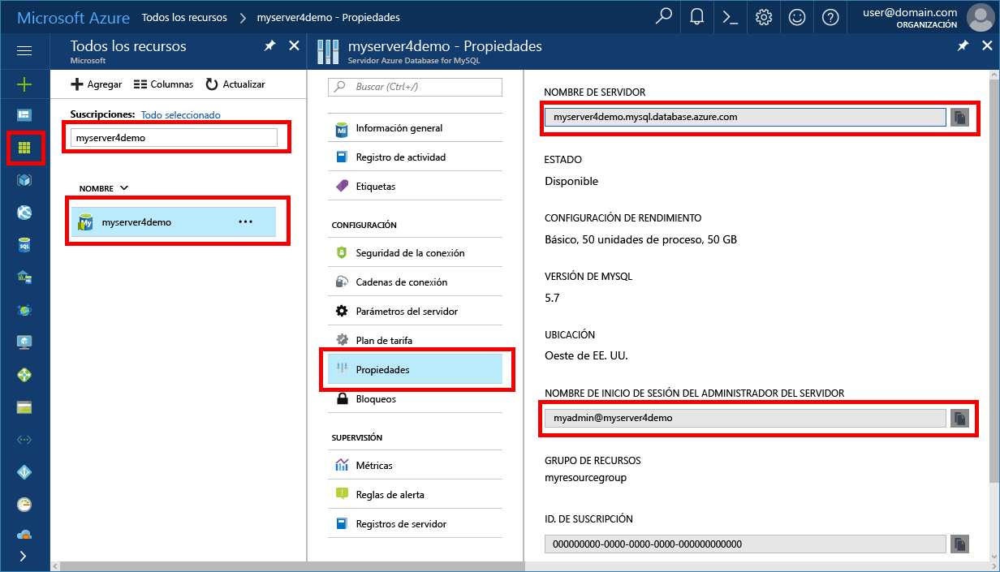

# <a name="migrate-your-mysql-database-by-using-import-and-export"></a>Migración de la base de datos de MySQL mediante importación y exportación
En este artículo se explican dos métodos habituales para importar y exportar datos a un servidor de Azure Database for MySQL mediante el uso de MySQL Workbench. 

## <a name="before-you-begin"></a>Antes de empezar
Para seguir esta guía, necesitará:
- Un servidor de Azure Database for MySQL, que puede obtener después de consultar [Creación de un servidor de Azure Database for MySQL con Azure Portal](quickstart-create-mysql-server-database-using-azure-portal.md).
- [Descargar](https://dev.mysql.com/downloads/workbench/) MySQL Workbench o cualquier otra herramienta de MySQL para importar y exportar.

## <a name="use-common-tools"></a>Uso de herramientas comunes
Use herramientas comunes como MySQL Workbench, Toad o Navicat para conectarse y restaurar datos de forma remota en Azure Database for MySQL. 

Use estas herramientas en el equipo cliente con una conexión a Internet para conectarse a Azure Database for MySQL. Use una conexión cifrada SSL para aprovechar los procedimientos recomendados de seguridad tal y como se describe en [Conectividad SSL de Azure Database for MySQL](concepts-ssl-connection-security.md).

No es necesario mover los archivos de importación y exportación a ninguna ubicación en la nube especial al migrar a Azure Database for MySQL. 

## <a name="create-a-database-on-the-azure-database-for-mysql-server"></a>Creación de una base de datos en el servidor de Azure Database for MySQL
Cree una base de datos vacía en el servidor de Azure Database for MySQL donde desea migrar los datos. Use una herramienta como MySQL Workbench, Toad o Navicat para crear la base de datos. La base de datos puede tener el mismo nombre que la base de datos que contiene los datos volcados, o puede crear una base de datos con un nombre diferente.

Para conectarse, busque la información de conexión en el panel de **propiedades** de Azure Database for MySQL.



Agregue la información de conexión a MySQL Workbench.


## <a name="determine-when-to-use-import-and-export-techniques-instead-of-a-dump-and-restore"></a>Determinación de cuándo se deben utilizar las técnicas de importación y exportación en lugar de realizar un volcado de memoria y una restauración
Use herramientas de MySQL para importar y exportar bases de datos en Azure MySQL Database en los escenarios siguientes. En otros escenarios, podría beneficiarse de las ventajas del método de [volcado de memoria y restauración](concepts-migrate-dump-restore.md). 

- Cuando deba elegir de forma selectiva unas cuantas tablas para importar desde una base de datos existente de MySQL en Azure MySQL Database, es mejor usar la técnica de importación y exportación.  Con ello, podrá omitir todas las tablas que no sean necesarias de la migración para ahorrar tiempo y recursos. Por ejemplo, use el conmutador `--include-tables` o `--exclude-tables` con [mysqlpump](https://dev.mysql.com/doc/refman/5.7/en/mysqlpump.html#option_mysqlpump_include-tables) y el conmutador `--tables` con [mysqldump](https://dev.mysql.com/doc/refman/5.7/en/mysqldump.html#option_mysqldump_tables).
- Si va a mover objetos de base de datos que no sean tablas, deberá crearlos explícitamente. Incluya restricciones (clave principal, clave externa, índices), vistas, funciones, procedimientos, desencadenadores y cualquier otro objeto de base de datos que desee migrar.
- Si va a migrar datos desde orígenes de datos externos que no sean una base de datos de MySQL, cree archivos planos e impórtelos mediante el uso de [mysqlimport](https://dev.mysql.com/doc/refman/5.7/en/mysqlimport.html).

Asegúrese de que todas las tablas de la base de datos usen el motor de almacenamiento InnoDB al cargar datos en Azure Database for MySQL. Azure Database for MySQL solo admite el motor de almacenamiento InnoDB por lo que no es compatible con otros alternativos. Si las tablas requieren otros motores de almacenamiento, conviértalos al formato del motor InnoDB antes de realizar la migración a Azure Database for MySQL. 

Por ejemplo, si tiene WordPress o una aplicación web que utiliza el motor MyISAM, convierta primero las tablas migrando los datos en tablas de InnoDB. A continuación, restaure en Azure Database for MySQL. Use la cláusula `ENGINE=INNODB` para configurar el motor para crear una nueva tabla y luego transfiera los datos a la tabla compatible antes de la migración. 

   ```sql
   INSERT INTO innodb_table SELECT * FROM myisam_table ORDER BY primary_key_columns
   ```

## <a name="performance-recommendations-for-import-and-export"></a>Recomendaciones de rendimiento para la importación y exportación
-   Cree los índices agrupados y las claves principales antes de cargar los datos. Cargue los datos en el orden de la clave principal. 
-   Retrase la creación de índices secundarios hasta después de que se hayan cargado los datos. Cree todos los índices secundarios después de la carga. 
-   Deshabilite las restricciones de las claves externas antes de la carga. El hecho de deshabilitar las comprobaciones de las claves externas favorece un aumento significativo del rendimiento. Habilite las restricciones y compruebe los datos después de la carga para garantizar la integridad referencial.
-   Cargue los datos en paralelo. Evite demasiado paralelismo ya que podría provocar que se alcanzara un límite de recursos, y supervise los recursos mediante las métricas disponibles en Azure Portal. 
-   Use tablas con particiones cuando sea necesario.

## <a name="import-and-export-by-using-mysql-workbench"></a>Importación y exportación mediante MySQL Workbench
Hay dos maneras de exportar e importar datos en MySQL Workbench. Cada una de ellas sirve para un propósito diferente. 

### <a name="table-data-export-and-import-wizards-from-the-object-browsers-context-menu"></a>Asistentes para la exportación e importación de datos de tablas mediante el menú contextual del examinador de objetos


Los asistentes para datos de tablas admiten operaciones de importación y exportación mediante archivos CSV y JSON. Incluyen varias opciones de configuración, como separadores, selección de columnas y selección de codificación. Puede ejecutar cada asistente en servidores locales o servidores de MySQL conectados de forma remota. La acción de importación incluye la tabla, la columna y la asignación de tipos. 

Puede acceder a estos asistentes desde el menú contextual del examinador de objetos haciendo clic con el botón derecho en una tabla. A continuación, elija **Asistente para exportación de datos de tabla** o **Asistente para importación de datos de tabla**. 

#### <a name="table-data-export-wizard"></a>Asistente para exportación de datos de tabla
En el ejemplo siguiente se exporta la tabla a un archivo CSV: 
1. Haga clic en con el botón derecho en la tabla de la base de datos que se va a exportar. 
2. Seleccione **Table Data Export Wizard** (Asistente para exportación de datos de tabla). Seleccione las columnas que se exportarán, el desplazamiento de fila (si lo hubiera) y el número (si lo hubiera). 
3. En la página **Seleccionar datos para exportar** haga clic en **Siguiente**. Seleccione la ruta de acceso del archivo y el tipo de archivo: CSV o JSON. Seleccione también el separador de línea, el método de inclusión de cadenas y el separador de campos. 
4. En la página **Select output file location** (Seleccionar ubicación del archivo de salida), haga clic en **Siguiente**. 
5. En la página **Exportar datos**, haga clic en **Siguiente**.

#### <a name="table-data-import-wizard"></a>Asistente para importación de datos de tabla
En el ejemplo siguiente se importa la tabla desde un archivo CSV:
1. Haga clic con el botón derecho en la tabla de la base de datos que se va a importar. 
2. Busque y seleccione el archivo CSV que desea importar y luego haga clic en **Siguiente**. 
3. Seleccione la tabla de destino (nueva o existente) y seleccione o anule la selección de la casilla **Truncate table before import** (Truncar tabla antes de la importación). Haga clic en **Siguiente**.
4. Seleccione la codificación y las columnas que desea importar y haga clic en **Siguiente**. 
5. En la página **Importar datos**, haga clic en **Siguiente**. El asistente procederá a importar los datos.

### <a name="sql-data-export-and-import-wizards-from-the-navigator-pane"></a>Asistentes para la exportación e importación de datos de SQL desde el panel del navegador
Use un asistente para exportar o importar datos de SQL generados desde MySQL Workbench o con el comando mysqldump. Acceda a estos asistentes desde el panel del **navegador** o seleccionando **Servidor** en el menú principal. A continuación, seleccione **Exportación de datos** o **Importación de datos**. 

#### <a name="data-export"></a>Exportación de datos


Puede usar la pestaña **Exportación de datos** para exportar los datos de MySQL. 
1. Seleccione cada esquema que desee exportar, elija opcionalmente objetos o tablas de esquema específicos de cada uno de ellos y genere la exportación. Entre las opciones de configuración se incluye la exportación a una carpeta de proyecto o un archivo independiente de SQL, el volcado de rutinas y eventos almacenados o la omisión de datos de tabla. 
 
   También puede usar **Export a Result Set** (Exportar un conjunto de resultados) para exportar un resultado concreto establecido en el editor de SQL a otro formato como CSV, JSON, HTML y XML. 
3. Seleccione los objetos de base de datos que desea exportar y configure las opciones relacionadas.
4. Haga clic en **Refresh** (Actualizar) para cargar los objetos actuales.
5. Si lo desea, abra la pestaña **Opciones avanzadas** para concretar más la operación de exportación. Por ejemplo, agregue bloqueos de tabla, utilice instrucciones replace en lugar de insert y entrecomille los identificadores con caracteres de acento grave.
6. Haga clic en **Iniciar exportación** para comenzar el proceso de exportación.


#### <a name="data-import"></a>Importación de datos


Puede usar la pestaña **Importación de datos** para importar o restaurar los datos exportados con la operación de exportación de datos o con el comando mysqldump. 
1. Elija la carpeta de proyecto o archivo SQL independiente, elija el esquema en el que se importarán los datos o elija **Nuevo** para definir un nuevo esquema. 
2. Haga clic en **Iniciar importación** para comenzar el proceso de importación.

## <a name="next-steps"></a>Pasos siguientes
Para conocer otro método de migración, consulte [Migración de la Base de datos MySQL mediante el volcado y la restauración en Azure Database for MySQL](concepts-migrate-dump-restore.md). 
