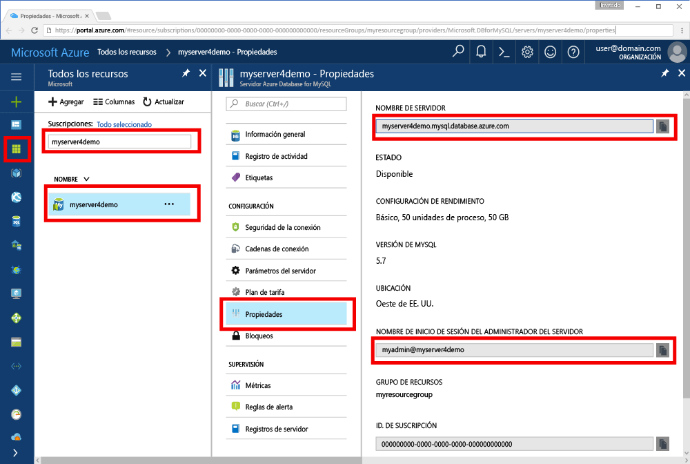

# <a name="azure-database-for-mysql-use-go-language-to-connect-and-query-data"></a>Azure Database for MySQL: uso del lenguaje Go para conectarse y consultar datos
En este tutorial rápido se muestra cómo conectarse a una instancia de Azure Database for MySQL mediante código escrito en el lenguaje [Go](https://golang.org/) desde las plataformas Windows, Ubuntu Linux y macOS de Apple. Se indica cómo usar instrucciones SQL para consultar, insertar, actualizar y eliminar datos en la base de datos. En este artículo se da por hecho que está familiarizado con el desarrollo mediante Go, pero que nunca ha usado Azure Database for MySQL.

## <a name="prerequisites"></a>Requisitos previos
En este tutorial rápido se usan como punto de partida los recursos creados en una de estas guías:
- [Create an Azure Database for MySQL server using Azure Portal](./quickstart-create-mysql-server-database-using-azure-portal.md) (Creación de un servidor de Azure Database for MySQL mediante Azure Portal)
- [Create an Azure Database for MySQL server using Azure CLI](./quickstart-create-mysql-server-database-using-azure-cli.md) (Creación de un servidor de Azure Database for MySQL mediante la CLI de Azure)

## <a name="install-go-and-mysql-connector"></a>Instalación de Go y el conector de MySQL
Instale [Go](https://golang.org/doc/install) y [go-sql-driver for MySQL](https://github.com/go-sql-driver/mysql#installation) en su propia máquina. Dependiendo de la plataforma, siga estos pasos:

### <a name="windows"></a>Windows
1. [Descargue](https://golang.org/dl/) e instale Go para Microsoft Windows de acuerdo con las [instrucciones de instalación](https://golang.org/doc/install).
2. En el menú Inicio, inicie el símbolo del sistema.
3. Cree una carpeta para su proyecto, por ejemplo, `mkdir  %USERPROFILE%\go\src\mysqlgo`.
4. Cambie el directorio a la carpeta de proyecto, por ejemplo `cd %USERPROFILE%\go\src\mysqlgo`.
5. Establezca la variable de entorno para GOPATH con el fin de que apunte al directorio de código fuente. `set GOPATH=%USERPROFILE%\go`.
6. Instale [go-sql-driver for mysql](https://github.com/go-sql-driver/mysql#installation) mediante la ejecución del comando `go get github.com/go-sql-driver/mysql`.

   ```cmd
   mkdir  %USERPROFILE%\go\src\mysqlgo
   cd %USERPROFILE%\go\src\mysqlgo
   set GOPATH=%USERPROFILE%\go
   go get github.com/go-sql-driver/mysql
   ```

### <a name="linux-ubuntu"></a>Linux (Ubuntu)
1. Inicie el shell de Bash. 
2. Instale Go mediante la ejecución de `sudo apt-get install golang-go`.
3. Cree una carpeta para el proyecto en su directorio principal, como `mkdir -p ~/go/src/mysqlgo/`.
4. Cambie el directorio a la carpeta, por ejemplo, `cd ~/go/src/mysqlgo/`.
5. Establezca la variable de entorno GOPATH para que apunte a un directorio de origen válido, como la carpeta go del directorio principal actual. En el shell de Bash, ejecute `export GOPATH=~/go` para agregar el directorio go como GOPATH para la sesión de shell actual.
6. Instale [go-sql-driver for mysql](https://github.com/go-sql-driver/mysql#installation) mediante la ejecución del comando `go get github.com/go-sql-driver/mysql`.

   ```bash
   sudo apt-get install golang-go
   mkdir -p ~/go/src/mysqlgo/
   cd ~/go/src/mysqlgo/
   export GOPATH=~/go/
   go get github.com/go-sql-driver/mysql
   ```

### <a name="apple-macos"></a>macOS de Apple
1. Descargue e instale Go de acuerdo con las [instrucciones de instalación](https://golang.org/doc/install) que coincidan con su plataforma. 
2. Inicie el shell de Bash. 
3. Cree una carpeta para el proyecto en su directorio principal, como `mkdir -p ~/go/src/mysqlgo/`.
4. Cambie el directorio a la carpeta, por ejemplo, `cd ~/go/src/mysqlgo/`.
5. Establezca la variable de entorno GOPATH para que apunte a un directorio de origen válido, como la carpeta go del directorio principal actual. En el shell de Bash, ejecute `export GOPATH=~/go` para agregar el directorio go como GOPATH para la sesión de shell actual.
6. Instale [go-sql-driver for mysql](https://github.com/go-sql-driver/mysql#installation) mediante la ejecución del comando `go get github.com/go-sql-driver/mysql`.

   ```bash
   mkdir -p ~/go/src/mysqlgo/
   cd ~/go/src/mysqlgo/
   export GOPATH=~/go/
   go get github.com/go-sql-driver/mysql
   ```


## <a name="get-connection-information"></a>Obtención de información sobre la conexión
Obtenga la información de conexión necesaria para conectarse a Azure Database for MySQL. Necesitará el nombre completo del servidor y las credenciales de inicio de sesión.

1. Inicie sesión en [Azure Portal](https://portal.azure.com/).
2. En el menú izquierdo de Azure Portal, haga clic en **Todos los recursos** y busque el servidor que ha creado, por ejemplo, **myserver4demo**.
3. Haga clic en el nombre del servidor **myserver4demo**.
4. Seleccione la página **Propiedades** del servidor. Tome nota del **Nombre del servidor** y del **Server admin login name** (Nombre de inicio de sesión del administrador del servidor).
 
5. Si olvida la información de inicio de sesión del servidor, navegue hasta la página **Información general** para ver el nombre de inicio de sesión del administrador del servidor y, si es necesario, restablecer la contraseña.
   

## <a name="build-and-run-go-code"></a>Compilación y ejecución del código de Go 
1. Pegue el código de Go de las secciones siguientes en archivos de texto y guárdelos en la carpeta del proyecto con la extensión de archivo *.go, como la ruta de acceso de Windows `%USERPROFILE%\go\src\mysqlgo\createtable.go` o la ruta de acceso de Linux `~/go/src/mysqlgo/createtable.go`.
2. Inicie el símbolo del sistema o el shell de Bash. Cambie el directorio a la carpeta de proyecto. Por ejemplo, en Windows `cd %USERPROFILE%\go\src\mysqlgo\`. En Linux `cd ~/go/src/mysqlgo/`.
3. Ejecute el código escribiendo el comando `go run createtable.go` para compilar la aplicación y ejecútela.
4. Además, para compilar el código en una aplicación nativa, `go build createtable.go`, inicie `createtable.exe` para ejecutar la aplicación.

## <a name="connect-create-table-and-insert-data"></a>Conexión, creación de una tabla e inserción de datos
Use el código siguiente para conectarse al servidor, crear una tabla y cargar los datos mediante una instrucción SQL **INSERT**. 

El código importa tres paquetes: el [paquete sql](https://golang.org/pkg/database/sql/), el [paquete go sql driver for mysql](https://github.com/go-sql-driver/mysql#installation) como controlador para la comunicación con Azure Database for MySQL y el [paquete fmt](https://golang.org/pkg/fmt/) para la entrada y salida impresas en la línea de comandos.

El código llama al método [sql.Open()](http://go-database-sql.org/accessing.html) para conectarse a Azure Database for MySQL y comprueba la conexión mediante el método [db.Ping()](https://golang.org/pkg/database/sql/#DB.Ping). Durante todo el proceso se usa un [identificador de base de datos](https://golang.org/pkg/database/sql/#DB), que contiene el grupo de conexiones del servidor de base de datos. El código llama al método [Exec()](https://golang.org/pkg/database/sql/#DB.Exec) varias veces para ejecutar varios comandos DDL. El código también usa los métodos [Prepare()](http://go-database-sql.org/prepared.html) y Exec() para ejecutar instrucciones preparadas con diferentes parámetros para insertar tres filas. En cada una de las veces se usa un método checkError() personalizado para comprobar si se ha producido un error y, en caso afirmativo, avisa para salir.

Reemplace las constantes `host`, `database`, `user` y `password` por sus propios valores. 

```Go
package main

import (
    "database/sql"
    "fmt"

    _ "github.com/go-sql-driver/mysql"
)

const (
    host     = "myserver4demo.mysql.database.azure.com"
    database = "quickstartdb"
    user     = "myadmin@myserver4demo"
    password = "yourpassword"
)

func checkError(err error) {
    if err != nil {
        panic(err)
    }
}

func main() {

    // Initialize connection string.
    var connectionString = fmt.Sprintf("%s:%s@tcp(%s:3306)/%s?allowNativePasswords=true", user, password, host, database)

    // Initialize connection object.
    db, err := sql.Open("mysql", connectionString)
    checkError(err)
    defer db.Close()

    err = db.Ping()
    checkError(err)
    fmt.Println("Successfully created connection to database.")

    // Drop previous table of same name if one exists.
    _, err = db.Exec("DROP TABLE IF EXISTS inventory;")
    checkError(err)
    fmt.Println("Finished dropping table (if existed).")

    // Create table.
    _, err = db.Exec("CREATE TABLE inventory (id serial PRIMARY KEY, name VARCHAR(50), quantity INTEGER);")
    checkError(err)
    fmt.Println("Finished creating table.")

    // Insert some data into table.
    sqlStatement, err := db.Prepare("INSERT INTO inventory (name, quantity) VALUES (?, ?);")
    res, err := sqlStatement.Exec("banana", 150)
    checkError(err)
    rowCount, err := res.RowsAffected()
    fmt.Printf("Inserted %d row(s) of data.\n", rowCount)

    res, err = sqlStatement.Exec("orange", 154)
    checkError(err)
    rowCount, err = res.RowsAffected()
    fmt.Printf("Inserted %d row(s) of data.\n", rowCount)

    res, err = sqlStatement.Exec("apple", 100)
    checkError(err)
    rowCount, err = res.RowsAffected()
    fmt.Printf("Inserted %d row(s) of data.\n", rowCount)
    fmt.Println("Done.")
}

```

## <a name="read-data"></a>Lectura de datos
Use el código siguiente para conectarse y leer los datos mediante la instrucción SQL **SELECT**. 

El código importa tres paquetes: el [paquete sql](https://golang.org/pkg/database/sql/), el [paquete go sql driver for mysql](https://github.com/go-sql-driver/mysql#installation) como controlador para la comunicación con Azure Database for MySQL y el [paquete fmt](https://golang.org/pkg/fmt/) para la entrada y salida impresas en la línea de comandos.

El código llama al método [sql.Open()](http://go-database-sql.org/accessing.html) para conectarse a Azure Database for MySQL y comprueba la conexión mediante el método [db.Ping()](https://golang.org/pkg/database/sql/#DB.Ping). Durante todo el proceso se usa un [identificador de base de datos](https://golang.org/pkg/database/sql/#DB), que contiene el grupo de conexiones del servidor de base de datos. El código llama al método [Query()](https://golang.org/pkg/database/sql/#DB.Query) para ejecutar el comando select. A continuación, ejecuta [Next()](https://golang.org/pkg/database/sql/#Rows.Next) para recorrer en iteración el conjunto de resultados y [Scan()](https://golang.org/pkg/database/sql/#Rows.Scan) para analizar los valores de columna y guardar el valor en variables. En cada una de las veces se usa un método checkError() personalizado para comprobar si se ha producido un error y, en caso afirmativo, avisa para salir.

Reemplace las constantes `host`, `database`, `user` y `password` por sus propios valores. 

```Go
package main

import (
    "database/sql"
    "fmt"

    _ "github.com/go-sql-driver/mysql"
)

const (
    host     = "myserver4demo.mysql.database.azure.com"
    database = "quickstartdb"
    user     = "myadmin@myserver4demo"
    password = "yourpassword"
)

func checkError(err error) {
    if err != nil {
        panic(err)
    }
}

func main() {

    // Initialize connection string.
    var connectionString = fmt.Sprintf("%s:%s@tcp(%s:3306)/%s?allowNativePasswords=true", user, password, host, database)

    // Initialize connection object.
    db, err := sql.Open("mysql", connectionString)
    checkError(err)
    defer db.Close()

    err = db.Ping()
    checkError(err)
    fmt.Println("Successfully created connection to database.")

    // Variables for printing column data when scanned.
    var (
        id       int
        name     string
        quantity int
    )

    // Read some data from the table.
    rows, err := db.Query("SELECT id, name, quantity from inventory;")
    checkError(err)
    defer rows.Close()
    fmt.Println("Reading data:")
    for rows.Next() {
        err := rows.Scan(&id, &name, &quantity)
        checkError(err)
        fmt.Printf("Data row = (%d, %s, %d)\n", id, name, quantity)
    }
    err = rows.Err()
    checkError(err)
    fmt.Println("Done.")
}
```

## <a name="update-data"></a>Actualización de datos
Use el código siguiente para conectarse y actualizar los datos mediante la instrucción SQL **UPDATE**. 

El código importa tres paquetes: el [paquete sql](https://golang.org/pkg/database/sql/), el [paquete go sql driver for mysql](https://github.com/go-sql-driver/mysql#installation) como controlador para la comunicación con Azure Database for MySQL y el [paquete fmt](https://golang.org/pkg/fmt/) para la entrada y salida impresas en la línea de comandos.

El código llama al método [sql.Open()](http://go-database-sql.org/accessing.html) para conectarse a Azure Database for MySQL y comprueba la conexión mediante el método [db.Ping()](https://golang.org/pkg/database/sql/#DB.Ping). Durante todo el proceso se usa un [identificador de base de datos](https://golang.org/pkg/database/sql/#DB), que contiene el grupo de conexiones del servidor de base de datos. El código llama al método [Exec()](https://golang.org/pkg/database/sql/#DB.Exec) para ejecutar el comando update. En cada una de las veces se usa un método checkError() personalizado para comprobar si se ha producido un error y, en caso afirmativo, avisa para salir.

Reemplace las constantes `host`, `database`, `user` y `password` por sus propios valores. 

```Go
package main

import (
    "database/sql"
    "fmt"

    _ "github.com/go-sql-driver/mysql"
)

const (
    host     = "myserver4demo.mysql.database.azure.com"
    database = "quickstartdb"
    user     = "myadmin@myserver4demo"
    password = "yourpassword"
)

func checkError(err error) {
    if err != nil {
        panic(err)
    }
}

func main() {

    // Initialize connection string.
    var connectionString = fmt.Sprintf("%s:%s@tcp(%s:3306)/%s?allowNativePasswords=true", user, password, host, database)

    // Initialize connection object.
    db, err := sql.Open("mysql", connectionString)
    checkError(err)
    defer db.Close()

    err = db.Ping()
    checkError(err)
    fmt.Println("Successfully created connection to database.")

    // Modify some data in table.
    rows, err := db.Exec("UPDATE inventory SET quantity = ? WHERE name = ?", 200, "banana")
    checkError(err)
    rowCount, err := rows.RowsAffected()
    fmt.Printf("Deleted %d row(s) of data.\n", rowCount)
    fmt.Println("Done.")
}
```

## <a name="delete-data"></a>Eliminación de datos
Use el código siguiente para conectarse y eliminar datos mediante la instrucción SQL **DELETE**. 

El código importa tres paquetes: el [paquete sql](https://golang.org/pkg/database/sql/), el [paquete go sql driver for mysql](https://github.com/go-sql-driver/mysql#installation) como controlador para la comunicación con Azure Database for MySQL y el [paquete fmt](https://golang.org/pkg/fmt/) para la entrada y salida impresas en la línea de comandos.

El código llama al método [sql.Open()](http://go-database-sql.org/accessing.html) para conectarse a Azure Database for MySQL y comprueba la conexión mediante el método [db.Ping()](https://golang.org/pkg/database/sql/#DB.Ping). Durante todo el proceso se usa un [identificador de base de datos](https://golang.org/pkg/database/sql/#DB), que contiene el grupo de conexiones del servidor de base de datos. El código llama al método [Exec()](https://golang.org/pkg/database/sql/#DB.Exec) para ejecutar el comando delete. En cada una de las veces se usa un método checkError() personalizado para comprobar si se ha producido un error y, en caso afirmativo, avisa para salir.

Reemplace las constantes `host`, `database`, `user` y `password` por sus propios valores. 

```Go
package main

import (
    "database/sql"
    "fmt"
    _ "github.com/go-sql-driver/mysql"
)

const (
    host     = "myserver4demo.mysql.database.azure.com"
    database = "quickstartdb"
    user     = "myadmin@myserver4demo"
    password = "yourpassword"
)

func checkError(err error) {
    if err != nil {
        panic(err)
    }
}

func main() {

    // Initialize connection string.
    var connectionString = fmt.Sprintf("%s:%s@tcp(%s:3306)/%s?allowNativePasswords=true", user, password, host, database)

    // Initialize connection object.
    db, err := sql.Open("mysql", connectionString)
    checkError(err)
    defer db.Close()

    err = db.Ping()
    checkError(err)
    fmt.Println("Successfully created connection to database.")

    // Modify some data in table.
    rows, err := db.Exec("DELETE FROM inventory WHERE name = ?", "orange")
    checkError(err)
    rowCount, err := rows.RowsAffected()
    fmt.Printf("Deleted %d row(s) of data.\n", rowCount)
    fmt.Println("Done.")
}
```

## <a name="next-steps"></a>Pasos siguientes
> [!div class="nextstepaction"]
> [Migración de una base de datos mediante exportación e importación](./concepts-migrate-import-export.md)

