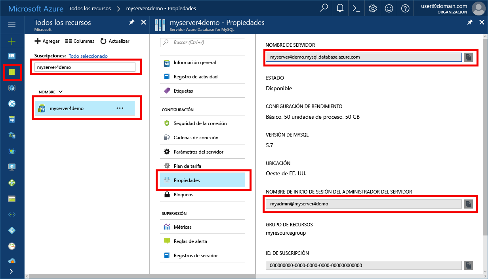

# <a name="azure-database-for-mysql-use-python-to-connect-and-query-data"></a>Azure Database for MySQL: uso de Python para conectarse y consultar datos
En este tutorial rápido se muestra cómo usar [Python](https://python.org) para conectarse a una instancia de Azure Database for MySQL. Se emplean instrucciones SQL para consultar, insertar, actualizar y eliminar datos de la base de datos en las plataformas Mac OS, Ubuntu Linux y Windows. En este tema se da por hecho que está familiarizado con el desarrollo mediante Python y que nunca ha usado Azure Database for MySQL.

## <a name="prerequisites"></a>Requisitos previos
En este tutorial rápido se usan como punto de partida los recursos creados en una de estas guías:
- [Create an Azure Database for MySQL server using Azure Portal](./quickstart-create-mysql-server-database-using-azure-portal.md) (Creación de un servidor de Azure Database for MySQL mediante Azure Portal)
- [Create an Azure Database for MySQL server using Azure CLI](./quickstart-create-mysql-server-database-using-azure-cli.md) (Creación de un servidor de Azure Database for MySQL mediante la CLI de Azure)

## <a name="install-python-and-the-mysql-connector"></a>Instalación de Python y el conector de MySQL
Instale [Python](https://www.python.org/downloads/) y el [conector de MySQL para Python](https://dev.mysql.com/downloads/connector/python/) en su propia máquina. Dependiendo de la plataforma, siga estos pasos de la sección que proceda:

### <a name="windows"></a>Windows
1. Descargue e instale Python 2.7 desde [python.org](https://www.python.org/downloads/windows/). 
2. Para comprobar la instalación de Python, inicie el símbolo del sistema. Ejecute el comando `C:\python27\python.exe -V` mediante el modificador V mayúscula para ver el número de versión.
3. Instale el conector de Python para MySQL desde [mysql.com](https://dev.mysql.com/downloads/connector/python/) que corresponda a su versión de Python.

### <a name="linux-ubuntu"></a>Linux (Ubuntu)
1. En Linux (Ubuntu), Python se instala normalmente como parte de la instalación predeterminada.
2. Para comprobar la instalación de Python, inicie el shell de Bash. Ejecute el comando `python -V` mediante el modificador V mayúscula para ver el número de versión.
3. Para comprobar la instalación de PIP, ejecute el comando `pip show pip -V` para ver el número de versión. 
4. PIP puede estar incluido en algunas versiones de Python. Si PIP no está instalado, puede instalar el paquete [PIP] (https://pip.pypa.io/en/stable/installing/) mediante la ejecución de comando `sudo apt-get install python-pip`.
5. Actualice PIP a la versión más reciente mediante la ejecución del comando `pip install -U pip`.
6. Instale el conector de MySQL para Python y sus dependencias mediante el comando PIP:

   ```bash
   sudo pip install mysql-connector-python-rf
   ```
 
### <a name="macos"></a>MacOS
1. En Mac OS, Python se instala normalmente como parte de la instalación predeterminada del sistema operativo.
2. Para comprobar la instalación de Python, inicie el shell de Bash. Ejecute el comando `python -V` mediante el modificador V mayúscula para ver el número de versión.
3. Para comprobar la instalación de PIP, ejecute el comando `pip show pip -V` para ver el número de versión.
4. PIP puede estar incluido en algunas versiones de Python. Si PIP no está instalado, puede instalar el paquete de [PIP](https://pip.pypa.io/en/stable/installing/).
5. Actualice PIP a la versión más reciente mediante la ejecución del comando `pip install -U pip`.
6. Instale el conector de MySQL para Python y sus dependencias mediante el comando PIP:

   ```bash
   pip install mysql-connector-python-rf
   ```

## <a name="get-connection-information"></a>Obtención de información sobre la conexión
Obtenga la información de conexión necesaria para conectarse a Azure Database for MySQL. Necesitará el nombre completo del servidor y las credenciales de inicio de sesión.

1. Inicie sesión en [Azure Portal](https://portal.azure.com/).
2. En el menú izquierdo de Azure Portal, haga clic en **Todos los recursos** y busque el servidor que ha creado, por ejemplo, **myserver4demo**.
3. Haga clic en el nombre del servidor **myserver4demo**.
4. Seleccione la página **Propiedades** del servidor. Tome nota del **Nombre del servidor** y del **Server admin login name** (Nombre de inicio de sesión del administrador del servidor).
 
5. Si olvida la información de inicio de sesión del servidor, navegue hasta la página **Información general** para ver el nombre de inicio de sesión del administrador del servidor y, si es necesario, restablecer la contraseña.
   

## <a name="run-python-code"></a>Ejecución de código de Python
- Pegue el código en un archivo de texto y luego guarde el archivo en una carpeta de proyecto con la extensión de archivo .py (por ejemplo, C:\pythonmysql\createtable.py o /home/username/pythonmysql/createtable.py).
- Para ejecutar el código, inicie el símbolo del sistema o el shell de Bash. Cambie el directorio a la carpeta de proyecto `cd pythonmysql`. A continuación, escriba el comando python seguido del nombre de archivo `python createtable.py` para ejecutar la aplicación. En el sistema operativo Windows, si no se encuentra python.exe, puede que tenga que proporcionar la ruta de acceso completa al archivo ejecutable o agregar la ruta de acceso de Python en la variable de entorno path. `C:\python27\python.exe createtable.py`

## <a name="connect-create-table-and-insert-data"></a>Conexión, creación de una tabla e inserción de datos
Use el código siguiente para conectarse al servidor, crear una tabla y cargar los datos mediante una instrucción SQL **INSERT**. 

En el código, se importa la biblioteca mysql.connector. La función [connect()](https://dev.mysql.com/doc/connector-python/en/connector-python-api-mysql-connector-connect.html) se usa para conectarse a Azure Database for MySQL mediante los [argumentos de conexión](https://dev.mysql.com/doc/connector-python/en/connector-python-connectargs.html) de la colección config. El código usa un cursor en la conexión, y el método [cursor.execute()](https://dev.mysql.com/doc/connector-python/en/connector-python-api-mysqlcursor-execute.html) ejecuta la consulta SQL en la base de datos MySQL. 

Reemplace los parámetros `host`, `user`, `password` y `database` por los valores especificados al crear el servidor y la base de datos.

```Python
import mysql.connector
from mysql.connector import errorcode

# Obtain connection string information from the portal
config = {
  'host':'myserver4demo.mysql.database.azure.com',
  'user':'myadmin@myserver4demo',
  'password':'yourpassword',
  'database':'quickstartdb'
}

# Construct connection string
try:
   conn = mysql.connector.connect(**config)
   print("Connection established")
except mysql.connector.Error as err:
  if err.errno == errorcode.ER_ACCESS_DENIED_ERROR:
    print("Something is wrong with the user name or password")
  elif err.errno == errorcode.ER_BAD_DB_ERROR:
    print("Database does not exist")
  else:
    print(err)
else:
  cursor = conn.cursor()

  # Drop previous table of same name if one exists
  cursor.execute("DROP TABLE IF EXISTS inventory;")
  print("Finished dropping table (if existed).")

  # Create table
  cursor.execute("CREATE TABLE inventory (id serial PRIMARY KEY, name VARCHAR(50), quantity INTEGER);")
  print("Finished creating table.")

  # Insert some data into table
  cursor.execute("INSERT INTO inventory (name, quantity) VALUES (%s, %s);", ("banana", 150))
  print("Inserted",cursor.rowcount,"row(s) of data.")
  cursor.execute("INSERT INTO inventory (name, quantity) VALUES (%s, %s);", ("orange", 154))
  print("Inserted",cursor.rowcount,"row(s) of data.")
  cursor.execute("INSERT INTO inventory (name, quantity) VALUES (%s, %s);", ("apple", 100))
  print("Inserted",cursor.rowcount,"row(s) of data.")

  # Cleanup
  conn.commit()
  cursor.close()
  conn.close()
  print("Done.")
```

## <a name="read-data"></a>Lectura de datos
Use el código siguiente para conectarse y leer los datos mediante la instrucción SQL **SELECT**. 

En el código, se importa la biblioteca mysql.connector. La función [connect()](https://dev.mysql.com/doc/connector-python/en/connector-python-api-mysql-connector-connect.html) se usa para conectarse a Azure Database for MySQL mediante los [argumentos de conexión](https://dev.mysql.com/doc/connector-python/en/connector-python-connectargs.html) de la colección config. El código usa un cursor en la conexión, y el método [cursor.execute()](https://dev.mysql.com/doc/connector-python/en/connector-python-api-mysqlcursor-execute.html) ejecuta la instrucción SQL en la base de datos MySQL. Las filas de datos se leen mediante el método [fetchall()](https://dev.mysql.com/doc/connector-python/en/connector-python-api-mysqlcursor-fetchall.html). El conjunto de resultados se mantiene en una fila de la colección y se usa un iterador for para recorrer en iteración las filas.

Reemplace los parámetros `host`, `user`, `password` y `database` por los valores especificados al crear el servidor y la base de datos.

```Python
import mysql.connector
from mysql.connector import errorcode

# Obtain connection string information from the portal
config = {
  'host':'myserver4demo.mysql.database.azure.com',
  'user':'myadmin@myserver4demo',
  'password':'yourpassword',
  'database':'quickstartdb'
}

# Construct connection string
try:
   conn = mysql.connector.connect(**config)
   print("Connection established")
except mysql.connector.Error as err:
  if err.errno == errorcode.ER_ACCESS_DENIED_ERROR:
    print("Something is wrong with the user name or password")
  elif err.errno == errorcode.ER_BAD_DB_ERROR:
    print("Database does not exist")
  else:
    print(err)
else:
  cursor = conn.cursor()

  # Read data
  cursor.execute("SELECT * FROM inventory;")
  rows = cursor.fetchall()
  print("Read",cursor.rowcount,"row(s) of data.")

  # Print all rows
  for row in rows:
    print("Data row = (%s, %s, %s)" %(str(row[0]), str(row[1]), str(row[2])))

  # Cleanup
  conn.commit()
  cursor.close()
  conn.close()
  print("Done.")
```

## <a name="update-data"></a>Actualización de datos
Use el código siguiente para conectarse y actualizar los datos mediante la instrucción SQL **UPDATE**. 

En el código, se importa la biblioteca mysql.connector.  La función [connect()](https://dev.mysql.com/doc/connector-python/en/connector-python-api-mysql-connector-connect.html) se usa para conectarse a Azure Database for MySQL mediante los [argumentos de conexión](https://dev.mysql.com/doc/connector-python/en/connector-python-connectargs.html) de la colección config. El código usa un cursor en la conexión, y el método [cursor.execute()](https://dev.mysql.com/doc/connector-python/en/connector-python-api-mysqlcursor-execute.html) ejecuta la instrucción SQL en la base de datos MySQL. 

Reemplace los parámetros `host`, `user`, `password` y `database` por los valores especificados al crear el servidor y la base de datos.

```Python
import mysql.connector
from mysql.connector import errorcode

# Obtain connection string information from the portal
config = {
  'host':'myserver4demo.mysql.database.azure.com',
  'user':'myadmin@myserver4demo',
  'password':'yourpassword',
  'database':'quickstartdb'
}

# Construct connection string
try:
   conn = mysql.connector.connect(**config)
   print("Connection established")
except mysql.connector.Error as err:
  if err.errno == errorcode.ER_ACCESS_DENIED_ERROR:
    print("Something is wrong with the user name or password")
  elif err.errno == errorcode.ER_BAD_DB_ERROR:
    print("Database does not exist")
  else:
    print(err)
else:
  cursor = conn.cursor()

  # Update a data row in the table
  cursor.execute("UPDATE inventory SET quantity = %s WHERE name = %s;", (200, "banana"))
  print("Updated",cursor.rowcount,"row(s) of data.")

  # Cleanup
  conn.commit()
  cursor.close()
  conn.close()
  print("Done.")
```

## <a name="delete-data"></a>Eliminación de datos
Use el código siguiente para conectarse y eliminar datos mediante la instrucción SQL **DELETE**. 

En el código, se importa la biblioteca mysql.connector.  La función [connect()](https://dev.mysql.com/doc/connector-python/en/connector-python-api-mysql-connector-connect.html) se usa para conectarse a Azure Database for MySQL mediante los [argumentos de conexión](https://dev.mysql.com/doc/connector-python/en/connector-python-connectargs.html) de la colección config. El código usa un cursor en la conexión, y el método [cursor.execute()](https://dev.mysql.com/doc/connector-python/en/connector-python-api-mysqlcursor-execute.html) ejecuta la consulta SQL en la base de datos MySQL. 

Reemplace los parámetros `host`, `user`, `password` y `database` por los valores especificados al crear el servidor y la base de datos.

```Python
import mysql.connector
from mysql.connector import errorcode

# Obtain connection string information from the portal
config = {
  'host':'myserver4demo.mysql.database.azure.com',
  'user':'myadmin@myserver4demo',
  'password':'yourpassword',
  'database':'quickstartdb'
}

# Construct connection string
try:
   conn = mysql.connector.connect(**config)
   print("Connection established.")
except mysql.connector.Error as err:
  if err.errno == errorcode.ER_ACCESS_DENIED_ERROR:
    print("Something is wrong with the user name or password.")
  elif err.errno == errorcode.ER_BAD_DB_ERROR:
    print("Database does not exist.")
  else:
    print(err)
else:
  cursor = conn.cursor()

  # Delete a data row in the table
  cursor.execute("DELETE FROM inventory WHERE name=%(param1)s;", {'param1':"orange"})
  print("Deleted",cursor.rowcount,"row(s) of data.")

  # Cleanup
  conn.commit()
  cursor.close()
  conn.close()
  print("Done.")
```

## <a name="next-steps"></a>Pasos siguientes
> [!div class="nextstepaction"]
> [Migración de una base de datos mediante exportación e importación](./concepts-migrate-import-export.md)
