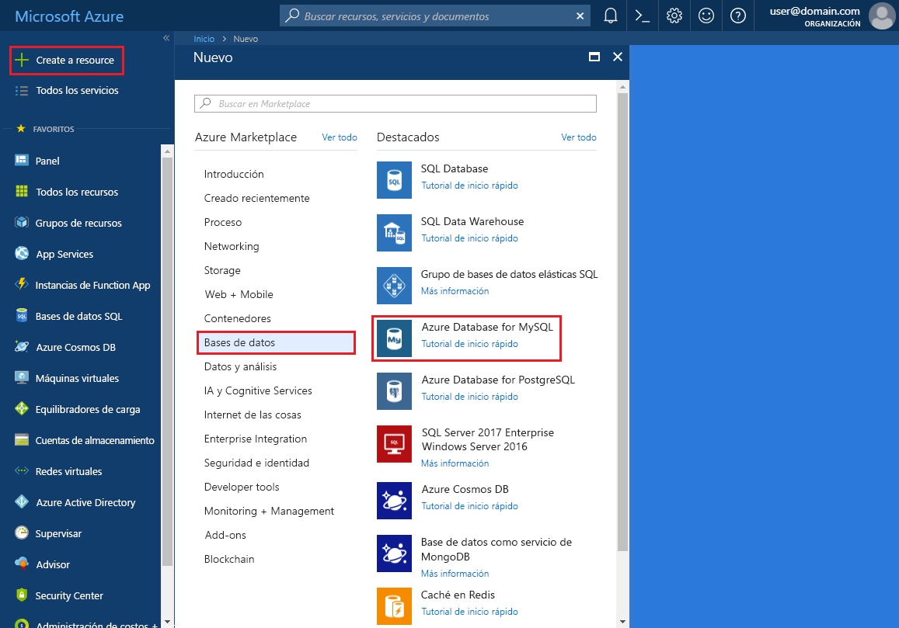

# <a name="create-an-azure-database-for-mysql-server-by-using-the-azure-portal"></a>Creación de un servidor de Azure Database for MySQL mediante Azure Portal
Azure Database for MySQL es un servicio administrado que se usa para ejecutar, administrar y escalar bases de datos MySQL de alta disponibilidad en la nube. Esta guía de inicio rápido muestra cómo crear un servidor de Azure Database for MySQL en unos cinco minutos mediante Azure Portal.  

Si no tiene una suscripción a Azure, cree una [cuenta gratuita de Azure](https://azure.microsoft.com/free/) antes de empezar.

## <a name="sign-in-to-azure"></a>Inicio de sesión en Azure
Abra el explorador web y vaya a [Azure Portal](https://portal.azure.com/). Introduzca sus credenciales para iniciar sesión en el portal. La vista predeterminada es el panel del servicio.

## <a name="create-an-azure-database-for-mysql-server"></a>Creación de un servidor de Azure Database for MySQL
Cree un servidor de Azure Database for MySQL con un conjunto definido de [recursos de proceso y almacenamiento](./concepts-compute-unit-and-storage.md). Cree el servidor dentro en un [grupo de recursos de Azure](../azure-resource-manager/resource-group-overview.md).

Para crear un servidor de Azure Database for MySQL, siga estos pasos:

1. Haga clic en el botón **Nuevo** (+) de la esquina superior izquierda de Azure Portal.

2. Seleccione **Bases de datos** > **Azure Database for MySQL**. También puede escribir **MySQL** en el cuadro de búsqueda para encontrar el servicio.

    

4. Rellene el formulario de datos del nuevo servidor con la siguiente información, como se muestra en la imagen anterior:

    **Configuración** | **Valor sugerido** | **Descripción del campo** 
    ---|---|---
    Nombre de servidor | Nombre de servidor único | Elija un nombre único que identifique al servidor de Azure Database for MySQL. Por ejemplo, myserver4demo. El nombre de dominio *mysql.database.azure.com* se anexa al nombre del servidor proporcionado. El nombre del servidor solo puede contener letras minúsculas, números y el carácter de guion (-). Debe contener entre 3 y 63 caracteres.
    La suscripción | Su suscripción | Seleccione la suscripción de Azure que quiere usar para el servidor. Si tiene varias suscripciones, elija aquella en la que se factura el recurso.
    Grupos de recursos | myresourcegroup | Proporcione un nombre de grupo de recursos nuevo o existente.
    Inicio de sesión de administrador de servidor | myadmin | Una cuenta de inicio de sesión para usarla al conectarse al servidor. El nombre de inicio de sesión de administrador no puede ser **azure_superuser**, **admin**, **administrator**, **root**, **guest** ni **public**.
    Password | *Su elección* | Proporcione una nueva contraseña para la cuenta de administrador del servidor. Debe contener entre ocho y 128 caracteres. La contraseña debe contener caracteres de tres de las siguientes categorías: letras en mayúsculas del alfabeto inglés, letras en minúscula del alfabeto inglés, números (0-9) y caracteres no alfanuméricos (!, $, #, %, etc.).
    Confirmar contraseña | *Su elección*| Confirme la contraseña de la cuenta de administrador.
    Ubicación | *Región más cercana a los usuarios*| Elija la ubicación más cercana a los usuarios u otras aplicaciones de Azure.
    Versión | *La versión más reciente*| La versión más reciente (a menos que tenga requisitos específicos que requieran otra versión).
    Plan de tarifa  | **Básico**, **50 unidades de proceso**, **50 GB** | Elija el nivel de servicio y el nivel de rendimiento de la nueva base de datos. Seleccione **Nivel básico** en la pestaña de la parte superior. Haga clic en el extremo izquierdo del control deslizante **Unidades de proceso** para ajustar el valor en la cantidad más baja disponible para este tutorial rápido. Haga clic en **Aceptar** para guardar este plan de tarifa. Para obtener más información, consulte la siguiente captura de pantalla.
    Anclar al panel | Comprobar | Active esta opción para permitir un seguimiento fácil del servidor en la página del panel frontal de Azure Portal.

    > [!IMPORTANT]
    > El nombre de usuario y la contraseña de inicio de servidor que se especifiquen aquí son necesarios para iniciar sesión tanto en el servidor como en las bases de datos de esta guía de inicio rápido. Recuerde o grabe esta información para su uso posterior.
    > 

    

4.  Seleccione **Crear** para realizar el aprovisionamiento del servidor. El aprovisionamiento puede tardar hasta 20 minutos.
   
5.  Haga clic en **Notificaciones** en la barra de herramientas (icono de campana) para supervisar el proceso de implementación.

## <a name="configure-a-server-level-firewall-rule"></a>Configuración de una regla de firewall de nivel de servidor

El servicio Azure Database for MySQL crea un firewall en el nivel de servidor. Evita que herramientas y aplicaciones externas se conecten al servidor o a las bases de datos de este, a menos que se cree una regla de firewall que lo abra para direcciones IP concretas. 

1.   Cuando finalice la implementación, busque el servidor. Si es necesario, puede buscarlo. Por ejemplo, seleccione **Todos los recursos** en el menú de la izquierda. Luego, escriba el nombre del servidor, como **myserver4demo**, para buscar el servidor recién creado. Seleccione el nombre del servidor en la lista de resultados de la búsqueda. Se abrirá la página **Introducción** del servidor, que proporciona opciones para continuar la configuración.

2. En la página del servidor, seleccione **Seguridad de la conexión**.

3.  En el encabezado **Reglas de firewall**, seleccione el cuadro de texto en blanco de la columna **Nombre de regla** para empezar a crear la regla de firewall. 

   

   En esta guía de inicio rápido, vamos a permitir que todas las direcciones IP entren en el servidor, para lo que rellenaremos los cuadros de texto de todas las columnas con los valores siguientes:

   Nombre de la regla | Dirección IP inicial | Dirección IP final 
   ---|---|---
   AllowAllIps (permitir todas las direcciones IP) |  0.0.0.0 | 255.255.255.255
   
   No se considera seguro permitir todas las direcciones IP. Este ejemplo ilustra solamente un caso sencillo. En un escenario del mundo real, debe conocer los intervalos de direcciones IP exactos que se agregarán para sus aplicaciones y usuarios. 

4. En la barra de herramientas superior de la página **Seguridad de la conexión**, seleccione **Guardar**. Antes de continuar espere hasta que aparezca la notificación que indica que la actualización ha finalizado correctamente. 

   > [!NOTE]
   > Las conexiones a Azure Database for MySQL se comunican a través del puerto 3306. Si intenta conectarse desde una red corporativa, es posible que no se permita el tráfico saliente a través del puerto 3306. En ese caso no podrá conectarse al servidor, salvo que el departamento de TI abra el puerto 3306.
   > 

## <a name="get-the-connection-information"></a>Obtención de la información de conexión
Para conectarse al servidor de bases de datos, es preciso utilizar el nombre completo del servidor y las credenciales de inicio de sesión de administrador. Es posible que anotara dichos valores en el artículo de la guía de inicio rápido. En caso de que no lo haya hecho, tanto el nombre del servidor como la información de inicio de sesión se pueden encontrar con facilidad en la página **Introducción** del servidor o en la página **Propiedades** de Azure Portal.

Para ello, siga estos pasos: 

1. Abra la página **Información general** del servidor. Tome nota del **Nombre del servidor** y del **Server admin login name** (Nombre de inicio de sesión del administrador del servidor). 

2. Desplace el cursor sobre cada campo y el icono de copiar aparece a la derecha del texto. Seleccione el icono de copiar según sea necesario para copiar los valores.

En este ejemplo, el nombre del servidor es **myserver4demo.mysql.database.azure.com** y el nombre de inicio de sesión del administrador del servidor, **myadmin@myserver4demo**.

## <a name="connect-to-mysql-by-using-the-mysql-command-line-tool"></a>Conexión a MySQL mediante la herramienta de línea de comandos mysql
Hay una serie de aplicaciones que se pueden usar para conectarse al servidor de Azure Database for MySQL. 

Ahora vamos a usar la herramienta de línea de comandos [mysql](https://dev.mysql.com/doc/refman/5.7/en/mysql.html) para conectarnos al servidor. También puede utilizar un explorador web y Azure Cloud Shell como se describe aquí sin instalar software adicional. Si la utilidad mysql está instalada localmente, también se puede conectar desde su propio equipo.

1. Inicie Azure Cloud Shell desde el icono del terminal (**>_**) de la parte superior derecha de Azure Portal.

2.  Azure Cloud Shell se abre en el explorador, donde puede escribir comandos de shell de Bash.

    

3. En el símbolo del sistema de Cloud Shell, conéctese al servidor de Azure Database for MySQL, para lo que debe escribir la línea de comandos de mysql.

    Para conectarse a un servidor de Azure Database for MySQL con la utilidad mysql, use el siguiente formato:

    ```bash
    mysql --host <fully qualified servername> --user <serveradminlogin@servername> -p
    ```

    Por ejemplo, el siguiente comando conecta con nuestro servidor de ejemplo:

    ```azurecli-interactive
    mysql --host myserver4demo.mysql.database.azure.com --user myadmin@myserver4demo -p
    ```

    parámetro mysql |Valor sugerido|Descripción
    ---|---|---
    --host | *Nombre del servidor* | El valor de nombre de servidor que usó al crear el servidor de Azure Database for MySQL. En el ejemplo, el servidor es **myserver4demo.mysql.database.azure.com**. Use el nombre de dominio completo (**\*.mysql.database.azure.com**) como se muestra en el ejemplo. Si no recuerda el nombre del servidor, siga los pasos de la sección anterior para obtener la información de conexión. 
    --user | *Nombre de inicio de sesión del administrador del servidor* |El nombre de usuario de inicio de sesión del administrador del servidor que suministró al crear el servidor de Azure Database for MySQL. Si no recuerda el nombre de usuario, siga los pasos de la sección anterior para obtener la información de conexión. El formato es *username@servername*.
    -p | *Espere hasta que se le pida* |Cuando se le pida, proporcione la misma contraseña que especificó cuando se creó el servidor. Tenga en cuenta que los caracteres de la contraseña escritos no se muestran en el símbolo del sistema de Bash al escribirlos. Después de que haya escrito la contraseña, presione **Entrar**.

   Una vez conectado, la utilidad de mysql muestra un símbolo del sistema de `mysql>`, donde puede escribir comandos. 

   A continuación puede encontrar un ejemplo de salida de mysql:

    ```bash
    Welcome to the MySQL monitor.  Commands end with ; or \g.
    Your MySQL connection id is 65505
    Server version: 5.6.26.0 MySQL Community Server (GPL)
    
    Copyright (c) 2000, 2017, Oracle and/or its affiliates. All rights reserved.
    
    Oracle is a registered trademark of Oracle Corporation and/or its
    affiliates. Other names may be trademarks of their respective
    owners.

    Type 'help;' or '\h' for help. Type '\c' to clear the current input statement.
    
    mysql>
    ```
    > [!TIP]
    > Si el firewall no está configurado para permitir la dirección IP de la instancia de Azure Cloud Shell, aparece el siguiente error:
    >
    > ERROR 2003 (28000): no está permitido que el cliente con la dirección IP 123.456.789.0 acceda al servidor.
    >
    > Para resolver el error, asegúrese de que la configuración del servidor coincida con los pasos descritos en la sección "Configuración de una regla de firewall de nivel de servidor" del artículo.

4. Para asegurarse de que la conexión es funcional, ver el estado del servidor, para lo que debe escribir `status` en el símbolo del sistema de mysql > .

    ```sql
    status
    ```

   > [!TIP]
   > Para otros comandos, consulte el [capítulo 4.5.1 del Manual de referencia de MySQL 5.7](https://dev.mysql.com/doc/refman/5.7/en/mysql.html).

5.  Cree una base de datos en blanco en el símbolo del sistema de **mysql>**, para lo que debe escribir el siguiente comando:
    ```sql
    CREATE DATABASE quickstartdb;
    ```
    El comando puede tardar un rato en completarse. 

    En un servidor de Azure Database for MySQL, puede crear una o varias bases de datos. Puede optar por crear una sola base de datos por servidor para que se usen todos los recursos, o bien crear varias bases de datos para compartir los recursos. No hay límite en el número de bases de datos que se pueden crear, pero varias bases de datos comparten los mismos recursos del servidor. 

6. Escriba el comando siguiente para enumerar las bases de datos en el símbolo del sistema **mysql>**:

    ```sql
    SHOW DATABASES;
    ```

7.  Escriba `\q` y presione la tecla **Entrar** tecla para cerrar la herramienta mysql. Cuando haya terminado, puede cerrar Azure Cloud Shell.

Ya está conectado al servidor de Azure Database for MySQL y ha creado una base de datos de usuario en blanco. En la sección siguiente encontrará un ejercicio similar. En el siguiente ejercicio se conecta al mismo servidor con otra herramienta común, MySQL Workbench.

## <a name="connect-to-the-server-by-using-the-mysql-workbench-gui-tool"></a>Conexión al servidor mediante la herramienta de interfaz gráfica de usuario MySQL Workbench
Para conectarse al servidor mediante la herramienta de interfaz gráfica de usuario MySQL Workbench, siga estos pasos:

1.  Abra la aplicación MySQL Workbench en el equipo cliente. MySQL Workbench se puede descargar e instalar desde [Download MySQL Workbench](https://dev.mysql.com/downloads/workbench/) (Descargar MySQL Workbench).

2. Cree una nueva conexión. Haga clic en el icono del signo más (+) situado junto al encabezado **MySQL Connections** (Conexiones MySQL).

3. En el cuadro de diálogo **Setup New Connection** (Configurar nueva conexión), escriba la información de la conexión del servidor en la pestaña **Parameters** (Parámetros). Los valores de marcador de posición se muestran como ejemplo. Reemplace el nombre de host, el nombre de usuario y la contraseña por sus propios valores.

    

    |Configuración |Valor sugerido|Descripción del campo|
    |---|---|---|
     Nombre de conexión | Conexión de demostración | Una etiqueta para esta conexión. |
    Método de conexión | Estándar (TCP/IP) | Estándar (TCP/IP) es suficiente. |
    Nombre de host. | *Nombre del servidor* | El valor de nombre de servidor que usó al crear el servidor de Azure Database for MySQL. En el ejemplo, el servidor es **myserver4demo.mysql.database.azure.com**. Use el nombre de dominio completo (**\*.mysql.database.azure.com**) como se muestra en el ejemplo. Si no recuerda el nombre del servidor, siga los pasos de la sección anterior para obtener la información de conexión.|
     Port | 3306 | El puerto que se usa al conectarse al servidor de base de datos de Azure Database for MySQL. |
    Nombre de usuario |  *Nombre de inicio de sesión del administrador del servidor* | La información de inicio de sesión del administrador del servidor que especificó al crear el servidor de Azure Database for MySQL. El nombre de usuario del ejemplo es **myadmin@myserver4demo**. Si no recuerda el nombre de usuario, siga los pasos de la sección anterior para obtener la información de conexión. El formato es *username@servername*.
    Password | *Su contraseña* | Haga clic en el botón **Store in Vault...** (Almacenar en almacén) para guardar la contraseña. |

4. Seleccione **Probar conexión** para probar si todos los parámetros están configurados correctamente. Luego, seleccione **Aceptar** para guardar la conexión. 

    > [!NOTE]
    > SSL se aplica de forma predeterminada en el servidor que requiere mayor configuración para conectarse correctamente. Para más información, consulte [Configuración de la conectividad SSL en la aplicación para conectarse de forma segura a Azure Database for MySQL](./howto-configure-ssl.md). Para deshabilitar SSL para este guía de inicio rápido, vaya a Azure Portal. Luego, seleccione la página de seguridad de la conexión para deshabilitar el botón de alternancia **Aplicar conexión SSL**.

## <a name="clean-up-resources"></a>Limpieza de recursos
Hay dos forma de eliminar los recursos que ha creado en la guía de inicio rápido. Puede eliminar el [grupo de recursos de Azure](../azure-resource-manager/resource-group-overview.md), lo que incluye todos los recursos del grupo de recursos. Si desea mantener intactos los restantes recursos, elimine solo el único recurso del servidor.

> [!TIP]
> Otras guías de inicio rápido de esta colección se basan en esta. Si tiene previsto seguir usando otras guías de inicio rápido, no elimine los recursos que ha creado en esta. Si no tiene previsto continuar, siga estos pasos para eliminar todos los recursos que ha creado en esta.
>

Para eliminar todo el grupo de recursos, incluido el servidor recién creado, siga estos pasos:

1.  Elimine el grupo de recursos en Azure Portal. En el menú de la izquierda, seleccione **Grupos de recursos** y, después, el nombre del grupo de recursos (en el ejemplo, **myresourcegroup**).

2.  En la página del grupo de recursos, seleccione **Eliminar**. Luego, escriba el nombre del grupo de recursos (en el ejemplo, **myresourcegroup**) en el cuadro para confirmar la eliminación y seleccione **Eliminar**.

Para eliminar solo el servidor recién creado, siga estos pasos:

1.  Busque el servidor en Azure Portal si no lo tiene abierto. Seleccione **Todos los recursos** en el menú de la izquierda de Azure Portal. Luego busque el servidor que ha creado.

2.  En la página **Introducción**, seleccione **Eliminar**. 

    

3.  Confirme el nombre del servidor que desea eliminar y muestre las bases de datos incluidas. Escriba el nombre del servidor en el cuadro (en nuestro ejemplo, **myserver4demo**). Seleccione **Eliminar**.

## <a name="next-steps"></a>Pasos siguientes

> [!div class="nextstepaction"]
> [Diseño de la primera base de datos de Azure Database for MySQL](./tutorial-design-database-using-portal.md)

