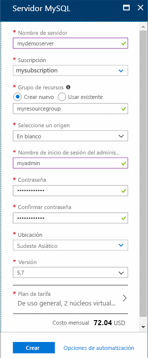
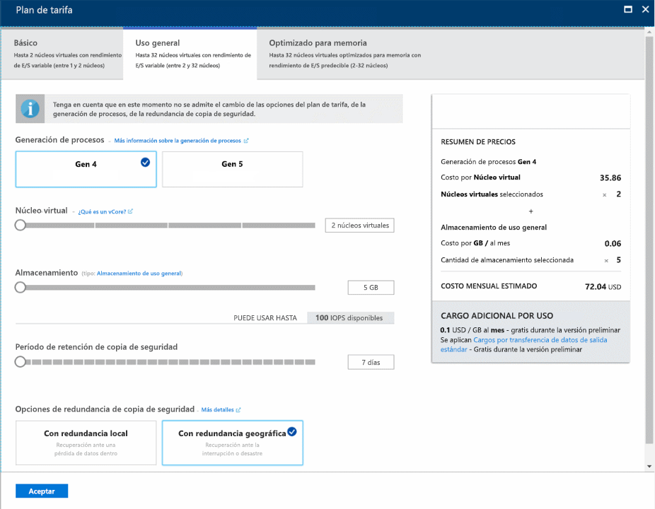

# <a name="design-your-first-azure-database-for-mysql-database"></a>Diseño de la primera base de datos de Azure Database for MySQL
Azure Database for MySQL es un servicio administrado que le permite ejecutar, administrar y escalar bases de datos de MySQL de alta disponibilidad en la nube. Con Azure Portal puede administrar fácilmente el servidor y diseñar una base de datos.

En este tutorial usará Azure Portal para aprender a hacer lo siguiente:

> [!div class="checklist"]
> * Creación de una instancia de Azure Database for MySQL
> * Configuración del firewall del servidor
> * Usar la herramienta de línea de comandos de mysql para crear una base de datos
> * Carga de datos de ejemplo
> * Datos de consulta
> * Actualización de datos
> * Restauración de datos

## <a name="sign-in-to-the-azure-portal"></a>Inicie sesión en el Portal de Azure.
Abra el explorador web de su preferencia y visite [Microsoft Azure Portal](https://portal.azure.com/). Introduzca sus credenciales para iniciar sesión en el portal. La vista predeterminada es el panel del servicio.

## <a name="create-an-azure-database-for-mysql-server"></a>Creación de un servidor de Azure Database for MySQL
Se crea un servidor de Azure Database for MySQL con un conjunto definido de [recursos de proceso y almacenamiento](./concepts-compute-unit-and-storage.md). El servidor se crea dentro de un [grupo de recursos de Azure](https://docs.microsoft.com/azure/azure-resource-manager/resource-group-overview).

1. Vaya a **Bases de datos** > **Azure Database for MySQL**. Si no encuentra el servidor MySQL en la categoría **Bases de datos**, haga clic en **Ver todo** para mostrar todos los servicios de base de datos disponibles. También puede escribir **Azure Database for MySQL** en el cuadro de búsqueda para encontrar el servicio rápidamente.
   
   

2. Haga clic en el icono **Azure Database for MySQL** y, después, en **Crear**. Rellene el formulario de Azure Database for MySQL.
   
   

    **Configuración** | **Valor sugerido** | **Descripción del campo** 
    ---|---|---
    Nombre de servidor | Nombre de servidor único | Elija un nombre único que identifique al servidor de Azure Database for MySQL. Por ejemplo, mydemoserver. El nombre de dominio *mysql.database.azure.com* se anexa al nombre del servidor proporcionado. El nombre del servidor solo puede contener letras minúsculas, números y el carácter de guion (-). Debe contener entre 3 y 63 caracteres.
    La suscripción | Su suscripción | Seleccione la suscripción de Azure que quiere usar para el servidor. Si tiene varias suscripciones, elija aquella en la que se factura el recurso.
    Grupos de recursos | *myresourcegroup* | Proporcione un nombre de grupo de recursos nuevo o existente.    Grupos de recursos|*myresourcegroup*| Un nuevo nombre de grupo de recursos o uno existente de la suscripción.
    Seleccionar origen | *En blanco* | Seleccione *En blanco* para crear un nuevo servidor desde el principio. (Seleccione *Copia de seguridad* si va a crear un servidor a partir de una copia de seguridad con redundancia geográfica de un servidor existente de Azure Database for MySQL).
    Inicio de sesión de administrador de servidor | myadmin | Una cuenta de inicio de sesión para usarla al conectarse al servidor. El nombre de inicio de sesión de administrador no puede ser **azure_superuser**, **admin**, **administrator**, **root**, **guest** ni **public**.
    Password | *Su elección* | Proporcione una nueva contraseña para la cuenta de administrador del servidor. Debe contener entre ocho y 128 caracteres. La contraseña debe contener caracteres de tres de las siguientes categorías: letras en mayúsculas del alfabeto inglés, letras en minúscula del alfabeto inglés, números (0-9) y caracteres no alfanuméricos (!, $, #, %, etc.).
    Confirmar contraseña | *Su elección*| Confirme la contraseña de la cuenta de administrador.
    Ubicación | *Región más cercana a los usuarios*| Elija la ubicación más cercana a los usuarios o a sus otras aplicaciones de Azure.
    Versión | *La versión más reciente*| La versión más reciente (a menos que tenga requisitos específicos que requieran otra versión).
    Nivel de precios | **Uso general**, **Gen 4**, **2 núcleos virtuales**, **5 GB**, **7 días**, **Redundancia geográfica** | Configuración de los recursos de proceso, almacenamiento y copia de seguridad para el nuevo servidor. Seleccione **Plan de tarifa**. A continuación, seleccione la pestaña **Uso general**. *Gen 4*, *2 núcleos virtuales*, *5 GB* y *7 días* son los valores predeterminados de **Generación de procesos**, **Núcleos virtuales**, **Almacenamiento** y **Período de retención de copia de seguridad**. Puede dejar los controles deslizantes tal y como están. Para habilitar las copias de seguridad del servidor en el almacenamiento con redundancia geográfica, seleccione **Redundancia geográfica** en **Opciones de redundancia de copia de seguridad**. Para guardar el plan de tarifa elegido, seleccione **Aceptar**. La captura de pantalla siguiente muestra estas opciones seleccionadas.
    
   

3. Haga clic en **Create**(Crear). En un par de minutos, tendrá un servidor nuevo de Azure Database for MySQL en ejecución en la nube. Puede hacer clic en el botón **Notificaciones** de la barra de herramientas para supervisar el proceso de implementación.

## <a name="configure-firewall"></a>Configuración del firewall
Las bases de datos de Azure para MySQL están protegidas con un firewall. De forma predeterminada, se rechazan todas las conexiones al servidor y a las bases de datos del servidor. Antes de conectarse a Azure Database for MySQL por primera vez, configure el firewall para agregar la dirección IP (o intervalo de direcciones IP) de red pública del equipo cliente.

1. Haga clic en el servidor recién creado y, luego, en **Seguridad de la conexión**.
   
   
2. Puede **agregar su dirección IP** o configurar aquí las reglas de firewall. Recuerde hacer clic en **Guardar** después de haber creado las reglas.
Ahora puede conectarse al servidor con la herramienta de línea de comandos de MySQL o la herramienta MySQL Workbench de la GUI.

> [!TIP]
> El servidor de Azure Database for MySQL se comunica a través del puerto 3306. Si intenta conectarse desde una red corporativa, es posible que el firewall de la red no permita el tráfico saliente a través del puerto 3306. En ese caso, no puede conectarse al servidor de Azure MySQL, a menos que el departamento de TI abra el puerto 3306.

## <a name="get-connection-information"></a>Obtención de información sobre la conexión
Obtenga en Azure Portal el **nombre de servidor** y el **nombre de inicio de sesión de administrador de servidor** completos para el servidor de Azure Database for MySQL. Usará el nombre completo del servidor para conectarse al servidor a través de la herramienta de línea de comandos de MySQL. 

1. En [Azure Portal](https://portal.azure.com/), haga clic en **Todos los recursos** en el menú izquierdo, escriba el nombre y busque el servidor de Azure Database for MySQL. Seleccione el nombre del servidor para ver los detalles.

2. En la página **Información general**, anote los valores de **Nombre de servidor** y **Nombre de inicio de sesión del administrador del servidor**. Puede hacer clic en el botón Copiar situado junto a cada campo para copiar el valor en el Portapapeles.
   

En este ejemplo, el nombre del servidor es *mydemoserver.mysql.database.azure.com* y el inicio de sesión del administrador del servidor es *myadmin@mydemoserver*.

## <a name="connect-to-the-server-using-mysql"></a>Conexión al servidor con MySQL
Use la [herramienta de línea de comandos mysql](https://dev.mysql.com/doc/refman/5.7/en/mysql.html) para establecer una conexión con el servidor de Azure Database for MySQL. Puede ejecutar la herramienta mysql de la línea de comandos desde Azure Cloud Shell en el explorador o desde su propio equipo mediante herramientas mysql instaladas de forma local. Para iniciar Azure Cloud Shell, haga clic en el botón `Try It` situado en un bloque de código de este artículo, o visite Azure Portal y haga clic en el icono `>_` de la barra de herramientas situada en la parte superior derecha. 

Escriba el comando para conectarse:
```azurecli-interactive
mysql -h mydemoserver.mysql.database.azure.com -u myadmin@mydemoserver -p
```

## <a name="create-a-blank-database"></a>Crear una base de datos en blanco
Una vez conectado al servidor, cree una base de datos vacía con la cual trabajar.
```sql
CREATE DATABASE mysampledb;
```

En el símbolo del sistema, ejecute el comando siguiente para cambiar la conexión a esta base de datos recién creada:
```sql
USE mysampledb;
```

## <a name="create-tables-in-the-database"></a>Creación de tablas en la base de datos
Ahora que sabe cómo conectarse a la base de datos de Azure Database for MySQL, puede completar algunas tareas básicas:

En primer lugar, cree una tabla y cárguela con algunos datos. Vamos a crear una tabla que almacena la información del inventario.
```sql
CREATE TABLE inventory (
    id serial PRIMARY KEY, 
    name VARCHAR(50), 
    quantity INTEGER
);
```

## <a name="load-data-into-the-tables"></a>Carga de datos en las tablas
Ahora que tiene una tabla, inserte algunos datos en ella. En la ventana de símbolo del sistema abierta, ejecute la consulta siguiente para insertar algunas filas de datos.
```sql
INSERT INTO inventory (id, name, quantity) VALUES (1, 'banana', 150); 
INSERT INTO inventory (id, name, quantity) VALUES (2, 'orange', 154);
```

Ahora tiene dos filas de datos de ejemplo en la tabla que creó anteriormente.

## <a name="query-and-update-the-data-in-the-tables"></a>Consulta y actualización de los datos en las tablas
Ejecute la consulta siguiente para recuperar información de la tabla de base de datos.
```sql
SELECT * FROM inventory;
```

También puede actualizar los datos en las tablas.
```sql
UPDATE inventory SET quantity = 200 WHERE name = 'banana';
```

La fila se actualiza en consecuencia cuando se recuperan los datos.
```sql
SELECT * FROM inventory;
```

## <a name="restore-a-database-to-a-previous-point-in-time"></a>Restauración de una base de datos a un momento anterior en el tiempo
Imagine que ha eliminado accidentalmente una tabla de base de datos importantes y no puede recuperar los datos fácilmente. Azure Database for MySQL permite restaurar el servidor a un momento dado, ya que crea una copia de las bases de datos en un nuevo servidor. Puede usar este servidor nuevo para recuperar los datos eliminados. Los pasos siguientes restauran el servidor de ejemplo a un punto antes de que se agregara la tabla.

1. En Azure Portal, localice Azure Database for MySQL. En la página **Información general**, haga clic en **Restaurar** en la barra de herramientas. Se abre la página de restauración.

   

2. Rellene el formulario de **restauración** con la información necesaria.
   
   
   
   - **Punto de restauración**: seleccione un momento dado al que quiere restaurar, en el período de tiempo que aparece. Asegúrese de que convierte la zona horaria local a UTC.
   - **Restaurar en el servidor nuevo**: especifique el nombre del nuevo servidor donde quiere restaurar.
   - **Ubicación**: la región es la misma que la del servidor de origen y no se puede cambiar.
   - **Plan de tarifa**: es el mismo que el del servidor de origen y no se puede cambiar.
   
3. Haga clic en **Aceptar** para restaurar el servidor a un [momento dado](./howto-restore-server-portal.md) antes de que se eliminara la tabla. Al restaurar un servidor, se crea una nueva copia del servidor a partir del momento dado que especifique. 

## <a name="next-steps"></a>pasos siguientes
En este tutorial uso Azure Portal para aprender a hacer lo siguiente:

> [!div class="checklist"]
> * Creación de una instancia de Azure Database for MySQL
> * Configuración del firewall del servidor
> * Usar la herramienta de línea de comandos de mysql para crear una base de datos
> * Carga de datos de ejemplo
> * Datos de consulta
> * Actualización de datos
> * Restauración de datos

> [!div class="nextstepaction"]
> [Conexión de aplicaciones a Azure Database for MySQL](./howto-connection-string.md)
