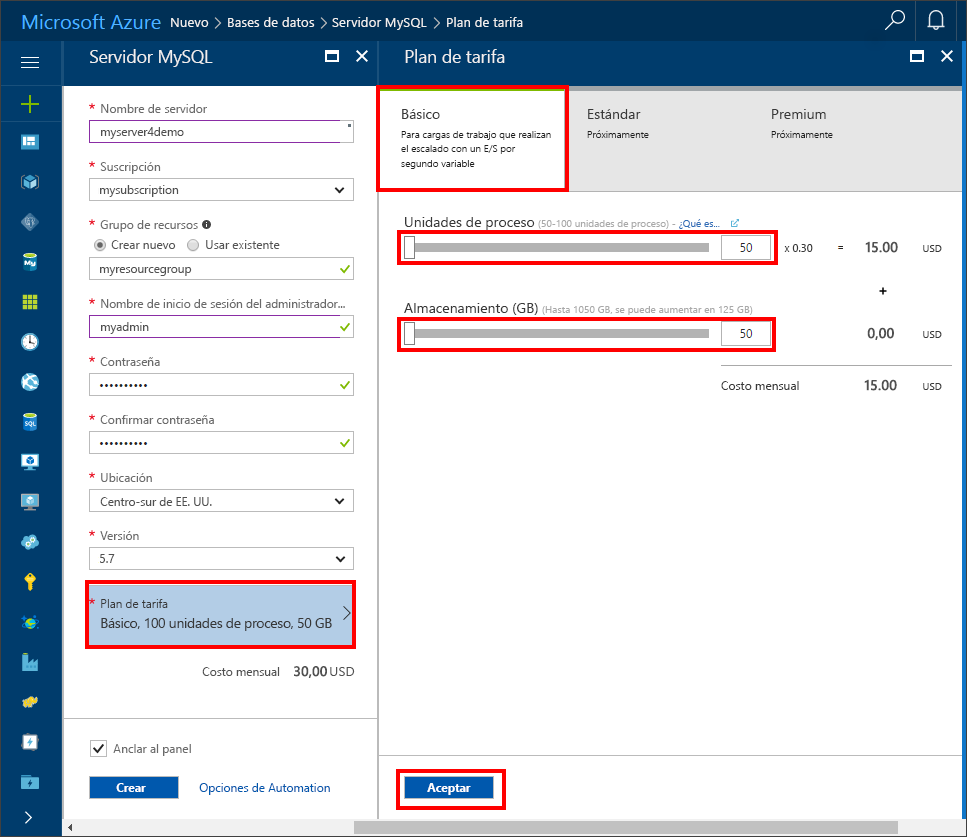

# <a name="design-your-first-azure-database-for-mysql-database"></a>Diseño de la primera base de datos de Azure Database for MySQL

Azure Database for MySQL es un servicio administrado que le permite ejecutar, administrar y escalar bases de datos de MySQL de alta disponibilidad en la nube. Con Azure Portal puede administrar fácilmente el servidor y diseñar una base de datos.

En este tutorial usará Azure Portal para aprender a hacer lo siguiente:

> [!div class="checklist"]
> * Creación de una instancia de Azure Database for MySQL
> * Configuración del firewall del servidor
> * Uso de la [herramienta de línea de comandos de mysql](https://dev.mysql.com/doc/refman/5.6/en/mysql.html) para crear una base de datos
> * Carga de datos de ejemplo
> * Datos de consulta
> * Actualización de datos
> * Restauración de datos

## <a name="log-in-to-the-azure-portal"></a>Iniciar sesión en el portal de Azure
Abra el explorador web de su preferencia y visite [Microsoft Azure Portal](https://portal.azure.com/). Escriba su credencial para iniciar sesión en el portal. La vista predeterminada es el panel del servicio.

## <a name="create-an-azure-database-for-mysql-server"></a>Creación de un servidor de Azure Database for MySQL
Se crea un servidor de Azure Database for MySQL con un conjunto definido de [recursos de proceso y almacenamiento](./concepts-compute-unit-and-storage.md). El servidor se crea dentro de un [grupo de recursos de Azure](https://docs.microsoft.com/en-us/azure/azure-resource-manager/resource-group-overview).

1.    Vaya a **Bases de datos** -> **MySQL**. Si no encuentra el servidor MySQL en la categoría **Bases de datos**, haga clic en **Ver todo** para mostrar todos los servicios de base de datos disponibles. También puede escribir **MySQL** en el cuadro de búsqueda para encontrar el servicio rápidamente.


2.    Haga clic en el icono **MySQL** y, luego en **Crear**.

En nuestro ejemplo, rellene el formulario de Azure Database for MySQL con la siguiente información:

| **Campo del formulario** | **Descripción del campo** |
|----------------|-----------------------|
| *Nombre del servidor* | mysqlserver4demo (el nombre del servidor es único a nivel global) |
| *Suscripción* | MySQLaaS (seleccione en la lista desplegable) |
| *Grupos de recursos* | myresource (cree un grupo de recursos o use uno existente) |
| *Inicio de sesión del administrador del servidor* | myadmin (dé un nombre a la cuenta de administrador) |
| *Password* | indique la contraseña de la cuenta de administrador |
| *Confirmar contraseña* | confirme la contraseña de la cuenta de administrador |
| *Ubicación* | Europa del Norte (seleccione **Europa del Norte** o **Oeste de EE. UU.**) |
| *Versión* | 5.6 (elija la versión del servidor MySQL) |
| *Configurar rendimiento* | Básico (elija el **Nivel de rendimiento**, las **Unidades de proceso**, el **Almacenamiento** y haga clic en **Aceptar**) |

A continuación, haga clic en **Crear**. En un par de minutos, tendrá un servidor nuevo de Azure Database for MySQL en ejecución en la nube. Puede hacer clic en el botón **Notificaciones** de la barra de herramientas para supervisar el proceso de implementación.

> [!TIP]
> Se recomienda colocar los servicios de Azure en la misma región y seleccionar la ubicación que le resulte más próxima. Además, puede marcar la opción **Anclar al panel** para realizar el seguimiento de las implementaciones fácilmente.



## <a name="configure-firewall"></a>Configuración del firewall
Las bases de datos de Azure para MySQL están protegidas con un firewall. De forma predeterminada, se rechazan todas las conexiones al servidor y a las bases de datos del servidor. Antes de conectarse a Azure Database for MySQL desde el cliente por primera vez, debe configurar el firewall y agregar la dirección IP (o intervalo de direcciones IP) de red pública del cliente a la lista de permitidos.

1.    Haga clic en el servidor recién creado y, luego, en **Seguridad de la conexión**.


2.    Puede **agregar su dirección IP** o configurar aquí las reglas de firewall. Recuerde hacer clic en **Guardar** después de haber creado las reglas.

Ahora puede conectarse al servidor con la herramienta de línea de comandos de MySQL o la herramienta MySQL Workbench de la GUI.

> El servidor de Azure Database for MySQL se comunica a través del puerto 3306. Si intenta conectarse desde una red corporativa, es posible que el firewall de la red no permita el tráfico saliente a través del puerto 3306. Si es así, no podrá conectarse al servidor MySQL de Azure a menos que el departamento de TI abra el puerto 3306.

## <a name="get-connection-information"></a>Obtención de información sobre la conexión
En Azure Portal encontrará el nombre completo del servidor Azure MySQL. Usará el nombre completo del servidor para conectarse al servidor a través de la herramienta de línea de comandos de MySQL.

1.    En [Azure Portal](https://portal.azure.com/), haga clic en **Todos los recursos** en el menú izquierdo y en el servidor de Azure Database for MySQL.

2.    Haga clic en **Propiedades**. Anote los valores de **NOMBRE DEL SERVIDOR** e **INICIO DE SESIÓN DEL ADMINISTRADOR DEL SERVIDOR**.


En este ejemplo, el nombre del servidor es *mysql4doc.database.windows.net* y el inicio de sesión del administrador del servidor, *mysqladmin@mysql4doc*.

## <a name="connect-to-the-server-using-mysql"></a>Conexión al servidor con MySQL
Use la [herramienta de línea de comandos mysql](https://dev.mysql.com/doc/refman/5.6/en/mysql.html) para establecer una conexión con el servidor de Azure Database for MySQL. En este ejemplo, el comando es:
```cmd
mysql -h mysqlserver4demo.database.windows.net -u myadmin@mysqlserver4demo -p
```

## <a name="create-a-blank-database"></a>Crear una base de datos en blanco
Una vez conectado al servidor, cree una base de datos vacía con la cual trabajar.
```sql
CREATE DATABASE mysampledb;
```

En el símbolo del sistema, ejecute el comando siguiente para cambiar la conexión a esta base de datos recién creada:
```sql
USE mysampledb;
```

## <a name="create-tables-in-the-database"></a>Creación de tablas en la base de datos
Ahora que sabe cómo conectarse a la base de datos de Azure Database for MySQL, podemos ver cómo completar algunas tareas básicas.

En primer lugar, podemos crear una tabla y cargarla con algunos datos. Vamos a crear una tabla que almacena la información del inventario.
```sql
CREATE TABLE inventory (
    id serial PRIMARY KEY, 
    name VARCHAR(50), 
    quantity INTEGER
);
```

## <a name="load-data-into-the-tables"></a>Carga de datos en las tablas
Ahora que tenemos una tabla, podemos insertar algunos datos en ella. En la ventana de símbolo del sistema abierta, ejecute la consulta siguiente para insertar algunas filas de datos.
```sql
INSERT INTO inventory (id, name, quantity) VALUES (1, 'banana', 150); 
INSERT INTO inventory (id, name, quantity) VALUES (2, 'orange', 154);
```

Ahora tiene dos filas de datos de ejemplo en la tabla que creó anteriormente.

## <a name="query-and-update-the-data-in-the-tables"></a>Consulta y actualización de los datos en las tablas
Ejecute la consulta siguiente para recuperar información de la tabla de base de datos.
```sql
SELECT * FROM inventory;
```

También puede actualizar los datos en las tablas.
```sql
UPDATE inventory SET quantity = 200 WHERE name = 'banana';
```

La fila se actualiza en consecuencia cuando se recuperan los datos.
```sql
SELECT * FROM inventory;
```

## <a name="restore-a-database-to-a-previous-point-in-time"></a>Restauración de una base de datos a un momento anterior en el tiempo
Imagine que eliminó accidentalmente esta tabla. No se puede recuperar con facilidad. Azure Database for MySQL permite volver a cualquier momento dado en el período de los últimos 35 días y restaurar este momento en un servidor nuevo. Puede usar este servidor nuevo para recuperar los datos eliminados. Los pasos siguientes restauran el servidor de ejemplo a un punto antes de que se agregara la tabla.

1- En la página Azure Data for MySQL del servidor, haga clic en **Restaurar** en la barra de herramientas. Se abre la página de **restauración**.


2- Rellene el formulario de **restauración** con la información necesaria:

-    Punto de restauración: seleccione el momento antes de que se modificara la base de datos.
-    Servidor de destino: especifique el nombre del nuevo servidor donde desea restaurar.
-    Ubicación: no se puede seleccionar la región; de forma predeterminada, es la misma que la del servidor de origen.
-    Plan de tarifa: no se puede cambiar este valor al restaurar un servidor. Es el mismo que el del servidor de origen.


3- Haga clic en **Aceptar** para restaurar el servidor a un [momento dado](./howto-restore-server-portal.md) antes de que se eliminaran las tablas. Restaurar un servidor a un momento dado distinto crea un servidor nuevo duplicado como el servidor original a partir del momento dado que especifique, siempre que se encuentren dentro del período de retención para el nivel de servicio.

## <a name="next-steps"></a>Pasos siguientes

En este tutorial uso Azure Portal para aprender a hacer lo siguiente:

> [!div class="checklist"]
> * Creación de una instancia de Azure Database for MySQL
> * Configuración del firewall del servidor
> * Uso de la [herramienta de línea de comandos de mysql](https://dev.mysql.com/doc/refman/5.6/en/mysql.html) para crear una base de datos
> * Carga de datos de ejemplo
> * Datos de consulta
> * Actualización de datos
> * Restauración de datos

[Creación y administración de reglas de firewall de Azure Database for MySQL mediante Azure Portal](./howto-manage-firewall-using-portal.md)

