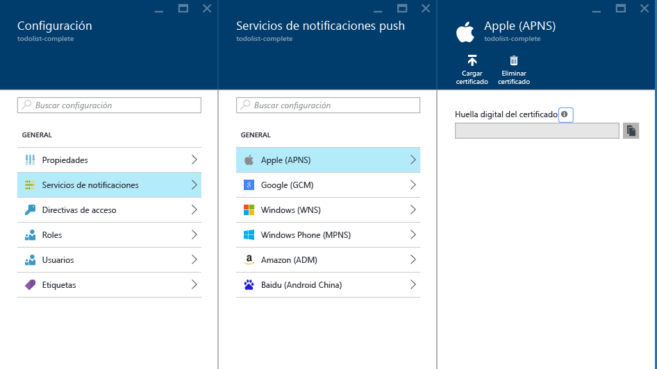
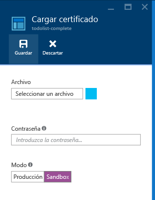

# Envío de notificaciones push a iOS con los Centros de notificaciones de Azure
[!INCLUDE [notification-hubs-selector-get-started](../../includes/notification-hubs-selector-get-started.md)]

## Información general
> [!NOTE]
> Para completar este tutorial, deberá tener una cuenta de Azure activa. En caso de no tener ninguna, puede crear una cuenta de evaluación gratuita en tan solo unos minutos. Para obtener más información, consulte [Evaluación gratuita de Azure](https://azure.microsoft.com/pricing/free-trial/?WT.mc_id=A0E0E5C02&amp;returnurl=http%3A%2F%2Fazure.microsoft.com%2Fen-us%2Fdocumentation%2Farticles%2Fnotification-hubs-ios-get-started).
> 
> 

Este tutorial muestra cómo puede utilizar los Centros de notificaciones de Azure para enviar notificaciones de inserción a una aplicación iOS. Creará una aplicación iOS vacía que recibe notificaciones push mediante el [Servicio de notificaciones push de Apple (APN)](https://developer.apple.com/library/ios/documentation/NetworkingInternet/Conceptual/RemoteNotificationsPG/Chapters/ApplePushService.html). 

Cuando haya finalizado, podrá usar el centro de notificaciones para difundir notificaciones push a todos los dispositivos que ejecutan su aplicación.

## Antes de empezar
[!INCLUDE [notification-hubs-hero-slug](../../includes/notification-hubs-hero-slug.md)]

El código completo de este tutorial se puede encontrar [en GitHub](https://github.com/Azure/azure-notificationhubs-samples/tree/master/iOS/GetStartedNH/GetStarted). 

## Requisitos previos
Este tutorial requiere lo siguiente:

* [SDK de iOS versión 1.2.4 para Servicios móviles]
* La versión más reciente de [Xcode]
* Un dispositivo compatible con iOS 8 (o una versión posterior)
* [programa para desarrolladores de Apple](https://developer.apple.com/programs/) 
  
  > [!NOTE]
  > Debido a los requisitos de configuración de las notificaciones push, debe implementar y probar estas en un dispositivo iOs físico (iPhone o iPad) en lugar de en el simulador de iOS.
  > 
  > 

La realización de este tutorial es un requisito previo para todos los demás tutoriales de Centros de notificaciones para aplicaciones iOS.

[!INCLUDE [Notification Hubs Enable Apple Push Notifications](../../includes/notification-hubs-enable-apple-push-notifications.md)]

## Configuración del Centro de notificaciones para notificaciones push de iOS
Esta sección le guía en la creación de un nuevo centro de notificaciones y la configuración de la autenticación con APNS mediante el certificado de inserción **.p12** que creó. Si desea usar un centro de notificaciones ya creado, puede omitir los pasos hasta el paso 5.

[!INCLUDE [notification-hubs-portal-create-new-hub](../../includes/notification-hubs-portal-create-new-hub.md)]

<ol start="6">

<li>

Haga clic en el botón <b>Servicios de notificaciones</b> en la hoja <b>Configuración</b> y, después, seleccione <b>Apple (APNs)</b>. Haga clic en <b>Cargar certificado</b> y seleccione el archivo <b>.p12</b> que exportó anteriormente. Asegúrese de que también especifica la contraseña correcta.

Asegúrese de seleccionar el modo <b>Espacio aislado</b> ya que esto es para desarrollo. Use el modo <b>Producción</b> únicamente si desea enviar notificaciones de inserción a los usuarios que compraron la aplicación en la tienda.

</li>
</ol>
&emsp;&emsp;&emsp;&emsp;

&emsp;&emsp;&emsp;&emsp;

Su centro de notificaciones está ahora configurado para funcionar con APNS, y tiene las cadenas de conexión para registrar su aplicación y enviar notificaciones push.

## Conexión de la aplicación iOS a los Centros de notificaciones
1. En XCode, cree un nuevo proyecto iOS y seleccione la plantilla **Single View Application** (Aplicación de vista sencilla).
   
    ![Xcode: aplicación de vista única][8]
    
2. Al configurar las opciones para su nuevo proyecto, asegúrese de usar el mismo **nombre de producto** e **identificador de organización** que usó cuando estableció anteriormente el identificador de paquete en el portal de desarrollo de Apple.
   
    ![Xcode: opciones de proyecto][11]
    
3. En **Targets** (Destinos), haga clic en el nombre de proyecto, luego haga clic en la pestaña **Build Settings** (Compilar configuración) y expanda **Code Signing Identity** (Identidad de firma de código); a continuación, en **Debug** (Depurar), establezca la identidad de firma de código. Alterne los **niveles** entre **Basic** (Básico) hasta **All** (Todos) y establezca el **perfil de aprovisionamiento** en el perfil de aprovisionamiento que creó anteriormente.
   
    Si no ve el nuevo perfil de aprovisionamiento que creó en Xcode, intente actualizar los perfiles de la identidad de firma. Haga clic en **Xcode** en la barra de menús, en **Preferences** (Preferencias), en la pestaña **Account** (Cuenta), en el botón **View Details** (Ver detalles), en la identidad de firma y, por último, en el botón Refresh (Actualizar) en la esquina inferior derecha.
   
    ![Xcode: perfil de aprovisionamiento][9]
4. Descargue el [SDK de iOS versión 1.2.4 para Servicios móviles] y descomprima el archivo. En XCode, haga clic con el botón derecho en el proyecto y haga clic en la opción **Add Files to** (Agregar archivos a) para agregar la carpeta **WindowsAzureMessaging.framework** al proyecto de XCode. Seleccione **Copy items if needed** (Copiar elementos si es necesario) y luego haga clic en **Add** (Agregar).
   
   > [!NOTE]
   > El SDK de los Centros de notificaciones no es compatible con bitcode en Xcode 7.  Debe establecer **Enable Bitcode** (Habilitar Bitcode) en **No** en **Build Options** (Opciones de compilación) en el proyecto.
   > 
   > 
   
    ![Descompresión del SDK de Azure][10]
5. Agregue un nuevo archivo de encabezado al proyecto denominado `HubInfo.h`. Este archivo contendrá las constantes para el centro de notificaciones.  Agregue las siguientes definiciones y reemplace los marcadores de posición de literal de cadena por su *nombre del centro* y el valor de *DefaultListenSharedAccessSignature* que anotó anteriormente.
   
        #ifndef HubInfo_h
        #define HubInfo_h
   
            #define HUBNAME @"<Enter the name of your hub>"
            #define HUBLISTENACCESS @"<Enter your DefaultListenSharedAccess connection string"
   
        #endif /* HubInfo_h */
6. Abra el archivo `AppDelegate.h` y agregue las siguientes directivas de importación:
   
         #import <WindowsAzureMessaging/WindowsAzureMessaging.h> 
         #import "HubInfo.h"
7. En el archivo `AppDelegate.m file`, agregue el siguiente código al método `didFinishLaunchingWithOptions` en función de la versión de iOS. Este código registra el identificador de dispositivo en APNS:
   
    Para iOS 8:
   
         UIUserNotificationSettings *settings = [UIUserNotificationSettings settingsForTypes:UIUserNotificationTypeSound |
                                                UIUserNotificationTypeAlert | UIUserNotificationTypeBadge categories:nil];
   
        [[UIApplication sharedApplication] registerUserNotificationSettings:settings];
        [[UIApplication sharedApplication] registerForRemoteNotifications];
   
    Para la versión de iOS antes de la 8:
   
         [[UIApplication sharedApplication] registerForRemoteNotificationTypes: UIRemoteNotificationTypeAlert | UIRemoteNotificationTypeBadge | UIRemoteNotificationTypeSound];
8. En el mismo archivo, agregue los siguientes métodos. Este código se conecta al centro de notificaciones usando la información de conexión especificada en HubInfo.h. Luego proporciona el token del dispositivo al centro de notificaciones para que el centro de notificaciones pueda enviar notificaciones:
   
        - (void)application:(UIApplication *)application didRegisterForRemoteNotificationsWithDeviceToken:(NSData *) deviceToken {
            SBNotificationHub* hub = [[SBNotificationHub alloc] initWithConnectionString:HUBLISTENACCESS
                                        notificationHubPath:HUBNAME];
   
            [hub registerNativeWithDeviceToken:deviceToken tags:nil completion:^(NSError* error) {
                if (error != nil) {
                    NSLog(@"Error registering for notifications: %@", error);
                }
                else {
                    [self MessageBox:@"Registration Status" message:@"Registered"];
                }
            }];
        }
   
        -(void)MessageBox:(NSString *)title message:(NSString *)messageText
        {
            UIAlertView *alert = [[UIAlertView alloc] initWithTitle:title message:messageText delegate:self
                cancelButtonTitle:@"OK" otherButtonTitles: nil];
            [alert show];
        }
9. En el mismo archivo, agregue el siguiente método para mostrar una **UIAlert** si la notificación se recibe mientras la aplicación está activa:

        - (void)application:(UIApplication *)application didReceiveRemoteNotification: (NSDictionary *)userInfo {
            NSLog(@"%@", userInfo);
            [self MessageBox:@"Notification" message:[[userInfo objectForKey:@"aps"] valueForKey:@"alert"]];
        }

1. Compile y ejecute la aplicación en el dispositivo para comprobar si hay errores.

## Prueba de envío de las notificaciones push
Para probar la recepción de notificaciones en la aplicación, envíe notificaciones push en el [Portal de Azure] a través de la sección **Solución del problemas** en la hoja del centro de notificaciones (utilice la opción *Envío de prueba* ).

![Portal de Azure: envío de prueba][30]

[!INCLUDE [notification-hubs-sending-notifications-from-the-portal](../../includes/notification-hubs-sending-notifications-from-the-portal.md)]

## (Opcional) Envío de notificaciones push desde la aplicación
> [!IMPORTANT]
> Este ejemplo sobre el envío de notificaciones desde la aplicación cliente se ha diseñado exclusivamente con fines informativos. `DefaultFullSharedAccessSignature` deberá estar presente en la aplicación cliente, lo que supone un riesgo para el Centro de notificaciones, ya que un usuario podría obtener acceso para enviar notificaciones no autorizadas a los clientes.
> 
> 

Si desea enviar notificaciones push desde dentro de una aplicación, esta sección le proporciona un ejemplo de cómo hacerlo mediante la interfaz REST.

1. En XCode, abra `Main.storyboard` y agregue los siguientes componentes de interfaz de usuario de la biblioteca de objetos para permitir que el usuario envíe notificaciones push en la aplicación:
   
   * Una etiqueta sin texto de etiqueta. Se usará para notificar errores al enviar notificaciones. La propiedad **Lines** se debe establecer en **0** para que el tamaño se ajuste automáticamente a los márgenes derecho e izquierdo y a la parte superior de la vista.
   * Un campo de texto con el texto de **Placeholder** (Marcador de posición) establecido en **Enter Notification Message** (Escribir mensaje de notificación). Restrinja el campo justo debajo de la etiqueta, tal como se muestra a continuación. Establezca el Controlador de vista como delegado de salida.
   * Un botón llamado **Send Notification** (Enviar notificación) se restringió justo debajo del campo de texto y horizontalmente en el centro.
     
     La vista debe tener el aspecto siguiente:
     
     ![Diseñador de Xcode][32]
2. [Agregue salidas](https://developer.apple.com/library/ios/recipes/xcode_help-IB_connections/chapters/CreatingOutlet.html) para la etiqueta y el campo de texto conectados a la vista y actualice la definición `interface` para que admita `UITextFieldDelegate` y `NSXMLParserDelegate`. Agregue las tres declaraciones de propiedades que se muestran a continuación para ayudar a admitir la llamada a la API de REST y el análisis de la respuesta.
   
    El archivo ViewController.h debe tener el aspecto siguiente:
   
        #import <UIKit/UIKit.h>
   
        @interface ViewController : UIViewController <UITextFieldDelegate, NSXMLParserDelegate>
        {
            NSXMLParser *xmlParser;
        }
   
        // Make sure these outlets are connected to your UI by ctrl+dragging
        @property (weak, nonatomic) IBOutlet UITextField *notificationMessage;
        @property (weak, nonatomic) IBOutlet UILabel *sendResults;
   
        @property (copy, nonatomic) NSString *statusResult;
        @property (copy, nonatomic) NSString *currentElement;
   
        @end
3. Abra `HubInfo.h` y agregue las siguientes constantes que se usarán para enviar notificaciones a su centro. Reemplace el literal de cadena del marcador de posición por la cadena de conexión *DefaultFullSharedAccessSignature* real.
   
        #define API_VERSION @"?api-version=2015-01"
        #define HUBFULLACCESS @"<Enter Your DefaultFullSharedAccess Connection string>"
4. Agregue las siguientes instrucciones `#import` al archivo `ViewController.h`.
   
        #import <CommonCrypto/CommonHMAC.h>
        #import "HubInfo.h"
5. En `ViewController.m` , agregue el siguiente código a la implementación de la interfaz. Este código analizará la cadena de conexión *DefaultFullSharedAccessSignature* . Como se mencionó en la [Referencia de la API de REST](http://msdn.microsoft.com/library/azure/dn495627.aspx), esta información analizada se usará para generar un token SaS para el encabezado de la solicitud **Autorización** .
   
        NSString *HubEndpoint;
        NSString *HubSasKeyName;
        NSString *HubSasKeyValue;
   
        -(void)ParseConnectionString
        {
            NSArray *parts = [HUBFULLACCESS componentsSeparatedByString:@";"];
            NSString *part;
   
            if ([parts count] != 3)
            {
                NSException* parseException = [NSException exceptionWithName:@"ConnectionStringParseException"
                    reason:@"Invalid full shared access connection string" userInfo:nil];
   
                @throw parseException;
            }
   
            for (part in parts)
            {
                if ([part hasPrefix:@"Endpoint"])
                {
                    HubEndpoint = [NSString stringWithFormat:@"https%@",[part substringFromIndex:11]];
                }
                else if ([part hasPrefix:@"SharedAccessKeyName"])
                {
                    HubSasKeyName = [part substringFromIndex:20];
                }
                else if ([part hasPrefix:@"SharedAccessKey"])
                {
                    HubSasKeyValue = [part substringFromIndex:16];
                }
            }
        }
6. En `ViewController.m`, actualice el método `viewDidLoad` para analizar la cadena de conexión cuando se cargue la vista. Agregue los métodos de utilidad que se muestran a continuación a la implementación de la interfaz.  

        - (void)viewDidLoad
        {
            [super viewDidLoad];
            [self ParseConnectionString];
            [_notificationMessage setDelegate:self];
        }

        -(NSString *)CF_URLEncodedString:(NSString *)inputString
        {
           return (__bridge NSString *)CFURLCreateStringByAddingPercentEscapes(NULL, (CFStringRef)inputString,
                NULL, (CFStringRef)@"!*'();:@&=+$,/?%#[]", kCFStringEncodingUTF8);
        }

        -(void)MessageBox:(NSString *)title message:(NSString *)messageText
        {
            UIAlertView *alert = [[UIAlertView alloc] initWithTitle:title message:messageText delegate:self
                cancelButtonTitle:@"OK" otherButtonTitles: nil];
            [alert show];
        }

1. En `ViewController.m`, agregue el código siguiente a la implementación de interfaz para generar el token de autorización SaS que se proporcionará en el encabezado **Authorization** (Autorización) tal como se mencionó en la [Referencia de la API de REST](http://msdn.microsoft.com/library/azure/dn495627.aspx).
   
        -(NSString*) generateSasToken:(NSString*)uri
        {
            NSString *targetUri;
            NSString* utf8LowercasedUri = NULL;
            NSString *signature = NULL;
            NSString *token = NULL;
   
            @try
            {
                // Add expiration
                uri = [uri lowercaseString];
                utf8LowercasedUri = [self CF_URLEncodedString:uri];
                targetUri = [utf8LowercasedUri lowercaseString];
                NSTimeInterval expiresOnDate = [[NSDate date] timeIntervalSince1970];
                int expiresInMins = 60; // 1 hour
                expiresOnDate += expiresInMins * 60;
                UInt64 expires = trunc(expiresOnDate);
                NSString* toSign = [NSString stringWithFormat:@"%@\n%qu", targetUri, expires];
   
                // Get an hmac_sha1 Mac instance and initialize with the signing key
                const char *cKey  = [HubSasKeyValue cStringUsingEncoding:NSUTF8StringEncoding];
                const char *cData = [toSign cStringUsingEncoding:NSUTF8StringEncoding];
                unsigned char cHMAC[CC_SHA256_DIGEST_LENGTH];
                CCHmac(kCCHmacAlgSHA256, cKey, strlen(cKey), cData, strlen(cData), cHMAC);
                NSData *rawHmac = [[NSData alloc] initWithBytes:cHMAC length:sizeof(cHMAC)];
                signature = [self CF_URLEncodedString:[rawHmac base64EncodedStringWithOptions:0]];
   
                // Construct authorization token string
                token = [NSString stringWithFormat:@"SharedAccessSignature sig=%@&se=%qu&skn=%@&sr=%@",
                    signature, expires, HubSasKeyName, targetUri];
            }
            @catch (NSException *exception)
            {
                [self MessageBox:@"Exception Generating SaS Token" message:[exception reason]];
            }
            @finally
            {
                if (utf8LowercasedUri != NULL)
                    CFRelease((CFStringRef)utf8LowercasedUri);
                if (signature != NULL)
                CFRelease((CFStringRef)signature);
            }
   
            return token;
        }
2. Presione Ctrl y arrastre desde el botón **Enviar notificación** hasta `ViewController.m` a fin de agregar una acción denominada **SendNotificationMessage** para el evento **Touch Down**. Método de actualización con el código siguiente para enviar la notificación mediante la API de REST.
   
        - (IBAction)SendNotificationMessage:(id)sender
        {
            self.sendResults.text = @"";
            [self SendNotificationRESTAPI];
        }
   
        - (void)SendNotificationRESTAPI
        {
            NSURLSession* session = [NSURLSession
                             sessionWithConfiguration:[NSURLSessionConfiguration defaultSessionConfiguration]
                             delegate:nil delegateQueue:nil];
   
            // Apple Notification format of the notification message
            NSString *json = [NSString stringWithFormat:@"{\"aps\":{\"alert\":\"%@\"}}",
                                self.notificationMessage.text];
   
            // Construct the message's REST endpoint
            NSURL* url = [NSURL URLWithString:[NSString stringWithFormat:@"%@%@/messages/%@", HubEndpoint,
                                                HUBNAME, API_VERSION]];
   
            // Generate the token to be used in the authorization header
            NSString* authorizationToken = [self generateSasToken:[url absoluteString]];
   
            //Create the request to add the APNs notification message to the hub
            NSMutableURLRequest *request = [NSMutableURLRequest requestWithURL:url];
            [request setHTTPMethod:@"POST"];
            [request setValue:@"application/json;charset=utf-8" forHTTPHeaderField:@"Content-Type"];
   
            // Signify Apple notification format
            [request setValue:@"apple" forHTTPHeaderField:@"ServiceBusNotification-Format"];
   
            //Authenticate the notification message POST request with the SaS token
            [request setValue:authorizationToken forHTTPHeaderField:@"Authorization"];
   
            //Add the notification message body
            [request setHTTPBody:[json dataUsingEncoding:NSUTF8StringEncoding]];
   
            // Send the REST request
            NSURLSessionDataTask* dataTask = [session dataTaskWithRequest:request
                completionHandler:^(NSData *data, NSURLResponse *response, NSError *error)
            {
                NSHTTPURLResponse* httpResponse = (NSHTTPURLResponse*) response;
                if (error || (httpResponse.statusCode != 200 && httpResponse.statusCode != 201))
                {
                    NSLog(@"\nError status: %d\nError: %@", httpResponse.statusCode, error);
                }
                if (data != NULL)
                {
                    xmlParser = [[NSXMLParser alloc] initWithData:data];
                    [xmlParser setDelegate:self];
                       [xmlParser parse];
                }
            }];
            [dataTask resume];
        }
3. En `ViewController.m`, agregue el siguiente método delegado para admitir el cierre del teclado para el campo de texto. Presione Ctrl y arrastre desde el campo de texto al icono de Controlador de vista en el diseñador de la interfaz para establecer el controlador de vista como el delegado de salida.
   
        //===[ Implement UITextFieldDelegate methods ]===
   
        -(BOOL)textFieldShouldReturn:(UITextField *)textField
        {
            [textField resignFirstResponder];
            return YES;
        }
4. En `ViewController.m`, agregue los siguientes métodos delegados para admitir el análisis de la respuesta mediante `NSXMLParser`.
   
       //===[ Implement NSXMLParserDelegate methods ]===
   
       -(void)parserDidStartDocument:(NSXMLParser *)parser
       {
           self.statusResult = @"";
       }
   
       -(void)parser:(NSXMLParser *)parser didStartElement:(NSString *)elementName
           namespaceURI:(NSString *)namespaceURI qualifiedName:(NSString *)qName
           attributes:(NSDictionary *)attributeDict
       {
           NSString * element = [elementName lowercaseString];
           NSLog(@"*** New element parsed : %@ ***",element);
   
           if ([element isEqualToString:@"code"] | [element isEqualToString:@"detail"])
           {
               self.currentElement = element;
           }
       }
   
       -(void) parser:(NSXMLParser *)parser foundCharacters:(NSString *)parsedString
       {
           self.statusResult = [self.statusResult stringByAppendingString:
               [NSString stringWithFormat:@"%@ : %@\n", self.currentElement, parsedString]];
       }
   
       -(void)parserDidEndDocument:(NSXMLParser *)parser
       {
           // Set the status label text on the UI thread
           dispatch_async(dispatch_get_main_queue(),
           ^{
               [self.sendResults setText:self.statusResult];
           });
       }
5. Compile el proyecto y compruebe si hay errores.

> [!NOTE]
> Si encuentra un error de compilación en Xcode7 relacionado con la compatibilidad de bitcode, debe cambiar el valor de **Build Settings (Configuración de compilación)** > **Enable Bitcode (ENABLE_BITCODE)** (Habilitar Bitcode [ENABLE_BITCODE]) a **NO** en Xcode. El SDK de los Centros de notificaciones no es compatible con bitcode. 
> 
> 

Puede buscar todas las cargas de notificaciones posibles en la guía [Local and Push Notification Programming Guide]de Apple.

## Comprobación de si la aplicación puede recibir notificaciones push
Para probar las notificaciones push en iOS, debe implementar la aplicación en un dispositivo iOS físico. No puede enviar notificaciones push de Apple con el simulador de iOS.

1. Ejecute la aplicación y compruebe que el registro se realiza correctamente, luego presione **OK**(Aceptar).
   
    ![Prueba de registro de notificación push de aplicación iOS][33]
2. Puede enviar una notificación push de prueba desde el [Portal de Azure], como se ha descrito anteriormente. Si agregó código para enviar las notificaciones push en la aplicación, pulse dentro del campo de texto para escribir un mensaje de notificación. A continuación, pulse el botón **Send** (Enviar) en el teclado, o el botón **Send Notification** (Enviar notificación) en la vista, para enviar el mensaje de notificación.
   
    ![Prueba de envío de notificación push de aplicación iOS][34]
3. La notificación push se envía a todos los dispositivos registrados para recibir las notificaciones desde el Centro de notificaciones concreto.
   
    ![Prueba de recepción de notificación push de aplicación iOS][35]

## Pasos siguientes
En este sencillo ejemplo, se difunden notificaciones push a todos los dispositivos iOS registrados. Como paso siguiente en su aprendizaje le sugerimos que continúe con el tutorial [Los Centros de notificaciones de Azure notifican a los usuarios para iOS con back-end de .NET] , que le guiará a través de la creación de un back-end para enviar notificaciones push mediante etiquetas. 

Si desea segmentar sus usuarios por grupos de interés, puede leer también el tutorial [Uso de los Centros de notificaciones para enviar noticias de última hora] . 

Para más información sobre los Centros de notificaciones, consulte [Introducción a los centros de notificaciones].

<!-- Images. -->

[6]: ./media/notification-hubs-ios-get-started/notification-hubs-configure-ios.png
[8]: ./media/notification-hubs-ios-get-started/notification-hubs-create-ios-app.png
[9]: ./media/notification-hubs-ios-get-started/notification-hubs-create-ios-app2.png
[10]: ./media/notification-hubs-ios-get-started/notification-hubs-create-ios-app3.png
[11]: ./media/notification-hubs-ios-get-started/notification-hubs-xcode-product-name.png

[30]: ./media/notification-hubs-ios-get-started/notification-hubs-test-send.png

[31]: ./media/notification-hubs-ios-get-started/notification-hubs-ios-ui.png
[32]: ./media/notification-hubs-ios-get-started/notification-hubs-storyboard-view.png
[33]: ./media/notification-hubs-ios-get-started/notification-hubs-test1.png
[34]: ./media/notification-hubs-ios-get-started/notification-hubs-test2.png
[35]: ./media/notification-hubs-ios-get-started/notification-hubs-test3.png

<!-- URLs. -->
[SDK de iOS versión 1.2.4 para Servicios móviles]: http://aka.ms/kymw2g
[Mobile Services iOS SDK]: http://go.microsoft.com/fwLink/?LinkID=266533
[Submit an app page]: http://go.microsoft.com/fwlink/p/?LinkID=266582
[My Applications]: http://go.microsoft.com/fwlink/p/?LinkId=262039
[Live SDK for Windows]: http://go.microsoft.com/fwlink/p/?LinkId=262253

[Get started with Mobile Services]: /develop/mobile/tutorials/get-started-ios
[Azure Classic Portal]: https://manage.windowsazure.com/
[Introducción a los centros de notificaciones]: http://msdn.microsoft.com/library/jj927170.aspx
[Xcode]: https://go.microsoft.com/fwLink/p/?LinkID=266532
[iOS Provisioning Portal]: http://go.microsoft.com/fwlink/p/?LinkId=272456

[Get started with push notifications in Mobile Services]: ../mobile-services-javascript-backend-ios-get-started-push.md
[Los Centros de notificaciones de Azure notifican a los usuarios para iOS con back-end de .NET]: notification-hubs-aspnet-backend-ios-apple-apns-notification.md
[Uso de los Centros de notificaciones para enviar noticias de última hora]: notification-hubs-ios-xplat-segmented-apns-push-notification.md

[Local and Push Notification Programming Guide]: http://developer.apple.com/library/mac/#documentation/NetworkingInternet/Conceptual/RemoteNotificationsPG/Chapters/ApplePushService.html#//apple_ref/doc/uid/TP40008194-CH100-SW1
[Portal de Azure]: https://portal.azure.com
