# Notificaciones push geovalladas con los Centros de notificaciones de Azure y datos espaciales de Bing
> [!NOTE]
> Para completar este tutorial, deberá tener una cuenta de Azure activa. En caso de no tener ninguna, puede crear una cuenta de evaluación gratuita en tan solo unos minutos. Para obtener más información, consulte [Evaluación gratuita de Azure](https://azure.microsoft.com/pricing/free-trial/?WT.mc_id=A0E0E5C02).
> 
> 

En este tutorial, se aprende a entregar notificaciones push basadas en la ubicación con Azure Notification Hubs y datos espaciales de Bing, procedentes de una aplicación de la Plataforma universal de Windows.

## Requisitos previos
Ante todo, asegúrese de que cumple todos los requisitos previos de servicios y software:

* [Visual Studio 2015 Update 1](https://www.visualstudio.com/downloads/download-visual-studio-vs.aspx) o posterior ([Community Edition](https://go.microsoft.com/fwlink/?LinkId=691978&clcid=0x409) también servirá). 
* La versión más reciente del [SDK de Azure](https://azure.microsoft.com/downloads/). 
* [Cuenta del Centro de desarrollo de Bing Maps](https://www.bingmapsportal.com/) (puede crear una gratis y asociarla a su cuenta de Microsoft). 

## Introducción
Comencemos con la creación del proyecto. En Visual Studio, inicie un nuevo proyecto de tipo **Aplicación vacía (Windows universal)**.

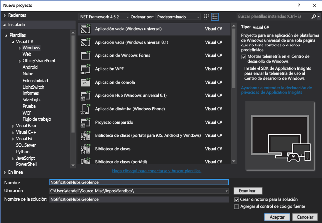

Una vez completada la creación del proyecto, debe tener la base para la propia aplicación. Ahora vamos a configurar todos los elementos de la infraestructura de geovalla. Como vamos a usar los servicios de Bing para esto, hay un punto de conexión de API de REST público que nos permite consultar los marcos de ubicación específicos:

    http://spatial.virtualearth.net/REST/v1/data/

Debe especificar los siguientes parámetros para que funcione:

* **Id. de origen de datos** y **Nombre de origen de datos**: en la API de Bing Maps, los orígenes de datos contienen distintos metadatos en depósitos, como las ubicaciones y el horario comercial de la operación. Puede leer más sobre ellos aquí. 
* **Nombre de entidad** : la entidad que desea utilizar como punto de referencia para la notificación. 
* **Clave de API de Bing Maps** : esta es la clave que obtuvo anteriormente al crear la cuenta del centro de desarrollo de Bing.

Analicemos ahora más profundamente la configuración de cada uno de los elementos anteriores.

## Configuración del origen de datos
Puede configurar el origen de datos en el Centro de desarrollo de Mapas de Bing. En la barra de navegación superior, elija **Data sources** (Orígenes de datos)  > **Manage Data Sources** (Administrar orígenes de datos).

Si no ha trabajado antes con la API de Mapas de Bing, lo más probable es que no haya ningún origen de datos presente, por lo que solo podrá crear uno nuevo; para ello, elija **Data sources** (Orígenes de datos)  > **Upload data** (Cargar datos). Asegúrese de que rellenar todos los campos obligatorios:

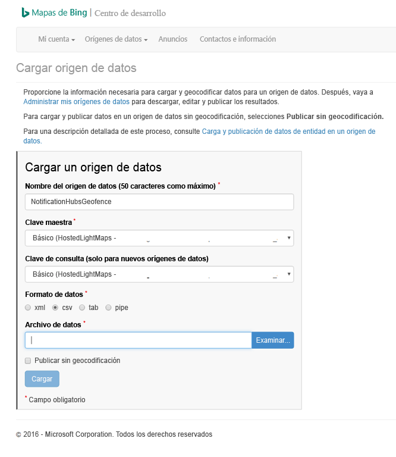

Tal vez se esté preguntando: ¿qué es el archivo de datos y qué se debería cargar? Para esta prueba, podemos utilizar el ejemplo basado en canalización que enmarca un área del muelle de San Francisco:

    Bing Spatial Data Services, 1.0, TestBoundaries
    EntityID(Edm.String,primaryKey)|Name(Edm.String)|Longitude(Edm.Double)|Latitude(Edm.Double)|Boundary(Edm.Geography)
    1|SanFranciscoPier|||POLYGON ((-122.389825 37.776598,-122.389438 37.773087,-122.381885 37.771849,-122.382186 37.777022,-122.389825 37.776598))

Lo anterior representa esta entidad:

Copie y pegue la cadena anterior en un archivo nuevo, guárdelo como **NotificationHubsGeofence.pipe** y cárguelo en el Centro de desarrollo de Bing.

> [!NOTE]
> Se le pedirá que especifique una nueva clave para la **clave maestra** que sea diferente de la **clave de consulta**. Simplemente cree una nueva clave en el panel y actualice la página de carga del origen de datos.
> 
> 

Una vez cargado en el archivo de datos, deberá asegurarse de publicar el origen de datos. 

Vaya a **Manage Data Sources** (Administrar orígenes de datos) (como antes), busque el origen de datos en la lista y elija **Publish** (Publicar) en la columna **Actions** (Acciones). Poco después debería ver el origen de datos en la pestaña **Published Data Sources** (Orígenes de datos publicados):

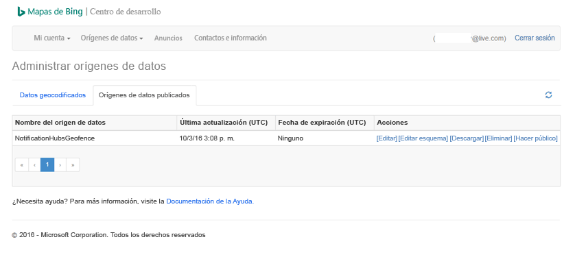

Al elegir **Edit** (Editar), verá de un vistazo las ubicaciones que se introdujeron en él:

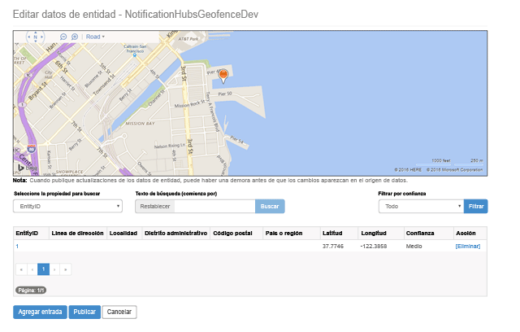

En este punto, el portal no muestra los límites de la geovalla creada; todo lo necesario es una confirmación de que la ubicación especificada está en las proximidades correctas.

Ahora tiene todos los requisitos para el origen de datos. Para obtener los detalles de la URL de solicitud para la llamada de API, en el Centro de desarrollo de Mapas de Bing, elija **Data sources** (Orígenes de datos) y seleccione **Data Source Information** (Información de origen de datos).

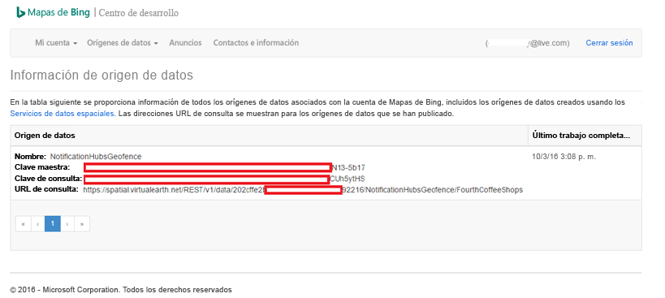

La **URL de consulta** es lo que tenemos aquí. Es el punto de conexión en el que podemos ejecutar consultas para comprobar si el dispositivo está dentro de los límites de una ubicación o no. Para realizar esta comprobación, solo tenemos que ejecutar una llamada GET en la URL de consulta con los siguientes parámetros anexados:

    ?spatialFilter=intersects(%27POINT%20LONGITUDE%20LATITUDE)%27)&$format=json&key=QUERY_KEY

De este modo se está especificando un punto de destino que se obtiene del dispositivo y Mapas de Bing realizarán automáticamente los cálculos para ver si está dentro de la geovalla. Una vez ejecutada la solicitud a través de un explorador (o cURL), obtendrá una respuesta JSON estándar:

Esta respuesta solo se produce cuando el punto realmente está dentro de los límites designados. Si no es así, obtendrá un depósito de **resultados** vacío:

## Configuración de la aplicación de UWP
Ahora que ya está listo el origen de datos, podemos empezar a trabajar en la aplicación de UWP que hemos arrancado anteriormente.

Ante todo, debemos habilitar los servicios de ubicación para nuestra aplicación. Para ello, abra el archivo `Package.appxmanifest` en el **Explorador de soluciones**.

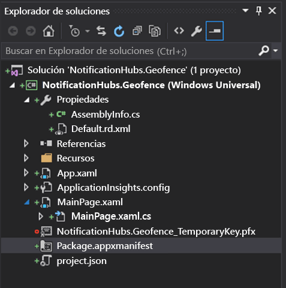

En la pestaña de propiedades de paquete que acaba de abrir, elija **Funcionalidades** y asegúrese de que selecciona **Ubicación**:

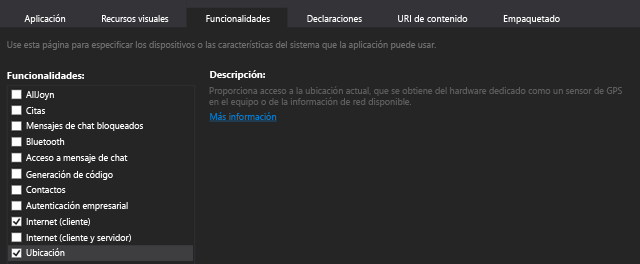

Cuando se declare la funcionalidad de ubicación, cree una nueva carpeta en la solución denominada `Core` y agregue un nuevo archivo en ella, llamado `LocationHelper.cs`:

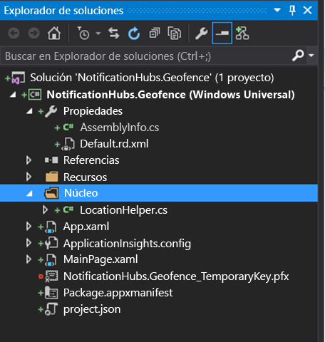

La misma clase `LocationHelper` es bastante básica en este momento, pues todo lo que hace es permitirnos obtener la ubicación del usuario a través de la API del sistema:

    using System;
    using System.Threading.Tasks;
    using Windows.Devices.Geolocation;

    namespace NotificationHubs.Geofence.Core
    {
        public class LocationHelper
        {
            private static readonly uint AppDesiredAccuracyInMeters = 10;

            public async static Task<Geoposition> GetCurrentLocation()
            {
                var accessStatus = await Geolocator.RequestAccessAsync();
                switch (accessStatus)
                {
                    case GeolocationAccessStatus.Allowed:
                        {
                            Geolocator geolocator = new Geolocator { DesiredAccuracyInMeters = AppDesiredAccuracyInMeters };

                            return await geolocator.GetGeopositionAsync();
                        }
                    default:
                        {
                            return null;
                        }
                }
            }

        }
    }

Puede leer más acerca de cómo obtener la ubicación del usuario en las aplicaciones de UWP en el [documento de MSDN](https://msdn.microsoft.com/library/windows/apps/mt219698.aspx)oficial.

Para comprobar que la adquisición de ubicación funciona realmente, abra la parte de código de la página principal (`MainPage.xaml.cs`). Cree un nuevo controlador de eventos para el evento `Loaded` en el constructor `MainPage`:

    public MainPage()
    {
        this.InitializeComponent();
        this.Loaded += MainPage_Loaded;
    }

La implementación del controlador de eventos es como sigue:

    private async void MainPage_Loaded(object sender, RoutedEventArgs e)
    {
        var location = await LocationHelper.GetCurrentLocation();

        if (location != null)
        {
            Debug.WriteLine(string.Concat(location.Coordinate.Longitude,
                " ", location.Coordinate.Latitude));
        }
    }

Observe que se ha declarado el controlador como async porque `GetCurrentLocation` admite await y, por tanto, es necesario para ejecutarse en un contexto asincrónico. Además, dado que en determinadas circunstancias se podría acabar con una ubicación nula (por ejemplo, los servicios de ubicación están deshabilitados o la aplicación no tiene permisos para acceder a la ubicación), es necesario asegurarse de que se controla adecuadamente con una comprobación de valores null.

Ejecute la aplicación. Asegúrese de que se permite el acceso de ubicación:

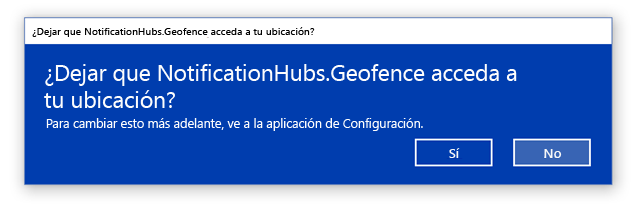

Cuando se inicie la aplicación, podrá ver las coordenadas en la ventana **Salida** :

Ahora ya sabe que funciona la adquisición de la ubicación, quite el controlador de eventos de prueba de la carga, ya que no lo va a usar ya.

El paso siguiente consiste en capturar los cambios de ubicación. Para ello, vuelva a la clase `LocationHelper` y agregue el controlador de eventos a `PositionChanged`:

    geolocator.PositionChanged += Geolocator_PositionChanged;

La implementación muestra las coordenadas de ubicación en la ventana **Salida** :

    private static async void Geolocator_PositionChanged(Geolocator sender, PositionChangedEventArgs args)
    {
        await CoreApplication.MainView.CoreWindow.Dispatcher.RunAsync(CoreDispatcherPriority.Normal, () =>
        {
            Debug.WriteLine(string.Concat(args.Position.Coordinate.Longitude, " ", args.Position.Coordinate.Latitude));
        });
    }

## Configuración del back-end
Descargue el [ejemplo de back-end de .NET desde GitHub](https://github.com/Azure/azure-notificationhubs-samples/tree/master/dotnet/NotifyUsers). Una vez finalizada la descarga, abra la carpeta `NotifyUsers` y, después, el archivo `NotifyUsers.sln`.

Establezca el proyecto `AppBackend` como **proyecto de inicio** e inícielo.

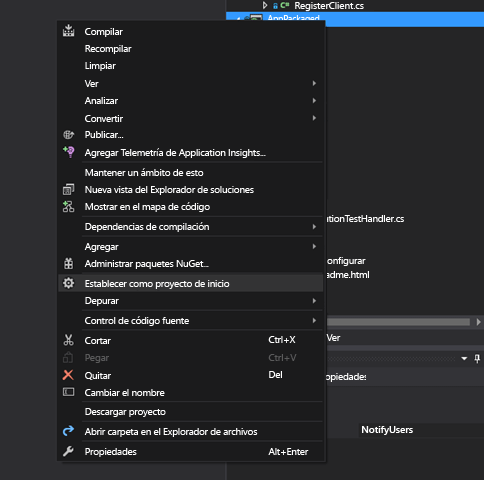

El proyecto ya está configurado para enviar notificaciones push a dispositivos de destino, por lo que solo necesitamos hacer dos cosas: intercambiar la cadena de conexión adecuada para el centro de notificaciones y agregar la identificación de límite para enviar la notificación solo cuando el usuario está dentro de la geovalla.

Para configurar la cadena de conexión, en la carpeta `Models` abra `Notifications.cs`. La función `NotificationHubClient.CreateClientFromConnectionString` debe contener la información sobre el centro de notificaciones que puede obtener en [Azure Portal](https://portal.azure.com) (busque dentro de la hoja **Directivas de acceso** en **Configuración**). Guarde el archivo de configuración actualizado.

Ahora vamos a crear un modelo para el resultado de la API de Bing Maps. La manera más fácil de hacerlo es abrir la carpeta `Models` y elegir **Agregar** > **Clase**. Asígnele el nombre `GeofenceBoundary.cs`. Una vez hecho, copie el JSON en la respuesta de la API que se describe en la primera sección y, en Visual Studio, use **Editar** > **Pegado especial** > **Pegar JSON como clases**. 

De este modo nos aseguramos de que se va a deserializar el objeto tal y como estaba previsto. El conjunto de clases resultante debe ser similar a esto:

    namespace AppBackend.Models
    {
        public class Rootobject
        {
            public D d { get; set; }
        }

        public class D
        {
            public string __copyright { get; set; }
            public Result[] results { get; set; }
        }

        public class Result
        {
            public __Metadata __metadata { get; set; }
            public string EntityID { get; set; }
            public string Name { get; set; }
            public float Longitude { get; set; }
            public float Latitude { get; set; }
            public string Boundary { get; set; }
            public string Confidence { get; set; }
            public string Locality { get; set; }
            public string AddressLine { get; set; }
            public string AdminDistrict { get; set; }
            public string CountryRegion { get; set; }
            public string PostalCode { get; set; }
        }

        public class __Metadata
        {
            public string uri { get; set; }
        }
    }

A continuación, abra `Controllers` > `NotificationsController.cs`. Es necesario ajustar la llamada Post a la cuenta para la latitud y longitud de destino. Para ello, simplemente agregue dos cadenas a la firma de la función: `latitude` y `longitude`.

    public async Task<HttpResponseMessage> Post(string pns, [FromBody]string message, string to_tag, string latitude, string longitude)

Cree una nueva clase en el proyecto denominado `ApiHelper.cs` : vamos a usarla para conectarse a Bing y comprobar las intersecciones de los límites de punto. Implemente una función `IsPointWithinBounds` , como esta:

    public class ApiHelper
    {
        public static readonly string ApiEndpoint = "{YOUR_QUERY_ENDPOINT}?spatialFilter=intersects(%27POINT%20({0}%20{1})%27)&$format=json&key={2}";
        public static readonly string ApiKey = "{YOUR_API_KEY}";

        public static bool IsPointWithinBounds(string longitude,string latitude)
        {
            var json = new WebClient().DownloadString(string.Format(ApiEndpoint, longitude, latitude, ApiKey));
            var result = JsonConvert.DeserializeObject<Rootobject>(json);
            if (result.d.results != null && result.d.results.Count() > 0)
            {
                return true;
            }
            else
            {
                return false;
            }
        }
    }

> [!NOTE]
> Asegúrese de sustituir el punto de conexión de API con la dirección URL de consulta que obtuvo anteriormente en el Centro de desarrollo de Bing (lo mismo se aplica a la clave de API). 
> 
> 

Si hay resultados para la consulta, significa que el punto especificado se encuentra dentro de los límites de la geovalla, por lo que devolvemos `true`. Si no hay ningún resultado, Bing nos indica que el punto está fuera del marco de búsqueda, por lo que se devuelven `false`.

En `NotificationsController.cs`, cree una comprobación justo antes de la instrucción switch:

    if (ApiHelper.IsPointWithinBounds(longitude, latitude))
    {
        switch (pns.ToLower())
        {
            case "wns":
                //// Windows 8.1 / Windows Phone 8.1
                var toast = @"<toast><visual><binding template=""ToastText01""><text id=""1"">" +
                            "From " + user + ": " + message + "</text></binding></visual></toast>";
                outcome = await Notifications.Instance.Hub.SendWindowsNativeNotificationAsync(toast, userTag);

                // Windows 10 specific Action Center support
                toast = @"<toast><visual><binding template=""ToastGeneric""><text id=""1"">" +
                            "From " + user + ": " + message + "</text></binding></visual></toast>";
                outcome = await Notifications.Instance.Hub.SendWindowsNativeNotificationAsync(toast, userTag);

                break;
        }
    }

De este modo, la notificación solo se envía cuando el punto está dentro de los límites.

## Prueba de las notificaciones push en la aplicación de UWP
Volviendo a la aplicación de UWP, ahora podemos probar las notificaciones. Dentro de la clase `LocationHelper`, cree una nueva función – `SendLocationToBackend`:

    public static async Task SendLocationToBackend(string pns, string userTag, string message, string latitude, string longitude)
    {
        var POST_URL = "http://localhost:8741/api/notifications?pns=" +
            pns + "&to_tag=" + userTag + "&latitude=" + latitude + "&longitude=" + longitude;

        using (var httpClient = new HttpClient())
        {
            try
            {
                await httpClient.PostAsync(POST_URL, new StringContent("\"" + message + "\"",
                    System.Text.Encoding.UTF8, "application/json"));
            }
            catch (Exception ex)
            {
                Debug.WriteLine(ex.Message);
            }
        }
    }

> [!NOTE]
> Cambie el `POST_URL` a la ubicación de la aplicación web implementada que hemos creado en la sección anterior. Por ahora, es correcto para ejecutarlo localmente, pero cuando se trabaja en la implementación de una versión pública, será necesario hospedarlo con un proveedor externo.
> 
> 

Ahora asegurémonos de registrar la aplicación de UWP para notificaciones push. En Visual Studio, elija **Proyecto** > **Tienda** > **Asociar aplicación con la Tienda**.

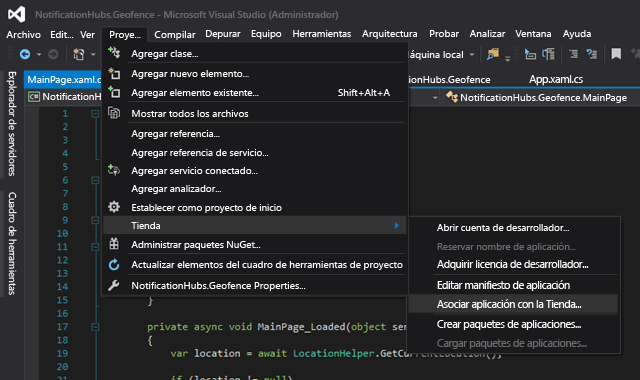

Cuando se inicia sesión en su cuenta de desarrollador, asegúrese de seleccionar una aplicación existente o de crear una nueva y asociar el paquete con ella. 

Vaya al Centro de desarrollo y abra la aplicación que acaba de crear. Elija **Servicios** > **Notificaciones push** > **Sitio de Servicios Live**.

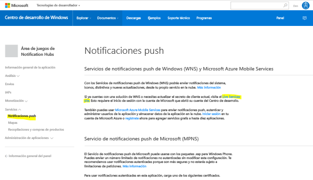

En el sitio, tome nota del **secreto de aplicación** y del **SID del paquete**. Los necesitará en Azure Portal: abra el centro de notificaciones, elija **Configuración** > **Notification Services** > **Windows (WNS)** y escriba la información en los campos obligatorios.

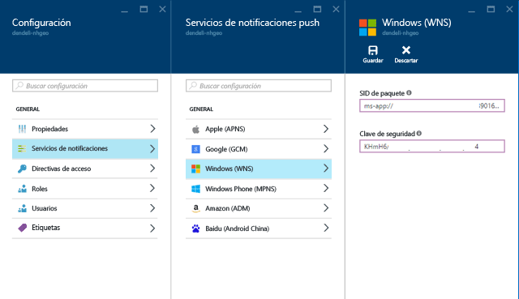

Elija **Guardar**.

Abra **Referencias** en el **Explorador de soluciones** y seleccione **Administrar paquetes NuGet**. Necesitaremos agregar una referencia a la **biblioteca administrada de Microsoft Azure Service Bus**; simplemente busque `WindowsAzure.Messaging.Managed` y agréguelo al proyecto.

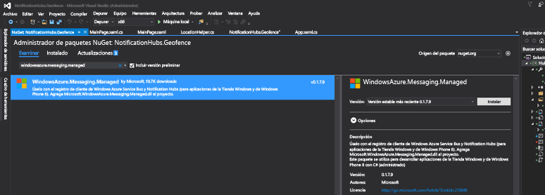

Para las pruebas, podemos crear el controlador de eventos `MainPage_Loaded` una vez más y agregar este fragmento de código a él:

    var channel = await PushNotificationChannelManager.CreatePushNotificationChannelForApplicationAsync();

    var hub = new NotificationHub("HUB_NAME", "HUB_LISTEN_CONNECTION_STRING");
    var result = await hub.RegisterNativeAsync(channel.Uri);

    // Displays the registration ID so you know it was successful
    if (result.RegistrationId != null)
    {
        Debug.WriteLine("Reg successful.");
    }

El código anterior registra la aplicación con el centro de notificaciones. Y ya está todo listo. 

En `LocationHelper`, dentro del controlador `Geolocator_PositionChanged`, puede agregar un fragmento de código de prueba que incluirá forzosamente la ubicación dentro de la geovalla:

    await LocationHelper.SendLocationToBackend("wns", "TEST_USER", "TEST", "37.7746", "-122.3858");

Como no se están superando las coordenadas reales (que pueden no estar dentro de los límites en ese momento) y se están usando valores de prueba predefinidos, veremos una notificación aparecer en la actualización:

## Pasos siguientes
Hay un par de pasos que debe seguir, además de lo anterior, para asegurarse de que la solución está lista para producción.

Ante todo, debe asegurarse de que las geovallas sean dinámicas. Esto requerirá un trabajo adicional con la API de Bing para poder cargar los nuevos límites dentro del origen de datos existente. Consulte la [documentación de la API de Servicios de datos espaciales de Bing](https://msdn.microsoft.com/library/ff701734.aspx) para obtener más detalles sobre el tema.

En segundo lugar, cuando se trabaja para garantizar que se realiza la entrega a los participantes adecuados, puede querer dirigirlos mediante el [etiquetado](notification-hubs-tags-segment-push-message.md).

La solución anterior describe un escenario en el que se puede tener una amplia variedad de plataformas de destino, por lo que no hemos limitado el geovallado a funcionalidades específicas del sistema. Dicho esto, Plataforma universal de Windows ofrece funcionalidades para [detectar geovallas directamente de fábrica](https://msdn.microsoft.com/windows/uwp/maps-and-location/set-up-a-geofence).

Para más información acerca de las funcionalidades de Centros de notificaciones, consulte nuestro [portal de documentación](https://azure.microsoft.com/documentation/services/notification-hubs/).

