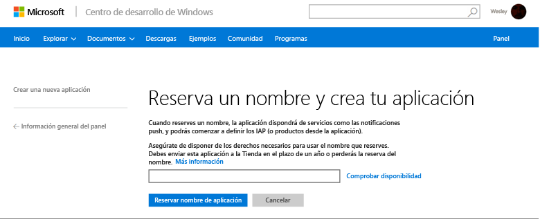
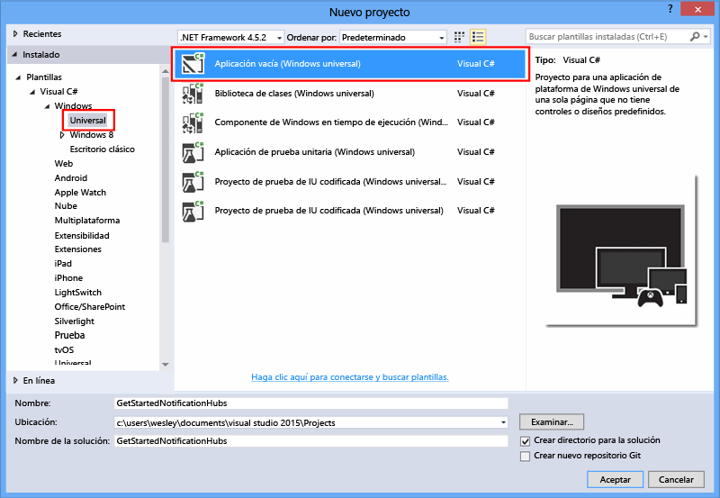
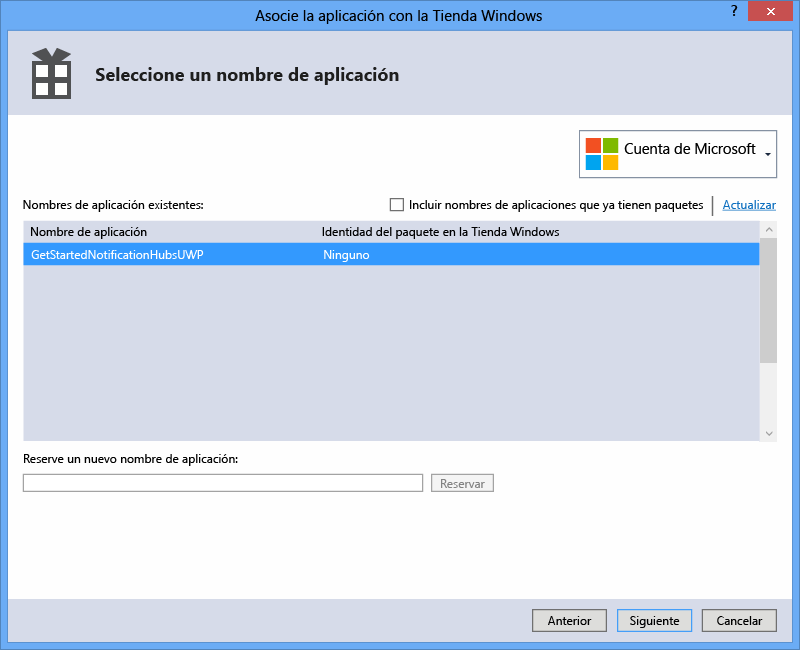
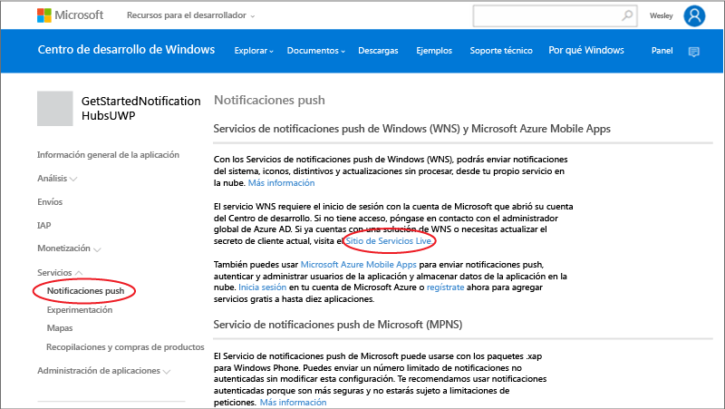
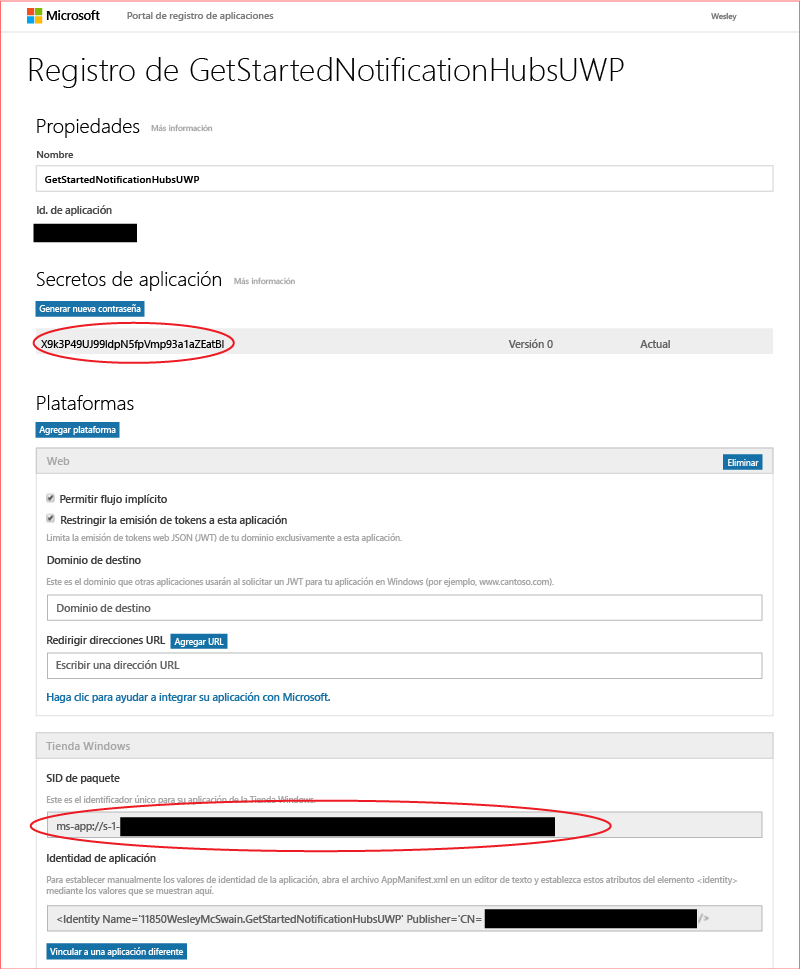

# Introducción a Centros de notificaciones para aplicaciones de la plataforma universal de Windows
[!INCLUDE [notification-hubs-selector-get-started](../../includes/notification-hubs-selector-get-started.md)]

## Información general
Este tutorial muestra cómo puede usar los Centros de notificaciones de Azure para enviar notificaciones push a una aplicación de la plataforma universal de Windows (UWP).

En este tutorial puede crear una aplicación de la Tienda Windows vacía que recibe notificaciones push mediante el Servicios de notificaciones de inserción de Windows (WNS). Cuando haya finalizado, podrá usar el centro de notificaciones para difundir notificaciones push a todos los dispositivos que ejecutan su aplicación.

## Antes de empezar
[!INCLUDE [notification-hubs-hero-slug](../../includes/notification-hubs-hero-slug.md)]

El código completo de este tutorial se puede encontrar en GitHub [aquí](https://github.com/Azure/azure-notificationhubs-samples/tree/master/dotnet/GetStartedWindowsUniversal).

## Requisitos previos
Este tutorial requiere lo siguiente:

* [Microsoft Visual Studio Community 2015](https://www.visualstudio.com/products/visual-studio-community-vs) o posterior
* [Herramientas de desarrollo de aplicaciones universales de Windows instaladas](https://msdn.microsoft.com/windows/uwp/get-started/get-set-up)
* Una cuenta activa de Azure  En caso de no tener cuenta, puede crear una de evaluación gratuita en tan solo unos minutos. Para obtener más información, consulte [Evaluación gratuita de Azure](https://azure.microsoft.com/pricing/free-trial/?WT.mc_id=A0E0E5C02&amp;returnurl=http%3A%2F%2Fazure.microsoft.com%2Fen-us%2Fdocumentation%2Farticles%2Fnotification-hubs-windows-store-dotnet-get-started%2F).
* Una cuenta de la Tienda Windows activa

Completar este tutorial es un requisito previo para todos los tutoriales de Centros de notificaciones para aplicaciones de la plataforma universal de Windows.

## Registro de la aplicación para la Tienda Windows
Para enviar notificaciones push a las aplicaciones de la UWP, debe asociar su aplicación a la Tienda Windows. A continuación, debe configurar su Centro de notificaciones para que se integre con WNS.

1. Si aún no ha registrado la aplicación, navegue al [Centro de desarrollo de Windows](https://dev.windows.com/overview), conéctese con su cuenta Microsoft y, a continuación, haga clic en **Crear una nueva aplicación**.
2. Escriba un nombre para la aplicación y haga clic en **Reservar nombre de aplicación**.
   
       
   
       This creates a new Windows Store registration for your app.
3. En Visual Studio, cree un nuevo proyecto de aplicaciones de la Tienda en Visual C# con la plantilla **Aplicación vacía** y haga clic en **Aceptar**.
   
       
4. Acepte los valores predeterminados para las versiones de plataforma mínima y de destino.
5. En el Explorador de soluciones, haga clic con el botón derecho en el proyecto de la aplicación para la Tienda Windows, haga clic en **Tienda** y, a continuación, en **Asociar aplicación con la Tienda...**.
   
       

       The **Associate Your App with the Windows Store** wizard appears.

1. En el asistente, haga clic en **Iniciar sesión** y, después, inicie sesión con su cuenta Microsoft.
2. Haga clic en la aplicación que registró en el paso 2, haga clic en **Siguiente** y, después, en **Asociar**.
   
       
   
       This adds the required Windows Store registration information to the application manifest.
3. De nuevo en la página [Centro de desarrollo de Windows](http://go.microsoft.com/fwlink/p/?LinkID=266582) de la nueva aplicación, haga clic en **Servicios**, **Notificaciones push** y **Sitio de Servicios Live** en **Servicios de notificaciones push de Windows (WNS) y Microsoft Azure Mobile Apps**.
   
       
4. En la página de registro de la aplicación, tome nota de la contraseña del **Secreto de aplicación** y del **identificador de seguridad de paquete (SID)** ubicado en la configuración de plataforma de la **Tienda Windows**.
   
       

     > [AZURE.WARNING]
    El secreto de aplicación y el SID del paquete son credenciales de seguridad importantes. No los comparta con nadie ni los distribuya con su aplicación.

## Configuración de su Centro de notificaciones
[!INCLUDE [notification-hubs-portal-create-new-hub](../../includes/notification-hubs-portal-create-new-hub.md)]

<ol start="6">
<li>
Seleccione la opción <b>Notification Services</b> y la opción <b>Windows (WNS)</b>. A continuación, escriba la contraseña del <b>secreto de aplicación</b> en el campo <b>Clave de seguridad</b>. Escriba el valor del <b>SID del paquete</b> obtenido de WNS en la sección anterior y, a continuación, haga clic en <b>Guardar</b>.

</li>
</ol>

&emsp;&emsp;

Su Centro de notificaciones está ahora configurado para funcionar con WNS y tiene las cadenas de conexión para registrar su aplicación y enviar notificaciones.

## Conexión de la aplicación al Centro de notificaciones
1. En Visual Studio, haga clic con el botón derecho en la solución y, a continuación, haga clic en **Administrar paquetes NuGet**.
   
    Se muestra el cuadro de diálogo **Administrar paquetes de NuGet** .
2. Busque `WindowsAzure.Messaging.Managed` y haga clic en **Instalar**, seleccione todos los proyectos en la solución y acepte los términos de uso.
   
    ![][20]
   
    A continuación, se descarga, instala y agrega una referencia a la biblioteca de Mensajería de Azure para Windows mediante el <a href="http://nuget.org/packages/WindowsAzure.Messaging.Managed/">paquete de NuGet WindowsAzure.Messaging.Managed</a>.
3. Abra el archivo de proyecto App.xaml.cs y agregue las siguientes instrucciones `using` . 
   
        using Windows.Networking.PushNotifications;
        using Microsoft.WindowsAzure.Messaging;
        using Windows.UI.Popups;
4. También en App.xaml.cs, agregue la siguiente definición de método **InitNotificationsAsync** a la clase **App**:
   
        private async void InitNotificationsAsync()
        {
            var channel = await PushNotificationChannelManager.CreatePushNotificationChannelForApplicationAsync();
   
            var hub = new NotificationHub("< your hub name>", "<Your DefaultListenSharedAccessSignature connection string>");
            var result = await hub.RegisterNativeAsync(channel.Uri);
   
            // Displays the registration ID so you know it was successful
            if (result.RegistrationId != null)
            {
                var dialog = new MessageDialog("Registration successful: " + result.RegistrationId);
                dialog.Commands.Add(new UICommand("OK"));
                await dialog.ShowAsync();
            }
   
        }
   
    Este código recupera el URI del canal de la aplicación desde WNS y, luego, lo registra en el Centro de notificaciones.
   
   > [!NOTE]
   > Asegúrese de reemplazar el marcador de posición con el "nombre del centro" por el nombre del Centro de notificaciones que aparece en el Portal de Azure. Sustituya también el marcador de posición de la cadena de conexión por la cadena de conexión **DefaultListenSharedAccessSignature** que obtuvo en la página **Directivas de acceso** del Centro de notificaciones en una sección anterior.
   > 
   > 
5. En la parte superior del controlador de eventos **OnLaunched** en App.xaml.cs, agregue la siguiente llamada al nuevo método **InitNotificationsAsync**:
   
        InitNotificationsAsync();
   
    Esto garantiza que el URI del canal se registre en su Centro de notificaciones cada vez que se inicia la aplicación.
6. Presione la tecla **F5** para ejecutar la aplicación. Se muestra un cuadro de diálogo emergente que contiene la clave de registro.
   
       ![][19]

La carpeta ahora ya está lista para recibir notificaciones.

## Envío de notificaciones
Para probar de forma rápida la recepción de notificaciones en su aplicación, envíe notificaciones en el [Portal de Azure](https://portal.azure.com/) mediante el botón **Envío de prueba** en el Centro de notificaciones, tal como se muestra en la pantalla que aparece a continuación.

Las notificaciones push se envían normalmente en un servicio back-end como Servicios móviles o ASP.NET mediante una biblioteca compatible. También puede usar la API de REST directamente para enviar mensajes de notificación si no hay disponible una biblioteca para su back-end. 

En este tutorial, vamos a simplificar las cosas y mostrar solo la prueba de su aplicación cliente mediante el envío de notificaciones con el SDK de .NET para los centros de notificaciones en una aplicación de consola en lugar de un servicio back-end. Se recomienda seguir el tutorial [Los Centros de notificaciones de Azure notifican a los usuarios con back-end de .NET] como paso siguiente para enviar notificaciones desde un back-end de ASP.NET. Sin embargo, se pueden usar los siguientes enfoques para enviar notificaciones:

* **Interfaz de REST**: puede admitir notificaciones en cualquier plataforma de back-end mediante la [interfaz de REST](http://msdn.microsoft.com/library/windowsazure/dn223264.aspx).
* **SDK para .NET de Centros de notificaciones de Microsoft Azure**: en el Administrador de paquetes NuGet para Visual Studio, ejecute [Install-Package Microsoft.Azure.NotificationHubs](https://www.nuget.org/packages/Microsoft.Azure.NotificationHubs/).
* **Node.js** : [Uso de los Centros de notificaciones desde Node.js](notification-hubs-nodejs-push-notification-tutorial.md).
* **Aplicaciones móviles de Azure**: para ver un ejemplo de cómo enviar notificaciones desde una aplicación móvil de Azure integrada en Centros de notificaciones, consulte [Incorporación de notificaciones push a la aplicación universal Windows en tiempo de ejecución 8.1](../app-service-mobile/app-service-mobile-windows-store-dotnet-get-started-push.md).
* **Java / PHP**: para ver un ejemplo de cómo enviar notificaciones con las API de REST, consulte "Uso de Notification Hubs desde Java o PHP" ([Java](notification-hubs-java-push-notification-tutorial.md) | [PHP](notification-hubs-php-push-notification-tutorial.md)).

## (Opcional) Enviar notificaciones desde una aplicación de consola
Para enviar notificaciones con una aplicación de consola .NET, siga estos pasos. 

1. Haga clic con el botón derecho en la solución, seleccione **Agregar** y **Nuevo proyecto...** y, a continuación, en **Visual C#**, haga clic en **Windows**, **Aplicación de consola** y **Aceptar**.
   
       ![][13]
   
    Esta acción agrega una aplicación de consola nueva de Visual C# a la solución. También puede hacer esto en una solución separada.
2. En Visual Studio, haga clic en **Herramientas**, **Administrador de paquetes NuGet** y, después, en **Consola del Administrador de paquetes**.
   
    Esto muestra la Consola del administrador de paquetes en Visual Studio.
3. En la ventana de la Consola del Administrador de paquetes, seleccione en **Proyecto predeterminado** el nuevo proyecto de aplicación de consola y, a continuación, ejecute el siguiente comando en la ventana de la consola:
   
        Install-Package Microsoft.Azure.NotificationHubs
   
    Así se agrega una referencia al SDK de Centros de notificaciones de Azure mediante el <a href="http://www.nuget.org/packages/Microsoft.Azure.NotificationHubs/">paquete NuGet Microsoft.Azure.Notification Hubs</a>.
   
    
4. Abra el archivo Program.cs y agregue la siguiente instrucción `using` :
   
        using Microsoft.Azure.NotificationHubs;
5. En la clase **Program** , agregue el siguiente método.
   
        private static async void SendNotificationAsync()
        {
            NotificationHubClient hub = NotificationHubClient
                .CreateClientFromConnectionString("<connection string with full access>", "<hub name>");
            var toast = @"<toast><visual><binding template=""ToastText01""><text id=""1"">Hello from a .NET App!</text></binding></visual></toast>";
            await hub.SendWindowsNativeNotificationAsync(toast);
        }
   
       Make sure to replace the "hub name" placeholder with the name of the notification hub that as it appears in the Azure Portal. Also, replace the connection string placeholder with the **DefaultFullSharedAccessSignature** connection string that you obtained from the **Access Policies** page of your Notification Hub in the section called "Configure your notification hub."
   
   > [!NOTE]
   > Asegúrese de usar una cadena de conexión con acceso **Total**, no con acceso de **Escucha**. La cadena de acceso de escucha no tiene permisos para enviar notificaciones.
   > 
   > 
6. Agregue las siguientes líneas al método **Main** :
   
         SendNotificationAsync();
         Console.ReadLine();
7. Haga clic con el botón derecho en el proyecto de la aplicación de consola en Visual Studio y haga clic en **Establecer como proyecto de inicio** para establecerlo como proyecto de inicio. A continuación, presione la tecla **F5** para ejecutar la aplicación.
   
       ![][14]
   
    Debería recibir una notificación del sistema en todos los dispositivos registrados. Si hace clic o toca el banner de notificaciones se carga la aplicación.

Puede encontrar todas las cargas compatibles en los temas de [catálogo de notificaciones del sistema], el [catálogo de iconos] y la [información general de distintivos] en MSDN (en inglés).

## Pasos siguientes
En este sencillo ejemplo, ha difundido notificaciones a todos los dispositivos con Windows mediante el portal o aplicación de consola. Se recomienda seguir el tutorial [Notificación a los usuarios con los Centros de notificaciones de Azure] como paso siguiente. Le mostrará cómo enviar notificaciones desde un back-end de ASP.NET mediante etiquetas para dirigirse a usuarios específicos.

Si desea segmentar los usuarios por grupos de interés, consulte [Uso de los Centros de notificaciones para enviar noticias de última hora]. 

Para más información general sobre los Centros de notificaciones, consulte [Guía de los Centros de notificaciones](notification-hubs-push-notification-overview.md).

<!-- Images. -->
[13]: ./media/notification-hubs-windows-store-dotnet-get-started/notification-hub-create-console-app.png
[14]: ./media/notification-hubs-windows-store-dotnet-get-started/notification-hub-windows-toast.png
[19]: ./media/notification-hubs-windows-store-dotnet-get-started/notification-hub-windows-reg.png
[20]: ./media/notification-hubs-windows-store-dotnet-get-started/notification-hub-windows-universal-app-install-package.png

<!-- URLs. -->

[Notificación a los usuarios con los Centros de notificaciones de Azure]: notification-hubs-aspnet-backend-windows-dotnet-wns-notification.md
[Uso de Centros de notificaciones para enviar noticias de último minuto]: notification-hubs-windows-notification-dotnet-push-xplat-segmented-wns.md

[catálogo del sistema]: http://msdn.microsoft.com/library/windows/apps/hh761494.aspx
[catálogo de iconos]: http://msdn.microsoft.com/library/windows/apps/hh761491.aspx
[información general sobre distintivos]: http://msdn.microsoft.com/library/windows/apps/hh779719.aspx

<!--HONumber=Nov16_HO2-->

