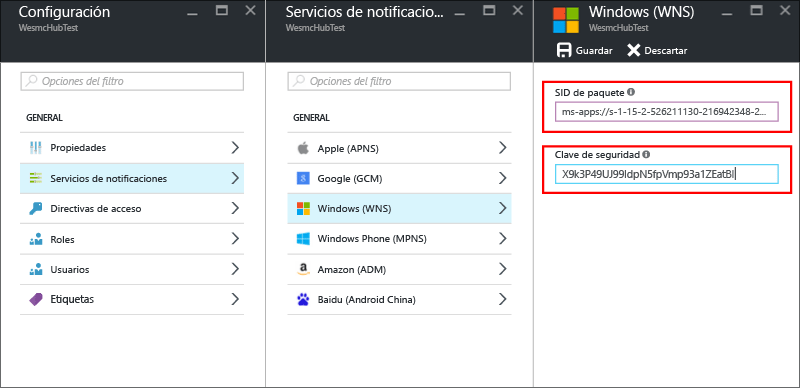

# Introducción a Notification Hubs para aplicaciones de la plataforma universal de Windows

[!INCLUDE [notification-hubs-selector-get-started](../../includes/notification-hubs-selector-get-started.md)]

## Información general
Este artículo muestra cómo usar Azure Notification Hubs para enviar notificaciones push a una aplicación de la plataforma universal de Windows (UWP).

En este artículo puede crear una aplicación de la Tienda Windows vacía que recibe notificaciones push a través de los Servicios de notificaciones de inserción de Windows (WNS). Cuando haya finalizado, podrá usar el centro de notificaciones para difundir notificaciones push a todos los dispositivos que ejecuten su aplicación.

## Antes de empezar
[!INCLUDE [notification-hubs-hero-slug](../../includes/notification-hubs-hero-slug.md)]

El código completo de este tutorial se encuentra en [GitHub](https://github.com/Azure/azure-notificationhubs-samples/tree/master/dotnet/GetStartedWindowsUniversal).

## requisitos previos
Este tutorial requiere lo siguiente:

* [Microsoft Visual Studio Community 2015](https://www.visualstudio.com/products/visual-studio-community-vs) o posterior
* [Herramientas de desarrollo de aplicaciones de la plataforma universal de Windows instaladas](https://msdn.microsoft.com/windows/uwp/get-started/get-set-up)
* Una cuenta activa de Azure  
    En caso de no tener cuenta, puede crear una de evaluación gratuita en tan solo unos minutos. Para más información, consulte [Obtener una evaluación gratuita de Azure](https://azure.microsoft.com/pricing/free-trial/?WT.mc_id=A0E0E5C02&amp;returnurl=http%3A%2F%2Fazure.microsoft.com%2Fen-us%2Fdocumentation%2Farticles%2Fnotification-hubs-windows-store-dotnet-get-started%2F).
* Una cuenta de la Tienda Windows activa

La realización de este tutorial es un requisito previo para todos los demás tutoriales de Notification Hubs para las aplicaciones de la plataforma universal de Windows.

## Registro de la aplicación para la Tienda Windows
Para enviar notificaciones push a las aplicaciones de la plataforma universal de Windows, asocie su aplicación a la Tienda Windows. A continuación, configure su centro de notificaciones para que se integre con los Servicios de notificaciones de inserción de Windows.

1. Si aún no ha registrado la aplicación, vaya al [Centro de desarrollo de Windows](https://dev.windows.com/overview), inicie sesión en su cuenta Microsoft y seleccione **Crear aplicación**.

2. Escriba un nombre para la aplicación y seleccione **Reservar nombre de aplicación**. Así se crea un nuevo registro de la Tienda Windows para el registro de la aplicación.

3. En Visual Studio, cree un nuevo proyecto de aplicaciones de la Tienda en Visual C# con la plantilla **Aplicación vacía** de la plataforma universal de Windows y seleccione **Aceptar**.

4. Acepte los valores predeterminados para las versiones de plataforma mínima y de destino.

5. En el Explorador de soluciones, haga clic con el botón derecho en el proyecto de la aplicación para la Tienda Windows, seleccione **Tienda** y **Asociar aplicación con la Tienda**.  
    Aparece el asistente **Asocie la aplicación con la Tienda Windows** .

6. En el asistente, inicie sesión con su cuenta de Microsoft.

7. Seleccione la aplicación que registró en el paso 2, **Siguiente** y **Asociar**. De esta manera, se agrega la información de registro necesaria de la Tienda Windows al manifiesto de aplicación.

8. De vuelta en la página [Centro de desarrollo de Windows](http://dev.windows.com/overview) de su nueva aplicación, seleccione **Services** (Servicios), **Push notifications** (Notificaciones push) y **WNS/MPNS**.

9. Seleccione **New Notification** (Notificación nueva).

10. Seleccione la plantilla **Blank (Toast)** (En blanco [sistema]) y **OK** (Aceptar).

11. Escriba el valor **Name** (Nombre) de la notificación y el mensaje de **contexto** visual y seleccione **Save as draft** (Guardar como borrador).

12. Vaya al [Portal de registro de aplicaciones](http://apps.dev.microsoft.com) e inicie sesión.

13. Seleccione el nombre de la aplicación. En la configuración de la plataforma de la **Tienda Windows**, anote la contraseña del **Secreto de aplicación** y el **identificador de seguridad de paquete (SID)**.

    >[!WARNING]
    >El secreto de aplicación y el SID del paquete son credenciales de seguridad importantes. No los comparta con nadie ni los distribuya con su aplicación.

## Configuración de su Centro de notificaciones
[!INCLUDE [notification-hubs-portal-create-new-hub](../../includes/notification-hubs-portal-create-new-hub.md)]

<ol start="6">
<li>
En <b>Servicios de notificaciones</b>, seleccione <b>Windows (WNS)</b> y escriba la contraseña secreta de la aplicación en el cuadro <b>Clave de seguridad</b>. En el cuadro <b>SID del paquete</b>, escriba el valor que obtuvo en WNS en la sección anterior y seleccione <b>Guardar</b>.

</li>
</ol>

El centro de notificaciones ya está configurado para funcionar con WNS. Tiene la cadena de conexión para registrar la aplicación y enviar notificaciones.

## Conexión de la aplicación al Centro de notificaciones
1. En Visual Studio, haga clic con el botón derecho en la solución y seleccione **Administrar paquetes NuGet**.  
    Se abre la ventana **Administrar paquetes NuGet**.

2. En el cuadro de búsqueda, escriba **WindowsAzure.Messaging.Managed**, seleccione **Instalar** y acepte las condiciones de uso.
   
    ![Ventana Administrar paquetes NuGet][20]
   
    Con esta acción se descarga, instala y agrega una referencia a la biblioteca de mensajería de Azure para Windows mediante el [paquete NuGet WindowsAzure.Messaging.Managed](http://nuget.org/packages/WindowsAzure.Messaging).

3. Abra el archivo de proyecto App.xaml.cs y agregue las siguientes instrucciones `using`: 
   
        using Windows.Networking.PushNotifications;
        using Microsoft.WindowsAzure.Messaging;
        using Windows.UI.Popups;

4. En App.xaml.cs, agregue también a la clase **App** la siguiente definición de método **InitNotificationsAsync**:
   
        private async void InitNotificationsAsync()
        {
            var channel = await PushNotificationChannelManager.CreatePushNotificationChannelForApplicationAsync();
   
            var hub = new NotificationHub("<your hub name>", "<Your DefaultListenSharedAccessSignature connection string>");
            var result = await hub.RegisterNativeAsync(channel.Uri);
   
            // Displays the registration ID so you know it was successful
            if (result.RegistrationId != null)
            {
                var dialog = new MessageDialog("Registration successful: " + result.RegistrationId);
                dialog.Commands.Add(new UICommand("OK"));
                await dialog.ShowAsync();
            }
   
        }
   
    Este código recupera el URI del canal de la aplicación desde WNS y, luego, lo registra en el Centro de notificaciones.
   
    >[!NOTE]
    >* Reemplace el marcador de posición del **nombre del centro** por el nombre del centro de notificaciones tal y como aparece en Azure Portal. 
    >* Reemplace también el marcador de posición de la cadena de conexión por la cadena de conexión **DefaultListenSharedAccessSignature** que obtuvo en la página **Directivas de acceso** del centro de notificaciones en una sección anterior.
   > 
   > 
5. En la parte superior del controlador de eventos **OnLaunched** en App.xaml.cs, agregue la siguiente llamada al nuevo método **InitNotificationsAsync**:
   
        InitNotificationsAsync();
   
    Esta acción garantiza que el URI del canal se registra en su centro de notificaciones cada vez que se inicia la aplicación.

6. Seleccione la tecla **F5** para ejecutar la aplicación. Se muestra un cuadro de diálogo que muestra la clave de registro.

La carpeta ahora ya está lista para recibir notificaciones.

## Envío de notificaciones
Puede probar rápidamente la recepción de notificaciones en la aplicación si envía alguna desde [Azure Portal](https://portal.azure.com/). Use el botón **Envío de prueba** del centro de notificaciones, como se muestra en la siguiente imagen:

Las notificaciones push se envían normalmente en un servicio back-end como Mobile Services o ASP.NET con una biblioteca compatible. Si no hay bibliotecas disponibles para el back-end, también se pueden enviar mensajes de notificación directamente con la API de REST. 

En este tutorial se va a mostrar cómo probar la aplicación cliente simplemente mediante el envío de notificaciones con el SDK de .NET para Notification Hubs en una aplicación de consola en lugar de un servicio back-end. Se recomienda seguir el tutorial sobre el [uso de Notification Hubs para enviar notificaciones push a los usuarios] como paso siguiente para enviar notificaciones desde un back-end de ASP.NET. Sin embargo, puede enviar notificaciones mediante los métodos siguientes:

* **Interfaz de REST**: puede admitir notificaciones en cualquier plataforma de back-end mediante la [interfaz de REST](http://msdn.microsoft.com/library/windowsazure/dn223264.aspx).

* **SDK para .NET de Microsoft Azure Notification Hubs**: en el Administrador de paquetes NuGet para Visual Studio, ejecute [Install-Package Microsoft.Azure.NotificationHubs](https://www.nuget.org/packages/Microsoft.Azure.NotificationHubs/).

* **Node.js**: consulte el artículo sobre el [uso de Notification Hubs desde Node.js](notification-hubs-nodejs-push-notification-tutorial.md).
* **Azure Mobile Apps**: para ver un ejemplo de cómo enviar notificaciones desde una aplicación móvil de Azure integrada en Notification Hubs, consulte el artículo sobre la [incorporación de notificaciones push a Mobile Apps](../app-service-mobile/app-service-mobile-windows-store-dotnet-get-started-push.md).

* **Java o PHP**: para ver ejemplos de envío de notificaciones mediante las API de REST, consulte:
    * [Java](notification-hubs-java-push-notification-tutorial.md)
    * [PHP](notification-hubs-php-push-notification-tutorial.md)

## pasos siguientes
En este sencillo ejemplo, ha difundido notificaciones a todos los dispositivos con Windows mediante el portal o la aplicación de consola. Como siguiente paso, se recomienda el tutorial sobre el [uso de Notification Hubs para enviar notificaciones push a los usuarios]. Se muestra cómo enviar notificaciones desde un back-end de ASP.NET mediante etiquetas para dirigirse a usuarios específicos.

Si desea segmentar los usuarios por grupos de interés, consulte [Uso de Notification Hubs para enviar noticias de última hora]. 

Para más información general sobre Notification Hubs, consulte la [guía de Notification Hubs](notification-hubs-push-notification-overview.md).

<!-- Images. -->
[13]: ./media/notification-hubs-windows-store-dotnet-get-started/notification-hub-create-console-app.png
[14]: ./media/notification-hubs-windows-store-dotnet-get-started/notification-hub-windows-toast.png
[19]: ./media/notification-hubs-windows-store-dotnet-get-started/notification-hub-windows-reg.png
[20]: ./media/notification-hubs-windows-store-dotnet-get-started/notification-hub-windows-universal-app-install-package.png

<!-- URLs. -->

[uso de Notification Hubs para enviar notificaciones push a los usuarios]: notification-hubs-aspnet-backend-windows-dotnet-wns-notification.md
[Uso de Notification Hubs para enviar noticias de última hora]: notification-hubs-windows-notification-dotnet-push-xplat-segmented-wns.md

[toast catalog]: http://msdn.microsoft.com/library/windows/apps/hh761494.aspx
[tile catalog]: http://msdn.microsoft.com/library/windows/apps/hh761491.aspx
[badge overview]: http://msdn.microsoft.com/library/windows/apps/hh779719.aspx
 
