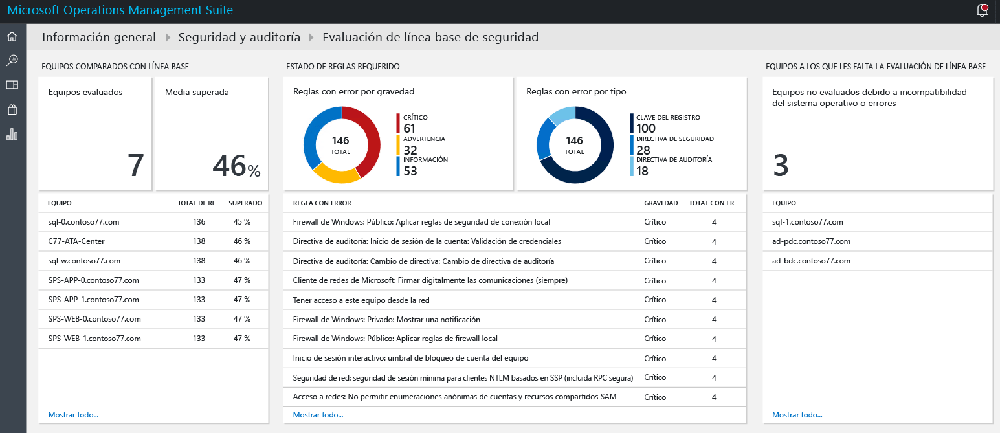
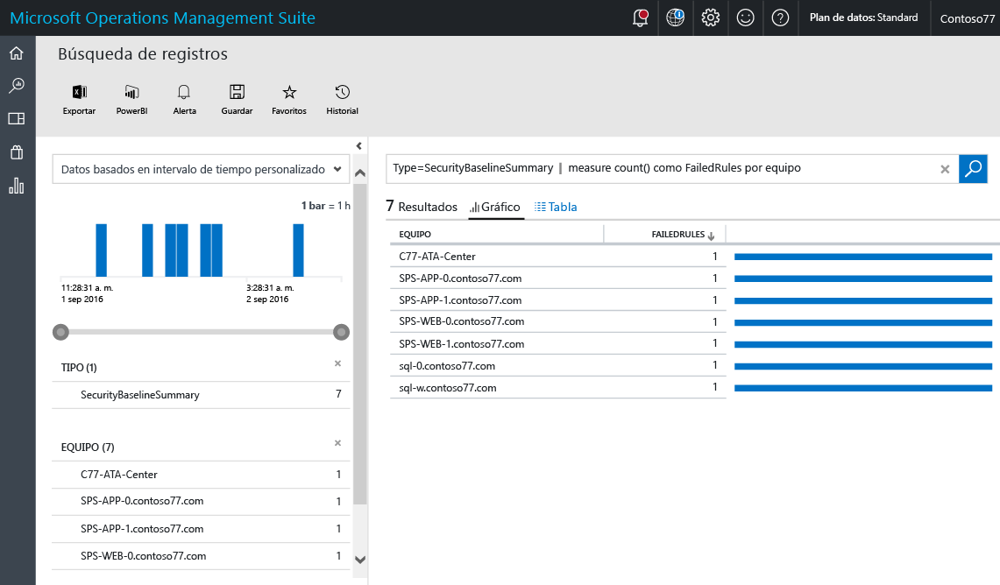
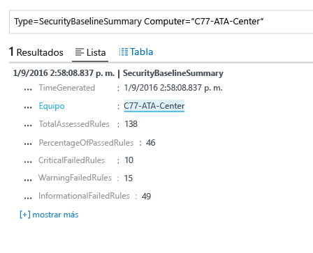
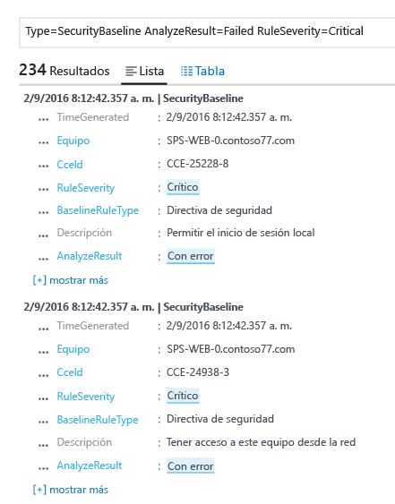

# Evaluación de línea base en la solución Seguridad y auditoría de Operations Management Suite
Este documento le ayuda a usar las funcionalidades de evaluación de línea base de la [solución Seguridad y auditoría de Operations Management Suite](operations-management-suite-overview.md) para acceder al estado de seguridad de los recursos supervisados.

## ¿Qué es la evaluación de línea base?
Microsoft, junto con organizaciones gubernamentales y del sector de todo el mundo, define una configuración de Windows que representa implementaciones de servidor muy seguras. Esta configuración es un conjunto de claves del Registro, la configuración de la directiva de auditoría y la configuración de la directiva de seguridad, junto con los valores recomendados de Microsoft para esta configuración. Este conjunto de reglas se conoce como línea base de seguridad. La funcionalidad de evaluación de línea base de Seguridad y auditoría de OMS puede examinar sin problemas todos los equipos para ver el cumplimiento. 

Existen tres tipos de reglas:

* **Reglas del Registro**: comprueba que las claves del Registro están establecidas correctamente.
* **Reglas de directiva de auditoría**: reglas relativas a la directiva de auditoría.
* **Reglas de directiva de seguridad**: reglas relativas a los permisos del usuario en el equipo.

> [!NOTE]
> Lea [Use OMS Security to assess the Security Configuration Baseline](https://blogs.technet.microsoft.com/msoms/2016/08/12/use-oms-security-to-assess-the-security-configuration-baseline/) (Uso de Seguridad de OMS para evaluar la línea base de configuración de seguridad) para ver una breve descripción de esta característica.
> 
> 

## Evaluación de línea base de seguridad
Puede revisar la evaluación de línea base de seguridad actual de todos los equipos supervisados por Seguridad y auditoría de OMS mediante el panel. Ejecute los siguientes pasos para acceder al panel de evaluación de línea base de seguridad:

1. En el panel principal de **Microsoft Operations Management Suite**, haga clic en el icono **Seguridad y auditoría**.
2. En el panel **Seguridad y auditoría**, haga clic en **Evaluación de línea base de seguridad** en **Dominios de seguridad**. Aparece el panel **Evaluación de línea base de seguridad**, como se muestra en la siguiente imagen:
   
    

Este panel se divide en tres áreas principales:

* **Equipos comparados con la línea base**: en esta sección se proporciona un resumen del número de equipos al que se accedió y el porcentaje de equipos que superaron la evaluación. También proporciona los 10 primeros equipos y el resultado en porcentaje de la evaluación.
* **Estado de reglas necesario**: esta sección tiene la intención de dar a conocer las reglas con errores por gravedad y por tipo. Puede buscar el primer gráfico para identificar rápidamente si la mayoría de las reglas con errores son críticas o no. También proporciona una lista de las 10 principales reglas con errores y su gravedad. El segundo gráfico muestra el tipo de regla que generó un error durante la evaluación. 
* **Falta la evaluación de línea base de seguridad de los equipos**: en esta sección se muestran los equipos a los que no se ha accedido debido a la incompatibilidad del sistema operativo o a errores. 

### Acceso a equipos en comparación con la línea base
Lo ideal es que todos los equipos cumplan la evaluación de línea base de seguridad. Sin embargo, se espera que en algunas circunstancias esto no suceda. Como parte del proceso de administración de seguridad, es importante incluir la revisión de los equipos con errores para que pasen todas las pruebas de evaluación de seguridad. Una forma rápida de verlo es mediante la selección de la opción **Computers accessed** (Equipos a los que se ha accedido), en la sección **Equipos comparados con la línea base**. Debería ver el resultado de la búsqueda de registros con la lista de los equipos, como se muestra en la siguiente pantalla:

El resultado de la búsqueda se muestra en formato de tabla, donde la primera columna contiene el nombre del equipo y el segundo color tiene el número de reglas con errores. Para recuperar la información relativa al tipo de regla con errores, haga clic en el número de reglas con errores, situado al lado del nombre del equipo. Verá un resultado similar al mostrado en la siguiente imagen:

En este resultado de la búsqueda, tiene el total de las reglas a las que se ha accedido, el número de reglas críticas con errores, las reglas con advertencias y las reglas de información con errores.

### Acceso al estado de las reglas necesarias
Después de obtener la información relativa al número de porcentaje de los equipos que superaron la evaluación, puede desear obtener más información acerca de qué reglas producen errores de acuerdo con su gravedad crítica. Esta visualización ayuda a priorizar qué equipos se deben abordar primero para asegurarse de que serán compatibles en la siguiente evaluación. Mueva el puntero sobre la parte Crítica del gráfico, que se encuentra en el icono **Reglas con errores por gravedad**, bajo **Estado de reglas necesario** y haga clic en ella. Verá un resultado similar a la siguiente pantalla:

 

En este resultado de registro, se ve el tipo de regla de la línea base con error, la descripción de esta regla y el identificador de Common Configuration Enumeration (CCE) de esta regla de seguridad. Estos atributos deben ser suficientes para realizar una acción correctora para solucionar este problema en el equipo de destino.

> [!NOTE]
> Para más información acerca de CCE, acceda a la [National Vulnerability Database](https://nvd.nist.gov/cce/index.cfm) (Base de datos de vulnerabilidad nacional).
> 
> 

### Acceso a equipos sin evaluación de línea base
OMS admite el perfil de línea base de miembros de dominio y de controladores de dominio en Windows Server 2008 R2 y hasta Windows Server 2012 R2. La línea base de Windows Server 2016 todavía no está finalizada y se agregará en cuanto se publique. Todos los demás sistemas operativos examinados mediante la evaluación de línea base de Seguridad y auditoría de OMS aparecen en la sección **Falta la evaluación de línea base de seguridad de los equipos**.

## Consulte también
En este documento, ha aprendido acerca de la evaluación de línea base de Seguridad y auditoría de OMS. Para obtener más información sobre Seguridad de OMS, consulte los siguientes artículos:

* [Información general de Operations Management Suite (OMS)](operations-management-suite-overview.md)
* [Supervisión de las alertas de seguridad y su respuesta en la solución Security and Audit de Operations Management Suite](oms-security-responding-alerts.md)
* [Supervisión de los recursos en la solución Seguridad y auditoría de Operations Management Suite](oms-security-monitoring-resources.md)

