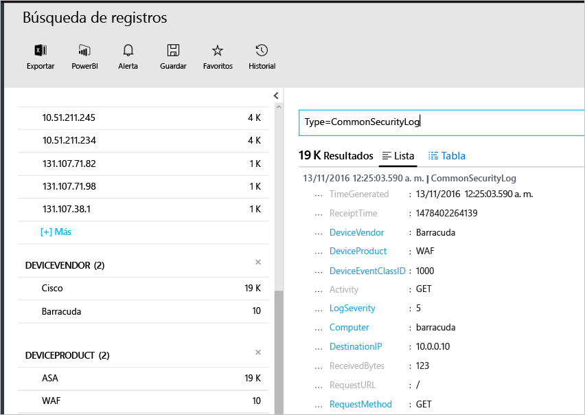

# <a name="connecting-your-security-products-to-the-operations-management-suite-oms-security-and-audit-solution"></a>Conexión de productos de seguridad a la solución Seguridad y auditoría de Operations Management Suite (OMS) 
Este documento le ayuda a conectar sus productos de seguridad en la solución Seguridad y auditoría de OMS. Se admiten los siguientes orígenes:

- Eventos de formato de evento común (CEF)
- Eventos de Cisco ASA


## <a name="what-is-cef"></a>¿Qué es el formato de evento común (CEF)?
El formato de evento común (CEF) es un formato estándar del sector sobre mensajes de Syslog, que utilizan muchos proveedores de seguridad para facilitar la interoperabilidad entre distintas plataformas. La solución Seguridad y auditoría de OMS admite la ingesta de datos usando CEF, lo que le permite conectar sus productos de seguridad con Seguridad de OMS. 

Al conectar el origen de datos a OMS, podrá sacar partido de las siguientes funcionalidades que forman parte de esta plataforma:

- Búsqueda y correlación
- Auditoría
- Alerta
- Información sobre amenazas
- Problemas importantes

## <a name="collection-of-security-solution-logs"></a>Colección de registros de soluciones de seguridad

Seguridad de OMS admite la recopilación de registros utilizando CEF sobre Syslogs y registros [Cisco ASA](https://blogs.technet.microsoft.com/msoms/2016/08/25/add-your-cisco-asa-logs-to-oms-security/). En este ejemplo, el origen (el equipo que genera los registros) es un equipo de Linux que ejecuta el demonio syslog-ng y el destino es Seguridad de OMS. Para preparar el equipo Linux, tendrá que realizar las siguientes tareas:

- Descargar el agente OMS para Linux, versión 1.2.0-25 o una versión posterior.
- Consulte la sección con la **guía de instalación rápida** de [este artículo](https://github.com/Microsoft/OMS-Agent-for-Linux/blob/master/docs/OMS-Agent-for-Linux.md#steps-to-install-the-oms-agent-for-linux) para instalar e incorporar el agente al área de trabajo.

Normalmente, el agente se instala en un equipo diferente de aquel en el que se generan los registros. El reenvío de los registros al equipo con el agente, normalmente requiere los siguientes pasos:

- Configurar el producto/máquina con los registros para que reenvíe los eventos necesarios al demonio syslog (rsyslog o syslog-ng) en el equipo con el agente.
- Habilitar el demonio syslog en el equipo del agente para recibir mensajes desde un sistema remoto.

En el equipo del agente, los eventos tienen que enviarse desde el demonio syslog al puerto UDP 25226 local. El agente escucha los eventos entrantes en este puerto. Este es un ejemplo de configuración para enviar todos los eventos desde el sistema local al agente (puede modificar la configuración para ajustarla a su configuración regional):

1. Abra la ventana de terminal y vaya al directorio */etc/syslog-ng /* 
2. Cree un nuevo archivo *security-config-omsagent.conf* y agregue el siguiente contenido: OMS_facility = local4
    
    filter f_local4_oms { facility(local4); };

    destination security_oms { tcp("127.0.0.1" port(25226)); };

    log { source(src); filter(f_local4_oms); destination(security_oms); };
    
3. Descargue el archivo *security_events.conf* y colóquelo en */etc/opt/microsoft/omsagent/conf/omsagent.d/* en el equipo del agente OMS.
4. Escriba el siguiente comando para reiniciar el demonio syslog: *Para la ejecución de syslog-ng:*
    
    ```
    sudo service rsyslog restart
    ```

    *Para la ejecución de rsyslog:*
    
    ```
    /etc/init.d/syslog-ng restart
    ```
5. Escriba el siguiente comando para reiniciar el agente OMS:

    *Para la ejecución de syslog-ng:*
    
    ```
    sudo service omsagent restart
    ```

    *Para la ejecución de rsyslog:*
    
    ```
    systemctl restart omsagent
    ```
6. Escriba el siguiente comando y revise el resultado para confirmar que no hay ningún error en el registro del agente OMS:

    ``` 
    tail /var/opt/microsoft/omsagent/log/omsagent.log
    ```

## <a name="reviewing-collected-security-events"></a>Revisión de eventos de seguridad recopilados

[!include[log-analytics-log-search-nextgeneration](../../includes/log-analytics-log-search-nextgeneration.md)]

Una vez finalizada la configuración, Seguridad de OMS iniciará la ingesta del evento de seguridad. Para visualizar esos eventos, abra la búsqueda de registros, escriba el comando *Type=CommonSecurityLog* en el campo de búsqueda y presione ENTRAR. En el ejemplo siguiente se muestra el resultado de este comando, tenga en cuenta que en este caso Seguridad OMS ya ha ingerido los registros de seguridad en varios proveedores:
   


Puede refinar la búsqueda para un proveedor único, por ejemplo, para visualizar los registros de Cisco en línea, escriba: *Type=CommonSecurityLog DeviceVendor=Cisco*. "CommonSecurityLog" tiene campos predefinidos para cualquier encabezado CEF incluida las extensiones básicas, mientras cualquier otra extensión tanto si se trata de una "Extensión personalizada" como si no, se insertará en el campo "AdditionalExtensions". Puede usar la característica de campos personalizados para obtener campos dedicados. 

### <a name="accessing-computers-missing-baseline-assessment"></a>Acceso a equipos sin evaluación de línea base
OMS admite el perfil de línea base de miembros de dominio en Windows Server 2008 R2 y hasta Windows Server 2012 R2. La línea base de Windows Server 2016 todavía no está finalizada y se agregará en cuanto se publique. Todos los demás sistemas operativos examinados mediante la evaluación de línea base de Seguridad y auditoría de OMS aparecen en la sección **Acceso a equipos sin evaluación de línea base**.

## <a name="see-also"></a>Consulte también
En este documento, ha aprendido a conectar su solución CEF a OMS. Para obtener más información sobre Seguridad de OMS, consulte los siguientes artículos:

* [Información general de Operations Management Suite (OMS)](operations-management-suite-overview.md)
* [Supervisión de las alertas de seguridad y su respuesta en la solución Security and Audit de Operations Management Suite](oms-security-responding-alerts.md)
* [Supervisión de los recursos en la solución Seguridad y auditoría de Operations Management Suite](oms-security-monitoring-resources.md)

