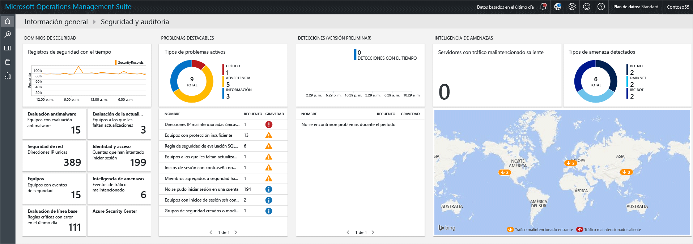
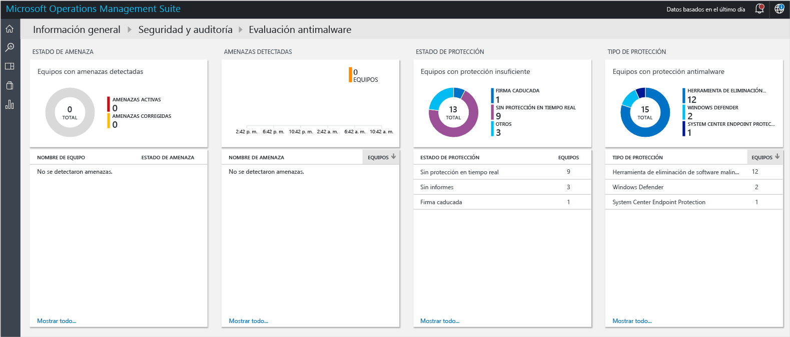
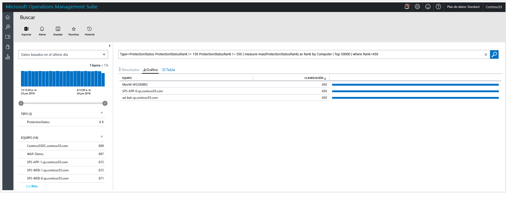
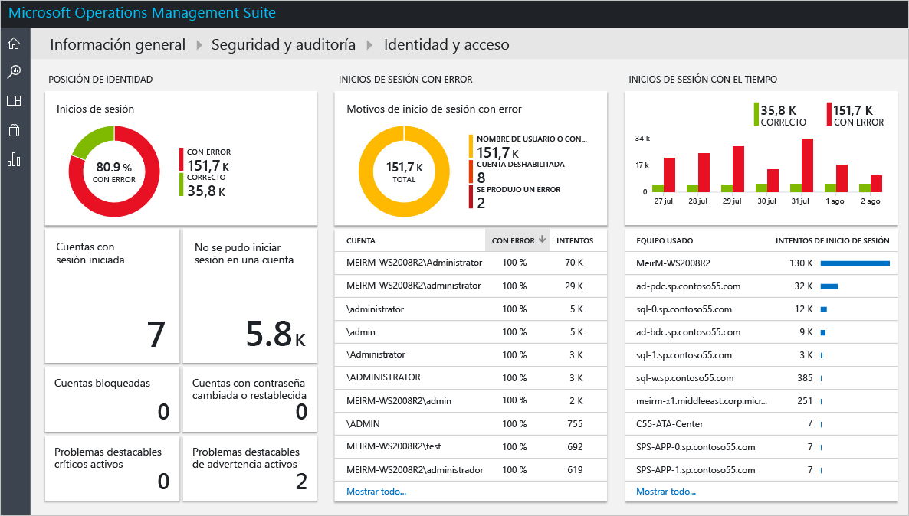
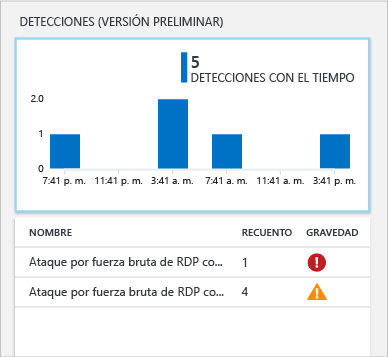
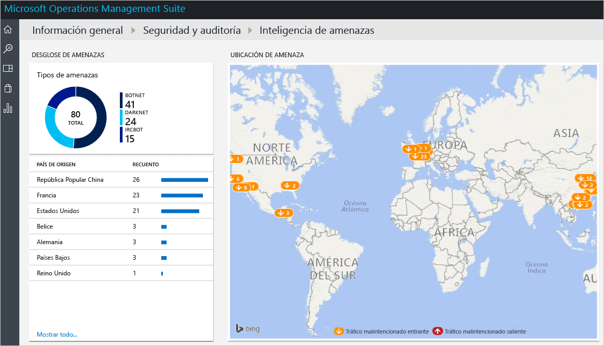

# Introducción a la solución Seguridad y auditoría de Operations Management Suite
Este documento le ayuda a empezar a trabajar rápidamente con las funcionalidades de la solución Seguridad y auditoría de Operations Management Suite (OMS) al guiarle a través de cada opción.

## ¿Qué es OMS?
Microsoft Operations Management Suite (OMS) es la solución de administración de TI basada en la nube de Microsoft que le ayuda a administrar y proteger su infraestructura local y en la nube. Para más información sobre OMS, lea el artículo [Operations Management Suite](https://technet.microsoft.com/library/mt484091.aspx).

## Panel de Seguridad y auditoría de OMS
La solución Seguridad y auditoría de OMS proporciona una vista completa de la postura de seguridad de TI de su organización con consultas de búsqueda integradas para problemas importantes que requieren su atención. El panel **Seguridad y auditoría** es la pantalla principal para todo lo relacionado con la seguridad en OMS. Proporciona información detallada sobre el estado de seguridad de los equipos. También incluye la capacidad de ver todos los eventos de las últimas 24 horas, 7 días o cualquier otro intervalo personalizado. Para acceder al panel **Seguridad y auditoría**, siga estos pasos:

1. En el panel principal de **Microsoft Operations Management Suite**, haga clic en el icono **Configuración**, situado a la izquierda.
2. En la hoja **Configuración**, en **Soluciones**, haga clic en la opción **Seguridad y auditoría**.
3. Aparece el panel **Seguridad y auditoría**:
   
    

Si obtiene acceso a este panel por primera vez y no dispone de dispositivos supervisados por OMS, los iconos no se completarán con los datos obtenidos del agente. Una vez que instale el agente, tardará un tiempo en completarse. Por lo tanto, es posible que al principio vea que faltan algunos datos que aún se están cargando en la nube.  En este caso, es normal que vea algunos iconos sin información tangible. Lea [Conexión de equipos Windows a Log Analytics](https://technet.microsoft.com/library/mt484108.aspx) para más información sobre cómo instalar el agente de OMS en un sistema Windows y [Conexión de equipos Linux a OMS](https://technet.microsoft.com/library/mt622052.aspx) para más información sobre cómo realizar esta tarea en un sistema Linux.

> [!NOTE]
> El agente recopila la información en función de los eventos actuales que están habilitados; por ejemplo, el nombre del equipo, la dirección IP y el nombre de usuario. Sin embargo, no se recopila ningún documento, archivo, nombre de la base de datos ni datos privados.   
> 
> 

Las soluciones son una colección de reglas de lógica, visualización y adquisición de datos que solucionan los desafíos clave a los que se enfrentan los clientes. Seguridad y auditoría es una solución, pueden agregarse otras por separado. Lea el artículo [Adición de soluciones](https://technet.microsoft.com/library/mt674635.aspx) para obtener más información sobre cómo agregar una nueva solución.

El panel de Seguridad y auditoría de OMS se organiza en cuatro categorías principales:

* **Dominios de seguridad**: en esta área podrá explorar más los registros de seguridad a lo largo del tiempo, acceder a la evaluación del malware, actualizar la evaluación, seguridad de la red, información de identidad y acceso, equipos con eventos de seguridad y acceder rápidamente al panel Azure Security Center.
* **Problemas importantes**: esta opción permitirá identificar rápidamente la cantidad de problemas activos y su gravedad.
* **Detecciones (vista previa)**: permite identificar patrones de ata medida que se producen.
* **Información sobre amenazas**: le permite identificar patrones de ataque mediante la visualización del número total de servidores con el tráfico de IP malintencionado saliente, el tipo de amenaza malintencionada y un mapa que muestra de dónde proceden estas direcciones IP. 
* **Consultas comunes de seguridad**: esta opción le proporciona una lista de las consultas de seguridad más comunes que puede utilizar para supervisar el entorno. Al hacer clic en una de las consultas, se abrirá la hoja **Buscar** con los resultados de esa consulta.

> [!NOTE]
> Para obtener más información sobre cómo OMS mantiene la seguridad de los datos, lea Cómo OMS protege los datos.
> 
> 

## Dominios de seguridad
Al supervisar recursos, es importante poder obtener acceso rápidamente al estado actual de su entorno. Sin embargo, es importante poder volver a realizar seguimiento de los eventos que se produjeron en el pasado y que pueden conducir a una mejor comprensión de lo que sucede en su entorno en un determinado momento. 

> [!NOTE]
> La conservación de los datos se realiza de acuerdo con el plan de precios de OMS. Para obtener más información, visite la página de precios de [Microsoft Operations Management Suite](https://www.microsoft.com/server-cloud/operations-management-suite/pricing.aspx) .
> 
> 

Los escenarios de investigación forense y de respuesta a incidentes se beneficiarán directamente de los resultados disponibles en el icono **Registros de seguridad con el paso del tiempo** .

Al hacer clic en este icono, se abrirá la hoja de **Buscar** con el resultado de una consulta para **Eventos de seguridad** (Type=SecurityEvents) con datos basados en los últimos siete días, como se muestra a continuación:

[!include[log-analytics-log-search-nextgeneration](../../includes/log-analytics-log-search-nextgeneration.md)]

El resultado de la búsqueda se divide en dos paneles: el panel izquierdo ofrece un desglose del número de eventos de seguridad encontrados, los equipos en los que se encontraron, el número de cuentas que se detectó en estos equipos y los tipos de actividades. El panel derecho le proporciona los resultados totales y una vista cronológica de los eventos de seguridad con la actividad de evento y el nombre del equipo. También puede hacer clic en **Mostrar más** para ver más detalles sobre este evento, como los datos del evento, su identificador y su origen.

> [!NOTE]
> Para obtener más información sobre la consulta de búsqueda de OMS, consulte [Referencia de búsqueda de OMS](https://technet.microsoft.com/library/mt450427.aspx).
> 
> 

### Evaluación de antimalware
Esta opción le permite identificar rápidamente los equipos con una protección insuficiente y los equipos que estén en peligro debido a un programa malintencionado. Se lee el estado de la evaluación del malware y las amenazas detectadas en los servidores supervisados, y luego los datos se envían al servicio de OMS en la nube para su procesamiento. Los servidores con amenazas detectadas y con una protección insuficiente se muestran en el panel de evaluación de malware, al que se puede acceder después de hacer clic en el icono **Evaluación de antimalware**. 

Al igual que cualquier otro icono dinámico disponible en el panel de OMS, al hacer clic en él, se abrirá la hoja **Buscar** con el resultado de la consulta. Para esta opción, si hace clic en la opción **Sin informes** en **Estado de protección**, tendrá el resultado de la consulta que muestra esta entrada única que contiene el nombre del equipo y su rango, como se muestra a continuación:

> [!NOTE]
> *rango* es una puntuación que se proporciona para reflejar el estado de la protección (activada, desactivada, actualizada, etc.) y las amenazas encontradas. Que este valor sea un número ayuda a realizar adiciones.
> 
> 

Si hace clic en el nombre del equipo, tendrá la vista cronológica del estado de protección de este equipo. Esto es muy útil para escenarios en los que debe comprender si alguna vez se instaló el antimalware y se quitó en algún momento.   

### Evaluación de la actualización
Esta opción permite determinar rápidamente la exposición general a posibles problemas de seguridad y la importancia de estas actualizaciones para su entorno. La solución Seguridad y auditoría de OMS solo proporciona la visualización de estas actualizaciones; los datos reales provienen de las [soluciones de administración de actualizaciones](oms-solution-update-management.md), que es un módulo diferente en OMS. A continuación se muestra un ejemplo de las actualizaciones:

> [!NOTE]
> Para más información acerca de la solución de administración de actualizaciones, consulte [Solución de administración de actualizaciones de OMS](oms-solution-update-management.md).
> 
> 

### Identidad y acceso
Identidad debe ser el plano de control de su empresa, ya que la protección de la identidad debe ser la máxima prioridad. Mientras que en el pasado existían perímetros alrededor de las organizaciones y esos perímetros eran una de las principales limitaciones defensivas, en la actualidad, con más datos y más aplicaciones que pasan a la nube, la identidad se ha convertido en el nuevo perímetro. 

> [!NOTE]
> Actualmente, los datos se basan solo en los datos de inicio de sesión de eventos de seguridad (id. de evento 4624) en los inicios de sesión futuros de Office365 y los datos de Azure AD también se incluirán.
> 
> 

Al supervisar las actividades de identidad, podrá realizar acciones proactivas antes de que se produzca un incidente o adoptar acciones reactivas para detener un intento de ataque. El panel **Identity and Access** proporciona una descripción general del estado de la identidad, incluido el número de intentos fallidos de inicio de sesión, la cuenta de usuario que se ha usado durante esos intentos, las cuentas que se han bloqueado, las cuentas en las que se ha cambiado o restablecido la contraseña y el número de cuentas actual con tienen una sesión iniciada. 

Cuando haga clic en el icono de **Identity and Access**, verá el panel siguiente:

La información disponible en este panel puede ayudarle de inmediato a identificar una posible actividad sospechosa. Por ejemplo, hay 338 intentos de iniciar sesión como **administrador** y se produjo un error en el 100 % de esos intentos. Esto puede deberse a un ataque de fuerza bruta contra esta cuenta. Si hace clic en esta cuenta, obtendrá más información que puede ayudarle a determinar el recurso de destino para este ataque potencial:

El informe detallado proporciona información importante sobre este evento, incluidos: el equipo de destino, el tipo de inicio de sesión (en este caso el inicio de sesión de red), la actividad (en este el evento de caso 4625) y una escala de tiempo completa de cada intento. 

### Equipos
Este icono se puede utilizar para obtener acceso a todos los equipos que tienen activamente eventos de seguridad. Al hacer clic en este icono, verá la lista de equipos con eventos de seguridad y el número de eventos en cada equipo:

Puede continuar con su investigación haciendo clic en cada equipo y revisar los eventos de seguridad que se marcaron.

### Información sobre amenazas

Mediante el uso de la opción Información sobre amenazas disponible en Seguridad y auditoría de OMS, los administradores de TI pueden identificar las amenazas de seguridad en el entorno, por ejemplo, identificar si un determinado equipo forma parte de un botnet. Los equipos pueden ser nodos en un botnet cuando los atacantes instalan de forma ilegal malware que se conecta en secreto al equipo para hacerse con el control. También puede identificar posibles amenazas procedentes de canales de comunicación de tipo underground, como darknet. Para más información sobre información de amenazas, consulte el artículo [Supervisión de las alertas de seguridad y su respuesta en la solución Seguridad y auditoría de Operations Management Suite](oms-security-responding-alerts.md).

En algunos escenarios, puede que observe una posible dirección IP malintencionada a la que se accedió desde un equipo supervisado:

Esta alerta y otras de la misma categoría, se generan a través de la seguridad de OMS mediante el uso de [Inteligencia de amenazas de Microsoft](https://youtu.be/O4WtxgUrDc8). Microsoft recopila los datos de inteligencia de amenazas, así como también los adquiere a través de los principales proveedores. Estos datos se actualizan con frecuencia y se adaptan a amenazas que cambian rápidamente. Debido a su naturaleza, debe combinarse con otras fuentes de información de seguridad mientras se [investiga](https://blogs.technet.microsoft.com/msoms/2016/12/08/investigating-suspicious-activity-in-a-hybrid-cloud-with-oms-security/) una alerta de seguridad. 

### Evaluación de línea base

Microsoft, junto con organizaciones gubernamentales y del sector de todo el mundo, define una configuración de Windows que representa implementaciones de servidor muy seguras. Esta configuración es un conjunto de claves del Registro, la configuración de la directiva de auditoría y la configuración de la directiva de seguridad, junto con los valores recomendados de Microsoft para esta configuración. Este conjunto de reglas se conoce como línea base de seguridad. Consulte [Evaluación de línea base en la solución Seguridad y auditoría de Operations Management Suite](oms-security-baseline.md) para más información sobre esta opción.

### Azure Security Center
Este icono es básicamente un acceso directo para obtener acceso al panel de Azure Security Center. Lea [Introducción a Azure Security Center](../security-center/security-center-get-started.md) paramás información sobre esta solución.

## Problemas importantes
El objetivo principal de este grupo de opciones es proporcionar una vista rápida de los problemas que tiene en su entorno, organizándolos en tres categorías: críticos, advertencias e informativos. El icono de tipo de problema activo es una visualización de estos problemas, pero no le permite obtener más detalles sobre ellos. Para ello, necesita usar la parte inferior de este icono que tiene el nombre del problema (NOMBRE), la cantidad de objetos que han hecho que se produzca (COUNT) y la importancia que tiene (SEVERITY).

Puede ver que estos problemas ya explicados en distintas áreas del grupo **Dominios de seguridad** , lo que refuerza la intención de esta vista: visualizar los problemas más importantes en el entorno desde un único lugar.

## Detecciones (vista previa)
El propósito principal de esta opción es permitir al departamento de TI identificar rápidamente las posibles amenazas a su entorno y su gravedad.

Esta opción también puede utilizarse durante la [investigación de una respuesta a incidentes](https://blogs.msdn.microsoft.com/azuresecurity/2016/11/30/investigating-suspicious-activity-in-a-hybrid-cloud-with-oms-security/) para realizar la evaluación y obtener información sobre el ataque.

> [!NOTE]
> Para más información acerca de cómo usar OMS para una respuesta a incidentes, dispone del vídeo [How to Leverage the Azure Security Center & Microsoft Operations Management Suite for an Incident Response](https://channel9.msdn.com/Blogs/Taste-of-Premier/ToP1703) (Cómo aprovechar Azure Security Center y Microsoft Operations Management Suite para una respuesta a incidentes).
> 
> 

## Información sobre amenazas
La nueva sección de información sobre amenazas de la solución Seguridad y auditoría permite ver los posibles patrones de ataque de diferentes formas: el número total de servidores con el tráfico de IP malintencionado saliente, el tipo de amenaza malintencionada y un mapa que muestra de dónde proceden estas direcciones IP. Puede interactuar con el mapa y hacer clic en las direcciones IP para obtener más información.

Los marcadores amarillos del mapa indican el tráfico entrante desde direcciones IP malintencionadas. No es raro que los servidores que están expuestos a Internet detecten tráfico malintencionado entrante, pero se recomienda revisar estos intentos para asegurarse de que ningún elemento malintencionado consigue su objetivo. Estos indicadores se basan en los registros del Firewall de Windows, WireData y registros de IIS.  

## Consultas comunes de seguridad
La lista de consultas comunes de seguridad disponible puede ser útil para obtener acceso rápidamente a información del recurso y personalizarla según las necesidades de su entorno. Estas consultas comunes son las siguientes:

* Todas las actividades de seguridad
* Actividades de seguridad en el equipo "computer01.contoso.com" (sustituya por su propio nombre de equipo)
* Actividades de seguridad en el equipo "computer01.contoso.com" para la cuenta "Administrator" (sustituya por sus propios nombres de equipo y cuenta)
* Actividad de inicio de sesión por equipo
* Cuentas que han acabado con el antimalware de Microsoft en cualquier equipo
* Equipos en los que se finalizó el proceso de antimalware de Microsoft
* Equipos en donde se ejecutó "hash.exe" ejecutan (sustituya por un nombre de proceso diferente)
* Todos los nombres de proceso que se han ejecutado
* Actividad de inicio de sesión por cuenta
* Cuentas que se registraron remotamente en el equipo "computer01.contoso.com" (sustituya por su propio nombre de equipo)

## Consulte también
En este documento, se presentó la solución Seguridad y auditoría de OMS. Para obtener más información sobre Seguridad de OMS, consulte los siguientes artículos:

* [Información general de Operations Management Suite (OMS)](operations-management-suite-overview.md)
* [Supervisión de las alertas de seguridad y su respuesta en la solución Security and Audit de Operations Management Suite](oms-security-responding-alerts.md)
* [Supervisión de los recursos en la solución Seguridad y auditoría de Operations Management Suite](oms-security-monitoring-resources.md)

