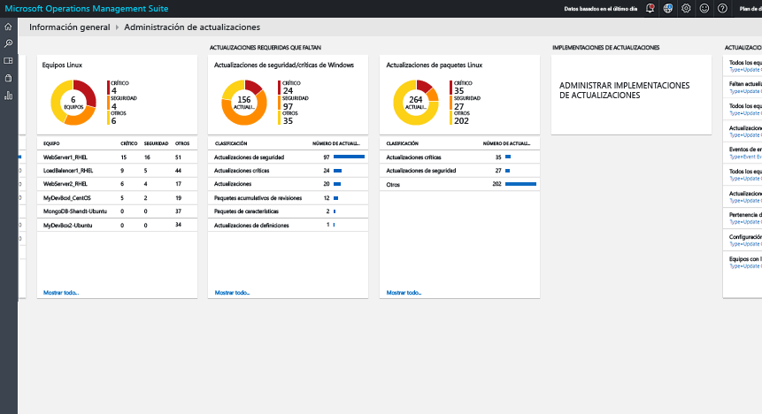
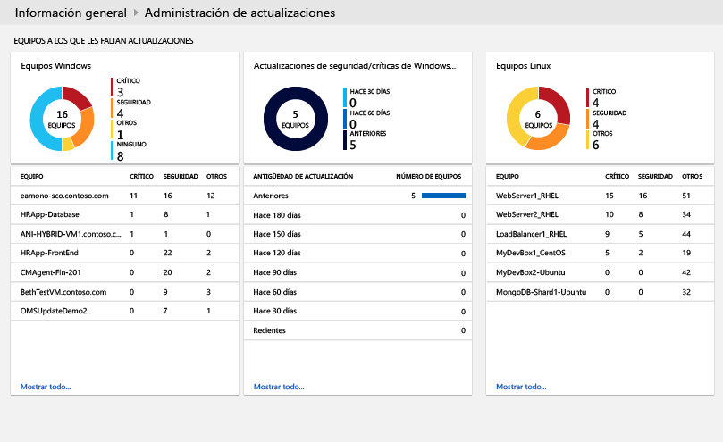
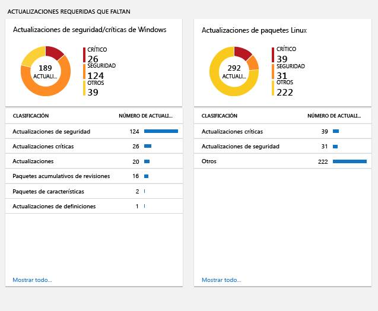
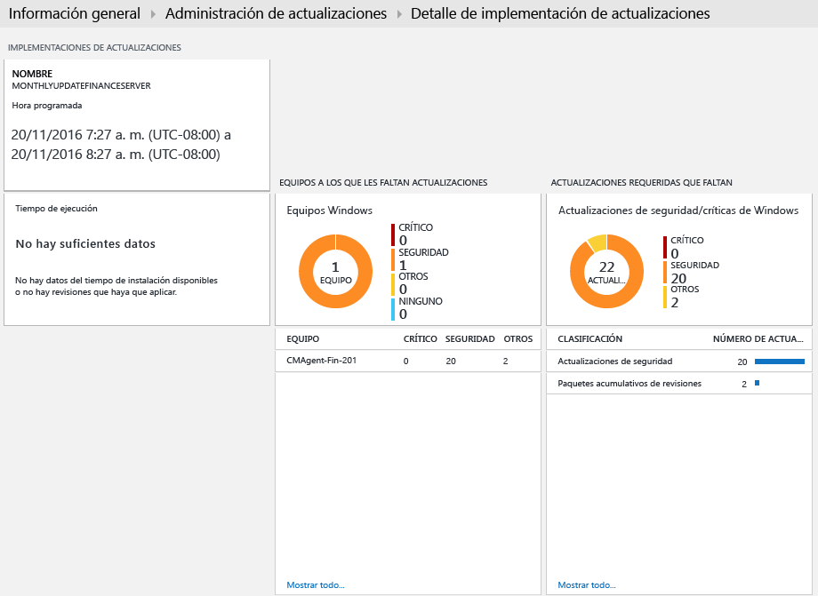

<properties
    pageTitle="Solución Administración de actualizaciones de OMS | Microsoft Azure"
    description="Este artículo está pensado para ayudarle a entender cómo utilizar esta solución para administrar las actualizaciones de los equipos Windows y Linux."
    services="operations-management-suite"
    documentationCenter=""
    authors="MGoedtel"
    manager="jwhit"
    editor=""
    />
<tags
    ms.service="operations-management-suite"
    ms.workload="tbd"
    ms.tgt_pltfrm="na"
    ms.devlang="na"
    ms.topic="get-started-article"
    ms.date="09/28/2016"
    ms.author="magoedte"/>

#  Solución Administración de actualizaciones de OMS

La solución Administración de actualizaciones de OMS permite administrar las actualizaciones de los equipos Windows y Linux.  Puede evaluar rápidamente el estado de las actualizaciones disponibles en todos los equipos agente e iniciar el proceso de instalación de las actualizaciones necesarias para los servidores. 

## Requisitos previos

-   Los agentes de Windows deben estar configurados para comunicarse con un servidor de Windows Server Update Services (WSUS) o tener acceso a Microsoft Update.  

    >[AZURE.NOTE] System Center Configuration Manager no puede administrar simultáneamente el agente de Windows.  
  
-   Los agentes de Linux deben tener acceso a un repositorio de actualización.  El agente de OMS para Linux se puede descargar desde [GitHub](https://github.com/microsoft/oms-agent-for-linux). 

## Configuración

Realice los pasos siguientes para agregar la solución Administración de actualizaciones al área de trabajo de OMS y agregar agentes de Linux.  Los agentes de Windows se agregan automáticamente sin ninguna configuración adicional.

1.  Agregue la solución Administración de actualizaciones al área de trabajo de OMS mediante el proceso descrito en [Incorporación de soluciones de OMS](../log-analytics/log-analytics-add-solutions.md) desde la galería de soluciones.  
2.  En el portal de OMS, seleccione **Configuración** y, a continuación, **Orígenes conectados**.  Anote el **Identificador del área de trabajo** y la **Clave principal** o la **Clave secundaria**.
3.  Realice los pasos siguientes para cada equipo Linux.

    a.  Instale la versión más reciente del agente de OMS para Linux mediante los comandos siguientes.  Reemplace <Workspace ID> por el identificador del área de trabajo y <Key> por la clave principal o secundaria.

        cd ~
        wget https://github.com/Microsoft/OMS-Agent-for-Linux/releases/download/v1.2.0-75/omsagent-1.2.0-75.universal.x64.sh
        sudo bash omsagent-1.2.0-75.universal.x64.sh --upgrade -w <Workspace ID> -s <Key>

     b. Para quitar al agente, ejecute el siguiente comando.

        sudo bash omsagent-1.2.0-75.universal.x64.sh --purge

## Módulos de administración

Si el grupo de administración de System Center Operations Manager está conectado al área de trabajo de OMS, se instalarán los siguientes módulos de administración en Operations Manager al agregar esta solución. No es necesario realizar tareas de configuración o mantenimiento de estos módulos de administración. 

-   Intelligence Pack Update Assessment de Microsoft System Center Advisor (Microsoft.IntelligencePacks.UpdateAssessment)
-   Microsoft.IntelligencePack.UpdateAssessment.Configuration (Microsoft.IntelligencePack.UpdateAssessment.Configuration)
-   Módulo de administración de Update Deployment

Para más información sobre cómo se actualizan los módulos de administración de soluciones, consulte [Conexión de Operations Manager con Log Analytics](../log-analytics/log-analytics-om-agents.md).

## Colección de datos

### Agentes admitidos

En la tabla siguiente se describen los orígenes conectados que son compatibles con esta solución.

Origen conectado | Compatible | Description|
----------|----------|----------|
Agentes de Windows | Sí | La solución recopila información acerca de las actualizaciones del sistema de los agentes de Windows e inicia la instalación de las actualizaciones necesarias.|
Agentes de Linux | Sí | La solución recopila información acerca de las actualizaciones del sistema de agentes de Linux.|
Grupo de administración de Operations Manager | Sí | La solución recopila información acerca de las actualizaciones del sistema de agentes en un grupo de administración conectado. No se requiere ninguna conexión directa entre el agente de Operations Manager y Log Analytics. Los datos se reenvían del grupo de administración al repositorio de OMS.|
Cuenta de almacenamiento de Azure | No | Azure Storage no incluye información acerca de las actualizaciones del sistema.|  

### Frecuencia de recopilación

Para cada equipo Windows administrado, se realiza un examen dos veces al día.  Cuando se instala una actualización, su información se actualiza en 15 minutos.  

Para cada equipo Linux administrado, se realiza un examen cada tres horas.  

## Uso de la solución

Al agregar la solución Administración de actualizaciones al área de trabajo de OMS, se agrega el icono de **Administración de actualizaciones al panel de OMS**. Este icono muestra un recuento y una representación gráfica del número de equipos de su entorno que actualmente requieren actualizaciones del sistema.  
 (Resumen de administración de actualizaciones)  

## Visualización de evaluaciones de la actualización

Haga clic en el icono de **Administración de actualizaciones** para abrir el panel **Administración de actualizaciones**. El panel incluye las columnas de la tabla siguiente. Cada columna muestra hasta los diez principales elementos que coinciden con los criterios de esa columna para el ámbito e intervalo de tiempo especificados. Puede ejecutar una búsqueda de registros que devuelva todos los registros haciendo clic en **Ver todo** en la parte inferior de la columna o haciendo clic en el encabezado de la columna.

Columna | Description|
----------|----------|
**Equipos con actualizaciones pendientes** ||
Actualizaciones críticas o de seguridad | Muestra una lista de los diez equipos que tienen más actualizaciones pendientes, ordenadas por el número de actualizaciones pendientes. Haga clic en el nombre de un equipo para ejecutar una búsqueda de registros que devuelva todos los registros de actualización de ese equipo.|
Actualizaciones críticas o de seguridad con una antigüedad superior a 30 días| Identifica el número de equipos que tienen actualizaciones críticas o de seguridad pendientes agrupados por el tiempo que ha pasado desde que se publicó la actualización. Haga clic en una de las entradas para ejecutar una búsqueda de registros que devuelva todas las actualizaciones pendientes y críticas.|
**Actualizaciones necesarias que faltan**||
Actualizaciones críticas o de seguridad | Muestra las clasificaciones de actualizaciones que los equipos tienen pendientes, ordenadas por el número de equipos que tienen pendientes la actualizaciones en la categoría. Haga clic en una clasificación para ejecutar una búsqueda de registros que devuelva todos los registros de actualización de esa clasificación.|
**Implementaciones de actualizaciones**||
Implementaciones de actualizaciones | Número de implementaciones de actualizaciones actualmente programadas y la duración hasta la siguiente ejecución programada.  Haga clic en el icono para ver las programaciones que se están ejecutando y las actualizaciones completadas, o bien programar una nueva implementación.|  
   
 (Resumen de administración de actualizaciones)   
 
   
 
   

## Instalación de actualizaciones

Una vez que se han evaluado las actualizaciones para todos los equipos de su entorno, puede instalar las actualizaciones necesarias mediante la creación de una *implementación de actualizaciones*.  Una implementación de actualizaciones es una instalación programada de las actualizaciones necesarias en uno o más equipos Windows.  Especifique la fecha y hora para la implementación, además de un equipo o grupo de equipos que se deben incluir.  

Los Runbooks instalan las actualizaciones en Azure Automation.  Actualmente, no puede ver estos Runbooks, que no requieren ninguna configuración.  Cuando se crea una implementación de actualizaciones, crea una programación que inicia un Runbook de actualización maestra a la hora especificada para los equipos incluidos.  Este Runbook maestro inicia un Runbook secundario en cada agente de Windows que realiza la instalación de las actualizaciones necesarias.  

### Visualización de implementaciones de actualizaciones

Haga clic en el icono **Implementación de actualizaciones** para ver la lista de implementaciones de actualizaciones existentes.  Se agrupan por estado: **Programado**, **En ejecución** y **Completado**.      

Las propiedades mostradas para cada implementación de actualizaciones se describen en la tabla siguiente.

Propiedad | Descripción|
----------|----------|
Nombre | Nombre de la implementación de actualizaciones.|
Schedule | Tipo de programación.  Actualmente, *OneTime* (Una vez) es el único valor posible.|
Hora de inicio|Fecha y hora programada para iniciar la implementación de actualizaciones.|
Duración | Número de minutos que la implementación de actualizaciones puede ejecutarse.  Si todas las actualizaciones no se instalan en este tiempo, el resto de las actualizaciones debe esperar hasta la siguiente implementación de actualizaciones.|
Servidores | Número de equipos afectados por la implementación de actualizaciones.|
Estado | Estado actual de la implementación de actualizaciones.  Los valores posibles son: - No iniciado - En ejecución - Finalizado|  

Haga clic en una implementación de actualizaciones para ver su pantalla de detalles, que incluye las columnas de la tabla siguiente.  Estas columnas no estarán rellenas si aún no ha comenzado la implementación de actualizaciones. 

Columna | Description|
----------|----------|
**Resultados del equipo**||
Se completó correctamente | Muestra el número de equipos de la implementación de actualizaciones por estado.  Haga clic en un estado para ejecutar una búsqueda de registros que devuelva todos los registros de actualización con ese estado para la implementación de actualizaciones.|
Estado de la instalación del equipo| Enumera los equipos implicados en la implementación de actualizaciones y el porcentaje de las actualizaciones que se instalaron correctamente. Haga clic en una de las entradas para ejecutar una búsqueda de registros que devuelva todas las actualizaciones pendientes y críticas.|
**Resultados de la actualización de instancias**||
Estado de la instalación de la instancia | Muestra las clasificaciones de actualizaciones que los equipos tienen pendientes, ordenadas por el número de equipos que tienen pendientes la actualizaciones en la categoría. Haga clic en un equipo para ejecutar una búsqueda de registros que devuelva todos los registros de actualización de ese equipo.|  
   

### Creación de una implementación de actualizaciones

Para crear una implementación de actualizaciones, haga clic en el botón **Agregar**, situado en la parte superior de la pantalla para abrir la página **New Update Deployment** (Nueva implementación de actualizaciones).  Debe proporcionar valores para las propiedades en la tabla siguiente.

Propiedad | Descripción|
----------|----------|
Nombre | Nombre único para identificar la implementación de actualizaciones.|
Zona horaria | Zona horaria que se utilizará para la hora de inicio.|
Hora de inicio | Fecha y hora para iniciar la implementación de actualizaciones.|
Duración | Número de minutos que la implementación de actualizaciones puede ejecutarse.  Si todas las actualizaciones no se instalan en este tiempo, el resto de las actualizaciones debe esperar hasta la siguiente implementación de actualizaciones.|
Equipos | Los nombres de equipos o grupos de equipos que se incluirán en la implementación de actualizaciones.  Seleccione una o más entradas de la lista desplegable.|
   

### Intervalo de tiempo

De forma predeterminada, el ámbito de los datos analizados en la solución Administración de actualizaciones es desde todos los grupos de administración conectados generados en el último día. 

Para cambiar el intervalo de tiempo de los datos, seleccione **Datos basados en** en la parte superior del panel. Puede seleccionar registros creados o actualizados en los últimos 7 días, 1 día o 6 horas. O puede seleccionar **Personalizado** y especificar un intervalo de fechas personalizado.     

## Registros de Log Analytics

La solución Administración de actualizaciones crea dos tipos de registros en el repositorio de OMS.

### Registros de actualización

Se crea un registro con el tipo **Actualizar** para cada actualización que está instalada o es necesaria en cada equipo. Los registros de actualización tienen las propiedades de la tabla siguiente.

Propiedad | Descripción|
----------|----------|
Tipo | *Actualizar*|
SourceSystem | El origen que ha aprobado la instalación de la actualización. Los valores posibles son: - Microsoft Update -  Windows Update - SCCM - Servidores Linux (recuperado de los administradores de paquetes)|
Aprobado | Especifica si se ha aprobado la actualización para la instalación.  Para los servidores Linux, actualmente es opcional, ya que la aplicación de revisiones no está administrada por OMS.|
Clasificación para Windows | Clasificación de la actualización. Los valores posibles son: - Aplicaciones - Actualizaciones críticas - Actualizaciones de definiciones - Feature Packs - Actualizaciones de seguridad - Service Packs - Paquetes acumulativos de actualizaciones - Actualizaciones|
Clasificación para Linux | Clasificación de la actualización. Los valores posibles son: - Actualizaciones críticas - Actualizaciones de seguridad - Otras actualizaciones|
Equipo | Nombre del equipo.|
InstallTimeAvailable | Especifica si la hora de instalación está disponible de otros agentes que instalaron la misma actualización.|
InstallTimePredictionSeconds | Tiempo de instalación estimado en segundos basado en otros agentes que instalaron la misma actualización.|
KBID | Identificador del artículo de la KB que describe la actualización.|
ManagementGroupName | Nombre del grupo de administración de agentes SCOM.  En el caso de los otros agentes, es AOI-<workspace ID>.|
MSRCBulletinID | Identificador del boletín de seguridad de Microsoft que describe la actualización.|
MSRCSeverity | Gravedad del boletín de seguridad de Microsoft. Los valores posibles son: - Crítico - Importante - Moderado|
Opcional | Especifica si la actualización es opcional.|
Producto | Nombre del producto al que corresponde la actualización.  Haga clic en **Ver** para abrir el artículo en un explorador.|
PackageSeverity | La gravedad de la vulnerabilidad corregida en esta actualización, notificada por los proveedores de distribución de Linux. | 
PublishDate | Fecha y hora en que se instaló la actualización.|
RebootBehavior | Especifica si la actualización fuerza un reinicio. Los valores posibles son: - canrequestreboot - neverreboots|
RevisionNumber | Número de revisión de la actualización.|
SourceComputerId | GUID para identificar de forma única el equipo.|
TimeGenerated | Fecha y hora en que se actualizó por última vez el registro.|
Título | Título de la actualización.|
UpdateID | GUID para identificar de forma única la actualización.|
UpdateState | Especifica si la actualización está instalada en este equipo. Los valores posibles son: - Instalada: la actualización está instalada en este equipo. - Necesaria: la actualización no está instalada y es necesaria en este equipo.|  

 
Cuando se realiza una búsqueda de registros que devuelve los registros con un tipo **Actualizar**, puede seleccionar la vista **Actualizaciones**, que muestra un conjunto de iconos que resumen las actualizaciones devueltas por la búsqueda. Puede hacer clic en las entradas de los iconos **Actualizaciones que faltan y aplicadas** y **Actualizaciones obligatorias y opcionales** para centrar el ámbito de la vista en ese conjunto de actualizaciones. Seleccione la vista **Lista** o **Tabla** para devolver los registros individuales.  

  

En la vista **Tabla**, puede hacer clic en **KBID** para cualquier registro con el fin de abrir un explorador con el artículo de la KB. Esto le permite leer rápidamente sobre los detalles de esa actualización específica.  

En la vista **Lista**, haga clic en el vínculo **Ver** situado junto al KBID para abrir el artículo de la KB. 

###Registros de UpdateSummary

Se crea un registro con un tipo de **UpdateSummary** para cada equipo del agente de Windows. Este registro se actualiza cada vez que se buscan actualizaciones en el equipo. Los registros **UpdateSummary** tienen las propiedades en la tabla siguiente.

Propiedad | Descripción|
----------|----------|
Tipo | UpdateSummary|
SourceSystem | OpsManager |
Equipo | Nombre del equipo.|
CriticalUpdatesMissing | Número de actualizaciones críticas pendientes en el equipo.|
ManagementGroupName | Nombre del grupo de administración de agentes SCOM. En el caso de los otros agentes, es AOI-<workspace ID>.|
NETRuntimeVersion | Versión del entorno de ejecución de .NET instalado en el equipo.|
OldestMissingSecurityUpdateBucket | Depósito para categorizar el tiempo desde que se publicó la actualización de seguridad más antigua pendiente en este equipo. Los valores posibles son: - Anterior - Hace 180 días - Hace 150 días - Hace 120 días - Hace 90 días - Hace 60 días - Hace 30 días - Reciente|
OldestMissingSecurityUpdateInDays | Número de días desde que se publicó la actualización de seguridad más antigua pendiente en este equipo.|
OsVersion | Versión del sistema operativo instalado en el equipo.|
OtherUpdatesMissing | Número de otras actualizaciones pendientes en el equipo.|
SecurityUpdatesMissing | Número de actualizaciones de seguridad pendientes en el equipo.|
SourceComputerId | GUID para identificar de forma única el equipo.|
TimeGenerated | Fecha y hora en que se actualizó por última vez el registro.|
TotalUpdatesMissing |Número total de actualizaciones pendientes en el equipo.|
WindowsUpdateAgentVersion | Número de versión del agente de Windows Update en el equipo.|
WindowsUpdateSetting | Configuración de cómo el equipo instalará las actualizaciones importantes. Los valores posibles son: - Deshabilitado - Notificar antes de la instalación - Instalación programada|
WSUSServer | Dirección URL del servidor WSUS si el equipo está configurado para usar uno.|  

## Búsquedas de registros de ejemplo

En la tabla siguiente se proporcionan ejemplos de búsquedas de registros para los registros de actualización recopilados por esta solución. 

Consultar | Description|
----------|----------|
Todos los equipos con actualizaciones pendientes | Type=Update UpdateState=Needed Optional=false &#124; select Computer,Title,KBID,Classification,UpdateSeverity,PublishedDate|
Actualizaciones pendientes en el equipo "COMPUTER01.contoso.com" (sustitúyalo por su propio nombre de equipo) | Type=Update UpdateState=Needed Optional=false Computer="COMPUTER01.contoso.com" &#124; select Computer,Title,KBID,Product,UpdateSeverity,PublishedDate|
Todos los equipos con actualizaciones de seguridad o críticas pendientes | Type=Update UpdateState=Needed Optional=false (Classification="Security Updates" OR Classification="Critical Updates")|
Actualizaciones críticas o de seguridad necesarias para las máquinas a las que se aplican manualmente las actualizaciones | Type=Update UpdateState=Needed Optional=false (Classification="Security Updates" OR Classification="Critical Updates") Computer IN {Type=UpdateSummary WindowsUpdateSetting=Manual &#124; Distinct Computer} &#124; Distinct KBID|
Eventos de error para las máquinas que tienen pendientes actualizaciones de seguridad o críticas necesarias | Type=Event EventLevelName=error Computer IN {Type=Update (Classification="Security Updates" OR Classification="Critical Updates") UpdateState=Needed Optional=false &#124; Distinct Computer}|
Todos los equipos con paquetes acumulativos de actualizaciones pendientes | Type=Update Optional=false Classification="Update Rollups" UpdateState=Needed &#124; select Computer,Title,KBID,Classification,UpdateSeverity,PublishedDate|
Actualizaciones distintivas pendientes en todos los equipos | Type=Update UpdateState=Needed Optional=false &#124; Distinct Title|
Pertenencia a un equipo WSUS | Type=UpdateSummary &#124; measure count() by WSUSServer|
Configuración de actualizaciones automáticas | Type=UpdateSummary &#124; measure count() by WindowsUpdateSetting|
Equipos con la actualización automática deshabilitada | Type=UpdateSummary WindowsUpdateSetting=Manual|  
Lista de todas las máquinas Linux que tienen un paquete de actualización disponible | Type=Update and OSType=Linux and UpdateState!="Not needed" &#124; measure count() by Computer|
Lista de todas las máquinas Linux que tienen un paquete de actualización disponible que soluciona una vulnerabilidad de seguridad o crítica | Type=Update and OSType=Linux and UpdateState!="Not needed" and (Classification="Critical Updates" OR Classification="Security Updates") &#124; measure count() by Computer|
Lista de todos los paquetes que tienen una actualización disponible | Type=Update and OSType=Linux and UpdateState!="Not needed"|
Lista de todos los paquetes que tienen una actualización disponible que soluciona una vulnerabilidad de seguridad o crítica | Type=Update  and OSType=Linux and UpdateState!="Not needed" and (Classification="Critical Updates" OR Classification="Security Updates")|
Lista de todas las máquinas "Ubuntu" con cualquier actualización disponible | Type=Update and OSType=Linux and OSName = Ubuntu &#124; measure count() by Computer|

## Pasos siguientes

- Usar Búsquedas de registros en [Log Analytics](../log-analytics/log-analytics-log-searches.md) para ver datos detallados sobre la actualización.

- [Crear sus propios paneles](../log-analytics/log-analytics-dashboards.md) que muestren el cumplimiento de las actualizaciones de los equipos administrados.

- [Crear alertas](../log-analytics/log-analytics-alerts.md) cuando se detectan actualizaciones críticas pendientes en equipos, o bien cuando un equipo tiene las actualizaciones automáticas deshabilitadas.  

<!--HONumber=Oct16_HO2-->

