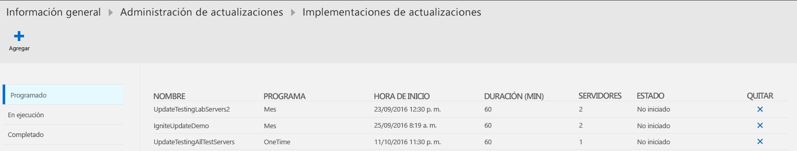
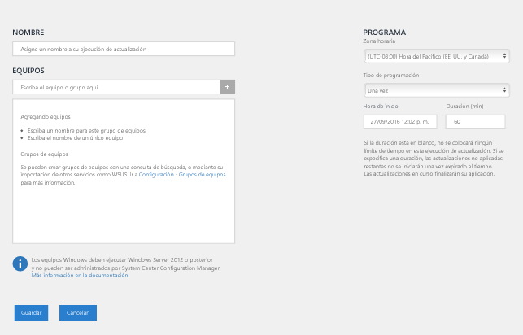
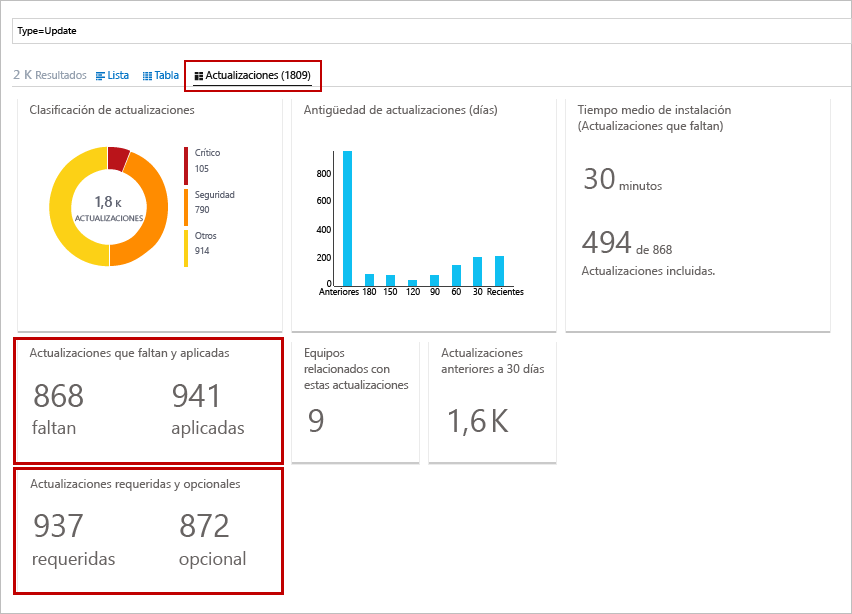
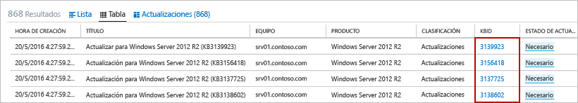
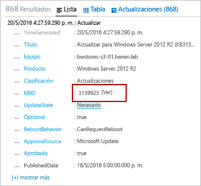

# Solución Administración de actualizaciones de OMS

La solución Update Management de OMS permite administrar las actualizaciones de seguridad del sistema operativo de los equipos de Windows y Linux implementados en Azure, en entornos locales o en otros proveedores en la nube.  Puede evaluar rápidamente el estado de las actualizaciones disponibles en todos los equipos agente y administrar el proceso de instalación de las actualizaciones necesarias para los servidores.

## Administración de actualizaciones en Azure Automation

La administración de actualizaciones se puede habilitar en las máquinas virtuales directamente desde una cuenta de [Azure Automation](../automation/automation-offering-get-started.md).
Para aprender a habilitar la administración de actualizaciones en máquinas virtuales desde una cuenta de Automation, consulte [Administración de actualizaciones para varias máquinas virtuales de Azure](../automation/manage-update-multi.md).

## Información general de la solución
Los equipos administrados por OMS usan lo siguiente para evaluar e implementar actualizaciones:

* Agente de OMS para Windows o Linux
* Extensión DSC (configuración de estado deseado) de PowerShell para Linux
* Hybrid Runbook Worker de Automation
* Microsoft Update o Windows Server Update Services para equipos Windows

Los siguientes diagramas muestran una vista conceptual del comportamiento y un flujo de datos con el modo en que la solución evalúa y aplica las actualizaciones de seguridad a todos los equipos Windows Server y Linux conectados en un área de trabajo.    

#### Windows Server

#### Linux

Después de que el equipo realiza un examen de cumplimiento de las actualizaciones, el agente de OMS reenvía la información de forma masiva a OMS. En un equipo Windows, el examen de cumplimiento se realiza cada 12 horas de forma predeterminada.  Además del examen programado, se inicia el examen de cumplimiento de las actualizaciones a los 15 minutos si se reinicia Microsoft Monitoring Agent (MMA), antes y después de la instalación de actualizaciones.  En un equipo Linux, el examen de cumplimiento se realiza cada 3 horas de forma predeterminada y se inicia un examen de cumplimiento en 15 minutos si se reinicia el agente MMA.  

Después, la información de cumplimiento se procesa y se resume en los paneles incluidos en la solución, o bien se puede buscar mediante consultas definidas por el usuario o predefinidas.  La solución informa del grado de actualización del equipo en función del origen configurado para la sincronización.  Si el equipo Windows está configurado para informar a WSUS, dependiendo de cuándo WSUS sincronizó por última vez con Microsoft Update, los resultados pueden diferir de lo que se muestra en Microsoft Updates.  Lo mismo ocurre en los equipos Linux que se configuran para informar a un repositorio local en lugar de a uno público.   

Puede implementar e instalar las actualizaciones de software en equipos que requieren las actualizaciones mediante la creación de una implementación programada.  Las actualizaciones clasificadas como *Opcional* no se incluyen en el ámbito de implementación para equipos Windows, solo las actualizaciones necesarias.  La implementación programada define qué equipos de destino recibirán las actualizaciones aplicables, ya sea explícitamente especificando equipos o seleccionando un [grupo de equipos](../log-analytics/log-analytics-computer-groups.md) que se basa en las búsquedas en registros de un conjunto determinado de equipos.  También se especifica una programación para aprobar y designar un período de tiempo dentro del cual se autoriza la instalación de las actualizaciones.  Los Runbooks instalan las actualizaciones en Azure Automation.  No puede ver estos runbooks, que no requieren ninguna configuración.  Cuando se crea una implementación de actualizaciones, esta crea una programación que inicia un runbook de actualización maestro a la hora especificada para los equipos incluidos.  Este runbook maestro inicia un runbook secundario en cada agente que realiza la instalación de las actualizaciones necesarias.       

En la fecha y hora especificadas en la implementación de actualizaciones, los equipos de destino ejecutan la implementación en paralelo.  En primer lugar, se realiza un examen para comprobar si las actualizaciones siguen siendo necesarias y las instala.  Para los equipos cliente WSUS, es importante tener en cuenta que, si no se aprueban las actualizaciones en WSUS, se producirá un error en la implementación de actualizaciones.  Los resultados de las actualizaciones aplicadas se reenvían a OMS para que se procesen y se resuman en los paneles o para la búsqueda de eventos.     

## requisitos previos
* La solución permite realizar evaluaciones de las actualizaciones en Windows Server 2008 y versiones posteriores, e implementaciones de actualizaciones en Windows Server 2008 R2 SP1 y versiones posteriores.  Nano Server no se admite.

    > [!NOTE]
    > Para poder implementar las actualizaciones en Windows Server 2008 R2 SP1 se necesita .NET Framework 4.5 y WMF 5.0 o versiones posteriores.
    >  
* No se admiten los sistemas operativos cliente Windows.  
* Los agentes de Windows deben estar configurados para comunicarse con un servidor de Windows Server Update Services (WSUS) o tener acceso a Microsoft Update.  

    > [!NOTE]
    > System Center Configuration Manager no puede administrar simultáneamente el agente de Windows.  
    >
* CentOS 6 (x86/x64) y 7 (x64)  
* Red Hat Enterprise (x86/x64) 6 y 7 (x64)  
* SUSE Linux Enterprise Server 11 (x86/x64) y 12 (x64)  
* Ubuntu 12.04 LTS y versiones más recientes (x86/x64)   
    > [!NOTE]  
    > Para evitar que las actualizaciones se apliquen fuera de una ventana de mantenimiento en Ubuntu, vuelva a configurar el paquete de actualizaciones desatendidas para deshabilitar las actualizaciones automáticas. Para más información sobre cómo configurarlo, consulte el [tema sobre actualizaciones automáticas en la Guía de Ubuntu Server](https://help.ubuntu.com/lts/serverguide/automatic-updates.html).

* Los agentes de Linux deben tener acceso a un repositorio de actualización.  

    > [!NOTE]
    > La solución no admite un agente de OMS para Linux configurado para informar a varias áreas de trabajo OMS.  
    >

Para más información acerca de cómo instalar el agente de OMS para Linux y descargar la versión más reciente, consulte [Agente de Operations Management Suite para Linux](https://github.com/microsoft/oms-agent-for-linux).  Para más información sobre cómo instalar el agente de OMS para Windows, consulte [Agente de Operations Management Suite para Windows](../log-analytics/log-analytics-windows-agent.md).  

### Permisos
Para crear implementaciones de actualizaciones, debe tener asignado el rol de colaborador en su cuenta Automation y el área de trabajo Log Analytics.  

## Componentes de soluciones
Esta solución consta de los siguientes recursos que se agregan a la cuenta de Automation y a los agentes directamente conectados o al grupo de administración conectado a Operations Manager.

### Módulos de administración
Si el grupo de administración de System Center Operations Manager está conectado al área de trabajo de OMS, se instalarán los siguientes módulos de administración en Operations Manager.  Estos módulos de administración también se instalan en equipos Windows directamente conectados después de agregar esta solución. No hay nada para configurar o administrar en estos módulos de administración.

* Intelligence Pack Update Assessment de Microsoft System Center Advisor (Microsoft.IntelligencePacks.UpdateAssessment)
* Microsoft.IntelligencePack.UpdateAssessment.Configuration (Microsoft.IntelligencePack.UpdateAssessment.Configuration)
* Módulo de administración de Update Deployment

Para obtener más información sobre cómo se actualizan los módulos de administración de soluciones, consulte [Conexión de Operations Manager con Log Analytics](../log-analytics/log-analytics-om-agents.md).

### Grupos de Hybrid Worker
Si habilita esta solución, los equipos Windows conectados directamente al área de trabajo de OMS se configurarán automáticamente como Hybrid Runbook Worker para admitir los runbooks que se incluyen en esta solución.  Cada equipo Windows administrado por la solución se enumerará en la hoja de grupos de Hybrid Runbook Worker de la cuenta de Automation, siguiendo la convención de nomenclatura *Nombre de host FQDN_GUID*.  Estos grupos no pueden ser grupos de destino de runbooks de su cuenta, porque se producirá un error. Estos grupos están diseñados únicamente para admitir la solución de administración.   

Sin embargo, puede agregar equipos Windows a un grupo de Hybrid Runbook Worker en la cuenta de Automation para admitir runbooks de Automation siempre que la cuenta para la solución y la pertenencia a grupos de Hybrid Runbook Worker sean las mismas.  Esta funcionalidad se agregó a la versión 7.2.12024.0 de Hybrid Runbook Worker.  

## Configuración
Realice los pasos siguientes para agregar la solución de administración de actualizaciones al área de trabajo de OMS y confirmar los agentes a los que se informa. Los agentes de Windows ya conectados al área de trabajo se agregan automáticamente sin ninguna configuración adicional.

Puede implementar la solución utilizando los métodos siguientes:

* Desde Azure Marketplace en Azure Portal, seleccionando la oferta Automation & Control o la solución Administración de actualizaciones
* Desde la Galería de soluciones de OMS en su área de trabajo de OMS

Si ya tiene una cuenta de Automation vinculada a un área de trabajo de OMS en el mismo grupo de recursos y región, al seleccionar Automation & Control se comprobará la configuración y se instalará y configurará la solución en ambos servicios.  Si selecciona la solución de administración de actualizaciones de Azure Marketplace, se produce el mismo comportamiento.  Si no tiene ambos servicios implementados en su suscripción, siga los pasos descritos en la hoja **Crear nueva solución** y confirme que desea instalar las otras soluciones preseleccionadas recomendadas.  También puede agregar la solución de administración de actualizaciones al área de trabajo de OMS mediante los pasos descritos en [Agregar soluciones de OMS](../log-analytics/log-analytics-add-solutions.md) desde la galería de soluciones.  

### Confirmar que los agentes de OMS y el grupo de administración de Operations Manager conectan a OMS

Para confirmar que los agentes de OMS para Linux y Windows conectados directamente se comunican con OMS, después de unos minutos, puede ejecutar la siguiente búsqueda en el registro:

* Linux: `Type=Heartbeat OSType=Linux | top 500000 | dedup SourceComputerId | Sort Computer | display Table`.  

* Windows: `Type=Heartbeat OSType=Windows | top 500000 | dedup SourceComputerId | Sort Computer | display Table`

En un equipo Windows, revise lo siguiente para comprobar la conectividad del agente con OMS:

1.  Abra Microsoft Monitoring Agent en el panel de control y, en la pestaña **Azure Log Analytics (OMS)**, el agente muestra un mensaje que indica: **Microsoft Monitoring Agent se conectó correctamente al servicio Microsoft Operations Management Suite**.   
2.  Abra el registro de eventos de Windows, vaya a **Registro de aplicaciones y servicios\Operations Manager** y busque los eventos con el identificador 3000 y 5002 del conector de servicio de origen.  Estos eventos indican que el equipo se ha registrado en el área de trabajo de OMS y está recibiendo la configuración.  

Si el agente no es capaz de comunicarse con el servicio OMS y está configurado para comunicarse con Internet a través de un servidor proxy o firewall, confirme que el firewall o el servidor proxy están configurados correctamente; para ello, consulte las secciones sobre [configuración de red para el agente de Windows](../log-analytics/log-analytics-windows-agent.md) o [configuración de red para el agente de Linux](../log-analytics/log-analytics-agent-linux.md).

> [!NOTE]
> Si los sistemas de Linux están configurados para comunicarse con un servidor proxy o puerta de enlace de OMS y está incorporando esta solución, actualice los permisos de *proxy.conf* para conceder al grupo omiuser permiso de lectura sobre este archivo realizando los siguientes comandos:  
> `sudo chown omsagent:omiusers /etc/opt/microsoft/omsagent/proxy.conf`  
> `sudo chmod 644 /etc/opt/microsoft/omsagent/proxy.conf`

Los agentes de Linux recién agregados mostrarán el estado **Actualizado** después de haber realizado una evaluación.  Este proceso puede tardar hasta 6 horas.

Para confirmar que un grupo de administración de Operations Manager se comunica con OMS, consulte [Validación de la integración de Operations Manager con OMS](../log-analytics/log-analytics-om-agents.md#validate-operations-manager-integration-with-oms).

## Colección de datos
### Agentes admitidos
En la tabla siguiente se describen los orígenes conectados que son compatibles con esta solución.

| Origen conectado | Compatible | DESCRIPCIÓN |
| --- | --- | --- |
| Agentes de Windows |Sí |La solución recopila información acerca de las actualizaciones del sistema de los agentes de Windows e inicia la instalación de las actualizaciones necesarias. |
| Agentes de Linux |Sí |La solución recopila información acerca de las actualizaciones del sistema de los agentes de Linux e inicia la instalación de las actualizaciones necesarias en las distribuciones admitidas. |
| Grupo de administración de Operations Manager |Sí |La solución recopila información acerca de las actualizaciones del sistema de agentes en un grupo de administración conectado. No se requiere ninguna conexión directa entre el agente de Operations Manager y Log Analytics. Los datos se reenvían del grupo de administración al repositorio de OMS. |
| Cuenta de almacenamiento de Azure |Sin  |Azure Storage no incluye información acerca de las actualizaciones del sistema. |

### Frecuencia de recopilación
Para cada equipo Windows administrado, se realiza un examen dos veces al día. Cada 15 minutos, se llama a la API de Windows para consultar la hora de la última actualización y determinar si ha cambiado el estado y, de ser así, se inicia un examen de cumplimiento.  Para cada equipo Linux administrado, se realiza un examen cada tres horas.

Puede tardar entre 30 minutos y 6 horas mostrar en el panel los datos actualizados de los equipos administrados.   

## Uso de la solución
Al agregar la solución Administración de actualizaciones al área de trabajo de OMS, se agrega el icono de **Administración de actualizaciones al panel de OMS**. Este icono muestra un recuento y una representación gráfica del número de equipos en el entorno y del cumplimiento de las actualizaciones.  
 (Resumen de administración de actualizaciones)  

## Visualización de evaluaciones de la actualización
Haga clic en el icono de **Administración de actualizaciones** para abrir el panel **Administración de actualizaciones**.    (Resumen de administración de actualizaciones) 

Este panel proporciona un análisis detallado del estado de las actualizaciones clasificadas por tipo de sistema operativo y clasificación de la actualización: crítica, seguridad u otros (por ejemplo, una actualización de definiciones). Los resultados de cada icono de este panel reflejan solo las actualizaciones que están aprobadas para la implementación, que se basa en el origen de sincronización de los equipos.   Al seleccionar el icono **Implementaciones de actualizaciones**, le redirige a la página Implementaciones de actualizaciones donde puede ver las programaciones, las implementaciones que se está ejecutando actualmente o las implementaciones completadas, o puede programar una nueva implementación.  

Para ejecutar una búsqueda en el registro que devuelva todos los registros, haga clic en el icono específico o, para ejecutar una consulta de una categoría determinada y criterios predefinidos, seleccione una de las disponibles en la lista de la columna **Consultas de actualización comunes**.    

## Instalación de actualizaciones
Una vez se han evaluado las actualizaciones para todos los equipos Linux y Windows de su área de trabajo, puede instalar las actualizaciones necesarias mediante la creación de una *implementación de actualizaciones*.  Una implementación de actualizaciones es una instalación programada de las actualizaciones necesarias en uno o más equipos.  Especifique la fecha y hora para la implementación, además de un equipo o grupo de equipos que deben incluirse en el ámbito de una implementación.  Para más información sobre grupos de equipos, consulte [Grupos de equipos de Log Analytics](../log-analytics/log-analytics-computer-groups.md).  Al incluir grupos de equipos en la implementación de la actualización, la pertenencia al grupo se evalúa solo en el momento de la creación de la programación.  No se reflejan los cambios posteriores en un grupo.  Para resolver este problema, elimine la implementación de actualización programada y vuelva a crearla.

> [!NOTE]
> Las máquinas virtuales Windows implementadas desde Azure Marketplace se establecen de forma predeterminada para recibir actualizaciones automáticas del servicio de Windows Update.  Este comportamiento no cambia después de agregar esta solución o máquinas virtuales Windows al área de trabajo.  Si no ha administrado activamente las actualizaciones con la solución, se aplicará el comportamiento predeterminado (aplicar automáticamente las actualizaciones).  

En el caso de las máquinas virtuales creadas a partir de las imágenes a petición de Red Hat Enterprise Linux (RHEL) en Azure Marketplace se registran para acceder a la instancia de [Red Hat Update Infrastructure (RHUI)](../virtual-machines/virtual-machines-linux-update-infrastructure-redhat.md) implementada en Azure.  Cualquier otra distribución de Linux se debe actualizar desde el repositorio de archivos en línea de distribuciones según los métodos admitidos de cada una de ellas.  

### Visualización de implementaciones de actualizaciones
Haga clic en el icono **Implementación de actualizaciones** para ver la lista de implementaciones de actualizaciones existentes.  Se agrupan por estado: **Programado**, **En ejecución** y **Completado**.      

Las propiedades mostradas para cada implementación de actualizaciones se describen en la tabla siguiente.

| Propiedad | DESCRIPCIÓN |
| --- | --- |
| NOMBRE |Nombre de la implementación de actualizaciones. |
| Schedule |Tipo de programación.  Las opciones disponibles son *Una vez*, *Periodicidad semanal* o *Periodicidad mensual*. |
| Hora de inicio |Fecha y hora programada para iniciar la implementación de actualizaciones. |
| Duration |Número de minutos que la implementación de actualizaciones puede ejecutarse.  Si todas las actualizaciones no se instalan en este tiempo, el resto de las actualizaciones debe esperar hasta la siguiente implementación de actualizaciones. |
| Servidores |Número de equipos afectados por la implementación de actualizaciones.  |
| Status |Estado actual de la implementación de actualizaciones.  Los valores posibles son: - No iniciado - En ejecución - Finalizado |

Seleccione una implementación de actualizaciones completada para ver su pantalla de detalles, que incluye las columnas de la tabla siguiente.  Estas columnas no estarán rellenas si aún no ha comenzado la implementación de actualizaciones.   

| Columna | DESCRIPCIÓN |
| --- | --- |
| **Vista de equipos** | |
| Equipos Windows |Enumera el número de equipos Windows de la implementación de actualizaciones por estado.  Haga clic en un estado para ejecutar una búsqueda de registros que devuelva todos los registros de actualización con ese estado para la implementación de actualizaciones. |
| Equipos Linux |Enumera el número de equipos Linux de la implementación de actualizaciones por estado.  Haga clic en un estado para ejecutar una búsqueda de registros que devuelva todos los registros de actualización con ese estado para la implementación de actualizaciones. |
| Estado de la instalación del equipo |Enumera los equipos implicados en la implementación de actualizaciones y el porcentaje de las actualizaciones que se instalaron correctamente. Haga clic en una de las entradas para ejecutar una búsqueda de registros que devuelva todas las actualizaciones pendientes y críticas. |
| **Vista de actualizaciones** | |
| Actualizaciones de Windows |Enumera las actualizaciones de Windows incluidas en la implementación de actualizaciones y su estado de instalación por cada actualización.  Seleccione una actualización para ejecutar una búsqueda en el registro que devuelva todos los registros de una actualización específica o haga clic en el estado para ejecutar una búsqueda en el registro que devuelva todos los registros de la implementación. |
| Actualizaciones de Linux |Enumera las actualizaciones de Linux que se incluyen en la implementación de actualizaciones y su estado de instalación por cada actualización.  Seleccione una actualización para ejecutar una búsqueda en el registro que devuelva todos los registros de una actualización específica o haga clic en el estado para ejecutar una búsqueda en el registro que devuelva todos los registros de la implementación. |

### Creación de una implementación de actualizaciones
Para crear una implementación de actualizaciones, haga clic en el botón **Agregar**, situado en la parte superior de la pantalla para abrir la página **New Update Deployment** (Nueva implementación de actualizaciones).  Debe proporcionar valores para las propiedades en la tabla siguiente.

| Propiedad | DESCRIPCIÓN |
| --- | --- |
| NOMBRE |Nombre único para identificar la implementación de actualizaciones. |
| Zona horaria |Zona horaria que se utilizará para la hora de inicio. |
| Tipo de programación | Tipo de programación.  Las opciones disponibles son *Una vez*, *Periodicidad semanal* o *Periodicidad mensual*.  
| Hora de inicio |Fecha y hora para iniciar la implementación de actualizaciones. **Nota:** El tiempo mínimo de ejecución de una implementación es de 30 minutos desde la hora actual si necesita implementar de inmediato. |
| Duration |Número de minutos que la implementación de actualizaciones puede ejecutarse.  Si todas las actualizaciones no se instalan en este tiempo, el resto de las actualizaciones debe esperar hasta la siguiente implementación de actualizaciones. |
| Equipos |Nombres de equipos o grupos de equipos de destino a incluir en la implementación de actualizaciones.  Seleccione una o más entradas de la lista desplegable. |

   

### Intervalo de tiempo
De forma predeterminada, el ámbito de los datos analizados en la solución Administración de actualizaciones es desde todos los grupos de administración conectados generados en el último día.

Para cambiar el intervalo de tiempo de los datos, seleccione **Datos basados en** en la parte superior del panel. Puede seleccionar registros creados o actualizados en los últimos 7 días, 1 día o 6 horas. O puede seleccionar **Personalizado** y especificar un intervalo de fechas personalizado.

## Registros de Log Analytics
La solución Administración de actualizaciones crea dos tipos de registros en el repositorio de OMS.

### Registros de actualización
Se crea un registro con el tipo **Actualizar** para cada actualización que está instalada o es necesaria en cada equipo. Los registros de actualización tienen las propiedades de la tabla siguiente.

| Propiedad | DESCRIPCIÓN |
| --- | --- |
| type |*Actualizar* |
| SourceSystem |El origen que ha aprobado la instalación de la actualización. Los valores posibles son: - Microsoft Update - Windows Update - SCCM - Servidores Linux (recuperado de los administradores de paquetes) |
| Aprobado |Especifica si se ha aprobado la actualización para la instalación.  Para los servidores Linux, actualmente es opcional, ya que la aplicación de revisiones no está administrada por OMS. |
| Clasificación para Windows |Clasificación de la actualización. Los valores posibles son: - Aplicaciones - Actualizaciones críticas - Actualizaciones de definiciones - Feature Packs - Actualizaciones de seguridad - Service Packs - Paquetes acumulativos de actualizaciones - Actualizaciones |
| Clasificación para Linux |Clasificación de la actualización. Los valores posibles son: - Actualizaciones críticas - Actualizaciones de seguridad - Otras actualizaciones |
| Equipo |Nombre del equipo. |
| InstallTimeAvailable |Especifica si la hora de instalación está disponible de otros agentes que instalaron la misma actualización. |
| InstallTimePredictionSeconds |Tiempo de instalación estimado en segundos basado en otros agentes que instalaron la misma actualización. |
| KBID |Identificador del artículo de la KB que describe la actualización. |
| ManagementGroupName |Nombre del grupo de administración de agentes SCOM.  En el caso de los otros agentes, es AOI-<workspace ID>. |
| MSRCBulletinID |Identificador del boletín de seguridad de Microsoft que describe la actualización. |
| MSRCSeverity |Gravedad del boletín de seguridad de Microsoft. Los valores posibles son: - Crítico - Importante - Moderado |
| Opcional |Especifica si la actualización es opcional. |
| Producto |Nombre del producto al que corresponde la actualización.  Haga clic en **Ver** para abrir el artículo en un explorador. |
| PackageSeverity |La gravedad de la vulnerabilidad corregida en esta actualización, notificada por los proveedores de distribución de Linux. |
| PublishDate |Fecha y hora en que se instaló la actualización. |
| RebootBehavior |Especifica si la actualización fuerza un reinicio. Los valores posibles son: - canrequestreboot - neverreboots |
| RevisionNumber |Número de revisión de la actualización. |
| SourceComputerId |GUID para identificar de forma única el equipo. |
| TimeGenerated |Fecha y hora en que se actualizó por última vez el registro. |
| Título |Título de la actualización. |
| UpdateID |GUID para identificar de forma única la actualización. |
| UpdateState |Especifica si la actualización está instalada en este equipo. Los valores posibles son: - Instalada: la actualización está instalada en este equipo. - Necesaria: la actualización no está instalada y es necesaria en este equipo. |

Cuando se realiza una búsqueda de registros que devuelve los registros con un tipo **Actualizar**, puede seleccionar la vista **Actualizaciones**, que muestra un conjunto de iconos que resumen las actualizaciones devueltas por la búsqueda. Puede hacer clic en las entradas de los iconos **Actualizaciones que faltan y aplicadas** y **Actualizaciones obligatorias y opcionales** para centrar el ámbito de la vista en ese conjunto de actualizaciones. Seleccione la vista **Lista** o **Tabla** para devolver los registros individuales. 

  

En la vista **Tabla**, puede hacer clic en **KBID** para cualquier registro con el fin de abrir un explorador con el artículo de la KB. Esto le permite leer rápidamente sobre los detalles de esa actualización específica. 

En la vista **Lista**, haga clic en el vínculo **Ver** situado junto al KBID para abrir el artículo de la KB. 

### Registros de UpdateSummary
Se crea un registro con un tipo de **UpdateSummary** para cada equipo del agente de Windows. Este registro se actualiza cada vez que se buscan actualizaciones en el equipo. Los registros **UpdateSummary** tienen las propiedades en la tabla siguiente.

| Propiedad | DESCRIPCIÓN |
| --- | --- |
| type |UpdateSummary |
| SourceSystem |OpsManager |
| Equipo |Nombre del equipo. |
| CriticalUpdatesMissing |Número de actualizaciones críticas pendientes en el equipo. |
| ManagementGroupName |Nombre del grupo de administración de agentes SCOM. En el caso de los otros agentes, es AOI-<workspace ID>. |
| NETRuntimeVersion |Versión del entorno de ejecución de .NET instalado en el equipo. |
| OldestMissingSecurityUpdateBucket |Depósito para categorizar el tiempo desde que se publicó la actualización de seguridad más antigua pendiente en este equipo. Los valores posibles son: - Anterior - Hace 180 días - Hace 150 días - Hace 120 días - Hace 90 días - Hace 60 días - Hace 30 días - Reciente |
| OldestMissingSecurityUpdateInDays |Número de días desde que se publicó la actualización de seguridad más antigua pendiente en este equipo. |
| OsVersion |Versión del sistema operativo instalado en el equipo. |
| OtherUpdatesMissing |Número de otras actualizaciones pendientes en el equipo. |
| SecurityUpdatesMissing |Número de actualizaciones de seguridad pendientes en el equipo. |
| SourceComputerId |GUID para identificar de forma única el equipo. |
| TimeGenerated |Fecha y hora en que se actualizó por última vez el registro. |
| TotalUpdatesMissing |Número total de actualizaciones pendientes en el equipo. |
| WindowsUpdateAgentVersion |Número de versión del agente de Windows Update en el equipo. |
| WindowsUpdateSetting |Configuración de cómo el equipo instalará las actualizaciones importantes. Los valores posibles son: - Deshabilitado - Notificar antes de la instalación - Instalación programada |
| WSUSServer |Dirección URL del servidor WSUS si el equipo está configurado para usar uno. |

## Búsquedas de registros de ejemplo
En la tabla siguiente se proporcionan ejemplos de búsquedas de registros para los registros de actualización recopilados por esta solución.

| Consultar | DESCRIPCIÓN |
| --- | --- |
| Type:Update OSType!=Linux UpdateState=Needed Optional=false Approved!=false &#124; measure count() by Computer |Servidores basados en Windows que necesitan actualizaciones |
| Type:Update OSType=Linux UpdateState!="Not needed" &#124; measure count() by Computer |Servidores Linux que necesitan actualizaciones | 
| Type=Update UpdateState=Needed Optional=false &#124; select Computer,Title,KBID,Classification,UpdateSeverity,PublishedDate |Todos los equipos con actualizaciones pendientes |
| Type=Update UpdateState=Needed Optional=false Computer="COMPUTER01.contoso.com" &#124; select Computer,Title,KBID,Product,UpdateSeverity,PublishedDate |Actualizaciones pendientes para un equipo específico (reemplace el valor por el nombre del equipo)|
| Type=Update UpdateState=Needed Optional=false (Classification="Security Updates" OR Classification="Critical Updates") |Todos los equipos con actualizaciones de seguridad o críticas pendientes | 
| Type=Update UpdateState=Needed Optional=false (Classification="Security Updates" OR Classification="Critical Updates") Computer IN {Type=UpdateSummary WindowsUpdateSetting=Manual &#124; Distinct Computer} &#124; Distinct KBID |Actualizaciones críticas o de seguridad necesarias para las máquinas a las que se aplican manualmente las actualizaciones |
| Type=Event EventLevelName=error Computer IN {Type=Update (Classification="Security Updates" OR Classification="Critical Updates") UpdateState=Needed Optional=false &#124; Distinct Computer} |Eventos de error para las máquinas que tienen pendientes actualizaciones de seguridad o críticas necesarias |
| Type=Update Optional=false Classification="Update Rollups" UpdateState=Needed &#124; select Computer,Title,KBID,Classification,UpdateSeverity,PublishedDate |Todos los equipos con paquetes acumulativos de actualizaciones pendientes | 
| Type=Update UpdateState=Needed Optional=false &#124; Distinct Title |Actualizaciones distintivas pendientes en todos los equipos | 
| Type:UpdateRunProgress InstallationStatus=failed &#124; measure count() by Computer, Title, UpdateRunName |Servidores basados en Windows con actualizaciones con error en la ejecución de la actualización | 
| Type:UpdateRunProgress InstallationStatus=failed &#124; measure count() by Computer, Product, UpdateRunName |Servidores Linux con actualizaciones con error en la ejecución de la actualización | 
| Type=UpdateSummary &#124; measure count() by WSUSServer |Pertenencia a un equipo WSUS | 
| Type=UpdateSummary &#124; measure count() by WindowsUpdateSetting |Configuración de actualizaciones automáticas | 
| Type=UpdateSummary WindowsUpdateSetting=Manual |Equipos con la actualización automática deshabilitada | 
| Type=Update and OSType=Linux and UpdateState!="Not needed" &#124; measure count() by Computer |Lista de todas las máquinas Linux que tienen un paquete de actualización disponible | 
| Type=Update and OSType=Linux and UpdateState!="Not needed" and (Classification="Critical Updates" OR Classification="Security Updates") &#124; measure count() by Computer |Lista de todas las máquinas Linux que tienen un paquete de actualización disponible que soluciona una vulnerabilidad de seguridad o crítica | 
| Type=Update and OSType=Linux and UpdateState!="Not needed" |Lista de todos los paquetes que tienen una actualización disponible | 
| Type=Update  and OSType=Linux and UpdateState!="Not needed" and (Classification="Critical Updates" OR Classification="Security Updates") |Lista de todos los paquetes que tienen una actualización disponible que soluciona una vulnerabilidad de seguridad o crítica | 
| Type:UpdateRunProgress &#124; measure Count() by UpdateRunName |Lista de las implementaciones de actualizaciones que han modificado equipos | 
| Type:UpdateRunProgress UpdateRunName="DeploymentName" &#124; measure Count() by Computer |Equipos que se actualizaron en esta ejecución de la actualización (reemplace el valor por el nombre de la implementación de actualizaciones) | 
| Type=Update and OSType=Linux and OSName = Ubuntu &#124; measure count() by Computer |Lista de todas las máquinas "Ubuntu" con cualquier actualización disponible |

## Integración con System Center Configuration Manager

Los clientes que han invertido en System Center Configuration Manager para administrar equipos, servidores y dispositivos móviles también confían en su solidez y nivel de madurez para administrar actualizaciones de software como parte de su ciclo de administración de actualizaciones de software (SUM).

Para aprender a integrar la solución OMS Update Management con System Center Configuration Manager, consulte [Integrar System Center Configuration Manager con Update Management de OMS [versión preliminar]](../automation/oms-solution-updatemgmt-sccmintegration.md).

## solución de problemas

En esta sección se proporciona información para resolver problemas con la solución de administración de actualizaciones.

### ¿Cómo se pueden solucionar los problemas de incorporación?
Si se producen problemas al intentar incorporar la solución o una máquina virtual, compruebe en los registros de eventos **Registros de aplicaciones y servicios y Operations Manager** los eventos con el identificador 4502 y el mensaje de evento que contenga **Microsoft.EnterpriseManagement.HealthService.AzureAutomation.HybridAgent**.  La tabla siguiente destaca los mensajes de error específicos y una posible solución para cada uno.  

| Message | Motivo | Solución |   
|----------|----------|----------|  
| No se pudo registrar la máquina para la administración de revisiones, error en el registro con la excepción System.InvalidOperationException: {"Message":"La máquina ya está registrada en una cuenta diferente. "} | La máquina ya está incorporada a otra área de trabajo para Update Management | Realice una limpieza de los artefactos antiguos [eliminando el grupo de hybrid runbook](../automation/automation-hybrid-runbook-worker.md#remove-hybrid-worker-groups)|  
| No se pudo registrar la máquina para la administración de revisiones, error en el registro con la excepción System.Net.Http.HttpRequestException: error al enviar la solicitud. ---> System.Net.WebException: la conexión subyacente se cerró: error inesperado en una operación de recepción. ---> System.ComponentModel.Win32Exception: el cliente y el servidor no pueden comunicarse, dado que no poseen un algoritmo común | El proxy, la puerta de enlace o el firewall están bloqueando la comunicación | [Revise los requisitos de red](../automation/automation-offering-get-started.md#network-planning)|  
| No se pudo registrar la máquina para la administración de revisiones, error en el registro con la excepción Newtonsoft.Json.JsonReaderException: error al analizar el valor de infinito positivo. | El proxy, la puerta de enlace o el firewall están bloqueando la comunicación | [Revise los requisitos de red](../automation/automation-offering-get-started.md#network-planning)| 
| El certificado presentado por el servicio <wsid>.oms.opinsights.azure.com no fue emitido por una entidad de certificación utilizada para los servicios de Microsoft. Póngase en contacto con el administrador de red para comprobar si están ejecutando un proxy que intercepte la comunicación TLS/SSL. |El proxy, la puerta de enlace o el firewall están bloqueando la comunicación | [Revise los requisitos de red](../automation/automation-offering-get-started.md#network-planning)|  
| No se pudo registrar la máquina para la administración de revisiones, error en el registro con la excepción AgentService.HybridRegistration. PowerShell.Certificates.CertificateCreationException: error al crear un certificado autofirmado. ---> System.UnauthorizedAccessException: se denegó el acceso. | Error al generar un certificado autofirmado | Compruebe que la cuenta del sistema tiene acceso de lectura a la carpeta: **C:\ProgramData\Microsoft\** **Crypto\RSA**|  

### ¿Cómo puedo solucionar problemas con las implementaciones de actualizaciones?
Puede ver los resultados del runbook responsable de implementar las actualizaciones incluidas en la implementación de actualizaciones programada en la hoja Trabajos de su cuenta de Automation vinculada con el área de trabajo de OMS que admite esta solución.  El runbook **Patch-MicrosoftOMSComputer** es un runbook secundario que tiene como destino un equipo administrado específico y, al revisar el flujo detallado, presentará información detallada de la implementación.  La salida muestra qué actualizaciones necesarias son aplicables, el estado de descarga, el estado de instalación y detalles adicionales.    

Para más información, consulte [Mensajes y salidas del runbook de Automation](../automation/automation-runbook-output-and-messages.md).   

## pasos siguientes
* Usar Búsquedas de registros en [Log Analytics](../log-analytics/log-analytics-log-searches.md) para ver datos detallados sobre la actualización.
* [Crear sus propios paneles](../log-analytics/log-analytics-dashboards.md) que muestren el cumplimiento de las actualizaciones de los equipos administrados.
* [Crear alertas](../log-analytics/log-analytics-alerts.md) cuando se detectan actualizaciones críticas pendientes en equipos, o bien cuando un equipo tiene las actualizaciones automáticas deshabilitadas.  
