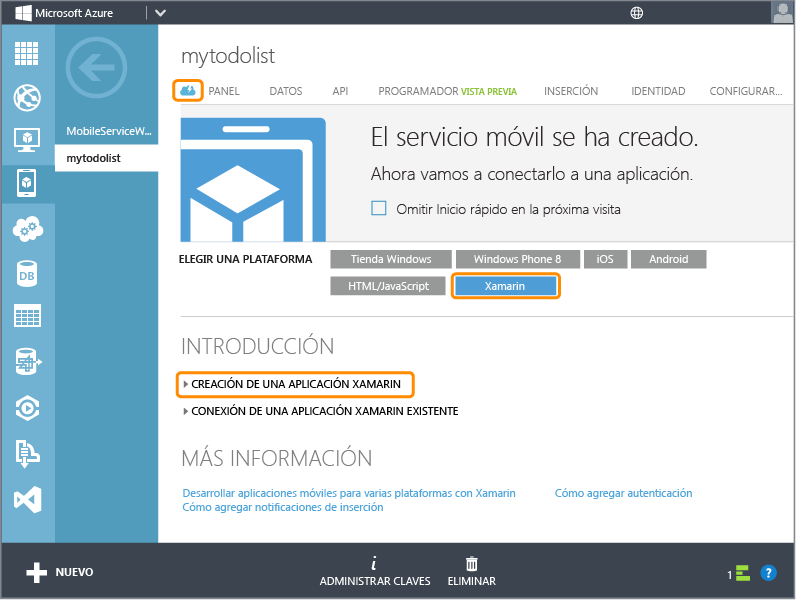
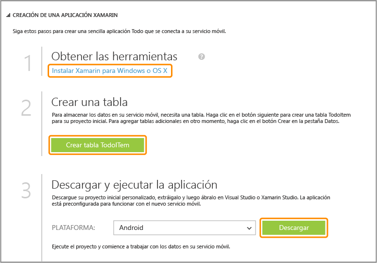
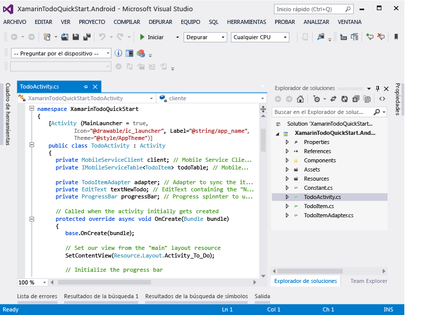

<properties pageTitle="Get Started with Mobile Services for Xamarin.Android" metaKeywords="Azure Xamarin.Android application, mobile service XamarinAndroid, getting started Azure Xamarin.Android" writer="craigd" description="Learn how to use Azure Mobile Services with your Xamarin.Android app." metaCanonical="" documentationCenter="Mobile" title="Get started with Mobile Services" />

Introducción a los Servicios móviles
====================================

[Tienda Windows](/es-es/documentation/articles/mobile-services-windows-store-get-started "Windows Store") [Windows Phone](/es-es/documentation/articles/mobile-services-windows-phone-get-started "Windows Phone") [iOS](/es-es/documentation/articles/mobile-services-ios-get-started "iOS") [Android](/es-es/documentation/articles/mobile-services-android-get-started "Android") [HTML](/es-es/documentation/articles/mobile-services-html-get-started "HTML") [Xamarin.iOS](/es-es/documentation/articles/partner-xamarin-mobile-services-ios-get-started "Xamarin.iOS") [Xamarin.Android](/es-es/documentation/articles/partner-xamarin-mobile-services-android-get-started "Xamarin.Android") [Sencha](/es-es/documentation/articles/partner-sencha-mobile-services-get-started/ "Sencha") [PhoneGap](/es-es/documentation/articles/mobile-services-javascript-backend-phonegap-get-started/ "PhoneGap")

En este tutorial se indica cómo agregar un servicio back-end basado en la nube a una aplicación Xamarin.Android mediante Servicios móviles de Azure. Con este tutorial creará tanto un servicio móvil nuevo como una aplicación simple de *Lista de pendientes* que almacena datos de la aplicación en el servicio móvil nuevo.

La siguiente captura de pantalla muestra la aplicación final:

[Ver el tutorial (en inglés)](http://channel9.msdn.com/Series/Windows-Azure-Mobile-Services/Getting-Started-with-Xamarin-and-Windows-Azure-Mobile-Services) [Reproducir vídeo (en inglés)](http://channel9.msdn.com/Series/Windows-Azure-Mobile-Services/Getting-Started-with-Xamarin-and-Windows-Azure-Mobile-Services) 10:05

Para completar este tutorial es necesario [Xamarin.Android](http://xamarin.com/download), que instala Xamarin Studio y un complemento de Visual Studio (en Windows) y la plataforma de Android más reciente. Se requiere el SDK de Android 4.2 o versiones posteriores.

El proyecto de inicio rápido descargado contiene el componente de Servicios móviles de Azure para Xamarin.Android. Mientras que este proyecto está dirigido a Android 4.2 o a una versión posterior, el SDK de Servicios móviles requiere solo Android 2.2 o una versión posterior.

**Nota:**

Necesita una cuenta de Azure para completar este tutorial. En caso de no tener ninguna, puede crear una cuenta de evaluación gratuita en tan solo unos minutos. Para obtener más información, consulte [Evaluación gratuita de Azure](http://www.windowsazure.com/es-es/pricing/free-trial/?WT.mc_id=A9C9624B5).

Creación de un servicio móvil
-----------------------------

[WACOM.INCLUDE [mobile-services-create-new-service](../includes/mobile-services-create-new-service.md)]

Creación de una nueva aplicaciónCreación de una nueva aplicación Xamarin.Android
-----------------------------------------------------------------------------------------------------------------

Una vez que haya creado el servicio móvil, podrá seguir una introducción rápida en el Portal de administración para crear una nueva aplicación o modificar una ya existente a fin de conectarla a dicho servicio.

En esta sección se creará una nueva aplicación Xamarin.Android que se conecta al servicio móvil.

1.  En el Portal de administración, haga clic en **Servicios móviles** y, a continuación, en el servicio móvil que acaba de crear.

2.  En la pestańa de inicio rápido, haga clic en **Xamarin.Android** bajo **Choose platform** y expanda **Create a new Android app**.

    

    Con esto se muestran los tres sencillos pasos requeridos para crear una aplicación Xamarin.Android conectada al servicio móvil.

    

3.  Haga clic en **Create TodoItem table** para crear una tabla donde almacenar datos de la aplicación.

4.  En **Download and run app**, haga clic en **Download**.

    De este modo se descarga el proyecto para la aplicación de *lista de pendientes* de muestra que está conectada al servicio móvil. Guarde el archivo comprimido del proyecto en el equipo local y anote dónde lo guardó.

Ejecución de la aplicación Android
----------------------------------

La etapa final de este tutorial consiste en crear y ejecutar la aplicación nueva.

1.  Desplácese a la ubicación donde se guardaron los archivos del proyecto comprimidos y expanda dichos archivos en el equipo.

2.  En Xamarin Studio o Visual Studio, haga clic en **File** y, a continuación en **Open**. Posteriormente, desplácese a los archivos de ejemplo sin comprimir y seleccione **XamarinTodoQuickStart.Android.sln** para abrirlo.

 	

	

1.  Presione el botón **Run** para compilar el proyecto e iniciar la aplicación. Se le solicitará que seleccione un emulador o un dispositivo USB conectado.

    **Nota:**

    Para poder ejecutar el proyecto en el emulador de Android, debe definir al menos un dispositivo virtual de Android (AVD). Use el administrador AVD para crear y administrar estos dispositivos.

2.  En la aplicación, escriba un texto significativo, como *Realice el tutorial* y, a continuación, haga clic en **Add**.

    

    Esta acción envía una solicitud POST al nuevo servicio móvil hospedado en Azure. Los datos de la solicitud se insertan en la tabla TodoItem. El servicio móvil devuelve los elementos almacenados en la tabla y los datos se muestran en la lista.

    > [WACOM.NOTE]
    > Puede revisar el código que tiene acceso a su servicio móvil para consultar e insertar datos, el que se encuentra en el archivo ToDoActivity.cs C\#.

3.  Nuevamente en el Portal de administración, haga clic en la pestańa **Data** y, a continuación, en la tabla **TodoItems**.

    

    Esto le permite examinar los datos que la aplicación inserta en la tabla.

    

Pasos siguientes
----------------

Ahora que completó el inicio rápido, aprenda a realizar importantes tareas adicionales en los Servicios móviles:

-   [Introducción a los datos](/es-es/develop/mobile/tutorials/get-started-with-data-xamarin-android)
    
    Obtenga más información sobre almacenar y consultar datos con los Servicios móviles.

-   [Introducción a la autenticación](/es-es/develop/mobile/tutorials/get-started-with-users-xamarin-android)
    
    Aprenda a autenticar a los usuarios de su aplicación con un proveedor de identidades.

-   [Introducción a las notificaciones de inserción](/es-es/develop/mobile/tutorials/get-started-with-push-xamarin-android)
    
    Aprenda a enviar una notificación de inserción muy básica a la aplicación.

