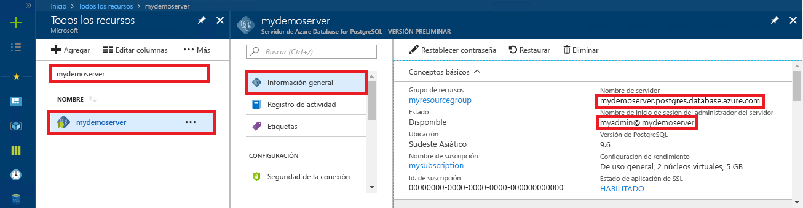

# <a name="azure-database-for-postgresql-use-net-c-to-connect-and-query-data"></a>Azure Database for PostgreSQL: uso de .NET (C#) para conectarse y consultar datos
En este tutorial rápido se muestra cómo conectarse a una instancia de Azure Database for PostgreSQL mediante una aplicación de C#. Se indica cómo usar instrucciones SQL para consultar, insertar, actualizar y eliminar datos en la base de datos. En los pasos de este artículo se da por hecho que está familiarizado con el desarrollo mediante C#, pero que nunca ha trabajado con Azure Database for PostgreSQL.

## <a name="prerequisites"></a>Requisitos previos
En este tutorial rápido se usan como punto de partida los recursos creados en una de estas guías:
- [Creación de la base de datos: Azure Portal](quickstart-create-server-database-portal.md)
- [Creación de la base de datos: CLI](quickstart-create-server-database-azure-cli.md)

Además, deberá:
- Instale [.NET Framework](https://www.microsoft.com/net/download). Siga los pasos descritos en el artículo vinculado para instalar .NET específicamente para su plataforma (Windows, Ubuntu Linux o macOS). 
- Instale [Visual Studio](https://www.visualstudio.com/downloads/) o Visual Studio Code para escribir y editar el código.
- Instale la biblioteca [Npgsql](http://www.npgsql.org/doc/index.html), tal y como se describe a continuación.

## <a name="install-npgsql-references-into-your-visual-studio-solution"></a>Instalación de referencias de Npgsql en la solución de Visual Studio
Para conectarse a PostgreSQL desde las aplicaciones de C#, use la biblioteca ADO.NET de código abierto llamada Npgsql. NuGet ayuda a descargar y administrar fácilmente las referencias.

1. Cree una nueva solución de C# o abra una existente: 
   - En Visual Studio, cree una solución; para ello, haga clic en el menú Archivo **Nuevo** > **Proyecto**.
   - En el cuadro de diálogo Nuevo proyecto, expanda **Plantillas** > **Visual C#**. 
   - Elija una plantilla adecuada, por ejemplo, **Aplicación de consola (.NET Core)**.

2. Use el Administrador de paquetes Nuget para instalar Npgsql:
   - Haga clic en el menú **Herramientas** > **Administrador de paquetes NuGet** > **Consola del Administrador de paquetes**.
   - En la **Consola del Administrador de paquetes**, escriba `Install-Package Npgsql`.
   - El comando de instalación descarga el archivo Npgsql.dll y los ensamblados relacionados y los agrega como dependencias en la solución.

## <a name="get-connection-information"></a>Obtención de información sobre la conexión
Obtenga la información de conexión necesaria para conectarse a Azure Database for PostgreSQL. Necesitará el nombre completo del servidor y las credenciales de inicio de sesión.

1. Inicie sesión en [Azure Portal](https://portal.azure.com/).
2. En el menú izquierdo de Azure Portal, haga clic en **Todos los recursos** y busque el servidor que ha creado, por ejemplo, **mypgserver-20170401**.
3. Haga clic en el nombre del servidor **mypgserver-20170401**.
4. Seleccione la página **Introducción** del servidor. Tome nota del **Nombre del servidor** y del **Server admin login name** (Nombre de inicio de sesión del administrador del servidor).
 
5. Si olvida la información de inicio de sesión del servidor, navegue hasta la página **Información general** para ver el nombre de inicio de sesión del administrador del servidor y, si es necesario, restablecer la contraseña.

## <a name="connect-create-table-and-insert-data"></a>Conexión, creación de una tabla e inserción de datos
Use el código siguiente para conectarse y cargar los datos mediante las instrucciones SQL **CREATE TABLE** e **INSERT INTO**. El código usa la clase NpgsqlCommand con el método [Open()](http://www.npgsql.org/api/Npgsql.NpgsqlConnection.html#Npgsql_NpgsqlConnection_Open) para establecer una conexión a PostgreSQL. A continuación, el código usa el método [CreateCommand()](http://www.npgsql.org/api/Npgsql.NpgsqlConnection.html#Npgsql_NpgsqlConnection_CreateCommand), establece la propiedad CommandText y llama al método [ExecuteNonQuery()](http://www.npgsql.org/api/Npgsql.NpgsqlCommand.html#Npgsql_NpgsqlCommand_ExecuteNonQuery) para ejecutar los comandos de base de datos. 

Reemplace los parámetros host, dbname, user y password por los valores especificados al crear el servidor y la base de datos. 

```csharp
using System;
using System.Collections.Generic;
using System.Linq;
using System.Text;
using System.Threading.Tasks;
using Npgsql;

namespace Driver
{
    public class AzurePostgresCreate
    {
        // Obtain connection string information from the portal
        //
        private static string Host = "mypgserver-20170401.postgres.database.azure.com";
        private static string User = "mylogin@mypgserver-20170401";
        private static string DBname = "mypgsqldb";
        private static string Password = "<server_admin_password>";
        private static string Port = "5432";

        static void Main(string[] args)
        {
            // Build connection string using parameters from portal
            //
            string connString =
                String.Format(
                    "Server={0}; User Id={1}; Database={2}; Port={3}; Password={4}; SSL Mode=Prefer; Trust Server Certificate=true",
                    Host,
                    User,
                    DBname,
                    Port,
                    Password);

            var conn = new NpgsqlConnection(connString);

            Console.Out.WriteLine("Opening connection");
            conn.Open();

            var command = conn.CreateCommand();
            command.CommandText = "DROP TABLE IF EXISTS inventory;";
            command.ExecuteNonQuery();
            Console.Out.WriteLine("Finished dropping table (if existed)");

            command.CommandText = "CREATE TABLE inventory (id serial PRIMARY KEY, name VARCHAR(50), quantity INTEGER);";
            command.ExecuteNonQuery();
            Console.Out.WriteLine("Finished creating table");

            command.CommandText =
                String.Format(
                    @"
                                INSERT INTO inventory (name, quantity) VALUES ({0}, {1});
                                INSERT INTO inventory (name, quantity) VALUES ({2}, {3});
                                INSERT INTO inventory (name, quantity) VALUES ({4}, {5});
                            ",
                    "\'banana\'", 150,
                    "\'orange\'", 154,
                    "\'apple\'", 100
                    );

            int nRows = command.ExecuteNonQuery();
            Console.Out.WriteLine(String.Format("Number of rows inserted={0}", nRows));

            Console.Out.WriteLine("Closing connection");
            conn.Close();

            Console.WriteLine("Press RETURN to exit");
            Console.ReadLine();
        }
    }
}
```

## <a name="read-data"></a>Lectura de datos
Use el código siguiente para conectarse y leer los datos mediante la instrucción SQL **SELECT**. El código usa la clase NpgsqlCommand con el método [Open()](http://www.npgsql.org/api/Npgsql.NpgsqlConnection.html#Npgsql_NpgsqlConnection_Open) para establecer una conexión a PostgreSQL. A continuación, el código usa el método [CreateCommand()](http://www.npgsql.org/api/Npgsql.NpgsqlConnection.html#Npgsql_NpgsqlConnection_CreateCommand) y el método [ExecuteReader()](http://www.npgsql.org/api/Npgsql.NpgsqlCommand.html#Npgsql_NpgsqlCommand_ExecuteReader) para ejecutar los comandos de base de datos. A continuación, el código usa [Read()](http://www.npgsql.org/api/Npgsql.NpgsqlDataReader.html#Npgsql_NpgsqlDataReader_Read) para avanzar a los registros de los resultados. A continuación, el código usa [GetInt32()](http://www.npgsql.org/api/Npgsql.NpgsqlDataReader.html#Npgsql_NpgsqlDataReader_GetInt32_System_Int32_) y [GetString()](http://www.npgsql.org/api/Npgsql.NpgsqlDataReader.html#Npgsql_NpgsqlDataReader_GetString_System_Int32_) para analizar los valores del registro.

Reemplace los parámetros host, dbname, user y password por los valores especificados al crear el servidor y la base de datos. 

```csharp
using System;
using System.Collections.Generic;
using System.Linq;
using System.Text;
using System.Threading.Tasks;
using Npgsql;

namespace Driver
{
    public class AzurePostgresRead
    {
        // Obtain connection string information from the portal
        //
        private static string Host = "mypgserver-20170401.postgres.database.azure.com";
        private static string User = "mylogin@mypgserver-20170401";
        private static string DBname = "mypgsqldb";
        private static string Password = "<server_admin_password>";
        private static string Port = "5432";

        static void Main(string[] args)
        {
            // Build connection string using parameters from portal
            //
            string connString =
                String.Format(
                    "Server={0}; User Id={1}; Database={2}; Port={3}; Password={4};",
                    Host,
                    User,
                    DBname,
                    Port,
                    Password);

            var conn = new NpgsqlConnection(connString);

            Console.Out.WriteLine("Opening connection");
            conn.Open();

            var command = conn.CreateCommand();
            command.CommandText = "SELECT * FROM inventory;";

            var reader = command.ExecuteReader();
            while (reader.Read())
            {
                Console.WriteLine(
                    string.Format(
                        "Reading from table=({0}, {1}, {2})",
                        reader.GetInt32(0).ToString(),
                        reader.GetString(1),
                        reader.GetInt32(2).ToString()
                        )
                    );
            }

            Console.Out.WriteLine("Closing connection");
            conn.Close();

            Console.WriteLine("Press RETURN to exit");
            Console.ReadLine();
        }
    }
}
```


## <a name="update-data"></a>Actualización de datos
Use el código siguiente para conectarse y leer los datos mediante la instrucción SQL **UPDATE**. El código usa la clase NpgsqlCommand con el método [Open()](http://www.npgsql.org/api/Npgsql.NpgsqlConnection.html#Npgsql_NpgsqlConnection_Open) para establecer una conexión a PostgreSQL. A continuación, el código usa el método [CreateCommand()](http://www.npgsql.org/api/Npgsql.NpgsqlConnection.html#Npgsql_NpgsqlConnection_CreateCommand), establece la propiedad CommandText y llama al método [ExecuteNonQuery()](http://www.npgsql.org/api/Npgsql.NpgsqlCommand.html#Npgsql_NpgsqlCommand_ExecuteNonQuery) para ejecutar los comandos de base de datos.

Reemplace los parámetros host, dbname, user y password por los valores especificados al crear el servidor y la base de datos. 

```csharp
using System;
using System.Collections.Generic;
using System.Linq;
using System.Text;
using System.Threading.Tasks;
using Npgsql;

namespace Driver
{
    public class AzurePostgresUpdate
    {
        // Obtain connection string information from the portal
        //
        private static string Host = "mypgserver-20170401.postgres.database.azure.com";
        private static string User = "mylogin@mypgserver-20170401";
        private static string DBname = "mypgsqldb";
        private static string Password = "<server_admin_password>";
        private static string Port = "5432";

        static void Main(string[] args)
        {
            // Build connection string using parameters from portal
            //
            string connString =
                String.Format(
                    "Server={0}; User Id={1}; Database={2}; Port={3}; Password={4};",
                    Host,
                    User,
                    DBname,
                    Port,
                    Password);

            var conn = new NpgsqlConnection(connString);

            Console.Out.WriteLine("Opening connection");
            conn.Open();

            var command = conn.CreateCommand();
            command.CommandText =
            String.Format("UPDATE inventory SET quantity = {0} WHERE name = {1};",
                200,
                "\'banana\'"
                );

            int nRows = command.ExecuteNonQuery();
            Console.Out.WriteLine(String.Format("Number of rows updated={0}", nRows));

            Console.Out.WriteLine("Closing connection");
            conn.Close();

            Console.WriteLine("Press RETURN to exit");
            Console.ReadLine();
        }
    }
}
```


## <a name="delete-data"></a>Eliminación de datos
Use el código siguiente para conectarse y leer los datos mediante la instrucción SQL **DELETE**. 

 El código usa la clase NpgsqlCommand con el método [Open()](http://www.npgsql.org/api/Npgsql.NpgsqlConnection.html#Npgsql_NpgsqlConnection_Open) para establecer una conexión a PostgreSQL. A continuación, el código usa el método [CreateCommand()](http://www.npgsql.org/api/Npgsql.NpgsqlConnection.html#Npgsql_NpgsqlConnection_CreateCommand), establece la propiedad CommandText y llama al método [ExecuteNonQuery()](http://www.npgsql.org/api/Npgsql.NpgsqlCommand.html#Npgsql_NpgsqlCommand_ExecuteNonQuery) para ejecutar los comandos de base de datos.

Reemplace los parámetros host, dbname, user y password por los valores especificados al crear el servidor y la base de datos. 

```csharp
using System;
using System.Collections.Generic;
using System.Linq;
using System.Text;
using System.Threading.Tasks;
using Npgsql;

namespace Driver
{
    public class AzurePostgresDelete
    {
        // Obtain connection string information from the portal
        //
        private static string Host = "mypgserver-20170401.postgres.database.azure.com";
        private static string User = "mylogin@mypgserver-20170401";
        private static string DBname = "mypgsqldb";
        private static string Password = "<server_admin_password>";
        private static string Port = "5432";

        static void Main(string[] args)
        {
            // Build connection string using parameters from portal
            //
            string connString =
                String.Format(
                    "Server={0}; User Id={1}; Database={2}; Port={3}; Password={4};",
                    Host,
                    User,
                    DBname,
                    Port,
                    Password);

            var conn = new NpgsqlConnection(connString);

            Console.Out.WriteLine("Opening connection");
            conn.Open();

            var command = conn.CreateCommand();
            command.CommandText =
            String.Format("DELETE FROM inventory WHERE name = {0};",
                "\'orange\'");
            int nRows = command.ExecuteNonQuery();
            Console.Out.WriteLine(String.Format("Number of rows deleted={0}", nRows));

            Console.Out.WriteLine("Closing connection");
            conn.Close();

            Console.WriteLine("Press RETURN to exit");
            Console.ReadLine();
        }
    }
}
```

## <a name="next-steps"></a>Pasos siguientes
> [!div class="nextstepaction"]
> [Migración de una base de datos mediante exportación e importación](./howto-migrate-using-export-and-import.md)
