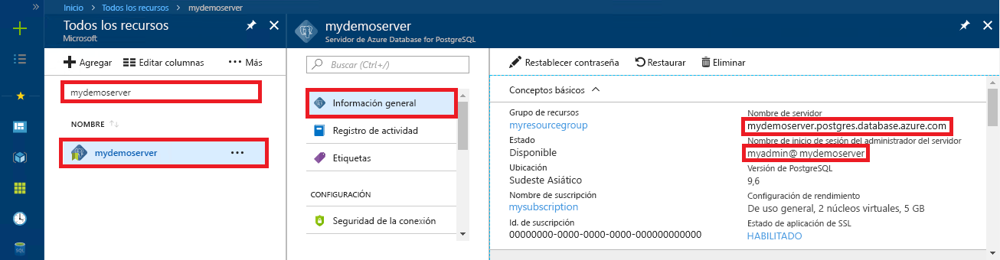

# <a name="azure-database-for-postgresql-use-nodejs-to-connect-and-query-data"></a>Azure Database for PostgreSQL: uso de Node.js para conectarse y consultar datos
En este tutorial rápido se muestra cómo conectarse a una instancia de Azure Database for PostgreSQL mediante una aplicación de [Node.js](https://nodejs.org/). Se indica cómo usar instrucciones SQL para consultar, insertar, actualizar y eliminar datos en la base de datos. En los pasos de este artículo se da por hecho que está familiarizado con el desarrollo mediante Node.js, pero que nunca ha trabajado con Azure Database for PostgreSQL.

## <a name="prerequisites"></a>Requisitos previos
En este tutorial rápido se usan como punto de partida los recursos creados en una de estas guías:
- [Creación de la base de datos: Azure Portal](quickstart-create-server-database-portal.md)
- [Creación de la base de datos: CLI](quickstart-create-server-database-azure-cli.md)

Además, deberá:
- Instalar [Node.js](https://nodejs.org)

## <a name="install-pg-client"></a>Instalación del cliente pg
Instale [pg](https://www.npmjs.com/package/pg), que es un cliente de PostgreSQL para Node.js.

Para ello, ejecute el Administrador de paquetes de Node (npm) para JavaScript desde la línea de comandos.
```bash
npm install pg
```

Compruebe la instalación; para ello, enumere los paquetes instalados.
```bash
npm list
```

## <a name="get-connection-information"></a>Obtención de información sobre la conexión
Obtenga la información de conexión necesaria para conectarse a Azure Database for PostgreSQL. Necesitará el nombre completo del servidor y las credenciales de inicio de sesión.

1. Inicie sesión en [Azure Portal](https://portal.azure.com/).
2. En el menú izquierdo de Azure Portal, haga clic en **Todos los recursos** y busque el servidor que creó.
3. Haga clic en el nombre del servidor.
4. Seleccione la página **Introducción** del servidor. Tome nota del **Nombre del servidor** y del **Server admin login name** (Nombre de inicio de sesión del administrador del servidor).
 
5. Si olvida la información de inicio de sesión del servidor, navegue hasta la página **Información general** para ver el nombre de inicio de sesión del administrador del servidor y, si es necesario, restablecer la contraseña.

## <a name="running-the-javascript-code-in-nodejs"></a>Ejecución del código de JavaScript en Node.js
Puede iniciar Node.js desde el shell de Bash, el terminal o el símbolo del sistema de Windows; para ello, escriba `node` y luego copie y pegue el ejemplo de código de JavaScript para ejecutarlo de manera interactiva. También puede guardar el código de JavaScript en un archivo de texto e iniciar `node filename.js` con el nombre de archivo como parámetro para ejecutarlo.

## <a name="connect-create-table-and-insert-data"></a>Conexión, creación de una tabla e inserción de datos
Use el código siguiente para conectarse y cargar los datos mediante las instrucciones SQL **CREATE TABLE** e **INSERT INTO**.
El objeto [pg.Client](https://github.com/brianc/node-postgres/wiki/Client) se usa para interactuar con el servidor de PostgreSQL. La función [pg.Client.connect()](https://github.com/brianc/node-postgres/wiki/Client#method-connect) se usa para establecer la conexión al servidor. La función [pg.Client.query()](https://github.com/brianc/node-postgres/wiki/Query) se usa para ejecutar la consulta SQL en la base de datos de PostgreSQL. 

Reemplace los parámetros host, dbname, user y password por los valores especificados al crear el servidor y la base de datos.

```javascript
const pg = require('pg');

const config = {
    host: '<your-db-server-name>.postgres.database.azure.com',
    // Do not hard code your username and password.
    // Consider using Node environment variables.
    user: '<your-db-username>',     
    password: '<your-password>',
    database: '<name-of-database>',
    port: 5432,
    ssl: true
};

const client = new pg.Client(config);

client.connect(err => {
    if (err) throw err;
    else {
        queryDatabase();
    }
});

function queryDatabase() {
    const query = `
        DROP TABLE IF EXISTS inventory;
        CREATE TABLE inventory (id serial PRIMARY KEY, name VARCHAR(50), quantity INTEGER);
        INSERT INTO inventory (name, quantity) VALUES ('banana', 150);
        INSERT INTO inventory (name, quantity) VALUES ('orange', 154);
        INSERT INTO inventory (name, quantity) VALUES ('apple', 100);
    `;

    client
        .query(query)
        .then(() => {
            console.log('Table created successfully!');
            client.end(console.log('Closed client connection'));
        })
        .catch(err => console.log(err))
        .then(() => {
            console.log('Finished execution, exiting now');
            process.exit();
        });
}
```

## <a name="read-data"></a>Lectura de datos
Use el código siguiente para conectarse y leer los datos mediante la instrucción SQL **SELECT**. El objeto [pg.Client](https://github.com/brianc/node-postgres/wiki/Client) se usa para interactuar con el servidor de PostgreSQL. La función [pg.Client.connect()](https://github.com/brianc/node-postgres/wiki/Client#method-connect) se usa para establecer la conexión al servidor. La función [pg.Client.query()](https://github.com/brianc/node-postgres/wiki/Query) se usa para ejecutar la consulta SQL en la base de datos de PostgreSQL. 

Reemplace los parámetros host, dbname, user y password por los valores especificados al crear el servidor y la base de datos. 

```javascript
const pg = require('pg');

const config = {
    host: '<your-db-server-name>.postgres.database.azure.com',
    // Do not hard code your username and password.
    // Consider using Node environment variables.
    user: '<your-db-username>',     
    password: '<your-password>',
    database: '<name-of-database>',
    port: 5432,
    ssl: true
};

const client = new pg.Client(config);

client.connect(err => {
    if (err) throw err;
    else { queryDatabase(); }
});

function queryDatabase() {
  
    console.log(`Running query to PostgreSQL server: ${config.host}`);

    const query = 'SELECT * FROM inventory;';

    client.query(query)
        .then(res => {
            const rows = res.rows;

            rows.map(row => {
                console.log(`Read: ${JSON.stringify(row)}`);
            });

            process.exit();
        })
        .catch(err => {
            console.log(err);
        });
}
```

## <a name="update-data"></a>Actualización de datos
Use el código siguiente para conectarse y leer los datos mediante la instrucción SQL **UPDATE**. El objeto [pg.Client](https://github.com/brianc/node-postgres/wiki/Client) se usa para interactuar con el servidor de PostgreSQL. La función [pg.Client.connect()](https://github.com/brianc/node-postgres/wiki/Client#method-connect) se usa para establecer la conexión al servidor. La función [pg.Client.query()](https://github.com/brianc/node-postgres/wiki/Query) se usa para ejecutar la consulta SQL en la base de datos de PostgreSQL. 

Reemplace los parámetros host, dbname, user y password por los valores especificados al crear el servidor y la base de datos. 

```javascript
const pg = require('pg');

const config = {
    host: '<your-db-server-name>.postgres.database.azure.com',
    // Do not hard code your username and password.
    // Consider using Node environment variables.
    user: '<your-db-username>',     
    password: '<your-password>',
    database: '<name-of-database>',
    port: 5432,
    ssl: true
};

const client = new pg.Client(config);

client.connect(err => {
    if (err) throw err;
    else {
        queryDatabase();
    }
});

function queryDatabase() {
    const query = `
        UPDATE inventory 
        SET quantity= 1000 WHERE name='banana';
    `;

    client
        .query(query)
        .then(result => {
            console.log('Update completed');
            console.log(`Rows affected: ${result.rowCount}`);
        })
        .catch(err => {
            console.log(err);
            throw err;
        });
}
```

## <a name="delete-data"></a>Eliminación de datos
Use el código siguiente para conectarse y leer los datos mediante la instrucción SQL **DELETE**. El objeto [pg.Client](https://github.com/brianc/node-postgres/wiki/Client) se usa para interactuar con el servidor de PostgreSQL. La función [pg.Client.connect()](https://github.com/brianc/node-postgres/wiki/Client#method-connect) se usa para establecer la conexión al servidor. La función [pg.Client.query()](https://github.com/brianc/node-postgres/wiki/Query) se usa para ejecutar la consulta SQL en la base de datos de PostgreSQL. 

Reemplace los parámetros host, dbname, user y password por los valores especificados al crear el servidor y la base de datos. 

```javascript
const pg = require('pg');

const config = {
    host: '<your-db-server-name>.postgres.database.azure.com',
    // Do not hard code your username and password.
    // Consider using Node environment variables.
    user: '<your-db-username>',     
    password: '<your-password>',
    database: '<name-of-database>',
    port: 5432,
    ssl: true
};

const client = new pg.Client(config);

client.connect(err => {
    if (err) {
        throw err;
    } else {
        queryDatabase();
    }
});

function queryDatabase() {
    const query = `
        DELETE FROM inventory 
        WHERE name = 'apple';
    `;

    client
        .query(query)
        .then(result => {
            console.log('Delete completed');
            console.log(`Rows affected: ${result.rowCount}`);
        })
        .catch(err => {
            console.log(err);
            throw err;
        });
}
```

## <a name="next-steps"></a>Pasos siguientes
> [!div class="nextstepaction"]
> [Migración de una base de datos mediante exportación e importación](./howto-migrate-using-export-and-import.md)
