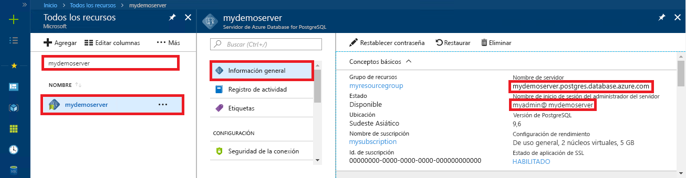

# <a name="azure-database-for-postgresql-use-python-to-connect-and-query-data"></a>Azure Database for PostgreSQL: uso de Python para conectarse y consultar datos
En esta guía de inicio rápido se muestra cómo usar [Python](https://python.org) para conectarse a una instancia de Azure Database for PostgreSQL; a continuación, se usarán instrucciones SQL para consultar, insertar, actualizar y eliminar datos de la base de datos desde las plataformas Mac OS, Ubuntu Linux y Windows. En los pasos de este artículo se da por hecho que está familiarizado con el desarrollo mediante Python, pero que nunca ha trabajado con Azure Database for PostgreSQL.

## <a name="prerequisites"></a>Requisitos previos
En este tutorial rápido se usan como punto de partida los recursos creados en una de estas guías:
- [Creación de la base de datos: Azure Portal](quickstart-create-server-database-portal.md)
- [Creación de la base de datos: CLI](quickstart-create-server-database-azure-cli.md)

También necesita lo siguiente:
- Tener instalado [Python](https://www.python.org/downloads/)
- Tener instalado el paquete [pip](https://pip.pypa.io/en/stable/installing/) (si usa los binarios de Python 2 >=2.7.9 o Python 3 >=3.4 descargados de [python.org](https://python.org) ya tiene instalado pip, aunque deberá actualizarlo)

## <a name="install-the-python-connection-libraries-for-postgresql"></a>Instalación de las bibliotecas de conexiones de Python para PostgreSQL
Instale el paquete [psycopg2](http://initd.org/psycopg/docs/install.html), que le permitía conectarse y consultar la base de datos. psycopg2 está [disponible en PyPI](https://pypi.python.org/pypi/psycopg2/) en forma de paquetes [wheel](http://pythonwheels.com/) para la mayoría de las plataformas (Linux, OSX, Windows), así que puede usar la instalación de pip para obtener la versión binaria del módulo, incluidas todas las dependencias:

```cmd
pip install psycopg2
```
Asegúrese de usar una versión actualizada de pip (se puede actualizar con algo parecido a `pip install -U pip`).

## <a name="get-connection-information"></a>Obtención de información sobre la conexión
Obtenga la información de conexión necesaria para conectarse a Azure Database for PostgreSQL. Necesitará el nombre completo del servidor y las credenciales de inicio de sesión.

1. Inicie sesión en el [Portal de Azure](https://portal.azure.com/).
2. En el menú izquierdo de Azure Portal, haga clic en **Todos los recursos** y busque el servidor **mypgserver-20170401** que acaba de crear.
3. Haga clic en el nombre del servidor **mypgserver-20170401**.
4. Seleccione la página **Introducción** del servidor. Tome nota del **Nombre del servidor** y del **Server admin login name** (Nombre de inicio de sesión del administrador del servidor).
 
5. Si olvida la información de inicio de sesión del servidor, navegue hasta la página **Información general** para ver el nombre de inicio de sesión del administrador del servidor y, si es necesario, restablecer la contraseña.

## <a name="how-to-run-python-code"></a>Ejecución de código Python
- Con el editor de texto que prefiera, cree un nuevo archivo denominado postgres.py y guárdelo en una carpeta de proyecto. Copie y pegue el ejemplo de código que se muestra a continuación en el archivo de texto y guárdelo. Asegúrese de seleccionar la codificación UTF-8 al guardar el archivo en el sistema operativo Windows. 
- Para ejecutar el código, inicie el símbolo del sistema o el shell de Bash. Cambie el directorio a la carpeta de proyecto, por ejemplo, `cd postgresql`. A continuación, escriba el comando python seguido del nombre de archivo, como `python postgres.py`.

> [!NOTE]
> A partir de la versión 3 de Python, es posible que al ejecutar los bloques de código siguientes, vea el error `SyntaxError: Missing parentheses in call to 'print'`. Si esto sucede, reemplace cada llamada al comando `print "string"` por una llamada de función con paréntesis, como `print("string")`.

## <a name="connect-create-table-and-insert-data"></a>Conexión, creación de una tabla e inserción de datos
Use el código siguiente para conectarse y cargar los datos mediante la función [psycopg2.connect](http://initd.org/psycopg/docs/connection.html) con la instrucción SQL **INSERT**. La función [cursor.execute](http://initd.org/psycopg/docs/cursor.html#execute) se usa para ejecutar la consulta SQL en la base de datos PostgreSQL. Reemplace los parámetros host, dbname, user y password por los valores especificados al crear el servidor y la base de datos.

```Python
import psycopg2

# Update connection string information obtained from the portal
host = "mypgserver-20170401.postgres.database.azure.com"
user = "mylogin@mypgserver-20170401"
dbname = "mypgsqldb"
password = "<server_admin_password>"
sslmode = "require"

# Construct connection string
conn_string = "host={0} user={1} dbname={2} password={3} sslmode={4}".format(host, user, dbname, password, sslmode)
conn = psycopg2.connect(conn_string) 
print "Connection established"

cursor = conn.cursor()

# Drop previous table of same name if one exists
cursor.execute("DROP TABLE IF EXISTS inventory;")
print "Finished dropping table (if existed)"

# Create table
cursor.execute("CREATE TABLE inventory (id serial PRIMARY KEY, name VARCHAR(50), quantity INTEGER);")
print "Finished creating table"

# Insert some data into table
cursor.execute("INSERT INTO inventory (name, quantity) VALUES (%s, %s);", ("banana", 150))
cursor.execute("INSERT INTO inventory (name, quantity) VALUES (%s, %s);", ("orange", 154))
cursor.execute("INSERT INTO inventory (name, quantity) VALUES (%s, %s);", ("apple", 100))
print "Inserted 3 rows of data"

# Cleanup
conn.commit()
cursor.close()
conn.close()
```

## <a name="read-data"></a>Lectura de datos
Use el código siguiente para leer los datos insertados mediante la función [cursor.execute](http://initd.org/psycopg/docs/cursor.html#execute) con la instrucción SQL **SELECT**. Esta función acepta una consulta y devuelve un conjunto de resultados que se puede iterar mediante el uso de [cursor.fetchall()](http://initd.org/psycopg/docs/cursor.html#cursor.fetchall). Reemplace los parámetros host, dbname, user y password por los valores especificados al crear el servidor y la base de datos.

```Python
import psycopg2

# Update connection string information obtained from the portal
host = "mypgserver-20170401.postgres.database.azure.com"
user = "mylogin@mypgserver-20170401"
dbname = "mypgsqldb"
password = "<server_admin_password>"
sslmode = "require"

# Construct connection string
conn_string = "host={0} user={1} dbname={2} password={3} sslmode={4}".format(host, user, dbname, password, sslmode)
conn = psycopg2.connect(conn_string) 
print "Connection established"

cursor = conn.cursor()

# Fetch all rows from table
cursor.execute("SELECT * FROM inventory;")
rows = cursor.fetchall()

# Print all rows
for row in rows:
    print "Data row = (%s, %s, %s)" %(str(row[0]), str(row[1]), str(row[2]))

# Cleanup
conn.commit()
cursor.close()
conn.close()
```

## <a name="update-data"></a>Actualización de datos
Use el código siguiente para actualizar la fila de inventario que insertó anteriormente mediante la función [cursor.execute](http://initd.org/psycopg/docs/cursor.html#execute) con la instrucción SQL **UPDATE**. Reemplace los parámetros host, dbname, user y password por los valores especificados al crear el servidor y la base de datos.

```Python
import psycopg2

# Update connection string information obtained from the portal
host = "mypgserver-20170401.postgres.database.azure.com"
user = "mylogin@mypgserver-20170401"
dbname = "mypgsqldb"
password = "<server_admin_password>"
sslmode = "require"

# Construct connection string
conn_string = "host={0} user={1} dbname={2} password={3} sslmode={4}".format(host, user, dbname, password, sslmode)
conn = psycopg2.connect(conn_string) 
print "Connection established"

cursor = conn.cursor()

# Update a data row in the table
cursor.execute("UPDATE inventory SET quantity = %s WHERE name = %s;", (200, "banana"))
print "Updated 1 row of data"

# Cleanup
conn.commit()
cursor.close()
conn.close()
```

## <a name="delete-data"></a>Eliminación de datos
Use el código siguiente para eliminar un elemento de inventario que insertó anteriormente mediante la función [cursor.execute](http://initd.org/psycopg/docs/cursor.html#execute) con la instrucción SQL **DELETE**. Reemplace los parámetros host, dbname, user y password por los valores especificados al crear el servidor y la base de datos.

```Python
import psycopg2

# Update connection string information obtained from the portal
host = "mypgserver-20170401.postgres.database.azure.com"
user = "mylogin@mypgserver-20170401"
dbname = "mypgsqldb"
password = "<server_admin_password>"
sslmode = "require"

# Construct connection string
conn_string = "host={0} user={1} dbname={2} password={3} sslmode={4}".format(host, user, dbname, password, sslmode)
conn = psycopg2.connect(conn_string) 
print "Connection established"

cursor = conn.cursor()

# Delete data row from table
cursor.execute("DELETE FROM inventory WHERE name = %s;", ("orange",))
print "Deleted 1 row of data"

# Cleanup
conn.commit()
cursor.close()
conn.close()
```

## <a name="next-steps"></a>Pasos siguientes
> [!div class="nextstepaction"]
> [Migración de una base de datos mediante exportación e importación](./howto-migrate-using-export-and-import.md)

