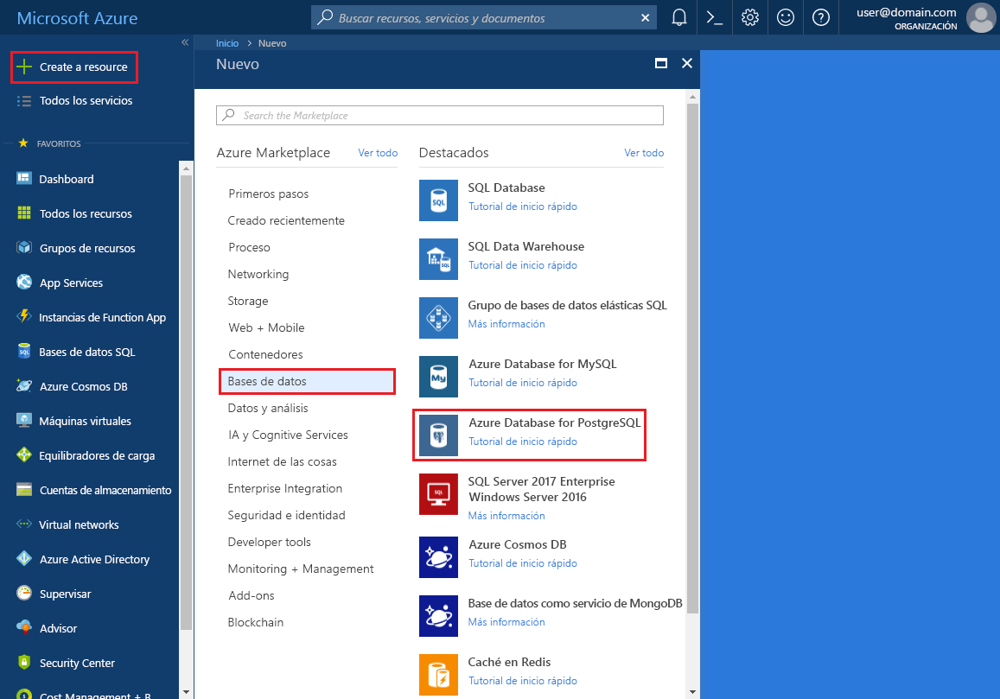
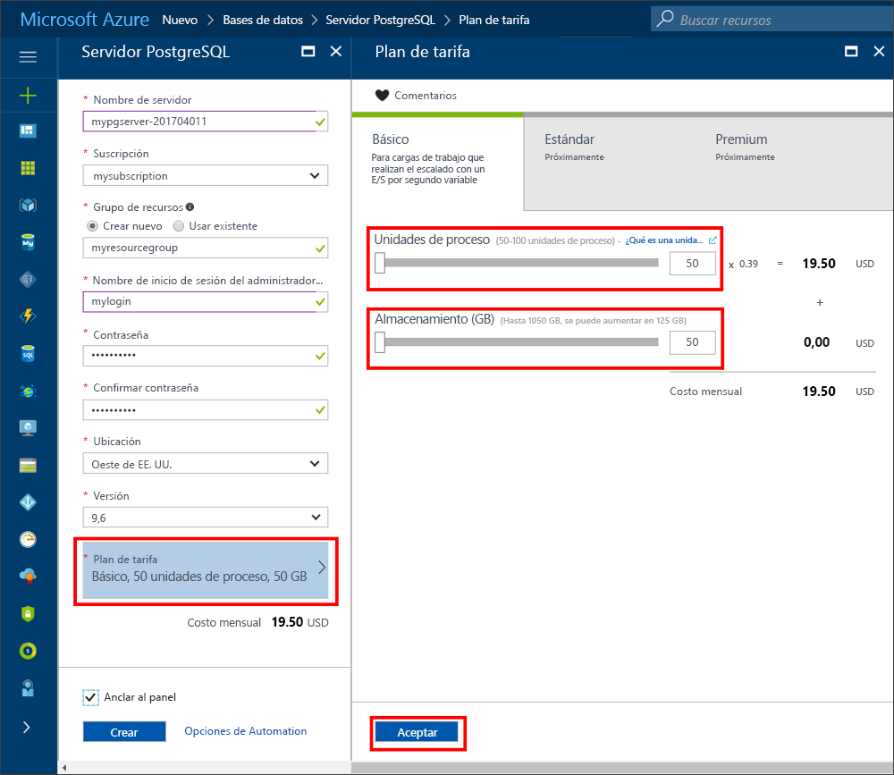
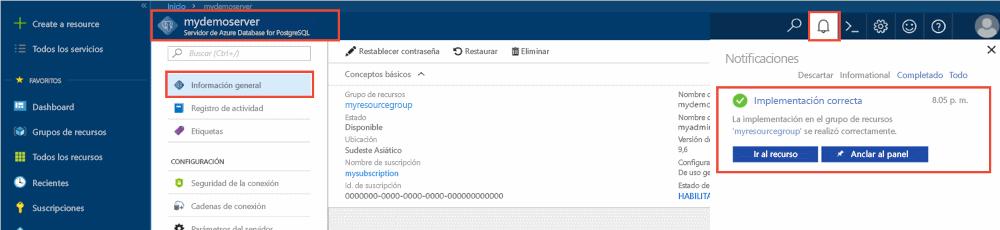
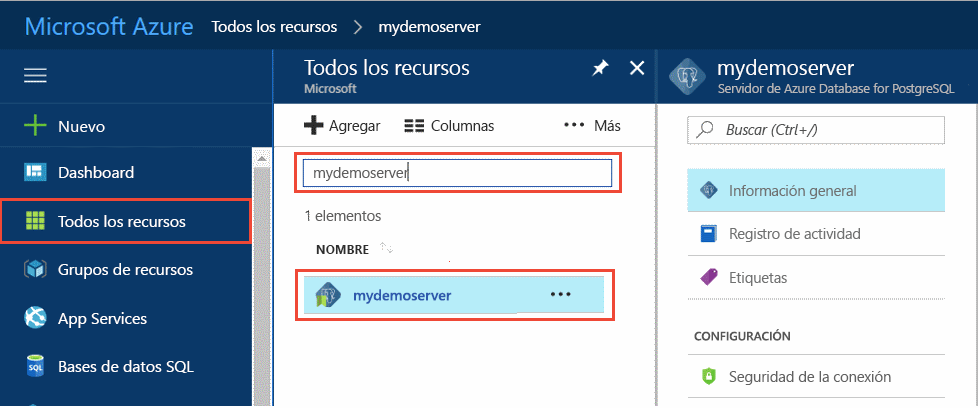
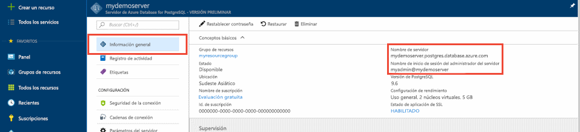
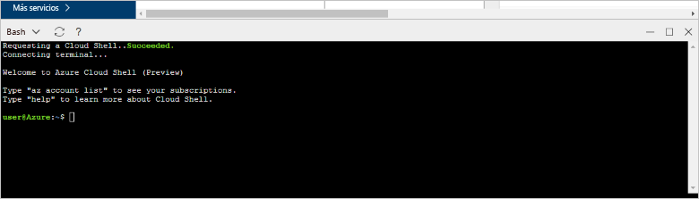
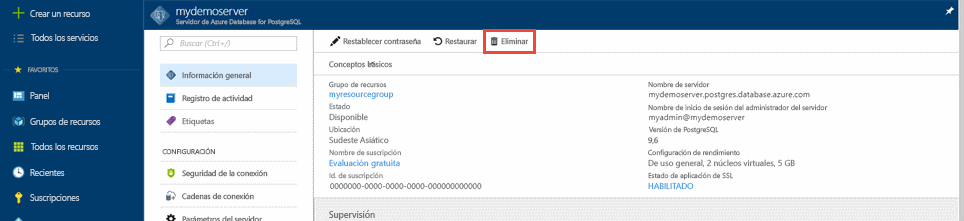

# <a name="create-an-azure-database-for-postgresql-server-in-the-azure-portal"></a>Creación de un servidor de Azure Database for PostgreSQL en Azure Portal

Azure Database for PostgreSQL es un servicio administrado que usa para ejecutar, administrar y escalar bases de datos de PostgreSQL de alta disponibilidad en la nube. Esta guía de inicio rápido muestra cómo crear un servidor de Azure Database for PostgreSQL en unos cinco minutos a través de Azure Portal.

Si no tiene una suscripción a Azure, cree una [cuenta gratuita de Azure](https://azure.microsoft.com/free/) antes de empezar.

## <a name="sign-in-to-the-azure-portal"></a>Inicie sesión en el Portal de Azure.
Abra el explorador web y vaya al [portal](https://portal.azure.com/). Introduzca sus credenciales para iniciar sesión en el portal. La vista predeterminada es el panel del servicio.

## <a name="create-an-azure-database-for-postgresql-server"></a>Creación de un servidor de Azure Database for PostgreSQL

Un servidor de Azure Database for PostgreSQL se crea con un conjunto definido de [recursos de proceso y almacenamiento](./concepts-compute-unit-and-storage.md). El servidor se crea dentro de un [grupo de recursos de Azure](../azure-resource-manager/resource-group-overview.md).

Para crear un servidor de Azure Database for PostgreSQL, siga los pasos siguientes:
1. Seleccione el botón **Nuevo** (+) de la esquina superior izquierda del portal.

2. Seleccione **Bases de datos** > **Azure Database for PostgreSQL**.

    

3. Rellene el formulario de datos del nuevo servidor con la siguiente información, como se muestra en la imagen anterior:

    Configuración|Valor sugerido|Descripción
    ---|---|---
    Nombre de servidor |*mypgserver-20170401*|Un nombre único que identifique al servidor de Azure Database for PostgreSQL. El nombre de dominio *postgres.database.azure.com* se anexa al nombre del servidor proporcionado. El servidor solo puede contener letras minúsculas, números y el carácter de guion (-). Debe contener al menos entre tres y 63 caracteres.
    La suscripción|Su suscripción|La suscripción de Azure que desea usar para el servidor. Si tiene varias suscripciones, elija aquella en la que se factura el recurso.
    Grupos de recursos|*myresourcegroup*| Un nuevo nombre de grupo de recursos o uno existente de la suscripción.
    Inicio de sesión de administrador de servidor |*mylogin*| Su propia cuenta de inicio de sesión para usarla al conectarse al servidor. El nombre de inicio de sesión de administrador no puede ser **azure_superuser,** **azure_pg_admin,** **admin,** **administrator,** **root,** **guest,** ni **public.** No puede empezar por **pg_**.
    Password |Su elección | Una contraseña nueva para la cuenta de administrador del servidor. Debe contener entre ocho y 128 caracteres. La contraseña debe contener caracteres de tres de las siguientes categorías: letras en mayúsculas del alfabeto inglés, letras en minúscula del alfabeto inglés, números (de cero a nueve) y caracteres no alfanuméricos (!, $, #, %, etc.).
    Ubicación|Región más cercana a los usuarios| Ubicación más cercana a los usuarios.
    Versión de PostgreSQL|La versión más reciente| La versión más reciente, a menos que tenga requisitos específicos.
    Plan de tarifa  | **Básico**, **50 unidades de proceso**, **50 GB** | El nivel de servicio y el nivel de rendimiento de la base de datos nueva. Seleccione **Plan de tarifa**. A continuación, seleccione la pestaña **Básico**. Después, seleccione el extremo izquierdo del control deslizante de **unidades de proceso** para ajustar el valor en la menor cantidad disponible para esta guía de inicio rápido. Para guardar este plan de tarifa, seleccione **Aceptar**. Para obtener más información, consulte la siguiente captura de pantalla. 
    Anclar al panel | Comprobar | Permite realizar un seguimiento fácil del servidor en la página del panel frontal del portal.

    > [!IMPORTANT]
    > Para iniciar sesión en el servidor y las bases de datos de esta guía de inicio rápido necesitará el inicio de sesión y la contraseña de administrador de servidor que especifique aquí. Recuerde o grabe esta información para su uso posterior.

    

4. Seleccione **Crear** para realizar el aprovisionamiento del servidor. El aprovisionamiento puede tardar hasta 20 minutos.

5. En la barra de herramientas, seleccione el símbolo de **Notificaciones** para supervisar el proceso de implementación.

    
   
  De forma predeterminada, una base de datos de **postgres** se crea en el servidor. La base de datos de [postgres](https://www.postgresql.org/docs/9.6/static/app-initdb.html) es una base de datos predeterminada pensada para que la usen los usuarios, las utilidades y aplicaciones de otros fabricantes. 

## <a name="configure-a-server-level-firewall-rule"></a>Configuración de una regla de firewall de nivel de servidor

Azure Database for PostgreSQL crea un firewall en el nivel de servidor. Evita que herramientas y aplicaciones externas se conecten al servidor o a las bases de datos de este, a menos que cree una regla para abrir el firewall para direcciones IP concretas. 

1. Cuando finalice la implementación, busque el servidor. Si es necesario, puede buscarlo. Por ejemplo, en el menú de la izquierda, seleccione **Todos los recursos**. Escriba el nombre del servidor, como **mypgserver-20170401**, para buscar el servidor recién creado. Seleccione el nombre del servidor en la lista de resultados de la búsqueda. Se abrirá la página **Introducción** del servidor, que proporciona opciones para continuar la configuración.
 
    

2. En la página del servidor, seleccione **Seguridad de la conexión**.

    

3. En el encabezado **Reglas de firewall**, en la columna **Nombre de regla**, seleccione el cuadro de texto en blanco para empezar a crear la regla de firewall. 

    Para esta guía de inicio rápido, permitamos todas las direcciones IP en el servidor. Rellene el cuadro de texto de cada columna con los valores siguientes:

    Nombre de la regla | Dirección IP inicial | Dirección IP final 
    ---|---|---
    AllowAllIps (permitir todas las direcciones IP) | 0.0.0.0 | 255.255.255.255

4. En la barra de herramientas superior de la página **Seguridad de la conexión**, seleccione **Guardar**. Antes de continuar espere hasta que aparezca la notificación que indica que la actualización de seguridad de la conexión ha finalizado correctamente.

    > [!NOTE]
    > Las conexiones al servidor de Azure Database for PostgreSQL se comunican a través de puerto 5432. Si intenta conectarse desde una red corporativa, es posible que el firewall de la red no permita el tráfico saliente a través del puerto 5432. En ese caso no podrá conectarse al servidor, salvo que el departamento de TI abra el puerto 5432.
    >

## <a name="get-the-connection-information"></a>Obtención de la información de conexión

Al crear el servidor de Azure Database for PostgreSQL, también se crea la base de datos predeterminada denominada **postgres**. Para conectarse al servidor de base de datos, necesita las credenciales de inicio de sesión de administrador y el nombre de servidor completo. Es posible que anotara dichos valores en el artículo de la guía de inicio rápido. En caso de que no lo hiciera, encontrará fácilmente el nombre del servidor y la información de inicio de sesión en la página **Información general** del servidor en el portal.

Abra la página **Información general** del servidor. Tome nota del **Nombre del servidor** y del **Nombre de inicio de sesión del administrador del servidor**. Desplace el cursor sobre cada campo y el símbolo de copiar aparecerá a la derecha del texto. Seleccione el símbolo de copiar según sea necesario para copiar los valores.

 

## <a name="connect-to-the-postgresql-database-by-using-psql-in-cloud-shell"></a>Conexión a la base de datos de PostgreSQL mediante psql de Cloud Shell

Hay una serie de aplicaciones que se pueden usar para conectarse al servidor de Azure Database for PostgreSQL. Ahora vamos a usar la utilidad de línea de comandos psql para conectarnos al servidor. Puede utilizar un explorador web y Azure Cloud Shell como se describe aquí sin necesidad de instalar ningún software adicional. Si tiene la utilidad psql instalada localmente en su propio equipo, puede conectarse desde allí también.

1. En el panel de navegación superior, seleccione el símbolo del terminal para abrir Cloud Shell.

   

2. Cloud Shell se abre en el explorador, donde puede escribir comandos de shell de Bash.

   

3. En el símbolo de sistema de Cloud Shell, conéctese a una base de datos del servidor de Azure Database for PostgreSQL, para lo que debe escribir la línea de comandos de psql.

    Para conectarse a un servidor de Azure Database for PostgreSQL con la utilidad [psql](https://www.postgresql.org/docs/9.6/static/app-psql.html), use el formato siguiente:
    ```bash
    psql --host=<yourserver> --port=<port> --username=<server admin login> --dbname=<database name>
    ```

    Por ejemplo, el siguiente comando conecta con un servidor de ejemplo:

    ```bash
    psql --host=mypgserver-20170401.postgres.database.azure.com --port=5432 --username=mylogin@mypgserver-20170401 --dbname=postgres
    ```

    Parámetro de psql |Valor sugerido|Descripción
    ---|---|---
    --host | Nombre de servidor | El valor de nombre de servidor que usó al crear el servidor de Azure Database for MySQL. El servidor de ejemplo que se muestra es **mypgserver-20170401.postgres.database.azure.com.** Use el nombre de dominio completo (**\*.postgres.database.azure.com**) tal como se muestra en el ejemplo. Si no recuerda el nombre del servidor, siga los pasos de la sección anterior para obtener la información de conexión. 
    --port | 5432 | El puerto se usará al conectarse al servidor de Azure Database for PostgreSQL. 
    --username | Nombre de inicio de sesión del administrador del servidor |El nombre de usuario de inicio de sesión del administrador del servidor que suministró al crear el servidor de Azure Database for PostgreSQL. Si no recuerda el nombre de usuario, siga los pasos de la sección anterior para obtener la información de conexión. El formato es *username@servername*.
    --dbname | *postgres* | El nombre de base de datos predeterminado generado por el sistema creado para la primera conexión. Posteriormente, puede crear su propia base de datos.

    Después de ejecutar el comando psql con sus propios valores de parámetros, se le pedirá que escriba la contraseña del administrador del servidor. Es la misma contraseña que especificó al crear el servidor. 

    Parámetro de psql |Valor sugerido|Descripción
    ---|---|---
    contraseña | Contraseña del administrador | Los caracteres que escriba en la contraseña no se muestran en el símbolo del sistema de bash. Después de escribir todos los caracteres, seleccione la tecla **ENTRAR** para autenticarse y conectarse.

    Tras conectarse, la utilidad psql muestra un símbolo del sistema de postgres donde escribir comandos sql. En la salida de la conexión inicial, puede aparecer una advertencia, ya que la versión de psql de Cloud Shell puede diferir de la versión del servidor de Azure Database for PostgreSQL. 
    
    Ejemplo de salida de psql:
    ```bash
    psql (9.5.7, server 9.6.2)
    WARNING: psql major version 9.5, server major version 9.6.
        Some psql features might not work.
    SSL connection (protocol: TLSv1.2, cipher: ECDHE-RSA-AES256-SHA384, bits: 256, compression: off)
    Type "help" for help.
   
    postgres=> 
    ```

    > [!TIP]
    > Si el firewall no está configurado para permitir la dirección IP de la instancia de Cloud Shell, aparece el siguiente error:
    > 
    > "psql: FATAL:  no pg_hba.conf entry for host "138.91.195.82", user "mylogin", database "postgres", SSL on FATAL: SSL connection is required. Specify SSL options and retry.
    > 
    > Para resolver el error, asegúrese de que la configuración del servidor coincida con los pasos descritos en la sección "Configuración de una regla de firewall de nivel de servidor" de este artículo.

4. Escriba el comando siguiente para crear una base de datos vacía en el símbolo del sistema:
    ```bash
    CREATE DATABASE mypgsqldb;
    ```
    El comando puede tardar unos minutos en finalizar. 

5. En el símbolo del sistema, ejecute el siguiente comando para cambiar las conexiones a la base de datos **mypgsqldb** recién creada:
    ```bash
    \c mypgsqldb
    ```

6. Escriba `\q` y presione la tecla **Entrar** para cerrar psql. Cuando haya terminado, puede cerrar Cloud Shell.

Ahora está conectado al servidor de Azure Database for PostgreSQL y ha creado una base de datos de usuario en blanco. Pase a la sección siguiente para la conexión con otra herramienta común, pgAdmin.

## <a name="connect-to-the-postgresql-database-by-using-pgadmin"></a>Conexión a la base de datos de PostgreSQL mediante pgAdmin

Para conectarse al servidor Azure PostgreSQL mediante la herramienta pgAdmin de la GUI:
1. Abra la aplicación pgAdmin en el equipo cliente. Puede instalar pgAdmin desde el [sitio web de pgAdmin](http://www.pgadmin.org/).

2. En la página del panel, en la sección **Vínculos rápidos**, seleccione el símbolo **Agregar nuevo servidor**.

3. En el cuadro de diálogo **Create - Server** (Crear: servidor) de la pestaña **General**, escriba un nombre descriptivo único para el servidor, como **Azure PostgreSQL Server**.

    

4. En la pestaña **Conexión** del cuadro de diálogo **Create - Server** (Crear: servidor), utilice la configuración especificada y, a continuación, seleccione **Guardar**.

   

    parámetro pgAdmin |Valor sugerido|Descripción
    ---|---|---
    Host Name/Address | Nombre de servidor | El valor de nombre de servidor que usó al crear el servidor de Azure Database for MySQL. El servidor de ejemplo es **mypgserver-20170401.postgres.database.azure.com.** Use el nombre de dominio completo (**\*.postgres.database.azure.com**) tal como se muestra en el ejemplo. Si no recuerda el nombre del servidor, siga los pasos de la sección anterior para obtener la información de conexión. 
    Port | 5432 | El puerto se usará al conectarse al servidor de Azure Database for PostgreSQL. 
    Maintenance Database | *postgres* | Nombre de la base de datos predeterminada que crea el sistema.
    Nombre de usuario | Nombre de inicio de sesión del administrador del servidor | El nombre de usuario de inicio de sesión del administrador del servidor que suministró al crear el servidor de Azure Database for PostgreSQL. Si no recuerda el nombre de usuario, siga los pasos de la sección anterior para obtener la información de conexión. El formato es *username@servername*.
    Password | Contraseña del administrador | La contraseña que eligió al crear el servidor antes en esta guía de inicio rápido.
    Rol | Déjelo en blanco | No es necesario proporcionar un nombre de rol en este momento. Deje el campo en blanco.
    SSL Mode | Obligatorio | De forma predeterminada, todos los servidores Azure PostgreSQL se crean de modo que se exija SSL. Para desactivar la obligación de SSL, consulte la sección sobre la [obligación de SSL](./concepts-ssl-connection-security.md).
    
5. Seleccione **Guardar**.

6. En el panel izquierdo del **explorador**, expanda el nodo **Servidores**. Seleccione el servidor (por ejemplo, **Azure PostgreSQL Server**). Haga clic para conectarse a él.

7. Expanda el nodo de servidor y **Bases de datos**. La lista debe incluir la base de datos de *postgres* existente y las bases de datos de usuario recién creadas, como **mypgsqldb**, que se creó en la sección anterior. Tenga en cuenta que con Azure Database for PostgreSQL puede crear varias bases de datos por servidor.

8. Haga clic con el botón derecho en **Bases de datos**, elija el menú **Crear** y, a continuación, seleccione **Base de datos**.

9. Escriba el nombre de base de datos que quiera en el campo **Base de datos**, como **mypgsqldb**, tal como se muestra en el ejemplo.

10. Seleccione el **propietario** de la base de datos en el cuadro de lista. Elija el nombre de inicio de sesión del administrador del servidor, como en el ejemplo, **mylogin**.

11. Seleccione **Guardar** para crear una base de datos vacía.

12. En el panel del **explorador**, consulte la base de datos que ha creado en la lista de bases de datos debajo del nombre del servidor.

    


## <a name="clean-up-resources"></a>Limpieza de recursos
Hay dos formas de eliminar los recursos que ha creado en la guía de inicio rápido. Puede eliminar el [grupo de recursos de Azure](../azure-resource-manager/resource-group-overview.md), lo que incluye todos los recursos del grupo de recursos. Si desea mantener intactos los restantes recursos, elimine solo el único recurso del servidor.

> [!TIP]
> Otras guías de inicio rápido de esta colección se basan en esta. Si tiene previsto seguir usando otras guías de inicio rápido, no elimine los recursos que ha creado en esta. Si no tiene previsto continuar, siga estos pasos para eliminar los recursos creados en esta guía de inicio rápido en el portal.

Para eliminar todo el grupo de recursos, incluido el servidor recién creado:
1. Elimine el grupo de recursos en el portal. En el menú de la izquierda, seleccione **Grupos de recursos**. A continuación, seleccione el nombre de su grupo de recursos (en el ejemplo, **myresourcegroup**).

2. En la página del grupo de recursos, seleccione **Eliminar**. Escriba el nombre del grupo de recursos (en el ejemplo, **myresourcegroup**) en el cuadro de texto para confirmar la eliminación. Seleccione **Eliminar**.

Para eliminar solo el servidor recién creado:
1. Busque el servidor en el portal si no lo tiene abierto. En el menú de la izquierda, seleccione **Todos los recursos**. Luego busque el servidor que ha creado.

2. En la página **Información general**, seleccione **Eliminar**.

    

3. Confirme el nombre del servidor que desea eliminar y vea las bases de datos incluidas. Escriba el nombre del servidor en el cuadro de texto (en el ejemplo, **mypgserver-20170401**). Seleccione **Eliminar**.

## <a name="next-steps"></a>Pasos siguientes
> [!div class="nextstepaction"]
> [Migración de una base de datos mediante exportación e importación](./howto-migrate-using-export-and-import.md)
