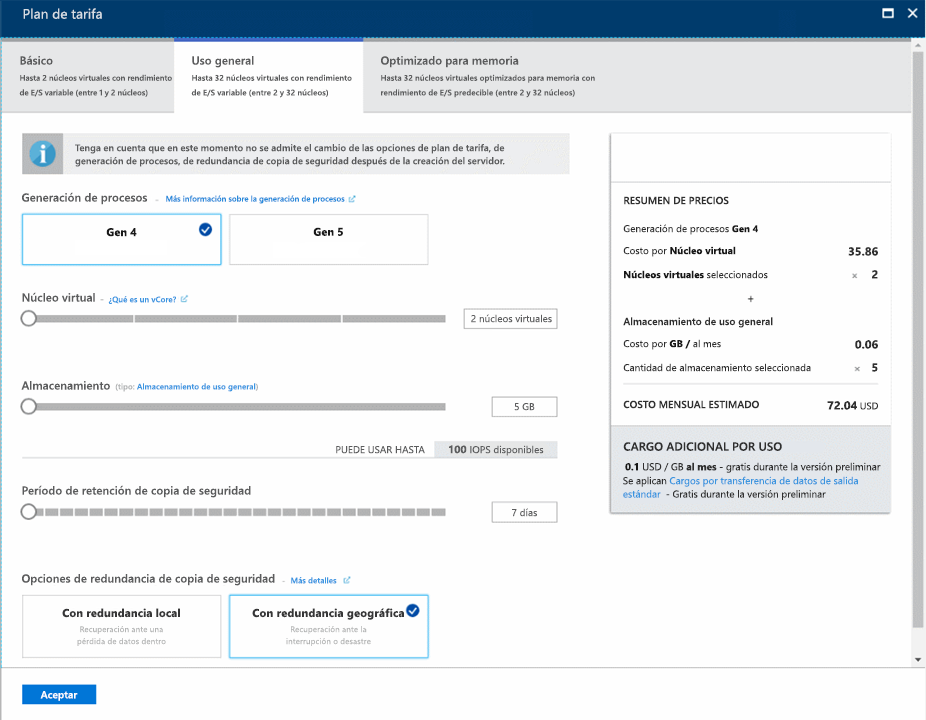
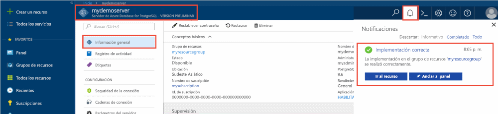
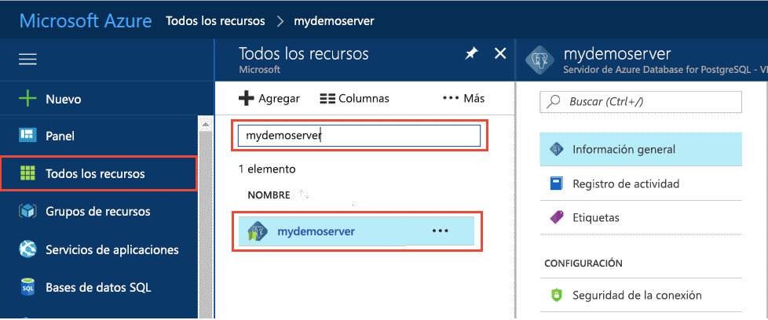
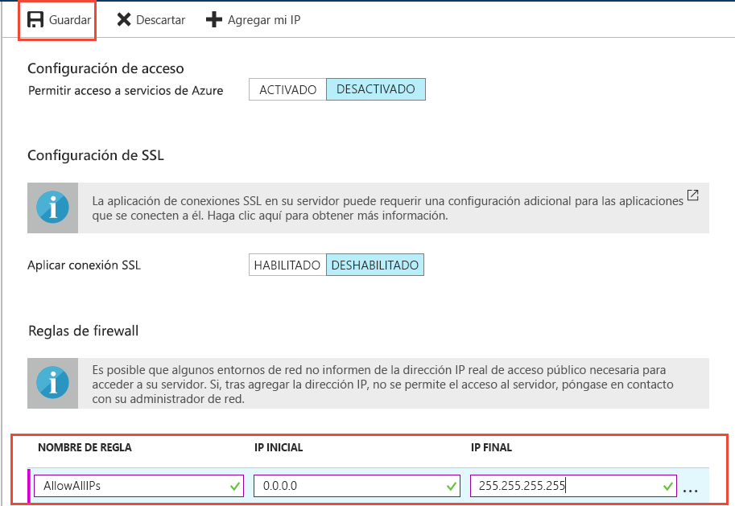

# <a name="tutorial-design-your-first-azure-database-for-postgresql-using-the-azure-portal"></a>Tutorial: Diseño de la primera base de datos de Azure Database for PostgreSQL con Azure Portal

Azure Database for PostgreSQL es un servicio administrado que le permite ejecutar, administrar y escalar bases de datos de PostgreSQL de alta disponibilidad en la nube. Con Azure Portal puede administrar fácilmente el servidor y diseñar una base de datos.

En este tutorial usará Azure Portal para aprender a hacer lo siguiente:
> [!div class="checklist"]
> * Creación de un servidor de Azure Database for PostgreSQL
> * Configuración del firewall del servidor
> * Uso de la utilidad [**psql**](https://www.postgresql.org/docs/9.6/static/app-psql.html) para crear una base de datos
> * Carga de datos de ejemplo
> * Datos de consulta
> * Actualización de datos
> * Restauración de datos

## <a name="prerequisites"></a>requisitos previos
Si no tiene una suscripción a Azure, cree una cuenta [gratuita](https://azure.microsoft.com/free/) antes de empezar.

## <a name="log-in-to-the-azure-portal"></a>Iniciar sesión en Azure Portal
Inicie sesión en [Azure Portal](https://portal.azure.com).

## <a name="create-an-azure-database-for-postgresql"></a>Creación de una instancia de Azure Database for PostgreSQL

Un servidor de Azure Database for PostgreSQL se crea con un conjunto definido de [recursos de proceso y almacenamiento](./concepts-compute-unit-and-storage.md). El servidor se crea dentro de un [grupo de recursos de Azure](../azure-resource-manager/resource-group-overview.md).

Para crear un servidor de Azure Database for PostgreSQL, siga estos pasos:
1.  Haga clic en **Crear un recurso** de la esquina superior izquierda de Azure Portal.
2.  En la página **Nuevo**, seleccione **Bases de datos** y, en la página **Bases de datos**, seleccione **Azure Database for PostgreSQL**.
  

3.  Rellene el formulario del nuevo servidor con la siguiente información:

    

    - Nombre del servidor: **mydemoserver** (el nombre del servidor se asigna al nombre DNS y, por tanto, debe ser globalmente único) 
    - Suscripción: si tiene varias, elija la suscripción donde se encuentre el recurso o para la cual se facture.
    - Grupo de recursos: **myresourcegroup**
    - El inicio de sesión de administrador y la contraseña que elija para el servidor
    - Ubicación
    - Versión de PostgreSQL

   > [!IMPORTANT]
   > El inicio de sesión y la contraseña de administrador del servidor que especifique aquí serán necesarios para iniciar sesión más adelante en ese servidor y en las bases de datos que se especificarán en este tutorial. Recuerde o grabe esta información para su uso posterior.

4.  Haga clic en **Plan de tarifa** para ver o cambiar el plan de tarifa de su nuevo servidor. Para este tutorial, seleccione **Uso general**, generación de procesos **Gen 4**, 2 **núcleos virtuales**, 5 GB de **almacenamiento** y 7 días de **período de retención de copia de seguridad**. Seleccione la opción de redundancia de copia de seguridad **Redundancia geográfica** para que las copias de seguridad del servidor se almacenen automáticamente en un almacenamiento con redundancia geográfica.
 

5.  Haga clic en **Aceptar**.

6.  Haga clic en **Crear** para realizar el aprovisionamiento del servidor. El aprovisionamiento tarda unos minutos.

7.  En la barra de herramientas, haga clic en **Notificaciones** para supervisar el proceso de implementación.
 

   > [!TIP]
   > Marque la opción **Anclar al panel** para realizar el seguimiento de las implementaciones fácilmente.

   De forma predeterminada, la base de datos de **postgres** se crea en el servidor. La base de datos [postgres](https://www.postgresql.org/docs/9.6/static/app-initdb.html) es una base de datos predeterminada pensada para que la usen los usuarios, las utilidades y aplicaciones de otros fabricantes. 

## <a name="configure-a-server-level-firewall-rule"></a>Configuración de una regla de firewall de nivel de servidor

El servicio Azure Database for PostgreSQL usa un firewall en el nivel de servidor. De forma predeterminada, este firewall evita que herramientas y aplicaciones externas se conecten al servidor o a las bases de datos de este, a menos que se cree una regla de firewall que lo abra a un intervalo de direcciones IP concretas. 

1.  Una vez finalizada la implementación, haga clic en **Todos los recursos** en el menú izquierdo y escriba el nombre **mydemoserver** para buscar el servidor recién creado. Haga clic en el nombre del servidor que aparece en el resultado de la búsqueda. Se abrirá la página **Introducción** del servidor, que proporciona opciones para continuar la configuración.

   

2.  En la página del servidor, seleccione **Seguridad de la conexión**. 

3.  Haga clic en el cuadro de texto de **Nombre de la regla,** y agregue una nueva regla de firewall para añadir el intervalo de IP de conectividad a la lista de permitidos. Para este tutorial, vamos a permitir todas las direcciones IP; para ello, escriba **Nombre de la regla = AllowAllIps**, **IP inicial = 0.0.0.0** e **IP final = 255.255.255.255** y haga clic en **Guardar**. Puede establecer una regla de firewall que abarque un intervalo de IP más pequeño para que pueda conectarse desde la red.

   

4.  Haga clic en **Guardar** y en la **X** para cerrar la página **Seguridad de las conexiones**.

   > [!NOTE]
   > El servidor Azure PostgreSQL se comunica a través de puerto 5432. Si intenta conectarse desde una red corporativa, es posible que el firewall de la red no permita el tráfico saliente a través del puerto 5432. En ese caso, no puede conectarse al servidor de Azure SQL Database, salvo que el departamento de TI abra el puerto 5432.
   >

## <a name="get-the-connection-information"></a>Obtención de la información de conexión

Al crear el servidor de Azure Database for PostgreSQL, también se creó la base de datos de **postgres** predeterminada. Para conectarse al servidor de bases de datos, debe proporcionar las credenciales de acceso y la información del host.

1. En el menú de la izquierda de Azure Portal, haga clic en **Todos los recursos** y busque el servidor que acaba de crear.

   

2. Haga clic en el nombre del servidor **mydemoserver**.

3. Seleccione la página **Introducción** del servidor. Tome nota del **Nombre del servidor** y del **Server admin login name** (Nombre de inicio de sesión del administrador del servidor).

   


## <a name="connect-to-postgresql-database-using-psql-in-cloud-shell"></a>Conexión a la base de datos de PostgreSQL mediante psql de Cloud Shell

Ahora vamos a usar la utilidad de línea de comandos [psql](https://www.postgresql.org/docs/9.6/static/app-psql.html) para conectarnos al servidor de Azure Database for PostgreSQL. 
1. Inicie Azure Cloud Shell desde el icono del terminal en el panel de navegación superior.

   

2. Azure Cloud Shell se abrirá en el explorador y podrá escribir comandos de Bash.

   

3. En el símbolo de sistema de Cloud Shell, conéctese al servidor de Azure Database for PostgreSQL con los comandos psql. El formato siguiente sirve para conectarse a un servidor de Azure Database for PostgreSQL con la utilidad [psql](https://www.postgresql.org/docs/9.6/static/app-psql.html):
   ```bash
   psql --host=<myserver> --port=<port> --username=<server admin login> --dbname=<database name>
   ```

   Por ejemplo, el siguiente comando se conecta a la base de datos predeterminada llamada **postgres** en el servidor PostgreSQL **mydemoserver.postgres.database.azure.com** con las credenciales de acceso. Escriba la contraseña de administrador del servidor cuando se le solicite.

   ```bash
   psql --host=mydemoserver.postgres.database.azure.com --port=5432 --username=myadmin@mydemoserver --dbname=postgres
   ```

## <a name="create-a-new-database"></a>Creación de una base de datos
Una vez conectado al servidor, cree una base de datos vacía en el símbolo del sistema.
```bash
CREATE DATABASE mypgsqldb;
```

En el símbolo del sistema, ejecute el siguiente comando para cambiar la conexión a la base de datos **mypgsqldb** recién creada.
```bash
\c mypgsqldb
```
## <a name="create-tables-in-the-database"></a>Creación de tablas en la base de datos
Ahora que sabe cómo conectarse a la base de datos de Azure Database for PostgreSQL, puede completar algunas tareas básicas:

En primer lugar, cree una tabla y cárguela con algunos datos. Se va a crear una tabla que haga un seguimiento de la información del inventario con este código de SQL:
```sql
CREATE TABLE inventory (
    id serial PRIMARY KEY, 
    name VARCHAR(50), 
    quantity INTEGER
);
```

Puede ver la tabla recién creada ahora en la lista de tablas si escribe lo siguiente:
```sql
\dt
```

## <a name="load-data-into-the-tables"></a>Carga de datos en las tablas
Ahora que tiene una tabla, inserte algunos datos en ella. En la ventana de símbolo del sistema abierta, ejecute la consulta siguiente para insertar algunas filas de datos.
```sql
INSERT INTO inventory (id, name, quantity) VALUES (1, 'banana', 150); 
INSERT INTO inventory (id, name, quantity) VALUES (2, 'orange', 154);
```

Ahora tiene dos filas de datos de ejemplo en la tabla de inventario que creó anteriormente.

## <a name="query-and-update-the-data-in-the-tables"></a>Consulta y actualización de los datos en las tablas
Ejecute la siguiente consulta para recuperar información de la tabla de la base de datos del inventario. 
```sql
SELECT * FROM inventory;
```

También puede actualizar los datos en la tabla.
```sql
UPDATE inventory SET quantity = 200 WHERE name = 'banana';
```

Igualmente, puede ver los valores actualizados cuando se recuperan los datos.
```sql
SELECT * FROM inventory;
```

## <a name="restore-data-to-a-previous-point-in-time"></a>Restauración de datos a un momento dado anterior
Imagine que eliminó accidentalmente esta tabla. No se puede recuperar con facilidad de esta situación. Azure Database for PostgreSQL permite volver a cualquier momento dado para el cual haya copias de seguridad del servidor (en función del período de retención de copia de seguridad que se configuró) y restaurar este momento dado en un nuevo servidor. Puede usar este servidor nuevo para recuperar los datos eliminados. En los pasos siguientes se restaura el servidor **mydemoserver** a un momento antes de que se agregara la tabla de inventario.

1.  En la página **Información general** de Azure Database for PostgreSQL del servidor, haga clic en **Restaurar** en la barra de herramientas. Se abre la página de **restauración**.

   

2.  Rellene el formulario de **restauración** con la información necesaria:

   

   - **Punto de restauración**: seleccione el momento antes de que se modificara la base de datos
   - **Servidor de destino**: especifique el nombre del nuevo servidor donde desea restaurar
   - **Ubicación**: no se puede seleccionar la región; de forma predeterminada, es la misma que la del servidor de origen
   - **Plan de tarifa**: no se puede cambiar este valor al restaurar un servidor. Es el mismo que el del servidor de origen. 
3.  Haga clic en **Aceptar** para [restaurar el servidor a un momento dado](./howto-restore-server-portal.md) antes de que se eliminara la tabla. Restaurar un servidor a un momento dado distinto crea un servidor nuevo duplicado como el servidor original a partir del momento dado que especifique, siempre que se encuentre dentro del período de retención para el [plan de tarifa](./concepts-pricing-tiers.md).

## <a name="next-steps"></a>Pasos siguientes
En este tutorial, aprendió a usar Azure Portal y otras utilidades para hacer lo siguiente:
> [!div class="checklist"]
> * Creación de un servidor de Azure Database for PostgreSQL
> * Configuración del firewall del servidor
> * Uso de la utilidad [**psql**](https://www.postgresql.org/docs/9.6/static/app-psql.html) para crear una base de datos
> * Carga de datos de ejemplo
> * Datos de consulta
> * Actualización de datos
> * Restauración de datos

A continuación, para aprender a usar la CLI de Azure para hacer tareas similares, revise este tutorial: [Diseño de la primera base de datos de Azure Database for PostgreSQL con la CLI de Azure](tutorial-design-database-using-azure-cli.md)
