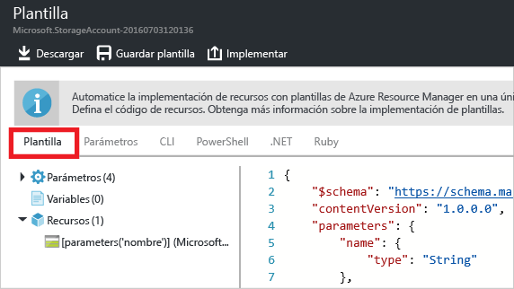

<properties 
	pageTitle="Exportación de plantillas de Azure Resource Manager | Microsoft Azure" 
	description="Use Azure Resource Manager para exportar una plantilla desde un grupo de recursos existente." 
	services="azure-resource-manager" 
	documentationCenter="" 
	authors="tfitzmac" 
	manager="timlt" 
	editor="tysonn"/>

<tags 
	ms.service="azure-resource-manager" 
	ms.workload="multiple" 
	ms.tgt_pltfrm="na" 
	ms.devlang="na" 
	ms.topic="get-started-article" 
	ms.date="05/10/2016" 
	ms.author="tomfitz"/>

# Exportación de plantillas de Azure Resource Manager desde recursos existentes

Comprender cómo construir plantillas de Azure Resource Manager puede parecer difícil, pero Resource Manager lo ayuda con esa tarea al permitirle exportar una plantilla desde recursos existentes en su suscripción. Puede usar esa plantilla generada para aprender sobre la sintaxis de plantillas o para automatizar la nueva implementación de su solución según sea necesario.

En este tutorial, creará una cuenta de almacenamiento por medio del portal y exportará la plantilla para esa cuenta de almacenamiento. Después, modificará el grupo de recursos con la incorporación de una red virtual a él y exportará una nueva plantilla que representa el estado actual. Aunque este tema se centra en una infraestructura simplificada, puede usar estos mismos pasos para exportar una plantilla para una solución más complicada.

## Crear una cuenta de almacenamiento

1. En el [Portal de Azure](https://portal.azure.com), seleccione **Nuevo**, **Datos y almacenamiento** y **Cuenta de almacenamiento**.

      

2. Cree una cuenta de almacenamiento con el nombre **storage**, sus iniciales y la fecha. El nombre de la cuenta de almacenamiento debe ser único en Azure así que, si el nombre ya se está usando, pruebe con una variación. Para el grupo de recursos, use **ExportGroup**. Puede usar los valores predeterminados para los demás campos. Seleccione **Crear**.

      

Una vez finalizada la implementación, la suscripción contiene la cuenta de almacenamiento.

## Exportación de la plantilla para la implementación
   
1. Vaya a la hoja del grupo de recursos que ha creado. Observará que aparece el resultado de la última implementación. Seleccione este vínculo.

      
   
2. Verá un historial de implementaciones para el grupo. En su caso, es probable que solo aparezca una implementación. Selecciónela.

     

3. Se muestra un resumen de la implementación. El resumen incluye el estado de la implementación y sus operaciones, además de los valores que proporcionó para los parámetros. Para ver la plantilla que se usó para la implementación, seleccione **Ver plantilla**.

     

4. Resource Manager genera cinco archivos. Son las siguientes:

   1. La plantilla que define la infraestructura de la solución. Cuando creó la cuenta de almacenamiento por medio del portal, Resource Manager usó una plantilla para implementarla y la guardó para futura referencia.

   2. Un archivo de parámetros que puede usar para pasar valores durante la implementación. Contiene los valores que proporcionó durante la primera implementación, pero puede cambiar cualquiera de ellos al volver a implementar la plantilla.

   3. Un archivo de script de Azure PowerShell que puede usar para implementar la plantilla.

   4. Un archivo de script de la CLI de Azure que puede usar para implementar la plantilla.
   
   5. Una clase .NET que puede utilizar para implementar la plantilla.

     Los archivos están disponibles mediante vínculos en la hoja. De forma predeterminada, la plantilla está seleccionada.
     
       
     
     Preste especial atención a la plantilla. Su plantilla debería parecerse a esta:
   
        {
          "$schema": "https://schema.management.azure.com/schemas/2015-01-01/deploymentTemplate.json#",
          "contentVersion": "1.0.0.0",
          "parameters": {
            "name": {
              "type": "String"
            },
            "accountType": {
              "type": "String"
            },
            "location": {
              "type": "String"
            },
            "encryptionEnabled": {
              "defaultValue": false,
              "type": "Bool"
            }
          },
          "resources": [
            {
              "type": "Microsoft.Storage/storageAccounts",
              "sku": {
                "name": "[parameters('accountType')]"
              },
              "kind": "Storage",
              "name": "[parameters('name')]",
              "apiVersion": "2016-01-01",
              "location": "[parameters('location')]",
              "properties": {
                "encryption": {
                  "services": {
                    "blob": {
                      "enabled": "[parameters('encryptionEnabled')]"
                    }
                  },
                  "keySource": "Microsoft.Storage"
                }
              }
            } 
          ]
        }
   
     Observe que define parámetros para el nombre de la cuenta de almacenamiento, el tipo, la ubicación y si está habilitado el cifrado (que tiene un valor predeterminado de **false**). En la sección **resources**, verá la definición de la cuenta de almacenamiento que se implementará.
     
Los corchetes contienen una expresión que se evalúa durante la implementación. Las expresiones entre corchetes mostradas antes sirven para obtener valores de parámetros durante la implementación. Hay muchas más expresiones que puede usar y verá ejemplos de ellas más adelante en este tema. Para ver la lista completa, consulte [Funciones de plantilla de Azure Resource Manager](resource-group-template-functions.md).
   
Para aprender más sobre la estructura de una plantilla, consulte [Creación de plantillas de Azure Resource Manager](resource-group-authoring-templates.md).

## Incorporación de una red virtual

La plantilla que descargó en la sección anterior representaba la infraestructura para esa implementación original, pero no incluirá los cambios que realice después de la implementación. Para ilustrar este problema, vamos a modificar el grupo de recursos agregando una red virtual por medio del portal.

1. En la hoja del grupo de recursos, seleccione **Agregar** y **red virtual** entre los recursos disponibles.
   
2. Asigne **VNET** como nombre de la red virtual y use los valores predeterminados para las demás propiedades. Seleccione **Crear**.

      
   
3. Una vez implementada la red virtual correctamente en el grupo de recursos, vuelva a consultar el historial de implementación. Ahora verá dos implementaciones. Seleccione la más reciente.

      
   
4. Eche un vistazo a la plantilla para esa implementación. Observe que solamente define los cambios realizados para agregar la red virtual.

Por lo general, se recomienda trabajar con una plantilla que implemente toda la infraestructura de la solución en una sola operación, en lugar de tener que recordar las muchas plantillas diferentes que hay que implementar.

## Exportación de la plantilla del grupo de recursos

Aunque cada implementación solo muestra los cambios que haya realizado en el grupo de recursos, puede exportar en cualquier momento una plantilla para mostrar los atributos del grupo de recursos completo.

1. Para ver la plantilla de un grupo de recursos, seleccione **Exportar plantilla**.

      

2. Volverá a ver los cinco archivos que puede usar para volver a implementar la solución, pero esta vez la plantilla es algo diferente. Esta plantilla solo contiene dos parámetros (uno para el nombre de la cuenta de almacenamiento y otro para el nombre de la red virtual).

        "parameters": {
          "virtualNetworks_VNET_name": {
            "defaultValue": "VNET",
            "type": "String"
          },
          "storageAccounts_storagetf05092016_name": {
            "defaultValue": "storagetf05092016",
            "type": "String"
          }
        },
        
     Resource Manager no recuperó las plantillas usadas durante la implementación. En su lugar, generó una nueva plantilla basada en la configuración actual de los recursos. Resource Manager no sabe qué valores desea pasar como parámetros, por lo que codifica de forma rígida la mayoría de los valores en función del valor en el grupo de recursos. Por ejemplo, los valores de ubicación de la cuenta de almacenamiento y replicación se establecen en:
     
        "location": "northeurope",
        "tags": {},
        "properties": {
            "accountType": "Standard_RAGRS"
        },

3. Descargue la plantilla para trabajar en ella localmente.

      

4. Busque el archivo .zip que descargó y extraiga el contenido. Puede usar esta plantilla descargada para volver a implementar su infraestructura.

## Pasos siguientes

¡Enhorabuena! Ha aprendido a exportar una plantilla desde recursos creados en el portal.

- En la segunda parte de este tutorial, personalizará la plantilla que acaba de descargar agregando más parámetros y la volverá a implementar mediante un script. Consulte [Personalización de la plantilla de Resource Manager exportada](resource-manager-customize-template.md).
- Para ver cómo exportar una plantilla mediante PowerShell, consulte [Uso de Azure PowerShell con Azure Resource Manager](powershell-azure-resource-manager.md).
- Para ver cómo exportar una plantilla mediante la CLI de Azure, consulte [Uso de la CLI de Azure para Mac, Linux y Windows con Azure Resource Manager](xplat-cli-azure-resource-manager.md). 

<!---HONumber=AcomDC_0511_2016-->