# Alertas de seguridad por tipo en Azure Security Center
Este documento ayuda a comprender los distintos tipos de alertas de seguridad disponibles en Azure Security Center. Para más información sobre cómo administrar estas alertas, consulte [Administración y respuesta a las alertas de seguridad en Azure Security Center](security-center-managing-and-responding-alerts.md) .

> [!NOTE]
> Para habilitar las detecciones avanzadas, actualice a la versión estándar de Azure Security Center. Hay una prueba de evaluación gratuita de 90 días disponible. Para realizar la actualización, seleccione el plan de tarifa en la [directiva de seguridad](security-center-policies.md). Para más información, consulte la [página de precios](https://azure.microsoft.com/pricing/details/security-center/) .
>
>

## ¿Qué tipo de alertas está disponible?
Azure Security Center proporciona una variedad de alertas que se alinean con las fases de la cadena de eliminación en Internet. La ilustración siguiente proporciona algunos ejemplos de varias alertas relacionadas con algunas de estas fases.

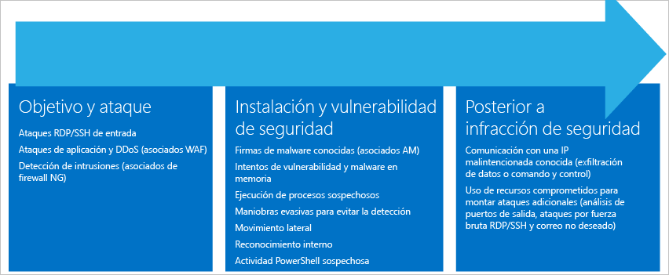

**Destino y ataque**

* Ataques RDP o SSH entrantes
* Ataques DDoS y aplicaciones (asociados de WAF)
* Detección de intrusiones (asociados de NG Firewall)

**Instalación y vulnerabilidad**

* Firmas de malware conocidas (asociados de AM)
* Intentos de malware y vulnerabilidad en memoria
* Ejecución de procesos sospechosos
* Maniobras evasivas para evitar la detección
* Desplazamiento lateral
* Reconocimiento interno
* Actividad de PowerShell sospechosa

**Infracción de POST**  

* Comunicación con una dirección IP malintencionada conocida (exfiltración de datos o comando y control)
* Uso de recursos en peligro para montar ataques adicionales (ataques de fuerza bruta de RDP o SSH de detección del puerto de salida y correo no deseado)

Los diferentes tipos de ataques están asociados a cada fase y se dirigen a distintos subsistemas. Para afrontar los ataques durante estas fases, Security Center tiene tres categorías de alertas:

* Análisis del comportamiento de la máquina virtual (VMBA)
* Análisis de red
* Análisis de recursos

## Análisis del comportamiento de la máquina virtual
Azure Security Center puede utilizar el análisis de comportamiento para identificar los recursos en peligro a partir de análisis de registros de eventos de la máquina virtual; por ejemplo: eventos de creación de procesos, eventos de inicio de sesión, etc. Además, existe una correlación con otras señales que se comprueban para fundamentar las pruebas de que se trata una campaña de gran difusión.

> [!NOTE]
> Para más información acerca de cómo actúan las funcionalidades de detección de Security Center, consulte [Funcionalidades de detección de Azure Security Center](security-center-detection-capabilities.md).
>
>

### Análisis de bloqueos
El análisis de la memoria de volcado de bloqueos es un método utilizado para detectar malware sofisticado que puede eludir las soluciones de seguridad tradicionales. Diversos tipos de malware intentan reducir la posibilidad de ser detectados por productos antivirus no escribiendo nunca en el disco o mediante el cifrado de los componentes de software escritos en el disco. Esto hace que el malware sea difícil de detectar mediante los enfoques tradicionales de antimalware. Sin embargo, este malware se puede detectar mediante un análisis de la memoria, ya que, para funcionar, tiene que dejar rastros en la memoria.

En el momento en que el software se bloquea, un volcado de memoria captura una porción de la memoria. El bloqueo puede deberse a malware o problemas de aplicaciones generales o del sistema. Mediante el análisis de la memoria durante el volcado, Security Center puede detectar las técnicas utilizadas para aprovechar las vulnerabilidades del software, acceder a información confidencial y permanecer subrepticiamente en una máquina en peligro. Esto se consigue con un impacto mínimo en el rendimiento de los hosts, ya que el análisis se realiza en el back-end de Security Center.

Los siguientes campos son comunes para las alertas de análisis de volcado de bloqueos enumeradas a continuación:

* DUMPFILE (ARCHIVO DE VOLCADO): nombre del archivo de volcado
* PROCESSNAME (NOMBRE DEL PROCESO): nombre del proceso de bloqueo
* PROCESSVERSION (VERSIÓN DEL PROCESO): versión del proceso de bloqueo

### Detectado shellcode
Shellcode es la carga que se ejecuta después de que un malware haya aprovechado una vulnerabilidad en el software. Esta alerta indica que el análisis del volcado de bloqueo ha detectado código ejecutable que muestra un comportamiento normalmente realizado mediante cargas malintencionadas. Aunque el software no malintencionado puede tener este comportamiento, no es típico en las prácticas de desarrollo de software normal.

Esta alerta proporciona el siguiente campo adicional:

* ADDRESS (DIRECCIÓN): ubicación de la memoria del shellcode

A continuación se muestra un ejemplo de este tipo de alerta:

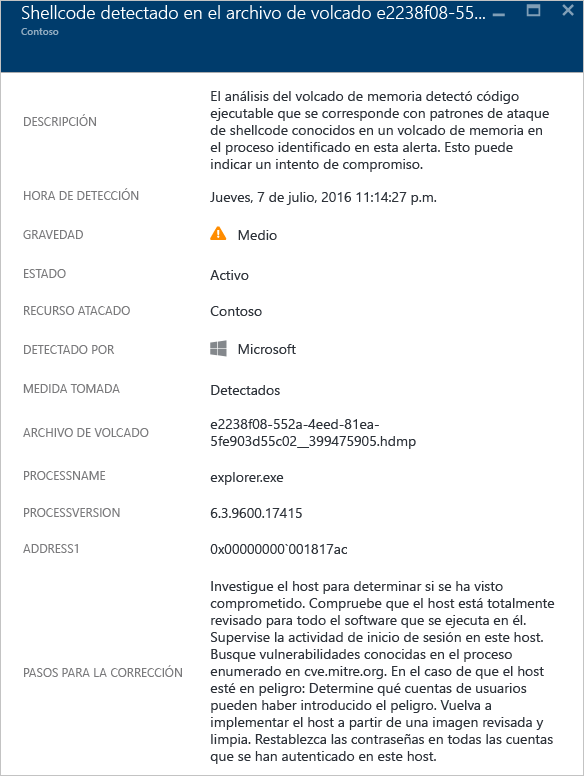

### Detectado secuestro de módulo
Windows se basa en las bibliotecas de vínculos dinámicos (DLL) para que el software pueda utilizar la funcionalidad del sistema Windows común. El secuestro de DLL se produce cuando el malware cambia el orden de carga de las DLL para realizar cargas malintencionadas en la memoria, donde se puede ejecutar código arbitrario. Esta alerta indica que el análisis del volcado de bloqueo ha detectado que se carga un módulo con un nombre similar desde dos rutas de acceso diferentes, una de las cuales procede de una ubicación binaria de un sistema Windows común.

Los desarrolladores de software legítimo ocasionalmente cambian el orden de carga DLL por razones no malintencionadas, como instrumentar, extender el sistema operativo Windows o aplicaciones de Windows. Para ayudar a diferenciar entre los cambios de código malintencionados y potencialmente benignos en el orden de carga de la DLL, Azure Security Center comprueba si un módulo cargado se ajusta a un perfil sospechoso. El resultado de esta comprobación se indica en el campo "SIGNATURE" (FIRMA) de la alerta y se refleja en la gravedad de la alerta, su descripción y los pasos de corrección. El análisis de la copia en disco del módulo secuestrador, como comprobar la firma digital de los archivos o realizar un examen antivirus, puede proporcionar más información acerca de la naturaleza legítima o malintencionada del módulo secuestrador.

Además de los campos comunes que se describen en la anterior sección, "Shellcode detectado", esta alerta proporciona los siguientes campos:

* SIGNATURE (FIRMA): indica si el módulo secuestrador se ajusta a un perfil de comportamiento sospechoso.
* HIJACKEDMODULE (MÓDULO SECUESTRADO): nombre del módulo del sistema Windows secuestrado.
* HIJACKEDMODULEPATH (RUTA DEL MÓDULO SECUESTRADO): ruta de acceso del módulo del sistema Windows secuestrado.
* HIJACKINGMODULEPATH (RUTA DEL MÓDULO SECUESTRADOR): ruta de acceso del módulo secuestrador.

A continuación se muestra un ejemplo de este tipo de alerta:

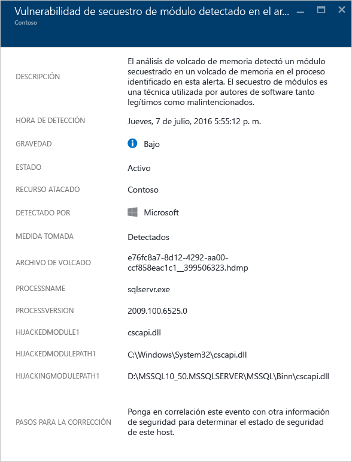

### Detectado módulo de Windows enmascarado
El malware puede usar nombres comunes de archivos binarios (por ejemplo, SVCHOST. (EXE) o módulos (por ejemplo, NTDLL.DLL) del sistema Windows para mezclarse y ocultar la naturaleza del software malintencionado a los administradores de sistemas. Esta alerta indica que el análisis del volcado de bloqueo ha detectado que el archivo de volcado contiene módulos que utilizan nombres de módulo del sistema Windows, pero no cumplen otros criterios típicos de módulos de Windows. El análisis de la copia en disco del módulo enmascarado puede proporcionar más información acerca de la naturaleza legítima o malintencionada de este módulo. El análisis puede incluir:

* Confirmar que el archivo en cuestión se distribuye como parte de un paquete de software legítimo.
* Verificar la firma digital del archivo.
* Ejecutar un examen antivirus del archivo.

Además de los campos comunes que se describen en la anterior sección, "Shellcode detectado", esta alerta proporciona los siguientes campos adicionales:

* DETAILS (DETALLES): describe si los metadatos de los módulos son válidos y si el módulo se cargó desde una ruta de acceso del sistema.
* NAME (NOMBRE): nombre del módulo de Windows enmascarado.
* PATH (RUTA DE ACCESO): ruta de acceso para el módulo de Windows enmascarado.

Esta alerta también extrae y muestra determinados campos del encabezado PE del módulo, como "CHECKSUM" (SUMA DE COMPROBACIÓN) y "TIMESTAMP" (MARCA DE TIEMPO). Estos campos solo se muestran si los campos están presentes en el módulo. Consulte la [especificación de Microsoft PE y COFF](https://msdn.microsoft.com/windows/hardware/gg463119.aspx) para más información sobre estos campos.

A continuación se muestra un ejemplo de este tipo de alerta:

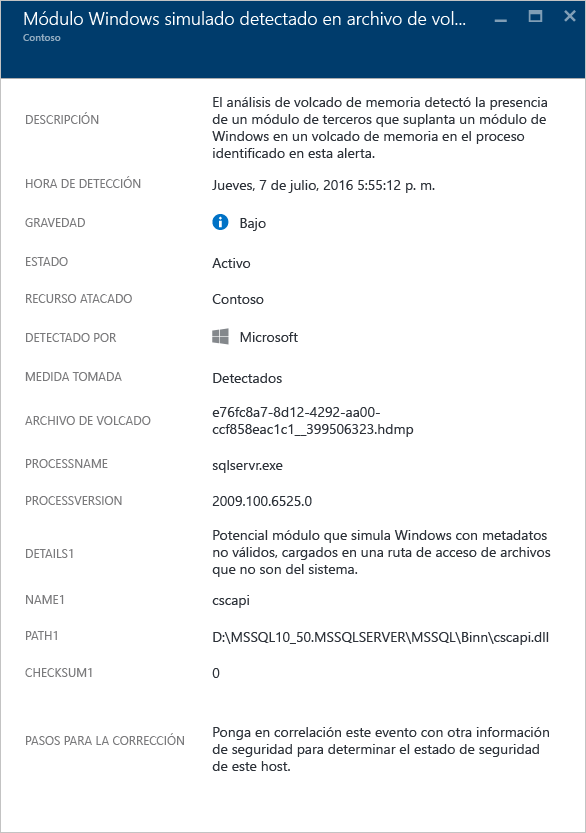

### Detectados archivos binarios del sistema modificados
El malware puede modificar archivos binarios del sistema básicos para un acceso clandestino a los datos o persistir clandestinamente en un sistema en peligro. Esta alerta indica que el análisis del volcado de bloqueo ha detectado que se han modificado archivos binarios básicos del sistema operativo Windows en la memoria o el disco.
Los desarrolladores de software legítimo modifican ocasionalmente módulos del sistema en la memoria por razones no malintencionados, como desvíos o compatibilidad de aplicaciones. Para ayudar a diferenciar entre módulos malintencionados y potencialmente legítimos, Azure Security Center comprueba si el módulo modificado se ajusta a un perfil sospechoso. El resultado de esta comprobación se indica mediante la gravedad de la alerta, su descripción y los pasos de corrección.

Además de los campos comunes que se describen en la anterior sección, "Shellcode detectado", esta alerta proporciona los siguientes campos adicionales:

* MODULENAME (NOMBRE DEL MÓDULO): nombre del archivo binario del sistema modificado.
* MODULEVERSION (VERSIÓN DEL MÓDULO): versión del archivo binario del sistema modificado.

A continuación se muestra un ejemplo de este tipo de alerta:

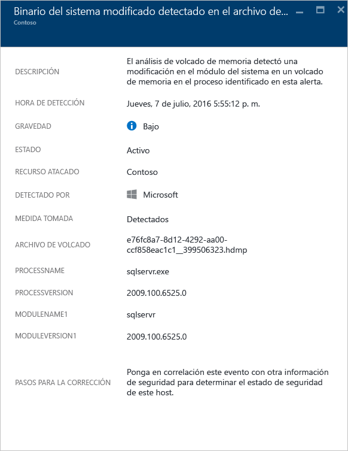

### Proceso sospechoso ejecutado
Security Center identifica un proceso sospechoso en ejecución en la máquina virtual de destino y desencadena una alerta. La detección no busca el nombre específico, sino su parámetro; por lo tanto, incluso si el atacante cambia el nombre del archivo ejecutable, Security Center aún puede detectarlo.

A continuación se muestra un ejemplo de este tipo de alerta:

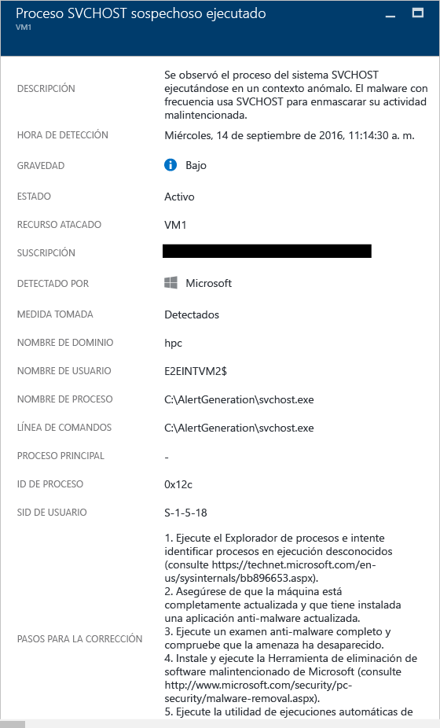

### Múltiples cuentas de dominio consultadas
Security Center puede detectar múltiples intentos de consultar cuentas de dominio, que es algo que suelen realizar los atacantes durante el reconocimiento de redes. Los atacantes pueden aprovechar esta técnica para consultar el dominio con el fin de identificar quiénes son los usuarios, cuáles son las cuentas de los administradores de dominio, qué equipos son controladores de dominio y, también, una posible relación de confianza de dominio con otros dominios.

A continuación se muestra un ejemplo de este tipo de alerta:

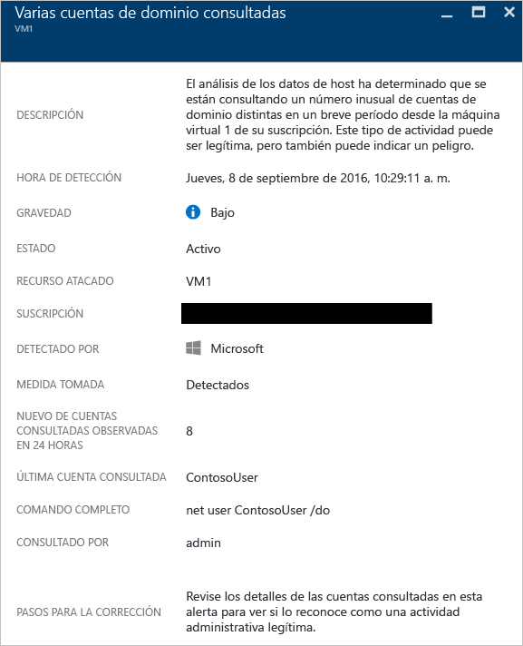

## Análisis de red
La detección de amenazas de Security Center recopila automáticamente información de seguridad de su tráfico (exportación de la información de flujo del protocolo de Internet) de IPFIX de Azure. Después, analiza estos datos (a menudo, relacionando la información de diferentes orígenes) para identificar las amenazas.

### Suspicious outgoing traffic detected (Tráfico saliente sospechoso detectado)
Se pueden detectar dispositivos de red y perfiles de la misma manera que otros tipos de sistemas. Los atacantes suelen comenzar con la exploración de puertos o con el barrido de puertos. En el ejemplo siguiente se muestra un tráfico SSH sospechoso desde una máquina virtual que puede estar realizando un ataque por fuerza bruta de SSH o un barrido de puerto contra un recurso externo.

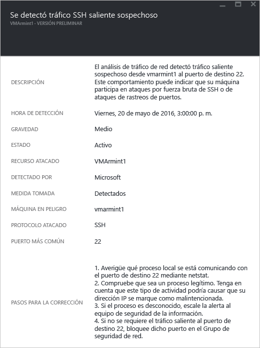

Esta alerta proporciona información que le permite identificar el recurso que se usó para iniciar este ataque, el equipo en riesgo, la hora de detección, el protocolo y puerto que se utilizó. Esta hoja también proporciona una lista de pasos de corrección que pueden utilizarse para mitigar este problema.

### Network communication with a malicious machine (Comunicación de red con una máquina malintencionada)
Mediante el aprovechamiento de las fuentes de inteligencia de amenazas de Microsoft, Azure Security Center puede detectar equipos en peligro que se comunican con direcciones IP malintencionadas, en muchos casos, mediante un comando y un centro de control. En este caso, Azure Security Center ha detectado que la comunicación se realizó mediante el malware Pony Loader (también conocido como [Fareit](https://www.microsoft.com/security/portal/threat/encyclopedia/entry.aspx?Name=PWS:Win32/Fareit.AF)).

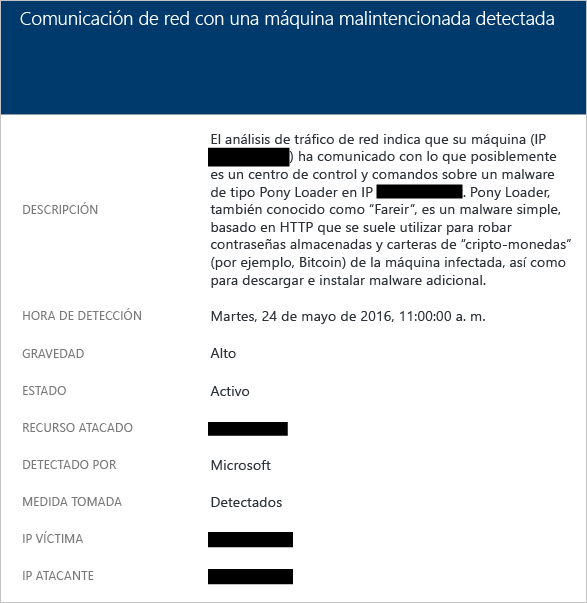

Esta alerta proporciona información que le permite identificar el recurso que se usó para iniciar este ataque, el recurso atacado, la dirección IP víctima, la dirección IP del atacante y la hora de detección.

> [!NOTE]
> Las direcciones IP activas se quitaron de esta captura de pantalla por privacidad.
>
>

### Posible ataque de denegación de servicio de salida detectado
El tráfico de red anómalo originado en una máquina virtual puede hacer que Security Center desencadene un tipo de ataque por potencial denegación de servicio.

A continuación se muestra un ejemplo de este tipo de alerta:

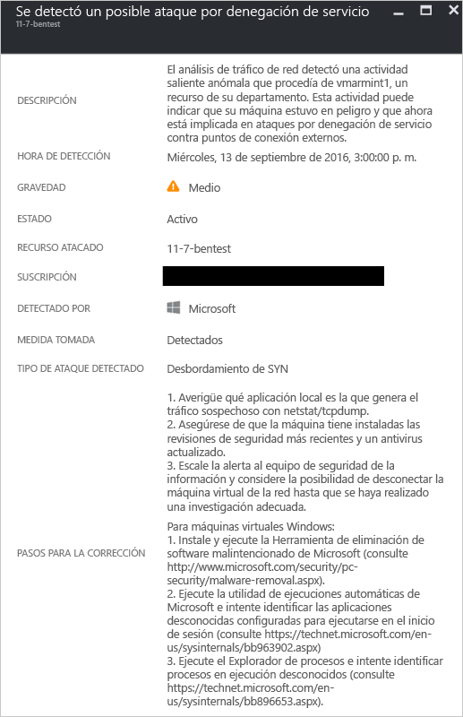

## Análisis de recursos
El análisis de los recursos de Security Center se centra en los servicios de PaaS, como la integración con la característica [detección de amenazas de Azure SQL Database](../sql-database/sql-database-threat-detection-get-started.md) . En función de los resultados del análisis de estas áreas, Security Center desencadena una alerta relacionada con los recursos.

### Posible inyección de código SQL
La inyección de código SQL es un ataque en el que se inserta código malintencionado en cadenas que posteriormente se pasan a una instancia de SQL Server para su análisis y ejecución. Deben revisarse todos los procedimientos que crean instrucciones SQL en busca de vulnerabilidades por inyección de código, ya que SQL Server ejecuta todas las consultas sintácticamente válidas que recibe. La detección de amenazas de SQL utiliza el aprendizaje automático, el análisis del comportamiento y la detección de anomalías para determinar eventos sospechosos que podrían estar teniendo lugar en sus instancias de Azure SQL Database. Por ejemplo:

* Un antiguo empleado ha intentado acceder a la base de datos
* Ataques de inyección de código SQL
* Acceso inusual a la base de datos de producción de un usuario en casa

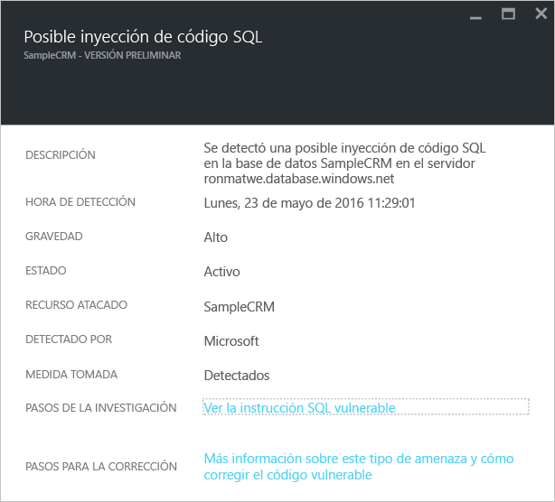

Esta alerta proporciona información que le permite identificar el recurso atacado, la hora de detección, el estado del ataque y también proporciona un vínculo a pasos de investigación adicionales.

### Vulnerabilidad a la inyección de código SQL
Esta alerta se desencadena cuando se ha detectado un error de aplicación en una base de datos, lo que puede indicar una posible vulnerabilidad a ataques de inyección de código SQL.

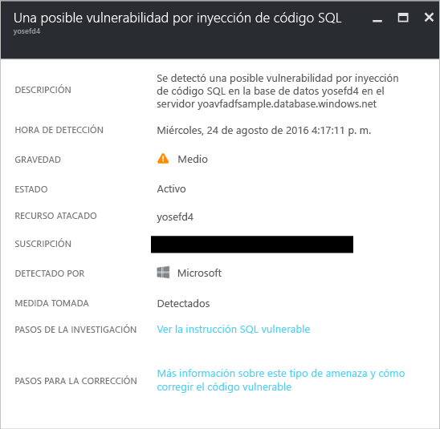

### Acceso inusual desde una ubicación desconocida
Esta alerta se desencadena cuando se detecta un acceso desde una dirección IP desconocida en el servidor, que no se ha visto en el último período.

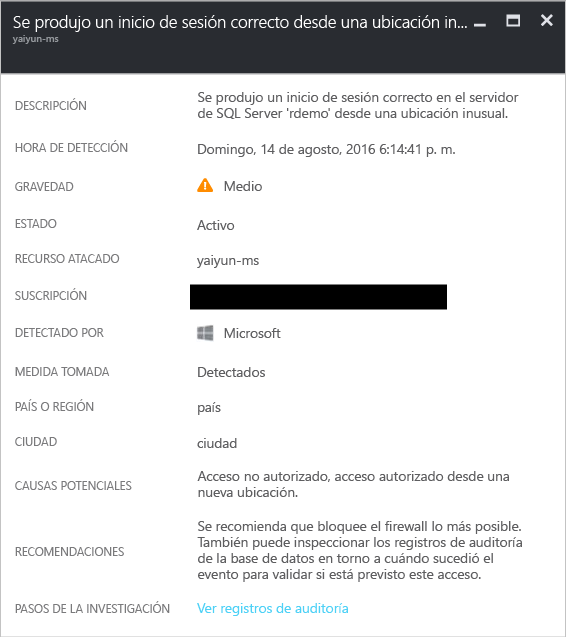

## Otras referencias
En este documento, ha aprendido acerca de los distintos tipos de alertas de seguridad en Security Center. Para más información sobre el Centro de seguridad, consulte los siguientes recursos:

* [Control de incidentes de seguridad en Azure Security Center](security-center-incident.md)
* [Funcionalidades de detección de Azure Security Center](security-center-detection-capabilities.md)
* [Guía de planeamiento y operaciones de Azure Security Center](security-center-planning-and-operations-guide.md)
* [Preguntas más frecuentes sobre Azure Security Center](security-center-faq.md) : encuentre las preguntas más frecuentes sobre el uso del servicio.
* [Blog de seguridad de Azure](http://blogs.msdn.com/b/azuresecurity/) : encuentre entradas de blog sobre el cumplimiento y la seguridad de Azure.

<!--HONumber=Dec16_HO2-->

