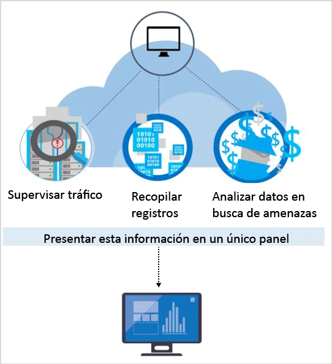

# Funcionalidades de detección de Azure Security Center
En este documento se describen las funcionalidades de detección avanzada de Azure Security Center, lo que ayuda a identificar las amenazas activas dirigidas a los recursos de Microsoft Azure, y se proporciona la información necesaria para que pueda responder a estas amenazas con rapidez.

El nivel estándar de Azure Security Center dispone de medidas de detección avanzadas. Hay disponible una versión de evaluación gratuita de 60 días. Si desea actualizar la versión, puede seleccionar las opciones disponibles en el Plan de tarifa de la [Directiva de seguridad](security-center-policies.md). Para más información sobre los precios, visite la [página de Security Center](https://azure.microsoft.com/pricing/details/security-center/) . 

> [!NOTE]
> Security Center ha lanzado un nuevo conjunto de detecciones en versión preliminar limitada que aprovecha los registros de auditoría, un marco de auditoría común, para detectar comportamientos malintencionados en máquinas Linux. Envíe un correo electrónico con los identificadores de suscripción a [nuestro equipo](mailto:ASC_linuxdetections@microsoft.com) para unirse a la versión preliminar.

## Respuesta a las amenazas actuales
En los últimos 20 años, las amenazas han cambiado considerablemente. Por lo general, en el pasado, las compañías solo tenían que preocuparse por las alteraciones que atacantes individuales realizaban en sus sitios web, quienes normalmente solo pretendían comprobar “qué es lo que eran capaces de hacer”. Hoy en día, los atacantes son mucho más sofisticados y están más organizados. Normalmente, se mueven por un fin económico o estratégico. También disponen de más recursos, ya que a veces están financiados por estados o por el crimen organizado.

Este enfoque ha propiciado un nivel de profesionalidad entre los atacantes que no tiene precedentes. Ya no les interesa alterar los sitios web. Ahora, lo que buscan es robar información, cuentas financieras y datos privados, que pueden usar con fines lucrativos en el mercado libre o para sacar provecho de una determinada situación política, militar o empresarial. Si los atacantes con un objetivo financiero son motivo de preocupación, aún lo son más los que pretenden abrir una brecha en las redes para dañar la infraestructura o infligir daños personales.

Como respuesta, las organizaciones suelen implementar varias soluciones específicas, que se centran en defender el perímetro o los puntos de conexión de la empresa mediante la búsqueda de firmas de ataque conocidas. Estas soluciones suelen generar un gran número de alertas con un bajo nivel de confiabilidad, lo que requiere que un analista de seguridad las cribe e investigue. La mayor parte de las organizaciones no disponen de la experiencia ni del tiempo necesarios para responder a estas alertas, por lo que muchas quedan desatendidas.  Entretanto, los atacantes han mejorado sus métodos para debilitar muchas de las defensas basadas en firmas y para [adaptarse a los entornos en la nube](https://azure.microsoft.com/blog/detecting-threats-with-azure-security-center/). Por tanto, se necesitan nuevos enfoques que permitan identificar con mayor rapidez las nuevas amenazas, así como acelerar su detección y respuesta. 

## Detección de las amenazas y respuesta por parte de Azure Security Center
Los investigadores de seguridad de Microsoft trabajan sin descanso para localizar amenazas. Tienen acceso al amplio conjunto de recursos de telemetría que les proporciona la presencia global de Microsoft en la nube y en sistemas locales. La amplitud y diversidad de estos conjuntos de datos permite a Microsoft detectar nuevos patrones y tendencias de ataque tanto en sus productos locales, destinados a particulares y empresas, como en sus servicios en línea. Como resultado, Security Center es capaz de actualizar rápidamente los algoritmos de detección a medida que los atacantes idean nuevas y más sofisticadas vulnerabilidades de seguridad. Este enfoque le ayuda a mantenerse al día en entornos llenos de amenazas que cambian continuamente. 

La detección de amenazas de Security Center recopila automáticamente información de seguridad de sus recursos de Azure, de la red y de soluciones de asociados relacionadas. Después, analiza estos datos (a menudo, relacionando la información de diferentes orígenes) para identificar las amenazas. En Security Center, las alertas de seguridad están clasificadas por prioridad y se incluyen recomendaciones para solucionar la amenaza.

Security Center utiliza análisis avanzados que superan con creces los enfoques basados en firmas. Los grandes avances registrados en las tecnologías de macrodatos y [aprendizaje automático](https://azure.microsoft.com/blog/machine-learning-in-azure-security-center/) se utilizan para evaluar eventos en todo el tejido de la nube, lo que permite detectar amenazas que no se podrían identificar mediante enfoques manuales, así como predecir la evolución de los ataques. Estas técnicas de análisis son: 

* **Información integrada sobre amenazas**: busca actores malintencionados conocidos utilizando la información global sobre amenazas de los productos y servicios de Microsoft, la Unidad de crímenes digitales de Microsoft (DCU), Microsoft Security Response Center (MSRC) y otras fuentes externas.
* **Análisis del comportamiento**: aplica patrones conocidos para detectar comportamientos malintencionados. 
* **Detección de anomalías**: utiliza la generación de perfiles estadísticos para crear una base histórica de referencia. Alerta de las desviaciones de las referencias que se ajustan a un posible vector de ataque.

### Información sobre amenazas
Microsoft dispone de una ingente cantidad de información sobre amenazas globales. Los recursos telemétricos proceden de diferentes fuentes, como Azure, Office 365, Microsoft CRM Online, Microsoft Dynamics AX, outlook.com, MSN.com, la Unidad de crímenes digitales de Microsoft (DCU) y Microsoft Security Response Center (MSRC). Los investigadores también cuentan con la información sobre amenazas que comparten los principales proveedores de servicios en la nube y que procede de fuentes de terceros. Azure Security Center puede usar todos estos datos para avisarle de las amenazas procedentes de actores malintencionados conocidos. Estos son algunos ejemplos:

* **Comunicaciones de salida dirigidas a una dirección IP malintencionada**: normalmente, el tráfico de salida hacia una red de robots (botnet) o una red oscura conocidas indica que el recurso se ha visto comprometido y que un atacante intenta ejecutar comandos en ese sistema o extraer información. Azure Security Center compara el tráfico de red con la base de datos de amenazas global de Microsoft y le avisa si detecta comunicaciones con una dirección IP malintencionada.

## Análisis del comportamiento
El análisis del comportamiento es una técnica que analiza datos y los compara con una serie de patrones conocidos. No obstante, estos patrones no son simples firmas, sino que están determinados por unos complejos algoritmos de aprendizaje automático que se aplican a conjuntos de datos masivos. También se determinan por medio de un análisis cuidadoso, llevado a cabo por analistas expertos, de los comportamientos malintencionados. Azure Security Center puede utilizar el análisis de comportamiento para identificar recursos en peligro a partir del análisis de registros de máquinas virtuales, registros de dispositivos de redes virtuales, registros de tejidos, volcados de memoria y otros orígenes. 

Además, existe una correlación con otras señales que se comprueban para fundamentar las pruebas de que se trata una campaña de gran difusión. Dicha correlación permite identificar eventos que se ajustan a unos indicadores de peligro establecidos. Estos son algunos ejemplos:

* **Ejecución de procesos sospechosos**: los atacantes utilizan varias técnicas para ejecutar software malintencionado sin que se detecte. Por ejemplo, un atacante podría asignar a un malware los mismos nombres que se utilizan en los archivos legítimos del sistema, pero situar estos archivos en otras ubicaciones, utilizar un nombre muy parecido al de un archivo legítimo o enmascarar la verdadera extensión del archivo. Security Center adapta el comportamiento de los procesos y supervisa su ejecución para detectar valores atípicos como estos.  
* **Malware oculto e intentos de aprovechamiento**: el malware sofisticado es capaz de eludir los productos antimalware tradicionales porque evita escribir en los discos o cifra los componentes del software almacenados en disco.  Sin embargo, este malware se puede detectar mediante un análisis de memoria, ya que, para poder funcionar, tiene que dejar rastros en la memoria. En el momento en que el software se bloquea, un volcado de memoria captura una porción de la memoria.  Con un análisis de la memoria durante el volcado, Azure Security Center puede detectar las técnicas utilizadas para aprovechar las vulnerabilidades del software, acceder a información confidencial y permanecer subrepticiamente en una máquina comprometida sin que esto afecte al rendimiento del equipo.
* **Desplazamiento lateral y reconocimiento interno**: para poder permanecer en una red comprometida y localizar o recopilar información valiosa, los atacantes suelen tratar de desplazar lateralmente el contenido de la máquina comprometida a otras máquinas de la misma red. Security Center supervisa las actividades de los procesos e inicios de sesión para detectar cualquier intento de expandir el punto de apoyo del atacante en la red, como sondeos de redes de ejecución remota de comandos y enumeración de cuentas.
* **Scripts de PowerShell malintencionados**: los atacantes utilizan PowerShell para ejecutar código malintencionado en las máquinas virtuales objetivo con diferentes propósitos. Security Center analiza la actividad de PowerShell en busca de evidencias de actividad sospechosa. 
* **Ataques de salida**: a menudo, el objetivo de los atacantes son recursos en la nube, que utilizan con el propósito de perpetrar otros ataques. Por ejemplo, las máquinas virtuales comprometidas pueden usarse para iniciar ataques por fuerza bruta contra otras máquinas virtuales, enviar correo no deseado o buscar puertos abiertos y otros dispositivos en Internet. Gracias a la aplicación del aprendizaje automático en el tráfico de red, Security Center puede detectar cuándo las comunicaciones de red salientes superan la norma establecida. En el caso del correo no deseado, Security Center relaciona el tráfico inusual de correo con la información de Office 365 para determinar si es probable que el mensaje sea fraudulento o si es el resultado de una campaña de correo electrónico legítima.  

### Detección de anomalías
Azure Security Center también utiliza la detección de anomalías para identificar amenazas. A diferencia del análisis del comportamiento, que depende de patrones conocidos obtenidos a partir de grandes conjuntos de datos, la detección de anomalías es una técnica más “personalizada” y se basa en referencias que son específicas de las implementaciones. El aprendizaje automático se aplica para determinar la actividad normal de las implementaciones. A partir de ahí, se generan reglas para definir condiciones de valores atípicos que podrían constituir un evento de seguridad. Veamos un ejemplo:

* **Ataques por fuerza bruta de RDP/SSH entrantes**: es posible que las implementaciones integren máquinas virtuales con mucha actividad que tengan multitud de inicios de sesión al día y otras máquinas virtuales que tengan pocos o ningún inicio de sesión. Azure Security Center puede determinar la actividad de referencia de los inicios de sesión de estas máquinas virtuales y utilizar el aprendizaje automático para definir qué se sale de la norma. Si el número de inicios de sesión, la hora del día en que tienen lugar, la ubicación desde la que se solicitan u otras características relacionadas difieren considerablemente de la referencia, se puede generar una alerta. Una vez más, es el aprendizaje automático el que se encarga de determinar qué es significativo.

## Supervisión continuada de la información sobre amenazas
Azure Security Center cuenta con equipos de científicos de datos e investigadores de seguridad que supervisan sin descanso los cambios que se registran en el terreno de las amenazas. Estos son algunas de las iniciativas que llevan a cabo:

* **Supervisión de la información sobre amenazas**: la información sobre amenazas incluye mecanismos, indicadores, implicaciones y notificaciones que tienen relación con amenazas nuevas o existentes. Esta información se comparte con la comunidad de seguridad, y Microsoft supervisa sin descanso las fuentes de orígenes internos y externos.
* **Uso compartido de señales**: la información que recopilan los equipos de Microsoft a partir de la amplia cartera de servicios en la nube y locales, de servidores y de dispositivos cliente de punto de conexión de Microsoft se comparte y se analiza. 
* **Especialistas en seguridad de Microsoft**: colaboración continua con equipos de Microsoft que trabajan en ámbitos de seguridad especializados, como análisis forense y detección de ataques web.
* **Ajuste preciso de la detección**: los algoritmos se ejecutan en conjuntos de datos de clientes reales, y los investigadores de seguridad trabajan con los clientes para validar los resultados. Los falsos positivos y los positivos verdaderos se utilizan para perfeccionar los algoritmos de aprendizaje automático.

Toda esta combinación de esfuerzos culmina en nuevas y mejoradas técnicas de detección, de las que puede beneficiarse al instante sin ninguna acción por su parte.

## Otras referencias
En este documento, ha visto cómo actúan las funcionalidades de detección de Azure Security Center. Para más información sobre el Centro de seguridad, consulte los siguientes recursos:

* [Guía de planeamiento y operaciones de Azure Security Center](security-center-planning-and-operations-guide.md)
* [Administración y respuesta a las alertas de seguridad en el Centro de seguridad de Azure](security-center-managing-and-responding-alerts.md)
* [Alertas de seguridad por tipo en Azure Security Center](security-center-alerts-type.md)
* [Supervisión del estado de seguridad en Azure Security Center](security-center-monitoring.md) : obtenga información sobre cómo supervisar el estado de los recursos de Azure.
* [Supervisión de las soluciones de asociados con Azure Security Center](security-center-partner-solutions.md) : aprenda a supervisar el estado de mantenimiento de las soluciones de asociados.
* [Preguntas más frecuentes sobre Azure Security Center](security-center-faq.md) : encuentre las preguntas más frecuentes sobre el uso del servicio.
* [Blog de seguridad de Azure](http://blogs.msdn.com/b/azuresecurity/) : encuentre entradas de blog sobre el cumplimiento y la seguridad de Azure.

