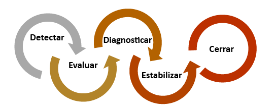
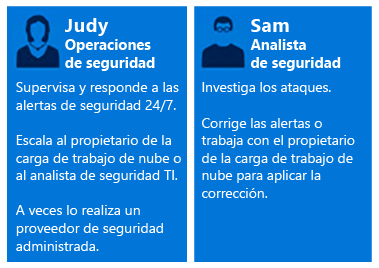
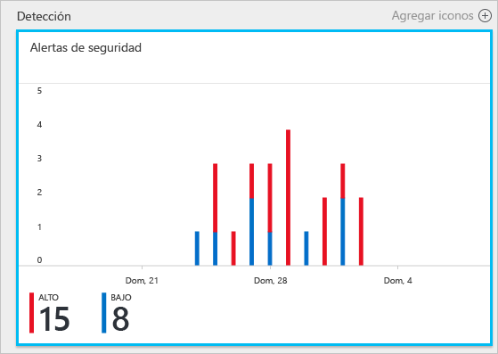
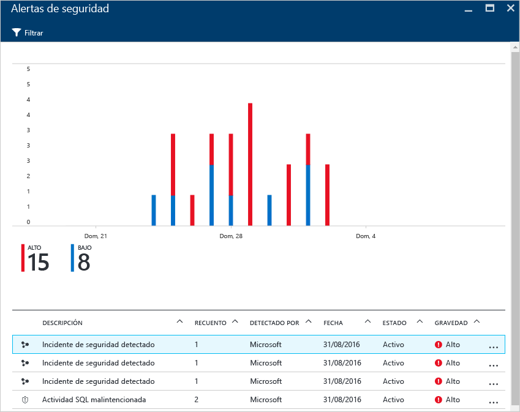
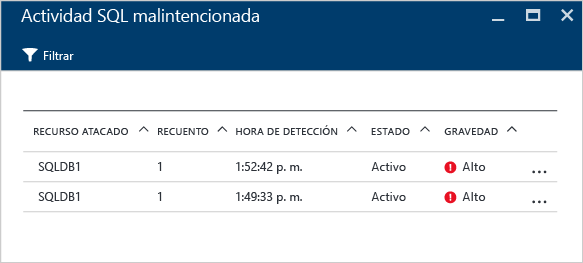
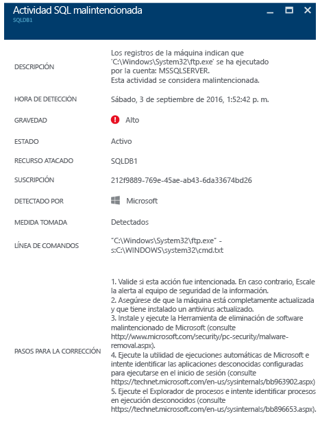

<properties
   pageTitle="Uso de Azure Security Center para responder a incidentes | Microsoft Azure"
   description="Este documento explica cómo usar Azure Security Center en un escenario de respuesta a incidentes."
   services="security-center"
   documentationCenter="na"
   authors="YuriDio"
   manager="swadhwa"
   editor=""/>

<tags
   ms.service="security-center"
   ms.topic="hero-article"
   ms.devlang="na"
   ms.tgt_pltfrm="na"
   ms.workload="na"
   ms.date="09/20/2016"
   ms.author="yurid"/>

# Uso de Azure Security Center para responder a incidentes
Muchas organizaciones aprenden a responder a incidentes de seguridad solo después de sufrir un ataque. Para reducir los costos y los daños, es importante tener un plan de respuesta a incidentes implantado antes de que se produzca un ataque. Azure Security Center puede usarse en distintas fases de una respuesta a incidentes.

## Respuesta a incidentes

Un plan eficaz depende de tres funciones básicas: las funcionalidades de proteger, detectar y responder a las amenazas. La protección consiste en prevenir incidentes, la detección consiste en identificar las amenazas pronto y la respuesta consiste en expulsar el atacante y restaurar los sistemas para mitigar los efectos de una infracción.

Este artículo usará las fases de la respuesta a incidentes de seguridad del artículo [Microsoft Azure Security Response in the Cloud](https://gallery.technet.microsoft.com/Azure-Security-Response-in-dd18c678) (Respuesta de seguridad de Microsoft Azure en la nube) tal como se muestra en el diagrama siguiente:

Security Center se puede usar durante las fases de detección, evaluación y diagnóstico. Puede aprender más acerca de cada una de estas fases. A continuación se proporciona un ejemplo de cómo Security Center puede ser útil durante las tres fases iniciales de respuesta a incidentes:

- **Detectar**: primera indicación de una investigación de eventos.
	- Ejemplo: comprobación inicial de que se ha generado una alerta de seguridad de alta prioridad en el panel de Security Center.
- **Evaluar**: realice la evaluación inicial para más información acerca de la actividad sospechosa.
	- Ejemplo: obtener más información acerca de la alerta de seguridad.
- **Diagnosticar**: realizar una investigación técnica e identificar las estrategias de contención, mitigación y solución.
	- Ejemplo: siga los pasos de corrección descritos por Security Center para esa alerta de seguridad.

El siguiente escenario muestra cómo usar Security Center durante las fases de detección, evaluación y diagnóstico y respuesta a un incidente de seguridad. En Security Center, un [incidente de seguridad](https://blogs.technet.microsoft.com/office365security/addressing-your-cxos-top-five-cloud-security-concerns/) es la suma de todas las alertas de un recurso que se alinean con patrones de [cadenas de eliminación](security-center-incident.md). Los incidentes aparecen en el icono y en la hoja [Alertas de seguridad](security-center-managing-and-responding-alerts.md). El incidente mostrará la lista de alertas relacionadas, lo que permite obtener más información sobre cada repetición. Security Center también presenta alertas de seguridad independientes que pueden utilizarse para realizar un seguimiento de una actividad sospechosa.

## Escenario

Contoso migró recientemente algunos de sus recursos locales a Azure, incluidas algunas cargas de trabajo empresariales basadas en máquinas virtuales y SQL Database. Actualmente el equipo de respuesta a incidentes de seguridad informática central de Contoso (CSIRT) tiene un problema para investigar problemas de seguridad, debido a la falta de inteligencia de seguridad integrada en sus herramientas actuales de respuesta a incidentes. Esta falta de integración presenta un problema durante las fases de detección (demasiados falsos positivos), evaluación y diagnóstico. Como parte de esta migración, decidió participar en Security Center para ayudar a solucionar el problema.

La primera fase de migración terminó después de incorporar todos los recursos y abordar todas las recomendaciones de seguridad de Security Center. El equipo CSIRT de Contoso es crucial para tratar los incidentes de seguridad informática. El equipo está formado por un grupo de personas encargadas de manejar los incidentes de seguridad. Los miembros del equipo tienen tareas claramente definidas para asegurarse de que no quede sin cubrir ninguna área de respuesta.

En este escenario, nos vamos a centrar en los roles de las siguientes personas que forman parte del equipo CSIRT de Contoso:

Judy está en operaciones de seguridad y sus responsabilidades incluyen:
- Supervisar y responder a amenazas de seguridad durante las 24 horas.
- Remitirlas al propietario de la carga de trabajo en la nube o al analista de seguridad según sea necesario.

Sam es un analista de seguridad y sus responsabilidades incluyen:
- Investigar ataques.
- Solucionar alertas.
- Trabajar con los propietarios de la carga de trabajo para determinar y aplicar mitigaciones.

Como puede ver, Judy y Sam tienen responsabilidades diferentes, y deben trabajar juntos y compartir la información obtenida de Security Center.

## Solución recomendada

Puesto que Judy y Sam tienen diferentes roles, usarán diferentes áreas de Security Center para obtener la información pertinente para sus actividades diarias. Judy usará las alertas de seguridad como parte de su supervisión diaria.

Judy utilizará las alertas de seguridad durante las fases de evaluación y detección. Una vez que Judy finalice la evaluación inicial, puede remitir el problema a Sam si requiere una investigación adicional. En este punto, Sam tendrá la información proporcionada por Security Center, a veces junto con otros orígenes de datos, para pasar a la fase de diagnóstico.

## Implemento de esta solución 

Para ver cómo se utilizaría Azure Security Center en un escenario de respuesta a incidentes, seguiremos los pasos de Judy en las fases de detección y evaluación y, a continuación, veremos lo que hace Sam para diagnosticar el problema.

### Fases de detección y evaluación de la respuesta a incidentes 

Judy inicia sesión en Azure Portal y está en la consola de Security Center. Como parte de sus actividades de supervisión diarias comienza a revisar las alertas de seguridad con alta prioridad mediante los pasos siguientes:

1. Hace clic en el icono **Alertas de seguridad** y accede a la hoja **Alertas de seguridad**. 

	> [AZURE.NOTE] En este escenario, Judy va a realizar una evaluación de la alerta de actividad SQL malintencionada, como se muestra en la ilustración anterior.
2. Hace clic en la alerta **Actividad SQL malintencionada** y revisa los recursos atacados en la hoja **Actividad SQL malintencionada**: 
	
	En esta hoja, Judy puede tomar notas relativas a los recursos atacados, cuántas veces ocurrió este ataque y cuándo se detectó.
3. Hace clic en el **recurso atacado** para más información acerca de este ataque.

Después de leer la descripción, Judy está convencida de que no es un falso positivo y que debe remitir este caso a Sam.

### Fases de diagnóstico de la respuesta a incidentes 

Sam recibe el caso de Judy y empieza revisando los pasos de corrección sugeridos por Security Center.

### Recursos adicionales

El equipo de respuesta a incidentes también puede aprovechar la funcionalidad [Security Center Power BI](security-center-powerbi.md) para ver distintos tipos de informes que pueden ayudarle durante una investigación más detallada para ver, analizar y filtrar las recomendaciones y las alertas de seguridad. Las empresas que usan su solución de información de seguridad y administración de eventos (SIEM) durante el proceso de investigación, también pueden [integrar Security Center en su solución](security-center-integrating-alerts-with-log-integration.md). Los registros de auditoría de Azure y los eventos de seguridad de las máquinas virtuales también se pueden integrar con la [herramienta de integración de registros de Azure](https://blogs.msdn.microsoft.com/azuresecurity/2016/07/21/microsoft-azure-log-integration-preview/). Esta información puede utilizarse junto con la información proporcionada por Security Center para investigar un ataque.

## Conclusión

Es muy importante para su organización reunir un equipo antes de que se produzca un incidente, e influirá positivamente en cómo se manejan los incidentes. Tener las herramientas adecuadas para supervisar los recursos puede ayudar a este equipo a adoptar los pasos exactos para solucionar un incidente de seguridad. Las [funcionalidades de detección](security-center-detection-capabilities.md) de Security Center ayudarán a TI a responder a los incidentes de seguridad y corregir los problemas de seguridad rápidamente.

<!---HONumber=AcomDC_0921_2016-->